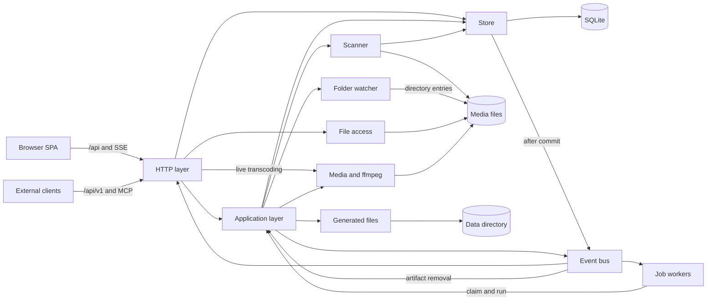
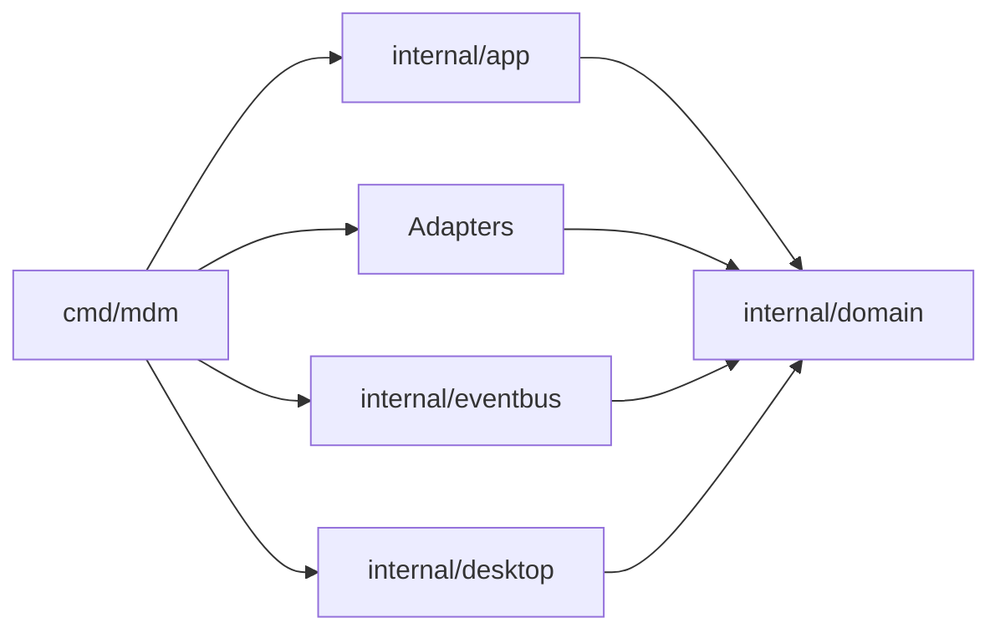
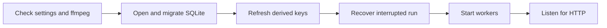

# Architecture

VVMDM is a self-hosted media data management (MDM) system: it indexes video
files on local storage and plays them back in a browser. This document is the
map of its parts, their boundaries and the rules that hold across them; the
detail of each part lives in the document the [subsystem map](#subsystem-map)
links. The stack choice is in
[tech-stack-selection.md](docs/design-docs/tech-stack-selection.md).

## System and where it runs

One Go process serves the embedded React SPA, the JSON API and byte-range video
streaming, backed by SQLite and by video files on a mounted volume, and ships
as one container. `ffmpeg`/`ffprobe` run as child processes, started by a job
worker or by the request that needs them. Multi-user support is not built yet.
The same binary also ships as the Windows desktop app `VVMDM.exe`
([windows-app.md](docs/design-docs/windows-app.md)).

The diagram shows the parts of the process and what each one reads or writes.

## Intended dependency direction

Imports point one way, from `cmd` through the `internal/` packages to
`internal/domain`, which depends on nothing in the repository.

| Layer | Packages | Owns | Must not import |
| --- | --- | --- | --- |
| Domain | `internal/domain` | Value types and pure rules, including the business rules the store enforces | `net/http`, `database/sql`, `os`, `os/exec`, the SQLite driver, any other `internal/*` package |
| Application | `internal/app` | The use cases (scans, auto-import, ingest, catalog, media folders, encoder choice, authentication, auto-tagging) | `net/http`, `database/sql`, `os/exec`, the SQLite driver, any adapter |
| Adapters | `internal/httpapi`, `store`, `media`, `artifacts`, `mediafs`, `opener`, `scanner`, `watcher`, `jobs`, `password`, `clef` | Talking to the outside world | Each other and `internal/app` |
| Beside the adapters | `internal/eventbus`, `internal/desktop` | In-process event delivery; the desktop app's OS side | Imported by `cmd/mdm` only |

`internal/app` reaches storage, `ffmpeg` and generated files only through
interfaces it declares, so its unit tests run without SQLite, `ffmpeg` or an
HTTP server.

golangci-lint's depguard enforces these rules in CI
([.golangci.yml](.golangci.yml)); each rule's message carries its reason, so a
violation explains itself in the `task lint` output. Test files are exempt,
because an external `package x_test` imports its own package.

`web/embed.go` is the one deliberate exception: Go's embed directive cannot
reference a parent directory, so the declaration that pulls `web/dist` into the
binary lives next to the SPA, and `internal/httpapi` consumes it as an `fs.FS`.

## Composition root

`cmd/mdm` reads the configuration, creates the adapters and the
application-layer values, wires them together, and starts and stops them; it
holds no use case of its own. Each consuming package declares the interfaces it
needs, and the values crossing them (`domain.VideoFile`, `domain.Job`,
`domain.VideoQuery`, …) live in `internal/domain`, so neither side imports the
other. [`cmd/mdm/events.go`](cmd/mdm/events.go) is the only place that
registers event subscribers, so adding one touches only the subscriber and that
file.

Startup prepares storage and background work before the listener opens; the
order, the recovery of an interrupted run and the shutdown order are in
[process-lifecycle.md](docs/design-docs/process-lifecycle.md).

## Cross-cutting invariants

**The domain decides, the store enforces.** `internal/domain` holds rules such
as which queued job may be claimed or whether a media folder may be added;
`internal/store` translates them into SQL and re-reads their inputs inside its
transaction. Database constraints (one running scan, one unfinished job per
kind and video) are the final guard against races.

**Store roles.** `store.DB` opens SQLite, runs migrations and hands out role
types (`IngestStore`, `LibraryStore`, `TagStore`, `AuthStore`, …). Each
business operation belongs to exactly one role, so calling it through the wrong
role does not compile. No role calls another role's public methods; work that
spans roles runs in one transaction through package-private helpers. SQL never
leaves `internal/store`.

**Events after commit.** The store publishes a domain event only after its
transaction commits, never from one that rolled back. Publishers do not know
their subscribers, and `internal/eventbus` gives each subscriber its own
goroutine and queue, so a slow or panicking subscriber never stalls a commit, a
worker or a scan.

**One owner for opening files.** `internal/mediafs` alone decides whether a
file may be opened: inside a registered media folder, after resolving symbolic
links, and a regular file. Streaming, live transcoding, subtitles, opening in
the default app and the directory picker all go through it, and a location
that fails the check is answered like a missing file.

**One owner for generated files.** `internal/artifacts` alone places, publishes,
opens and removes thumbnails, seek sprites and hover previews. A file becomes
visible only when complete (it is generated under `.tmp` and renamed into
place), and it is removed only when the last video referencing its content goes.

**User data survives a rebuild.** Playback positions, watch history, tags,
public flags, favorites and owner edits are keyed by values a rescan reproduces (the content
key, a version bundle's key, a folder's absolute path), never by `videos.id`,
and carry no foreign key to `videos`. Which tables are rebuildable is in
[Data and recovery](docs/how-to/running-vv.md#data-and-recovery).

**Every read knows its viewer.** Each store read that returns videos, locations
or folders takes a `domain.Audience`, whose zero value is the guest. The HTTP
layer classifies every request at its outermost layer, before routing, by path
into bearer, anyone, guests too or owner only, matching each operation's
`security` in `api/openapi.yaml` (a Go test checks that). Hidden videos answer
the same `404` as missing ones
([guest-api.md](specs/016-single-account-auth/contracts/guest-api.md)).

**Only a scan reads the media folders' files.** Only a scan opens the files
in the media folders, and only a user-started scan walks them whole. The
folder watcher (`internal/watcher`) reads directory entries only, to place a
watch on each directory, and never opens a file. The folder index (folder
groups and folder names), folder browsing and the import status are derived
from SQLite, never from the filesystem.

## Subsystem map

| Package | Owns | Detail |
| --- | --- | --- |
| `internal/scanner` | Walking the media folders and identifying files by content, so a move or rename keeps the video | [017 data-model](specs/017-folder-groups/data-model.md), [033 research](specs/033-video-dates/research.md) |
| `internal/watcher`, `internal/app` (`AutoImport`) | Folder change notifications as changed directories; the dirty set, the quiet and settle waits and the watch scans that import them | [folder-watching.md](docs/design-docs/folder-watching.md), [042 research](specs/042-folder-watch-import/research.md) |
| `internal/jobs`, `internal/app` (`Ingest`, `Scans`) | One worker per ingest stage over the persistent job queue; import progress and issues | [020 data-model](specs/020-seek-thumbnail-stage/data-model.md), [024 research](specs/024-import-progress/research.md) |
| `internal/media` | `ffprobe`/`ffmpeg` runs: metadata, thumbnails, seek sprites, previews, fingerprints | [seek-sprite-generation.md](docs/design-docs/seek-sprite-generation.md), [030 research](specs/030-video-versions/research.md) |
| `internal/artifacts` | Paths, publication and removal of generated files under `MDM_DATA_DIR/thumbnails` | [`internal/artifacts`](internal/artifacts) |
| Live transcoding (`internal/media`, `internal/httpapi`) | Request-scoped fragmented MP4, seek, encoder choice and quality | [live-transcode-seek.md](docs/design-docs/live-transcode-seek.md), [hardware-encoding.md](docs/design-docs/hardware-encoding.md), [playback-quality.md](docs/design-docs/playback-quality.md) |
| `internal/store` | SQLite schema, migrations, role types, search keys | [013 data-model](specs/013-library-search/data-model.md), [030 data-model](specs/030-video-versions/data-model.md) |
| `internal/httpapi` | Screen API, `/api/events`, authentication boundary, gzip for JSON and screen files when the client accepts it | [auth-api.md](specs/016-single-account-auth/contracts/auth-api.md), [error-api.md](specs/023-english-i18n/contracts/error-api.md) |
| External API and MCP (`internal/httpapi`) | `/api/v1` and `/mcp` behind bearer tokens | [external-api.md](docs/how-to/external-api.md), [mcp.md](specs/026-external-api/contracts/mcp.md) |
| Sidecar subtitles (`internal/httpapi`, `internal/media`) | Finding sidecar files per request and converting them to WebVTT | [sidecar-subtitles.md](docs/design-docs/sidecar-subtitles.md) |
| `internal/clef`, `internal/app` (`AutoTagger`) | Asking a Clef classifier in Ollama which existing tags fit a video, and its queue | [auto-tagging.md](docs/design-docs/auto-tagging.md) |
| `internal/opener` | Opening a video in the server PC's default app, loopback requests only | [video-detail-api.md](specs/012-video-detail-ia/contracts/video-detail-api.md) |
| `internal/password` | Argon2id hashing in PHC strings | [016 data-model](specs/016-single-account-auth/data-model.md) |
| `internal/app` (`Auth`) | Setup, login throttling, sessions and API tokens | [016 data-model](specs/016-single-account-auth/data-model.md), [026 data-model](specs/026-external-api/data-model.md) |
| `internal/eventbus` | In-process delivery of domain events | [process-lifecycle.md](docs/design-docs/process-lifecycle.md) |
| `internal/desktop` | The desktop app's window, dialogs and data folders | [windows-app.md](docs/design-docs/windows-app.md) |

## API contracts and generated code

Each HTTP API boundary has one source of truth:

| Contract | Boundary | Generated code |
| --- | --- | --- |
| `api/openapi.yaml` | The Go backend and the SPA | `internal/httpapi/gen/`, `web/src/api/gen/` |
| `api/external-v1.yaml` | External tools (`/api/v1`) | `internal/httpapi/extgen/` only, because the SPA never calls it |

`task generate` writes both; the generated files are version controlled and
never edited by hand, and CI fails when regenerating them produces a diff.

## Web layer

The SPA under `web/src` is split by responsibility rather than by widget.

| Directory | Contents |
| --- | --- |
| `api/` | The only place that talks to the server: `fetch`, the shared `/api/events` connection, list paging and re-fetch |
| `auth/` | The gate in front of every route, and the setup and login screens |
| `app/` | Routes |
| `shell/` | Top bar, sidebar, scan state, the frame around a screen |
| `library/`, `folders/`, `settings/`, `tags/`, `player/`, `versions/` | Their product flows |
| `videoList/` | List pieces the library and folder screens share |
| `ui/` | Reusable primitives, published as the shadcn registry in `web/registry.json` ([design-system.md](docs/design-docs/design-system.md)) |
| `hooks/` | Hooks the registry components share, such as `use-mobile` |
| `lib/` | Helpers several flows share: locale-independent formatting, the tag-name rule, IME key handling |
| `i18n/` | Screen text and locale-dependent formatting ([i18n.md](docs/design-docs/i18n.md)) |
| `preferences/` | Per-device display settings |
| `theme/` | Token tests only, no runtime code |

Pages and components never call `fetch` themselves, so how the server is
reached changes in one place. The auth gate decides from the session who is
viewing, sends a guest away from owner-only screens, and reloads the page
whenever the viewer changes, so nothing read for the previous viewer stays in
memory.

The playback screen (`/videos/:id`) has no shell: it is a two-pane screen
under its own header band, and keeping that to one routing decision lets the
shell stay ignorant of which screen it frames. The visual tokens live only in
`web/src/ui/tokens.css`; the components, tokens and usage rules screens are built
from are the [design system](docs/design-docs/design-system.md); list
behaviour, scrolling and preferences are in
[library-ui.md](docs/design-docs/library-ui.md).

## Principles

- Make module boundaries explicit and mechanically enforceable where possible.
- Keep dependencies directed from product-facing layers toward stable domain
  interfaces.
- Capture consequential design decisions in `docs/design-docs/`.
