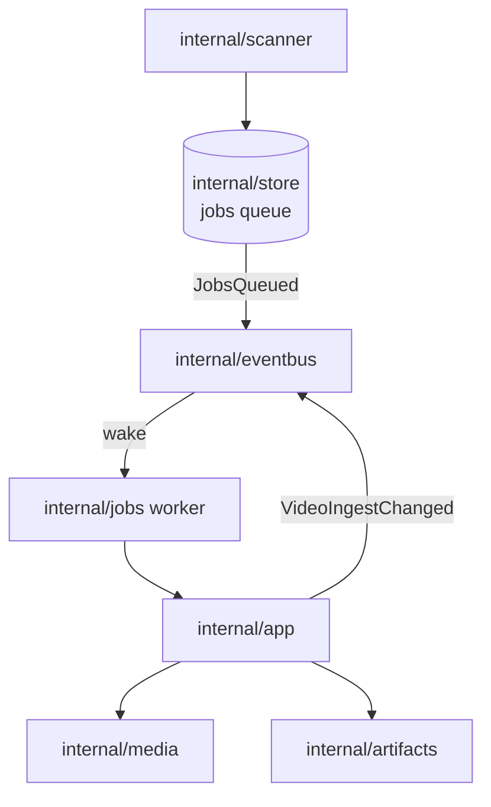
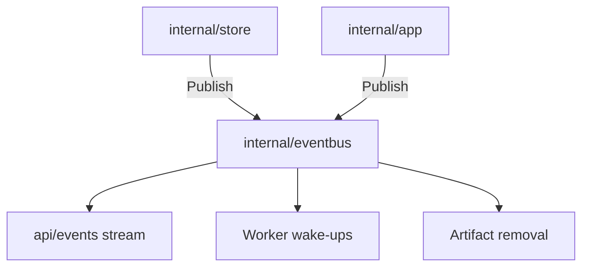

# Architecture

This repository targets a self-hosted media data management (MDM) system. It indexes video files
on local storage and plays them back in a browser.

The core is in place: a single Go binary, backed by SQLite, that scans configured media folders,
serves the JSON API and the embedded React SPA, streams video with byte ranges, and records
playback positions. The remaining components are introduced as later phases land. The selected
stack and the component boundaries are recorded in
[docs/design-docs/tech-stack-selection.md](docs/design-docs/tech-stack-selection.md).
Expand the sections below as implementation lands.

## Intended topology

A single Go binary serves the JSON API, the embedded React SPA build, and byte-range video
streaming (via `http.ServeContent`). It is backed by SQLite and by video files on a mounted
volume. `ffmpeg`/`ffprobe` run as child processes for metadata, thumbnails, and subtitle
conversion, driven by an in-process job worker. Everything ships as one container.

In place today, `cmd/mdm` starts up in this order:

1. It reads the remaining `MDM_*` environment variables.
2. It checks that `ffprobe`/`ffmpeg` are on `PATH`.
3. It opens SQLite under `MDM_DATA_DIR` and applies embedded goose migrations.
4. It starts the job worker.

It then serves:

| Surface | Routes | Notes |
| --- | --- | --- |
| Health | `GET /api/health` | |
| Video library API | `/api/videos*`, `/api/scans*` | A single video's response also carries its representative location, the folder that holds it (with the registered folder's display name, for the playback page's breadcrumb), seek-preview state and, for a folder-group member, the group and its position in it. |
| Video actions | `/api/videos/{id}/related`, `/probe`, `/open` | Return related videos (for a group member, also every member in group order, with next/previous inside the group), retry a failed metadata read, and open the file in the server PC's default app. |
| Media-folder settings and server-side directory picker APIs | | |
| Live-transcode video encoder setting | `/api/settings/transcoding` | The saved choice, the encoder in use and each hardware encoder's startup check result. |
| Read-only folder browsing API | `/api/folders*` | |
| Tag management API | `/api/tags*` | List, create, rename, delete, merge and synonym registration/removal. |
| Video-tags API | `/api/video-tags`, `/api/video-tags/summary` | Attach/detach a tag on a set of videos; summarize which tags apply to a selection. |
| Library items API | `/api/library*` | Described below. |
| Byte-range streaming, thumbnails, playback progress | | |
| SPA | | Embedded from `web/dist`. |

Two per-video lists accept the same parameters:

| List | Route | Scope |
| --- | --- | --- |
| The folder view's root search | `GET /api/videos` | The library |
| A folder | `GET /api/folders/{rootId}/videos` | Direct children by default, or the whole subtree with `scope=subtree` |

The shared parameters are a search expression (`query`), watch-state and playable filters,
thirteen sort orders and a shuffle `seed`.

- `internal/httpapi` validates those parameters at the entry and hands them to the store as
  `domain.VideoQuery` / `domain.FolderVideoQuery`.
- `total` counts every match after all of them apply.
- Each item carries the folder of the location it was listed from (`Video.folder`, built from
  the registered media folders with `domain.LocateVideoFolder`)
  ([specs/013-library-search/contracts/list-api.md](specs/013-library-search/contracts/list-api.md)).
- Every `Video` response (list, single, related, and retried-probe) also carries `tags` (an empty
  array when none). `internal/httpapi` looks them up from `TagStore.TagsByContentKeys` the same
  way `progressFor` looks up playback positions.
- The library list additionally accepts up to 16 `tag` ids (AND) and reports any that no longer
  exist in `missingTagIds`
  ([specs/014-video-tags/contracts/tags-api.md](specs/014-video-tags/contracts/tags-api.md)).

Every API error is a JSON `Error`:

| Field | Content |
| --- | --- |
| `code` | Machine-readable. |
| `message` | English. The fallback for API clients and unknown codes. |
| `reason` (`ErrorReason`) | Present where one `code` covers several situations the UI can cause. |
| `limit` | A server limit, for some reasons. `internal/httpapi` fills it from the server's own constants. |
| `tagName` | The conflicting tag's original name, for some reasons. |

The UI builds its text from `code` and `reason`. `internal/httpapi` maps
`domain.InvalidTagNameError` to the tag-name reasons
([specs/023-english-i18n/contracts/error-api.md](specs/023-english-i18n/contracts/error-api.md)).

`GET /api/library` takes the same parameters as `GET /api/videos` but returns library items: a
video, or a folder group as one item (`LibraryStore.ListLibrary`).

- The search, playable and tag filters apply per member. A group appears when any member matches.
- A group's values come from all of its members: count, total duration and size, latest dates,
  watch state and the member to open (decided by `domain.GroupWatch` and
  `domain.GroupOpenIndex`).
- The watch filter, sort and `total` apply to items.
- `GET /api/library/ids` returns the matched videos plus every member of matched groups (owner
  only).
- `GET /api/folders/{rootId}/group` refetches one group card.
- A guest sees groups built from public members only. A group with one public member is listed as
  that video
  ([specs/017-folder-groups/contracts/library-api.md](specs/017-folder-groups/contracts/library-api.md)).
- `GET /api/videos` stays a per-video list for the folder view's root search.

`internal/scanner` walks a snapshot of the media folders stored in SQLite when a user starts a
scan. Only a user-started scan walks the media folders. It identifies files by content (`sha256`
over the first and last 1MiB plus the size), so moves and renames do not duplicate rows, and it
queues the heavy work.

The folder index is folder groups and each video's ancestor folder names:

- Just before a scan closes (done or failed), `internal/app` asks
  `ScanIndexStore.RebuildFolderIndex` to rebuild the folder index.
- The rebuild reads every location row in SQLite, never the filesystem.
- A failed rebuild does not fail the scan but marks the index stale.
- At startup the folder index is rebuilt only when its rule version is out of date or it is
  stale (`RefreshFolderIndex`, after the search-key refresh and before HTTP and the workers
  start), or when an interrupted scan was closed
  ([specs/017-folder-groups/data-model.md](specs/017-folder-groups/data-model.md) §3).

The latest scan owns the set of videos that the current import has to prepare (`scan_videos`):

- Every transaction that queues a job, or makes a queued job claimable again by adding or
  replacing a media folder, adds the video to the latest scan in the same transaction.
- Starting a scan replaces the previous set while carrying over the videos that still have
  claimable queued or running jobs.
- The probe result and the preview job are written in one transaction, so a video never looks
  finished between the two.
- A video is settled when it has no claimable queued or running job. This is derived on every
  read, so requeued running jobs are not counted twice.
- `scans.settled_at` records when the closed latest scan's set first had no remaining work.
  `internal/store` recomputes it (`refreshScanSettled`) before committing any transaction whose
  change set can alter the remaining work: claims, job outcomes, enqueues, video deletions,
  media-folder changes and closing a scan.
- `internal/app` (`Scans`) combines the scan row and those counts into the user-facing
  `Scan.status` (`finding`, `running`, `done`, `partial`, `failed`) and progress through
  `domain.ImportTally`
  ([specs/024-import-progress/research.md](specs/024-import-progress/research.md) R-1–R-5).

The latest scan also owns its issues (`scan_issues`, one row per event):

- `internal/scanner` hands each file it cannot read or register to the reporter it declares, and
  `internal/app` records it.
- A job that fails at the retry limit is recorded in the same transaction as
  `recordTerminalFailure`. A later success of that stage deletes it.
- Starting a scan clears the previous scan's issues, and every change bumps
  `scans.issues_revision`.
- Reads group the rows per video (or per path for unregistered files) and drop those outside
  every registered media folder.
- One failed issue makes the import `partial`, and files that could not be registered count
  toward the progress (R-6).

What the import is doing right now (`Scan.activity`: registering, probe, thumbnail,
seekThumbnail or preview, with the file) is not stored:

- `internal/app` (`Scans`) keeps the running activities in memory, shows the one that started
  last, and falls back to the latest remaining one when it ends.
- It publishes `ScanActivityChanged` whenever the shown one changes (R-8).
- `internal/scanner` reports each file before registering it, and its progress after every file
  (no longer every 20 files), to the reporter it declares.
- The workers report each job through the `Started` and `Finished` hooks of `internal/jobs`,
  which `cmd/mdm` wires to `Scans`.
- After a restart only what is running then is shown.

`internal/jobs` runs one in-process worker per ingest stage. Each worker claims only its own kind
of job from the persistent `jobs` queue, one at a time, and hands it to `internal/app`.
`internal/app` drives the `internal/media` adapters and publishes their output through
`internal/artifacts`.

| Stage | `internal/media` work |
| --- | --- |
| probe | `ffprobe` for metadata |
| thumbnail | `ffmpeg` for one library thumbnail |
| seek_thumbnail | Seek-preview sprite sheets from the keyframes an MP4/MOV index assigns to each interval or, for other inputs, from up to four concurrent input seeks |
| preview | A content-keyed hover-preview clip per video |

Seek previews:

- New seek previews use at most 81 frames on one 9 × 9 sheet with cells up to 160 px.
- `domain.NewSeekSpriteLayout` derives the interval from the duration. It keeps five seconds for
  short videos and widens it for longer videos.
- For MP4/MOV with H.264/HEVC the index is read once and only the chosen keyframes are read.
  Other inputs use one input seek per frame.
- An interval without a frame reuses the previous frame. Only an ffmpeg failure falls back to the
  sequential decoder.
- Existing completed six-sheet sprites remain readable
  ([seek-sprite-generation.md](docs/design-docs/seek-sprite-generation.md)).

Two generation fallbacks are substitutions that the user is told about: a library thumbnail
taken from the first frame because no frame was found at the chosen position, and a seek sprite
rebuilt by decoding the whole video. They are recorded in this order:

1. `internal/media` returns them as values (`Thumbnail`, `GenerateSeekSprite`) without knowing
   events or the store.
2. `internal/app` passes them with the stage's success.
3. `internal/store` records `thumbnail_first_frame` / `seek_thumbnail_full_decode` in the
   transaction that writes the success, or deletes the row when the stage is rebuilt without the
   fallback.

- The seek sprite also keeps the flag in its `sprite.json`. Adopting a completed sprite (a rerun
  after a stop between publishing and recording, or another video with the same content)
  therefore records the same substitution.
- An import with only substitutions stays `done` and counts them in `Scan.issues.substituted`
  ([specs/024-import-progress/research.md](specs/024-import-progress/research.md) R-7).

Claim order and wake-ups:

- The library thumbnail and the seek sprite are separate stages with their own state columns, so
  a library thumbnail never waits for any video's seek sprite.
- A worker sleeps while its queue is empty. `internal/store` publishes `domain.JobsQueued` after
  every committed enqueue, and a subscription wakes the worker for that stage, so no worker polls
  the queue.
- A thumbnail job is not claimed until its video's probe has finished, because the frame
  position depends on the duration.
- A seek_thumbnail job is not claimed until its video's probe has finished and no claimable
  thumbnail job remains. After a scan every library thumbnail therefore comes first, and up to
  four generation `ffmpeg` processes can run within one seek job.
- Hover preview and newly claimed thumbnail work may overlap. The condition applies only at claim
  time; a running seek_thumbnail job is not stopped when new thumbnail jobs arrive.
- `internal/app` publishes `domain.VideoIngestChanged` with the finished stage. Subscriptions
  wake the thumbnail worker as soon as a probe's result is recorded, and the seek_thumbnail worker
  when a probe or thumbnail result is recorded or a video row is deleted.
- Removing a media folder also publishes `domain.JobsQueued` for seek_thumbnail, because
  thumbnail work under that folder stops being claimable even when the video row survives through
  an unregistered location.

Recovery and cleanup:

- At the next startup, interrupted scans are closed, running jobs are requeued, and the single
  `.tmp` directory that holds in-progress generation output is removed.
- A video row is deleted when a scan finds its last location gone, its content changes, or its
  media folder is removed or replaced. `internal/store` then publishes the released content keys
  (`domain.ContentUnreferenced`) after commit.
- `internal/app`, subscribed to that event, removes that content's thumbnail, seek sprite and
  hover preview unless another video still references it. Nothing else sweeps the thumbnails
  directory.
- A hover preview that is gone or incomplete is repaired when it is found. `internal/app` already
  checks it before the video API exposes `previewUrl`. When a `done` preview's MP4 is missing or
  does not match the size in its manifest, it sets the video back to `pending` and queues a
  preview job in one transaction, once per loss.

A failed probe or scan keeps its free-text reason and, separately, a machine-readable code:

| Failure | Free-text reason | Code | Wrapped by | API field |
| --- | --- | --- | --- | --- |
| Probe | `videos.probe_error` | `videos.probe_error_code` | `domain.ProbeFailure` (`internal/media`) | `Video.probeErrorCode` |
| Scan | `scans.error` | `scans.error_code`, with `scans.error_path` when the reason concerns one location (the media folder or the place that could not be read) | `domain.ScanFailure` (`internal/scanner`) | `Scan.errorCode`/`errorPath` |

- The adapter that produces the failure wraps it.
- `internal/app` marks a scan stopped by shutdown as `interrupted`, as does closing one left
  running at startup.
- `internal/store` takes the code out with `errors.As` when it records the failure, storing
  `internal` for anything unwrapped.
- The screen explains a failure from the code instead of the free text.
- Rows recorded before the codes existed keep their old reason with no code
  ([data-model.md](specs/023-english-i18n/data-model.md)).
- `jobs.last_error` stays free text.

Generated files have one owner, `internal/artifacts`. Under `MDM_DATA_DIR/thumbnails` (the root
comes from `cmd/mdm`'s configuration), it alone decides where each content key's files live, and
it alone creates, checks, opens and removes them.

| File | Path under the root |
| --- | --- |
| Library thumbnail | `
/<s>.jpg` |
| Seek sprite | `seek/
/<s>/`: sheets `000.jpg`… and the `sprite.json` layout, whose presence marks the sprite complete |
| Hover preview and its size/SHA-256 manifest | `preview/
/<s>.mp4[.sha256]` |

`<s>` is the content key with `:`, `/` and `\` replaced by `_`, and `
` is its first two
characters.

- Generation writes into a directory under `.tmp` that `internal/artifacts` hands out and then
  renames into place. A file still being generated is neither reported as present nor served.
- The seek sprite's layout records the frame size read from the first sheet.
- Publishing a seek sprite first removes a directory without `sprite.json` (the earlier
  one-JPEG-per-frame layout or a broken one) under the caller's per-content lock.
- A content key that would point outside the root (empty, or starting with `.`) never becomes a
  path.
- `internal/media` only runs `ffmpeg` against the output path it is given.
- `internal/app` (deciding when to generate and when to remove, under its per-content lock) and
  `internal/httpapi` (serving the files) reach the store through interfaces they declare.

> [!WARNING]
> Changing that layout would orphan every file an existing data directory already holds.

State changes that trigger side effects are domain events (`internal/domain/event.go`):

- a video's ingest state changed;
- jobs were queued;
- the remaining work per stage changed;
- the scan changed;
- the current import activity changed (`ScanActivityChanged`);
- content keys lost their last reference.

- Publishers call a `Publish` interface they declare themselves and know nothing about the
  subscribers.
- `internal/store` publishes after a transaction commits, never from one that rolled back. It
  sends one notice per kind of change per transaction, plus one per deleted video.
- `internal/app` publishes for job outcomes and scans.
- `internal/eventbus` delivers each event to every subscriber on that subscriber's own goroutine
  and queue, so a slow or panicking subscriber never stalls a commit, a worker or a scan.
- `cmd/mdm/events.go` is the one place that registers subscribers (the `/api/events` stream, the
  worker wake-ups, artifact removal). Adding one touches only the subscriber and that file.
- At shutdown the stream subscription is dropped before the streams close, and the wake-ups
  before the workers stop.
- The bus is closed only after the workers and any running scan have stopped, so queued artifact
  removals still run.
- The scan gets its own 10 second grace, because a read from an unresponsive mount does not
  return on cancellation. Past it, shutdown continues and the next startup closes the scan.

`/api/events` pushes changes to the browser as Server-Sent Events instead of the browser polling:

| Event | Sent when |
| --- | --- |
| `scan` | The current scan, the remaining jobs (job outcomes move the import's settled count) or the current activity change |
| `video` | A video's ingest state changes |

- There is no per-stage job count on the wire. The screen shows only the import's own status,
  video count and current activity.
- The payload is read at send time, and pending notices for a connection are coalesced.
- A new connection first receives the current `scan`, so a reconnect recovers what it missed.

Logical videos are separated from their physical locations, so the same content may remain
available from more than one configured root.

- Folders are not stored. The folder browsing API derives each folder's direct children and
  direct videos from the current locations' paths on every request. It addresses a folder by its
  registered root's id and a `/`-separated relative path.
- Streaming delegates ranges to `http.ServeContent` and only opens current locations that resolve
  inside a configured media folder.

`internal/mediafs` is the one owner of the rule that keeps arbitrary files from being read. A
location may be opened only when all of these hold:

- its cleaned path is inside a registered media folder;
- the path its symbolic links resolve to is inside the same folder;
- the file is a regular file (not a directory or a device).

How the rule is applied:

- It opens or hands out the resolved path, so what was checked is what gets opened.
- Streaming, live transcoding, opening in the default app, registering a media folder
  (`CheckMediaFolder`: a readable directory reached without symbolic links) and the server-side
  directory picker all use it through interfaces they declare.
- The containment checks themselves are pure functions in `internal/domain` (`PathInsideRoot`,
  `MediaFileInsideRoot`, `SamePath`), so they are tested without a filesystem.
- `internal/httpapi` only maps the result to a response. A location that points outside is
  answered like a missing file.

`internal/opener` launches the operating system's default app for a video's representative
location (`explorer.exe`, `open` or `xdg-open`).

- It is kept apart from `internal/media`, which is the entry point for `ffmpeg`/`ffprobe`.
- It resolves the command once at startup.
- On Linux and similar systems it also requires `DISPLAY` or `WAYLAND_DISPLAY`, so containers and
  headless servers report it as unavailable.
- The open route only accepts requests whose remote address and `Host` are loopback, and it never
  takes a path from the request.

`internal/password` hashes and verifies passwords with Argon2id and stores them as PHC strings
(`$argon2id$v=19$m=…,t=…,p=…$<salt>$<hash>`).

- New hashes use m=19456 KiB, t=2, p=1, a random 16-byte salt and a 32-byte key.
- Verification reads the parameters from the stored string, so stronger parameters can be
  introduced later without invalidating existing hashes.
- It is an adapter rather than part of `internal/domain`, because it draws random salts and uses
  an external cryptographic implementation.
- The pure authentication rules live in `internal/domain`: the username and password value rules,
  the session lifetime, the post-login redirect check, `Audience` (whose zero value is the guest)
  and which list conditions a guest may use.

Shutdown runs in this order:

1. It closes the `/api/events` streams.
2. It drains in-flight requests within a 10 second grace period.
3. It stops the scanner and the workers, so a running job returns to the queue.

### Rebuildable and user data

Stored data falls into three recovery categories:

| Category | Data | Recovery |
| --- | --- | --- |
| Rebuildable | `videos`, `video_locations` (including their search keys), `location_search_fts`, `jobs`, `scans` (including `settled_at` and `issues_revision`), `scan_videos`, `scan_issues`, generated thumbnails and previews, the folder index (`folder_groups`, `folder_group_members`, `video_folder_names`, `folder_index_state`), and `video_transcode_probes` | Rebuilt from registered media folders by scanning and processing the files again |
| User or configuration data | `playback_progress`, the tag tables (`tags`, `tag_names`, `video_tags`), `public_videos`, `folder_group_overrides`, `account`, `media_folders`, `settings` (owner-chosen values such as the live-transcode video encoder, `specs/025-hardware-encoding/data-model.md`), and `api_tokens` (issued API tokens, which must be issued again if lost, `specs/026-external-api/data-model.md` §1) | A scan cannot restore it |
| Transient | `sessions` | A fresh login restores it |

- A scan cannot start with no registered `media_folders`. After database loss those folders must
  be registered again before scanning.
- That is why playback positions, tag assignments and public flags are keyed by the content
  identifier rather than by `videos.id`, and why those tables carry no foreign key to `videos`.
- Grouping exceptions are keyed by the folder's absolute path (`domain.FolderKey`) and carry no
  foreign key to `videos` or `media_folders`, so they survive rescans and media-folder changes.
- The single `account` row holds the username, Argon2id password hash and credential version.
  Deleting it sends the server back to first-run setup
  (`specs/016-single-account-auth/data-model.md` §2).
- The operational backup and restore procedure is in
  [Running vv](docs/how-to/running-vv.md#data-and-recovery).

`store.DB` is only the foundation. It:

- opens and closes the SQLite connection pools, routing write transactions through an
  immediate-lock pool and snapshot list reads through a deferred pool so they do not reserve the
  writer;
- runs migrations (`store.Migrate`);
- answers the health ping;
- registers the publisher for post-commit events;
- hands out the role types.

Every business operation is a method of the role type that owns it, so calling one through the
wrong role does not compile:

| Role | Owns | Notes |
| --- | --- | --- |
| `IngestStore` | The job queue (enqueue, claim, complete, fail, requeue, remaining work) and writing each ingest stage's result back to the video row, including the retry of a failed probe and the rebuild of a missing preview. A probe's result also upserts the video's live-transcode probe (`video_transcode_probes`: a versioned `domain.TranscodeProbe` JSON plus the probed file's size and nanosecond mtime) in the same transaction. `SaveTranscodeProbe` upserts one probed at request time. | `specs/018-live-transcode-seek/data-model.md` |
| `LibraryStore` | Reads of the index: the video list and search, library items (videos and folder groups, a group's card and the "select all" ids), folder browsing, related videos and the folder group a video belongs to (`VideoGroup`), a video's locations, a video's stored live-transcode probe (`TranscodeProbe`), and the startup refresh of search keys. | Details below. |
| `ScanStore` | The state of a scan run. | |
| `ScanIndexStore` | Reflecting a scan's filesystem facts into the index (upserting locations, removing missing ones and the videos they orphan), rebuilding the folder index before a scan closes, and the startup refresh of an out-of-date folder index. | |
| `SettingsStore` | Registering, replacing and removing media folders, rebuilding the folder index in the same transaction. Reading and saving owner settings in the `settings` table (the live-transcode video encoder choice, returned uninterpreted). | |
| `FolderGroupStore` | Setting and clearing a folder's grouping exception (`ungroup`, `group_direct`) and turning a folder's group into a tag (finding or creating the tag by name or synonym and writing `ungroup`), each rebuilding the folder index in the same transaction. Reading folders' groupings for `FolderSummary.grouping`. | Shared helpers below. |
| `PlaybackStore` | Playback positions. | Holds only the SQL connection and does not depend on the rebuildable index stores or their notifications. |
| `TagStore` | Tags themselves: create, rename, delete, merge, register/remove a synonym, the counted listing, and the startup refresh of tag-name search keys. Attaching and detaching a tag across a set of video ids (resolved to the currently-registered videos' content keys). Summarizing the tags on a selected set of videos. Looking up the tags on a set of content keys in bulk for the video list (`TagsByContentKeys`, shaped like `PlaybackStore.ProgressByContentKeys`). | `specs/014-video-tags/data-model.md`. Like `PlaybackStore`, holds only the SQL connection and does not depend on the rebuildable index stores or their notifications. Tag changes have no side effects, so they publish no domain event. |
| `AuthStore` | The single account, its login sessions and its API tokens. | Details below. Like `PlaybackStore`, holds only the SQL connection and publishes no domain event. |
| `VisibilityStore` | Switching the public flag of a set of video ids (resolved to the currently-registered videos' content keys, like tag attachment) in one transaction, returning the content keys it applied to. | `specs/016-single-account-auth/data-model.md` §5. Like `TagStore`, holds only the SQL connection. |

`LibraryStore` details:

- A video's stored live-transcode probe is read one video at a time and is never part of the list
  or detail reads. `domain.TranscodeProbeUsable` decides whether it may be used.
- The video list can AND-filter on a set of tag ids and reports which of them do not exist
  (`VideoQuery.TagIDs`/`VideoPage.MissingTagIDs`, `specs/014-video-tags/data-model.md` §6).
- `LibraryIDs` returns the matching item ids unpaged for the library's "select all"
  (`specs/017-folder-groups/contracts/library-api.md` §2).
- The search-box term matcher also OR-matches a video's tag names (original name and synonyms)
  alongside title and path (`specs/014-video-tags/data-model.md` §7).
- Every read that returns videos, locations or folders (`ListVideos`, `ListFolderVideos`,
  `DirectVideoPaths`, `GetVideo`, `VideosAddedNear`, `VideosByIDs`, `VideoGroup`,
  `FolderLocations`, `HasFolderLocations`) takes a `domain.Audience`. Its location condition goes
  through one function, `visibleLocationCondition`.
- The owner sees every location under a registered folder. A guest additionally sees only those of
  videos with a non-empty content key in `public_videos`, and a guest's search does not match tag
  names (`specs/016-single-account-auth/data-model.md` §3).
- The conditions used by ingest, jobs and tag counts stay owner-only.

Shared package-private helpers:

- `LibraryStore` resolves which of a set of tag ids currently exist through `existingTagIDs`.
- `TagStore` resolves a set of video ids down to the currently-registered videos' content keys
  through `registeredContentKeysForVideoIDs`.
- Both are unexported package functions (`internal/store/roles.go`), never called as another
  role's public method.
- `FolderGroupStore`'s tag lookup and creation are the package-private `findOrCreateTag` and
  `insertTag` (`internal/store/tags.go`), shared with `TagStore`.
- The folder-index rebuild itself is the package-private `rebuildFolderIndex`, shared by
  `ScanIndexStore`, `SettingsStore` and `FolderGroupStore`. The assignment rule is the pure
  `domain.BuildFolderIndex` (`specs/017-folder-groups/data-model.md` §2).

`AuthStore` details:

- First-run setup writes the account row and the first session in one transaction, so concurrent
  setups resolve by the primary key.
- Changing the username or password bumps `account.version` and clears `sessions` and
  `api_tokens` in the same transaction.
- It adds, checks, deletes and sweeps expired sessions.
- It issues, lists, revokes and checks API tokens, and records their last use at most once a
  minute.
- It stores only the SHA-256 of a session ID or an API token.
- A session is valid only while its `account_version` matches `account.version` and it has not
  expired (`specs/016-single-account-auth/data-model.md` §4, §5).
- An API token is valid only while its `account_version` matches
  (`specs/026-external-api/data-model.md` §1).

Role isolation:

- `store.DB` does not hand out its `*sql.DB`, so SQL stays inside `internal/store`.
- Tests outside the package set up and inspect storage through the role types. When no role
  operation fits, they use the few test-only functions in `internal/store/storetest.go` (suffixed
  `ForTest`, never called by production code).
- A role type never calls another role type's public methods.
- Reads several roles need (media folders, one video, whether a content key is still referenced)
  have a single package-private implementation that each role exposes as its own operation.
- Operations that span roles in one transaction (removing a media folder with its locations,
  videos and jobs, or scheduling a preview rebuild) stay atomic and share package-private SQL
  helpers inside that transaction.

Search matches a per-location `search_key`:

- Go builds it from the title and the path below the registered media folder, folded with
  `domain.FoldForMatch`.
- The trigram FTS5 table `location_search_fts` indexes it.
- SQL cannot express that folding. Startup therefore refreshes every location whose
  `search_version` is older than `domain.SearchKeyVersion`, right after `store.Migrate` and before
  jobs or HTTP start.
- Startup aborts if that refresh fails (`specs/013-library-search/data-model.md` §5).

Every request crosses an authentication boundary at the outermost layer of `internal/httpapi`
(`auth.go`) before routing. It sorts each request into one of four kinds by the `path.Clean`ed
request path:

| Kind | Requests |
| --- | --- |
| Bearer | `/api/v1/…` (the external API) and `/mcp`; see below |
| Anyone | `GET /api/health`, `GET /api/auth/session`, `POST /api/auth/setup`, `POST /api/auth/login`, `POST /api/auth/logout`, and `GET`/`HEAD` outside `/api/` for the SPA build |
| Guests too | The video, stream, artifact and folder reads |
| Owner only | Everything else, including undefined `/api/*` paths |

- The classification matches each operation's `security` in `api/openapi.yaml`. A Go test checks
  that.
- `ServeMux` splits the escaped path before decoding each segment. A request whose escaped
  segments differ from its decoded ones (an encoded `/` or `.`, as in `%2F` or `%2E%2E`) is
  therefore classified owner only when either form is under `/api/`, so classification and
  dispatch cannot disagree.
- The boundary decides the viewer (`domain.Audience`) from the session cookie
  (`__Host-vv_session` over HTTPS, `vv_session` over HTTP) and puts it on the request context for
  handlers to read.
- It tags every `/api/*` response with `X-VV-Audience: owner|guest`.
- Owner-only requests without a valid session, and every non-anyone request while no account is
  configured, get `401 unauthenticated`. A failed session lookup is `500`, never an owner.

Guest-too requests without a valid session are handled as a guest. Handlers pass the audience to
`LibraryStore` and `Catalog`, with these effects
([specs/016-single-account-auth/contracts/guest-api.md](specs/016-single-account-auth/contracts/guest-api.md)):

- Only public videos (and folders derived from them) appear.
- Hidden videos and folders answer the same `404` as missing ones.
- Guest responses omit `location`, `progress`, `probeError`, `probeErrorCode` and `rootPath`, and
  carry empty `tags`.
- List conditions that depend on owner data (`watch`, played-at sorts, `tag`) are `400`.

Thumbnails, seek previews and hover previews are served `private, no-cache` with an `ETag` (`304`
on a match) to owners and guests alike, so neither a shared cache nor the browser keeps serving
them after logout.

In-flight responses are cut off as follows:

- For owner requests the boundary keeps an in-memory ledger. It sets the session expiry as the
  context deadline and ends a session's in-flight responses on logout.
- The ledger re-checks requests that run longer than 30 seconds every 30 seconds, so a credential
  change from the host command also ends them.
- Ending a response cancels its context and moves the write deadline to now.
- `PUT /api/video-visibility` (owner only) switches the public flag through `VisibilityStore`.
  After the switch commits, making videos private ends the in-flight guest stream, live-transcode
  and hover-preview responses of their content keys, which a second in-memory ledger
  (`visibility.go`) tracks. Owner responses continue.
- Switches run one at a time from commit to cut-off, so a later re-publish cannot be cut off by an
  earlier switch to private.

Session and token routes
([specs/016-single-account-auth/contracts/auth-api.md](specs/016-single-account-auth/contracts/auth-api.md),
[specs/026-external-api/contracts/token-api.md](specs/026-external-api/contracts/token-api.md)):

| Route | Access | Behavior |
| --- | --- | --- |
| `POST /api/auth/setup` | Anyone | Creates the first account and logs in |
| `POST /api/auth/login` | Anyone | Issues a session |
| `POST /api/auth/logout` | Anyone | Revokes a session |
| `GET /api/auth/session` | Anyone | Reports `owner`, `guest` or `setupRequired` |
| `GET`/`POST /api/api-tokens`, `DELETE /api/api-tokens/{id}` | Owner only, cookie sessions only | List, issue and revoke API tokens; the plaintext appears only in the issue response |

Bearer requests
([specs/026-external-api/research.md](specs/026-external-api/research.md) R-3, R-4, R-9):

- A Bearer request is a `path.Clean`ed path under `/api/v1/` (including undefined ones, which
  answer a JSON `404` after authentication) or `/mcp`, chosen only when the escaped and decoded
  segments agree.
- Bearer requests never read the cookie. `Authorization: Bearer <token>` alone decides the owner
  through `app.Auth`.
- A missing, malformed, unknown or revoked token is `401 unauthenticated` with
  `WWW-Authenticate: Bearer`.
- Every other path never reads `Authorization`, so a Bearer-only request to the screen API is a
  guest (or `401` for owner-only operations).
- The same-origin check applies to cookie requests only. A Bearer request's `Origin` is not
  checked, while the JSON body rule still applies.
- A valid token records its last use at most once a minute. A failed write is logged and the
  request continues.
- A token's requests join the in-memory ledger under the token's id. Revoking it on the settings
  page ends them at once, and the 30-second re-check ends them after a credential change from the
  host command.
- The external API's handlers live on a separate type (`externalServer`, `external.go`) generated
  from `api/external-v1.yaml` into `internal/httpapi/extgen/`
  ([docs/how-to/external-api.md](docs/how-to/external-api.md)).

`/mcp` is an MCP server (Streamable HTTP, stateless, JSON responses; `GET` and `DELETE` are
`405`) built with the official Go SDK in `internal/httpapi/mcp.go`, behind the same Bearer
boundary
([specs/026-external-api/contracts/mcp.md](specs/026-external-api/contracts/mcp.md),
[research.md](specs/026-external-api/research.md) R-8).

- Its six tools map one to one to the external API operations.
- Each tool builds that operation's query or body and calls the same `externalServer` handler. It
  returns the response body as structured content, or `isError` with the external API's error
  body for a non-2xx status.
- A tool call is cancelled with its HTTP request, so revoking a token also ends its running tools.

Wiring and client origin:

- `cmd/mdm` wraps `app.Auth` for the boundary, deletes expired sessions at startup, and logs a
  warning while no account is configured.
- The client address and whether a request is HTTPS come from `client_origin.go`. It reads
  `X-Forwarded-For` and `X-Forwarded-Proto` only on connections from the reverse proxies in
  `MDM_TRUSTED_PROXIES` (loopback and private addresses when unset), and otherwise uses the
  connecting address and TLS.
- The login attempt limit, authentication logs, the cookie name and `Secure`, the same-origin
  check and the loopback check for opening a file all use it.

Not built yet: subtitles and multi-user support.

Live transcoding:

- Browser-incompatible video can be transcoded to a request-scoped fragmented MP4 stream.
  Transcoded output is not persisted.
- The transcode route reuses the video's stored live-transcode probe when it still matches the
  opened file, and saves the one `internal/media` probed otherwise.
- A seek copies the video when it can and starts at the previous keyframe. `internal/media` reads
  that actual start from the output's `moov` edit lists. It falls back to encoding when that start
  is more than `domain.CopySeekAllowance` before the requested position.
- The player learns that start from `GET /api/videos/{id}/transcode-start`, keyed by the
  `attempt` it put on the transcode URL and served from an in-memory ledger in `internal/httpapi`
  ([live-transcode-seek.md](docs/design-docs/live-transcode-seek.md)).
- When the video is encoded, the route puts the encoder `TranscodeSettings` currently resolves
  (software, NVENC, Quick Sync, VAAPI or VideoToolbox) on each request. A new choice applies from
  the next request without a restart, and a running stream keeps the encoder it started with.
- A hardware encoder that exits before its first data is retried with `libx264` inside the same
  request, and the route logs that fallback as a warning.
- `cmd/mdm` starts the startup encoder checks in the background, so they never delay the HTTP
  listener ([hardware-encoding.md](docs/design-docs/hardware-encoding.md)).

## Intended dependency direction

`cmd -> internal/{app,httpapi,store,media,mediafs,artifacts,opener,scanner,jobs,eventbus,password} -> internal/domain`,
one way only. The packages under `internal/` fall into three layers:

| Layer | Packages |
| --- | --- |
| Domain | `internal/domain` |
| Application | `internal/app` |
| Adapters | `internal/httpapi`, `internal/store`, `internal/media`, `internal/artifacts`, `internal/mediafs`, `internal/opener`, `internal/scanner`, `internal/jobs` and `internal/password`; `internal/eventbus` sits beside them |

`internal/domain` holds the domain model: value types and pure rules (`EvaluatePlayability`,
`OrderRelated`, search-key folding, …). It includes the business rules the store enforces:

| Rule | Functions |
| --- | --- |
| How a claim counts attempts, and whether a failed job returns to `queued` or stops as `failed` | `ClaimAttempts`, `JobStateAfterFailure` |
| Which queued jobs may be claimed: a registered location, a finished probe for thumbnails and seek thumbnails, and no claimable thumbnail job left for seek thumbnails | `ClaimConditionFor` |
| Whether a media folder may be added, replaced or removed | `CheckMediaFolderPlacement`, `CheckMediaFolderMutation` |

- `internal/store` translates these into SQL and writes their results. It re-reads the inputs
  inside its transaction, and the database constraints (one running scan, one unfinished job per
  `(kind, video_id)`) remain the final guard against races.
- `internal/domain` is the end of the chain. It must not depend on `net/http`, `database/sql`,
  `os`, `os/exec`, the SQLite driver, or any other `internal/*` package.

`internal/app` is the application layer and holds the use cases:

| Use case | Responsibilities |
| --- | --- |
| `Scans` | Starting, running and closing a scan, and recovering an interrupted one at startup |
| `Ingest` | Processing one probe, thumbnail, seek-thumbnail or preview job: checking the claimed identity, calling the generator, applying the result, publishing the outcome, and removing artifacts whose content lost its last reference |
| `Catalog` | The decisions behind a video response: requeueing a missing hover preview, deriving the seek-preview state from its stored state and requeueing a `done` one whose sprite is missing or incomplete. Also assembling related videos, which for a folder-group member orders next/previous inside the group and leaves its members out of the related list |
| `MediaFolders` | Adding, replacing and removing media folders after the filesystem adapter has checked the path |
| `TranscodeSettings` | Holding the live-transcode video encoder choice with the startup encoder checks (run concurrently with a per-encoder time limit and kept in memory only), to decide the encoder actually used and to save a new choice |
| `Auth` | First-run setup, login verification with per-source throttling, issuing, checking and revoking login sessions, and issuing (`vvt_` plus 32 random bytes), listing, checking and revoking API tokens |

- `internal/app` reaches storage, `ffmpeg`/`ffprobe` and generated files only through interfaces
  it declares, so its unit tests run without SQLite, `ffmpeg` or an HTTP server.
- It must not import `net/http`, `database/sql`, `os/exec`, the SQLite driver, or any adapter
  package.

The adapters talk to the outside world.

- `internal/eventbus` only delivers `domain.Event` values in-process. Only `cmd/mdm` imports it.
- Filesystem checks stay in the adapters. `internal/mediafs` checks media folder paths, the files
  a request may open and the directories the picker lists. `internal/store` therefore never
  touches the filesystem, and `internal/httpapi` never decides by itself whether a file may be
  opened.
- `internal/httpapi` only parses requests, calls the application layer, the store or
  `internal/mediafs`, and converts to the generated `gen` types.

`cmd/mdm` is the composition root: it reads the configuration, creates the adapters and the
application-layer values, wires them together, and starts and stops them. It holds no use case of
its own.

The sibling packages under `internal/` (the adapters and `internal/app`) do not import each
other. Each declares the interfaces it consumes:

| Consumer | Declared interfaces |
| --- | --- |
| `internal/app` | A scan store, an ingest store, a generator, an artifact store, an event publisher, an auth store and a password hasher |
| `internal/scanner`, `internal/jobs` and `internal/httpapi` | An index to write to, a queue to claim from, a library and a video catalog to query, generated files to serve, and an authenticator (`httpapi.Authenticator`, which `cmd/mdm` fills by wrapping `app.Auth`) |

`cmd/mdm` is the only place that knows which concrete type goes where. The values crossing those
boundaries (`domain.VideoFile`, `domain.Job`, `domain.VideoQuery`, `domain.VideoView`, …) live in
`internal/domain`, which is why neither side needs the other.

All of this is enforced mechanically with golangci-lint's depguard in CI. The rules live in
[.golangci.yml](.golangci.yml):

- one for `internal/domain`;
- one for `internal/app`;
- one that forbids the sibling packages from importing each other (test files are exempt, because
  an external `package x_test` imports its own package).

Each rule carries the reason in its message, so a violation explains itself from the `task lint`
output alone.

Each HTTP API boundary has a single source of truth:

| Contract | Between | Generated code |
| --- | --- | --- |
| `api/openapi.yaml` | The Go backend and the TypeScript frontend | Both sides |
| `api/external-v1.yaml` | Versioned contract with external tools (the external API under `/api/v1`) | Go only (`internal/httpapi/extgen/`), because the SPA never calls it |

Both are generated by `task generate`, the generated files are version controlled, and CI fails
when regenerating them produces a diff.

`web/embed.go` is the one deliberate exception to the layering. Go's embed directive cannot
reference a parent directory, so the declaration that pulls `web/dist` into the binary lives next
to the SPA, and `internal/httpapi/spa.go` consumes it as an `fs.FS`.

## Web layer

The SPA under `web/src` is split by responsibility rather than by widget.

`web/src/api/` is the only place that talks to the server. Pages and components do not call
`fetch` themselves, so how the server is reached stays changeable in one place.

| File | Role |
| --- | --- |
| `client.ts` | Wraps `fetch` over the generated types in `web/src/api/gen/` (never hand-edited; `task generate` rewrites them from `api/openapi.yaml`). It turns a failed `fetch` into `NetworkFailed` and an error response into `RequestFailed`. |
| `serverEvents.ts` | Shares one `EventSource` on `/api/events` among its subscribers. |
| `useVideos.ts` | Owns paging and request cancellation for the library list, and re-fetches a listed video in place when a `video` event names it. Its paging, per-item and per-group re-fetch, list-data reducer and criteria keying live in `useVideoPages.ts`, `useItemRefresh.ts`, `useGroupRefresh.ts`, `videosData.ts` and `videosCriteria.ts`. |
| `libraryItems.ts` | `LibraryItem`, the type of `useVideos`'s items: a video or a folder group. |
| `useVideoDetail.ts` | Fetches one video for the playback screen, and re-fetches it when a `video` event names it or the event stream reconnects. |
| `listSnapshot.ts` | Holds the in-memory snapshot that lets the list restore its position after a round trip to the playback screen. |
| `tags.ts` | Holds a single shared, last-value-only cache of the tag list behind `getTags`/`refreshTags`/`subscribeTags`. The combobox, tag-filter confirmation and the tag admin screen all read and invalidate the same list instead of issuing their own `GET /api/tags`. |
| `auth.ts` | Checks who is viewing (`GET /api/auth/session`) and sends first-run setup, login and logout. |

- A group item is re-fetched from `GET /api/folders/{rootId}/group` when a member's progress,
  tags or `video` event changes, and dropped on 404.
- A group whose re-fetch has not settled is kept in the list snapshot's `staleGroups` and
  re-fetched when the list is restored.
- The list's conditions (search terms, watch state, playable-only, sort and the shuffle `seed`)
  live in the URL. `web/src/videoList/listCriteria.ts` converts between the URL and the criteria
  `useVideos` sends.
- The server applies every condition, so the page neither filters loaded pages nor reads ahead to
  find matches.

`web/src/auth/` is the gate in front of every route. `AuthGate`:

- renders nothing until the session state is known;
- sends every URL to `/setup` while no account exists;
- sends a guest on an owner-only screen (`/settings`, `/tags`) to `/login?next=…`;
- exposes the answer to the screens through `useAudience`.

Other parts of `web/src/auth/` and the viewer handling:

- The first-run setup (`/setup`) and login (`/login`) screens live there too, and sit outside the
  shell and its providers.
- When the viewer changes (setup, login, logout), the page is reloaded rather than re-rendered, so
  nothing read for the previous viewer stays in memory.
- The gate also tells `client.ts` who the page is rendered for. While that is the owner, the
  first `/api/*` response that is a 401 or carries `X-VV-Audience: guest` (a logout in another
  tab, an expired session) reloads the page once and is never handed to the screen.
- The `/api/events` connection and the playback screen's video cannot read a status or header
  when they fail. When the event stream gives up or the video fails to load, they check the
  session instead, and reload once if the viewer is no longer the owner rather than retrying
  forever.

A guest gets the same shell and screens with every owner-data control left out rather than
disabled:

- the scan button and progress;
- the tag and settings entries;
- selection, tag filters, the watch-state filter and "recently played" sort (list conditions left
  in the URL or the stored sort are rounded to the defaults);
- tags, file location, re-probe and saved playback position on the playback screen.

`ScanProvider`, `useVideos` and `useVideoDetail` neither fetch owner-only state nor subscribe to
`/api/events` for a guest.

| Directory | Owns |
| --- | --- |
| `web/src/shell/` | The responsive top bar, sidebar, scan state, and the frame around a screen |
| `web/src/library/`, `web/src/folders/`, `web/src/settings/`, `web/src/tags/`, `web/src/player/` | Their respective product flows |
| `web/src/ui/` | Reusable primitives |
| `web/src/lib/` | Locale-independent formatting helpers (duration, size, resolution) |
| `web/src/i18n/` | User-facing text, the locale-dependent formatting (numbers, dates, relative time, plurals) and the display of API errors |
| `web/src/videoList/` | The video-list pieces the library and folder screens share: list criteria and their URL hook, the condition labels and count summary, the video card, the empty/loading/error states and the search, filter, sort and zoom controls |

- `web/src/i18n/` holds an English catalog that components import statically as `t`. Its values
  are the branded `UiText` type that `web/src/ui/` props require.
- Its `errorText` turns a `RequestFailed` (its `reason`, `code`, `limit` and `tagName`) or a
  `NetworkFailed` into English instead of showing the server's or the browser's text.
- ESLint reports Japanese or fixed text outside `web/src/i18n/`. The details are in
  [docs/design-docs/i18n.md](docs/design-docs/i18n.md).
- `web/src/videoList/` belongs to neither screen, so neither screen imports from the other.
- `web/src/tags/` is the tag admin screen (`/tags`): a list of every tag with its video count, an
  in-page name/synonym search, create, rename and delete. `web/src/shell/navigation.ts` puts its
  sidebar entry right after "Folders".
- Every sidebar entry links to a working screen.
- The library, folder, settings and tag screens use the shell: `app/App.tsx` puts `AppShell`
  around the `/`, `/folders/*`, `/settings` and `/tags` routes.
- The playback screen (`/videos/:id`) deliberately gets no shell at all, because it is a two-pane
  screen of its own under its own header band. Keeping that choice to the one routing decision is
  what lets the shell stay ignorant of which screen it is framing.

| Playback screen part | Content |
| --- | --- |
| Header band | A logo that goes home, a breadcrumb to the video's folder, and a single close button (× or Esc) that returns to the list the screen was opened from |
| Left pane | The player with the title, tags, a file-facts row and a technical row |
| Right pane | Related videos |

- Inside `web/src/player/`, video.js owns only the control bar.
- Ingest stages, read and playback failures, the ended prompt and the touch controls are React
  layers stacked in one container above the player. For a folder-group member with a next member,
  the ended prompt is a five-second autoplay notice that re-checks that member before moving on.
- Keyboard shortcuts are handled page-wide rather than by video.js.
- The composition is recorded in [docs/design-docs/library-ui.md](docs/design-docs/library-ui.md).

The shell exposes the library, the folder browser and media-folder settings as routes.

- The folder browser reuses the shared video card and the library's paging (`useVideos` takes the
  folder as its source).
- It reads its location from the URL itself. Each path segment is encoded once when a link is
  built and decoded once from `location.pathname`, so names containing `%`, `#` or `?`
  round-trip.
- "Recently added" and "In progress" show a preparation notice until backing routes exist. Shell
  tests keep that boundary explicit.

The shell does not take ownership of scrolling. The sidebar and the toolbar are fixed or sticky,
and the document (the window) keeps scrolling the content as it did before the shell existed.
That is deliberate: the library list's scroll restoration, its zoom anchoring and its infinite
scroll all sit on `window.scrollY` and on a viewport-based `IntersectionObserver`, so moving the
scroll container inside the shell would rewrite all three.

`web/src/index.css` is the single source of truth for the visual rules.

- Its `@theme` block declares every color, radius and size as a role-named token
  (`--color-surface`, `--color-fg-muted`, `--color-accent`, …), and screens use only the utility
  classes generated from it.
- Raw hex values, raw pixels and Tailwind's default palette names are not written under
  `web/src/**`.
- Only the dark palette is implemented; there is no light/dark toggle.
- The reasoning is recorded in [docs/design-docs/library-ui.md](docs/design-docs/library-ui.md).

| Directory | Contents |
| --- | --- |
| `web/src/theme/` | No runtime code; it is inspection only. `tokens.test.ts` reads `index.css` as a file and asserts that every token pair it lists meets its WCAG contrast ratio, and that no file under `web/src` reintroduces a raw color or a Tailwind palette name. |
| `web/src/preferences/` | The per-device display settings as total functions over `localStorage` that never throw, so a corrupted value degrades to the defaults instead of blanking the screen. |

Unit tests run on Vitest with Testing Library in a `jsdom` environment, configured in
`web/vite.config.ts` and `web/vitest.setup.ts`. `task test-web` runs the production build check
and `vitest run` together, and `task check` calls it, so a regression in either fails CI the same
way.

## Principles

- Make module boundaries explicit and mechanically enforceable where possible.
- Keep dependencies directed from product-facing layers toward stable domain
  interfaces.
- Capture consequential design decisions in `docs/design-docs/`.
- Keep generated code (`internal/httpapi/gen/`, `internal/httpapi/extgen/`,
  `web/src/api/gen/`) generated; change `api/openapi.yaml` or
  `api/external-v1.yaml` instead.
