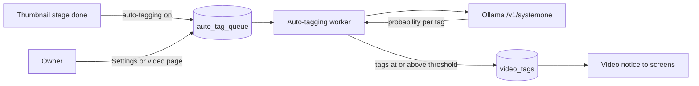
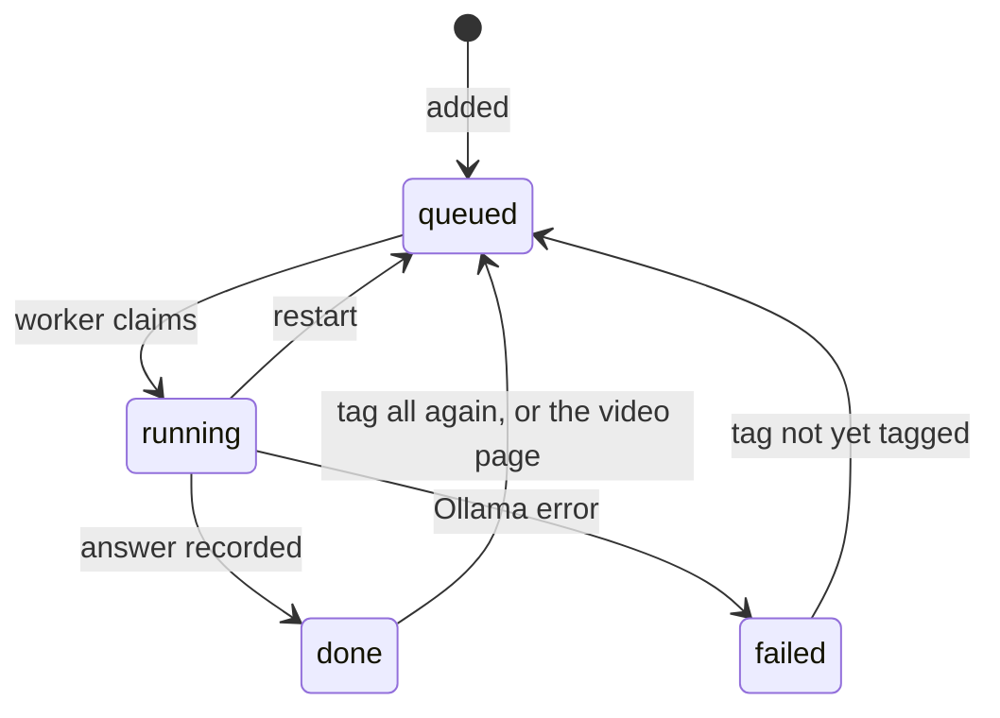

# Auto-tagging with a Clef classifier in Ollama

VVMDM asks a decision model running in Ollama (Cloudflare's Clef or
Clef-flash) which existing tags fit a video, and adds the tags whose
probability reaches a threshold. The use case is
[`internal/app/auto_tag.go`](../../internal/app/auto_tag.go), the queue is
[`internal/store/auto_tags.go`](../../internal/store/auto_tags.go), and the
Ollama client is [`internal/clef`](../../internal/clef).

The diagram shows how a video reaches the classifier and how its tags come
back.

## Classifier request

Each existing tag becomes one yes/no (`noul`) question, and a video is sent as
its thumbnail image plus a JSON state with its title, file name and folder.

Clef scores every question in one non-autoregressive pass and returns a
probability per question, so one request answers up to 64 tags. A library
with more tags is sent in batches of 64 with the same image. The question
names the tag and lists its synonyms; tentative tags are not asked about.

| Input | Source | When missing |
| --- | --- | --- |
| Image | The library thumbnail (640 px JPEG) the import already made | Text only; the thumbnail stage failed or the file is gone |
| `title` | The display name, else the file title | Never missing |
| `file_name`, `folder` | The representative location's path | Never missing |

Reusing the existing thumbnail adds no ffmpeg work. On a 4-core CPU without a
GPU, Clef-flash takes about 100 s per thumbnail and 25 s for text only; the
published GPU latency is under 0.2 s.

## Tags it adds

A tag is added when its probability is at least the threshold (0.8 by
default), as an ordinary tag on the video; no tag is created.

Added tags are indistinguishable from tags the owner added, so the existing
tag screens remove or merge them. The default threshold leans towards missing
a tag rather than adding a wrong one: in a trial on 14 images, the one wrong
tag had a probability between 0.5 and 0.8.

| Rejected | Why |
| --- | --- |
| Create tags from the model's suggestions | Clef only scores options it is given; it does not generate names |
| Mark added tags as tentative | Tentative is a state of a newly created tag, and these tags already exist |

## Queue and when a video is judged

Each video's content key has one row in `auto_tag_queue`, and the row stays
`done` after judging so that automatic judging never repeats on that video.

| Trigger | Queues |
| --- | --- |
| Thumbnail stage finishes, "Tag new videos automatically" on | Videos with no row |
| Settings, "Tag videos not yet tagged" | Videos with no row or a `failed` row |
| Settings, "Tag all videos again" | Every video not `running` |
| Video page, "Suggest tags" | That video, unless `running` |

Keeping `done` rows means a tag the owner removed is not added back by the
next import of the same content. One worker judges one video at a time, so a
slow CPU-only Ollama is not given parallel requests it cannot serve.

## Failures

A failed request marks the row `failed` with Ollama's message and the worker
moves on; nothing retries it until the owner queues it again.

Ollama being stopped makes every queued video fail within seconds instead of
blocking the queue, and the Settings page shows the count and the last
message. A row still `running` at shutdown goes back to `queued` at the next
startup.

## Settings

The owner sets the Ollama URL, the model, the threshold and automatic
judging under Settings, Auto-tagging; "Save and test connection" saves the
form and sends one question to the saved URL.

The server only sends requests to the saved URL, never to one in a request
body, and passes on only the error text of an Ollama JSON reply. Otherwise a
request could make the server fetch any reachable address and show the reply.

| Setting | Default |
| --- | --- |
| Tag new videos automatically | Off |
| Ollama URL | `http://127.0.0.1:11434` |
| Model | `clef-flash` (`clef` is 27B and more accurate) |
| Minimum probability | 0.8 |
