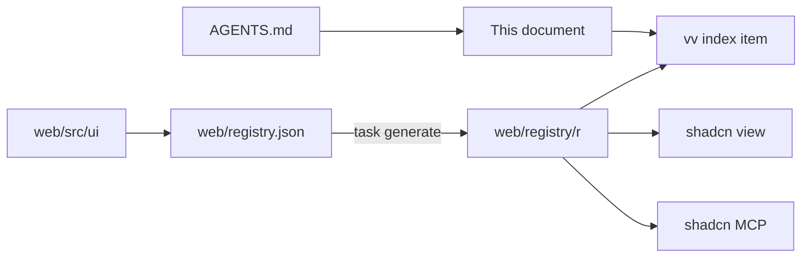

# vv design system

- Status: adopted in part; each tier's section is written by the change that
  builds it ([038 plan](../../specs/038-design-system/plan.md#documentation-ownership))
- Scope: the tokens, components, rules and page patterns every screen in
  `web/src` is built from, and how agents and checks reach them

Every screen is built from one shadcn/ui-based design system, kept as a shadcn
registry in `web/`, which agents read through the shadcn CLI and MCP server.

The diagram shows where each part lives and who reads it.

## Registry and agent route

The registry is built into the repository and read by path: `web/registry.json`
declares the items, and `task generate` runs `shadcn build` into
`web/registry/r/`, which is version controlled and never edited by hand.
`task check` (`generate-check`) fails when the built items are older than their
sources.

The shadcn CLI and MCP server cannot search a registry on disk, so the `vv`
item is the list of every item, its tier and when to use it. Start from it.

| Tool | Call, from `web/` |
| --- | --- |
| CLI | `npx shadcn view ./registry/r/vv.json`, then `./registry/r/<item>.json` |
| MCP | `view_items_in_registries` with `./registry/r/<item>.json`; it returns the item's description and files |
| Plain read | `web/registry/r/<item>.json` |

The CLI prints each file's content and the item's `docs` line, which names the
section of the usage rules that applies. The item list, the file layout and
the checks are fixed in
[038 contracts/registry.md](../../specs/038-design-system/contracts/registry.md).

Agents are routed here from `AGENTS.md`. The official shadcn skill is vendored
in `.agents/skills/shadcn/` and runs the CLI pinned in `web/package.json`
([VENDORED.md](../../.agents/skills/shadcn/VENDORED.md)); the shadcn MCP server
is registered for Claude in `.mcp.json` and for Codex in `.codex/config.toml`.
A feature's `ui-design.md` composes registry components and page patterns, and
adds a missing one to the design system first.

| Rejected | Why |
| --- | --- |
| A `@vv` registry on a localhost URL | Every agent session would have to start a server first |
| A GitHub address (`syudead/vv/<item>`) | Sees only pushed commits, so a component added on a working branch is invisible to the agent using it |

The decisions behind the setup are R-3, R-4 and R-7 of
[038 research](../../specs/038-design-system/research.md).

## Checks and exceptions

`task check` fails on code written outside the design system. ESLint
(`task lint-web`) checks every file under `web/src` except tests
(`*.test.ts`, `*.test.tsx`) and `src/testing/`, which render harnesses rather
than screens. `eslint-plugin-better-tailwindcss` reads the theme from
`web/src/index.css` and checks `className` and the string arguments of `cn()`
and `cva()`.

| Fails on | Rule | Message |
| --- | --- | --- |
| `<button>`, `<input>`, `<select>`, `<textarea>` outside `web/src/ui` | `no-restricted-syntax` | `Use the design-system component (web/registry/rules/components.md).` |
| A class with an arbitrary value or property, or the `(--var)` shorthand | `better-tailwindcss/no-restricted-classes` | `Arbitrary value outside the design-system scale (web/registry/rules/foundations.md).` |
| A class the theme does not generate | `better-tailwindcss/no-unknown-classes` | `Unknown class detected: <class>` |
| A raw colour outside the tokens, a default palette class, a contrast pair below its minimum | `web/src/theme/tokens.test.ts` | The test's own |

Arbitrary variants (`data-[state=open]:`, `has-[...]:`, `max-[49.5rem]:`)
pass: the arbitrary-value rule checks only the utility after the last variant.
`h-[3px]` and `[overflow-wrap:anywhere]` fail; `data-[state=open]:bg-accent-soft`
passes.

`noInlineConfig` turns off `eslint-disable` comments, so every exception is an
entry in `web/design-exceptions.js`:

| Field | Meaning |
| --- | --- |
| `file` | Path under `web/src`, such as `player/VideoPage.tsx` |
| `rules` | The rule names from the table above that the entry exempts |
| `classes` | Optional: regular expressions for the only classes allowed, each matched against the whole class; without it the file is exempt from `rules` |
| `kind` | `migration`, removed by the PR that migrates the file, or `special`, which stays |
| `reason` | Required for `special`: why the design system cannot express the look |

An exemption from `no-restricted-syntax` lifts only the raw-control check; the
i18n checks that share the rule still apply. `classes` applies to the two class
rules only.

The list started with every file that broke the checks when they landed, as
`migration` entries. A new file that breaks a check fails from then on, and
each migration PR deletes its files' entries
([research.md R-9](../../specs/038-design-system/research.md#r-9-screens-migrate-one-area-per-pr-behind-a-shrinking-exception-list)).
`web/src/theme/designExceptions.test.ts` (`task test-web`) fails when an entry
names a missing file, names an unknown rule, has an unknown `kind`, repeats a
file, or is `special` without a `reason`.

| Rejected | Why |
| --- | --- |
| `eslint-disable` comments at each offender | `noInlineConfig` forbids them, and scattered comments cannot be counted or removed by area |
| Checking tests as well | Tests render bare `<button>` harnesses that are not screens; listing them would keep `migration` entries that no screen migration removes |

The decisions behind the checks are R-8 and R-9 of
[038 research](../../specs/038-design-system/research.md).

## Foundations

Written by
[Define the design-system foundations and apply them to the library screen](https://github.com/syudead/vv/issues/769).

## Components

Written by
[Rebuild the action and input components on shadcn/ui](https://github.com/syudead/vv/issues/770).

## Page patterns

Written by
[Define the page patterns and finish the library screen on them](https://github.com/syudead/vv/issues/772).
