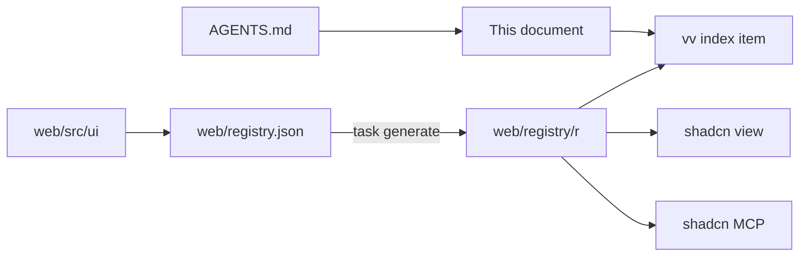
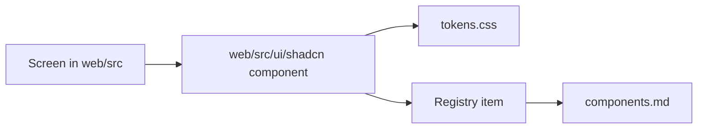
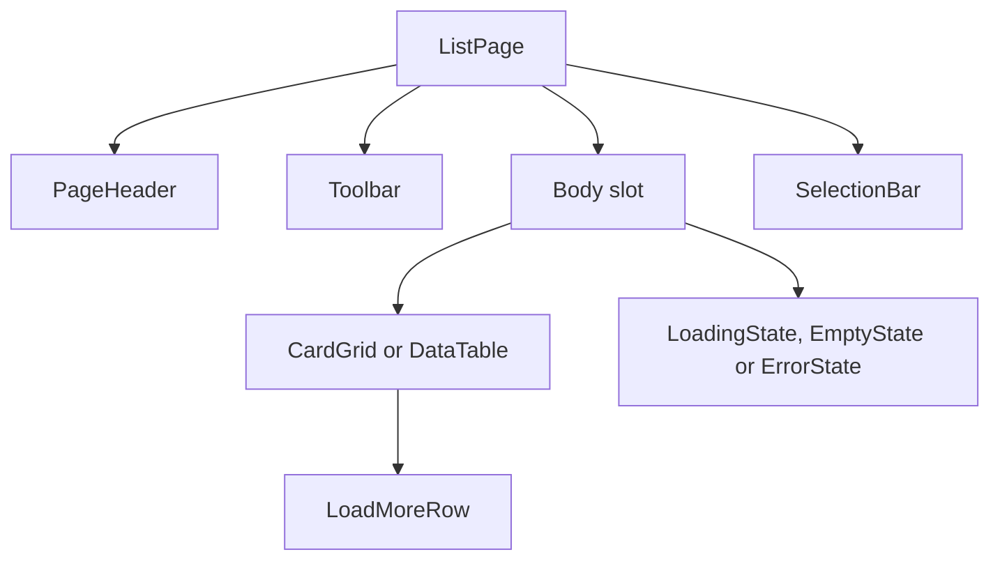

# vv design system

- Status: adopted in part; each tier's section is written by the change that
  builds it ([038 plan](../../specs/038-design-system/plan.md#documentation-ownership))
- Scope: the tokens, components, rules and page patterns every screen in
  `web/src` is built from, and how agents and checks reach them

Every screen is built from one shadcn/ui-based design system, kept as a shadcn
registry in `web/`, which agents read through the shadcn CLI and MCP server.

The diagram shows where each part lives and who reads it.

## Registry and agent route

The registry is built into the repository and read by path: `web/registry.json`
declares the items, and `task generate` runs `shadcn build` into
`web/registry/r/`, which is version controlled and never edited by hand.
`task check` (`generate-check`) fails when the built items are older than their
sources.

The shadcn CLI and MCP server cannot search a registry on disk, so the `vv`
item is the list of every item, its tier and when to use it. Start from it.

| Tool | Call, from `web/` |
| --- | --- |
| CLI | `npx shadcn view ./registry/r/vv.json`, then `./registry/r/<item>.json` |
| MCP | `view_items_in_registries` with `./registry/r/<item>.json`; it returns the item's description and files |
| Plain read | `web/registry/r/<item>.json` |

The CLI prints each file's content and the item's `docs` line, which names the
section of the usage rules that applies. The item list, the file layout and
the checks are fixed in
[038 contracts/registry.md](../../specs/038-design-system/contracts/registry.md).

Agents are routed here from `AGENTS.md`. The official shadcn skill is vendored
in `.agents/skills/shadcn/` and runs the CLI pinned in `web/package.json`
([VENDORED.md](../../.agents/skills/shadcn/VENDORED.md)); the shadcn MCP server
is registered for Claude in `.mcp.json` and for Codex in `.codex/config.toml`.
A feature's `ui-design.md` composes registry components and page patterns, and
adds a missing one to the design system first.

| Rejected | Why |
| --- | --- |
| A `@vv` registry on a localhost URL | Every agent session would have to start a server first |
| A GitHub address (`syudead/vv/<item>`) | Sees only pushed commits, so a component added on a working branch is invisible to the agent using it |

The decisions behind the setup are R-3, R-4 and R-7 of
[038 research](../../specs/038-design-system/research.md).

## Checks and exceptions

`task check` fails on code written outside the design system. ESLint
(`task lint-web`) checks every file under `web/src` except tests
(`*.test.ts`, `*.test.tsx`) and `src/testing/`, which render harnesses rather
than screens. `eslint-plugin-better-tailwindcss` reads the theme from
`web/src/index.css` and checks `className` and the string arguments of `cn()`
and `cva()`.

| Fails on | Rule | Message |
| --- | --- | --- |
| `<button>`, `<input>`, `<select>`, `<textarea>` outside `web/src/ui` | `no-restricted-syntax` | `Use the design-system component (web/registry/rules/components.md).` |
| A class with an arbitrary value or property, or the `(--var)` shorthand | `better-tailwindcss/no-restricted-classes` | `Arbitrary value outside the design-system scale (web/registry/rules/foundations.md).` |
| A class the theme does not generate, including a step outside the scale (`p-7`, `text-2xl`, `rounded-xl`, `font-bold`) | `better-tailwindcss/no-unknown-classes` | `Unknown class detected: <class>` |
| A raw colour outside the tokens, a default palette class, a contrast pair below its minimum | `web/src/theme/tokens.test.ts` | The test's own |

Arbitrary variants (`data-[state=open]:`, `has-[...]:`, `max-[49.5rem]:`)
pass: the arbitrary-value rule checks only the utility after the last variant.
`h-[3px]` and `[overflow-wrap:anywhere]` fail; `data-[state=open]:bg-primary-soft`
passes.

`noInlineConfig` turns off `eslint-disable` comments, so every exception is an
entry in `web/design-exceptions.js`:

| Field | Meaning |
| --- | --- |
| `file` | Path under `web/src`, such as `player/VideoPage.tsx` |
| `rules` | The rule names from the table above that the entry exempts |
| `classes` | Optional: regular expressions for the only classes allowed, each matched against the whole class; without it the file is exempt from `rules` |
| `kind` | `special`, which stays; `migration` marked a file waiting for its screen migration and is no longer accepted |
| `reason` | Required for `special`: why the design system cannot express the look |

An exemption from `no-restricted-syntax` lifts only the raw-control check; the
i18n checks that share the rule still apply. `classes` applies to the two class
rules only.

The list started with every file that broke the checks when they landed, as
`migration` entries. A new file that breaks a check fails from then on, and
each migration PR deletes its files' entries
([research.md R-9](../../specs/038-design-system/research.md#r-9-screens-migrate-one-area-per-pr-behind-a-shrinking-exception-list)).
Once every screen had migrated, the last unit removed the remaining
`migration` entries, so the list holds only `special` entries.
`web/src/theme/designExceptions.test.ts` (`task test-web`) fails when an entry
names a missing file, names an unknown rule, is a `migration` entry or has
another unknown `kind`, repeats a file, or is `special` without a `reason`.

| Rejected | Why |
| --- | --- |
| `eslint-disable` comments at each offender | `noInlineConfig` forbids them, and scattered comments cannot be counted or removed by area |
| Checking tests as well | Tests render bare `<button>` harnesses that are not screens; listing them would keep `migration` entries that no screen migration removes |

The decisions behind the checks are R-8 and R-9 of
[038 research](../../specs/038-design-system/research.md).

## Foundations

Every visual value is a token in `@theme` in `web/src/ui/tokens.css` (registry
item `vv-theme`), and screens use only the utility classes generated from it.
vv keeps dark neutral surfaces with cyan as its one interaction colour, in
shadcn/ui's flat style: thin borders, no gradients, and shadows only on
floating layers. Which token to use where is in
[foundations.md](../../web/registry/rules/foundations.md) (item `vv-rules`).

Colour tokens use shadcn/ui's semantic names, so upstream component code needs
no renaming, plus vv's own roles that shadcn lacks.

| Token | Role |
| --- | --- |
| `navbar`, `background`, `muted`, `card`, `popover` | The five surfaces, darkest first; no two look the same |
| `foreground`, `muted-foreground` (and the `-foreground` of each surface) | Body and secondary text; two greys of text are enough |
| `secondary`, `accent` | Secondary fills and hover rows; `accent` is shadcn's hover role, not the brand colour |
| `primary`, `primary-hover`, `primary-active`, `primary-foreground`, `primary-soft` | Cyan: the main action, selection, progress |
| `border`, `input`, `ring` | Dividers, control edges, keyboard focus |
| `destructive`, `warning`, `success`, each with `-foreground` and `-soft`; `destructive-strong` | Status, always with words and an icon |
| `favorite`, `overlay` | The favorite heart only; the one translucent colour, behind dialogs and over thumbnails |

Values are six-digit hex, so `web/src/theme/tokens.test.ts` can check every
text and border pair on every surface; one dark set exists
([library-ui.md, Dark scheme only](library-ui.md#dark-scheme-only-without-a-lightdark-switch)).
The tokens sit in their own file because `shadcn add` writes an upstream
theme's variables into `index.css`, where the raw-colour scan fails them.

The scales are closed:

| Scale | Steps |
| --- | --- |
| Type | `text-2xs` (thumbnail text) to `text-xl` (page titles), six steps; `font-normal`, `font-medium`, `font-semibold` |
| Spacing and sizes | One 4px scale (`0` to `16`, with `9` for control heights) and named layout steps (`navbar`, `sidebar`, `card-0` to `card-3`, list columns, popover and combobox widths) |
| Radius | `sm`, `md`, `lg`, `full` |
| Shadow | `shadow-card-hover`, `shadow-elevated`, `drop-shadow-mark`; none on resting surfaces |
| Motion | `fade-in`, `pop-in`, `slide-up`, and `shimmer`, `spin`, `pulse` for loading; off under reduced motion |

The library is denser than the video page: `h-8` controls, `gap-2` between
controls, `gap-3` between cards, `text-sm` body, against `h-9`, `gap-3`,
`gap-4` and `text-base`.

The scales are closed by the theme itself. `tokens.css` first resets
Tailwind's default namespaces for every scale (`--color-*`, `--text-*`,
`--font-weight-*`, `--spacing` and `--spacing-*`, `--radius-*`, `--shadow-*`,
`--drop-shadow-*`, `--animate-*`) and then defines only the scale's steps, so a
step outside them (`p-7`, `gap-2.5`, `text-2xl`, `rounded-xl`, `font-bold`,
`bg-red-500`) is never generated and fails as an unknown class. Fractions,
`full`, `auto`, `px` and the container widths (`max-w-md`) are not part of a
reset namespace and stay available. The reset also drops `tw-animate-css`'s
enter and exit animations, so floating layers open with `animate-pop-in`.

During the migration the previous token names (`surface`, `fg-muted`, `link`,
...) were `var()` aliases of the new ones and a `no-restricted-classes`
pattern failed off-scale steps; both went with the reset. The cyan `accent` was
renamed to `primary` everywhere at once, because shadcn uses `accent` for the
hover fill.

| Rejected | Why |
| --- | --- |
| Keeping vv's names (`surface`, `fg-muted`) | Every shadcn/ui component added later would be translated by hand |
| oklch values, as shadcn's defaults | The contrast test parses hex only |
| A white primary button, as shadcn's default | Cyan is the brand's action colour |

The decisions behind the foundations are R-5 and R-8 of
[038 research](../../specs/038-design-system/research.md) and
[038 UI design, Foundations](../../specs/038-design-system/ui-design.md#foundations).

## Components

Every control is a shadcn/ui component on the radix base, kept in
`web/src/ui/shadcn` under the file name upstream gives it (`button.tsx`) and
read through its registry item. `components.json` points shadcn's `ui` alias at
that folder, so `shadcn add` writes there. Its structure and variants are upstream's; only colour, radius
and height change, through the tokens. When to use each one, what it pairs
with and when not to use it is in
[components.md](../../web/registry/rules/components.md) (item `vv-rules`).

| Component | Item | Replaces |
| --- | --- | --- |
| `Button` (`default`, `secondary`, `outline`, `ghost`, `destructive`, `link`; sizes `sm`, `default`, `lg`, `icon-sm`, `icon`) | `button` | `ui/Button`, `ui/IconButton` |
| `Input`, `Textarea`, `Label`, `Field` | `input`, `textarea`, `label`, `field` | Raw `<input>` and `<textarea>` |
| `Select`, `RadioGroup` | `select`, `radio-group` | Raw `<select>`, the sort radio columns |
| `Checkbox`, `Switch` | `checkbox`, `switch` | `ui/Checkbox` |
| `Toggle`, `ToggleGroup` | `toggle`, `toggle-group` | `ui/FilterChip`, `ui/SegmentedControl` |
| `Slider` | `slider` | The zoom slider |
| `Combobox` (`Command` in a popover), `Command` | `combobox`, `command` | `ui/Combobox` |

The diagram shows how a screen reaches a component and its rules.

The components share three behaviours, so a screen never restyles them:

| Behaviour | How |
| --- | --- |
| Keyboard focus | One ring for every component, the `:focus-visible` outline in `web/src/index.css`; upstream's per-component `ring-[3px]` and `ring-3` are dropped. Rows in a menu, a select or a command list show focus with the `accent` fill instead |
| Selected and pressed | `primary-soft` fill with `primary` text (`Toggle`, `ToggleGroup`), or a `primary` fill (`Checkbox`, `Switch`, `RadioGroup`) |
| Density | Library-density screens use `sm` and `icon-sm` (`h-8`); the video page uses `default` and `lg` |

Five changes to upstream keep the checks and the catalog rules: `Checkbox`
draws the `indeterminate` state, `Slider` passes its `aria-label` to the thumb
that takes the focus, `CommandGroup` styles its heading by wrapping it,
because the attribute selector upstream uses is an arbitrary value,
`CommandInput` drops upstream's `outline-hidden` and is lower than its row, so
the shared focus ring shows in full inside the `Command`, and `CommandInput`
takes a class for the frame around the input and an element after the input,
so the vv `TagCommand` can draw its compact field with a busy spinner inside
it. `Select`
and `Combobox` read Radix's position variables (`--radix-select-*`,
`--radix-popover-*`); those classes are `special` entries in
`web/design-exceptions.js`.

This tier changed no existing screen: the old components stayed at their
paths in `web/src/ui` until the screen migrations replaced their last use, and
the last unit deleted the ones nothing imported. The tag-name input on the
video page and the merge target list in the tag admin moved from the old
`ui/Combobox` to the vv component `TagCommand`, a `Command` with the tag-name
rules that the selection bar's tag popovers also use, and `ui/Combobox` was
deleted. The new components live in their own
folder, so a file name never differs from an old one by case alone. The old
components are not registry items; new code imports from `web/src/ui/shadcn`.

The showcase (`/design-system`) lays each component out by variant and state:
normal, hover, keyboard focus, pressed, selected and disabled. The states are
drawn without a pointer by the `data-demo-state` attribute on an element
around the component: `web/src/index.css` adds it to Tailwind's `hover`,
`focus`, `focus-visible` and `active` variants, and draws the focus ring on
the element's first child. Screens never set it.

| Rejected | Why |
| --- | --- |
| Keeping vv's file names (`Button.tsx`) for the new components | `shadcn add` writes upstream's names, so every later update would be renamed by hand |
| Moving the old components aside and switching the library screen to the new ones in this tier | The maintainer keeps every existing screen unchanged until its own migration |
| Restyling the components to look like the old ones | The components are for new screens; the screen migrations replace the old look |
| A per-component focus ring, as upstream | Each component would carry its own copy that differs from the shared outline, and the arbitrary `ring-[3px]` fails the checks |

### Overlays and feedback, and vv components

These are shadcn/ui components on the Radix base, taken with their upstream
structure and variants and dressed only through the foundations' tokens; vv's
own components follow the same shape. Each is a `registry:ui` item whose
`docs` names its section in
[components.md](../../web/registry/rules/components.md), which says what it is
for, what it combines with and when not to use it. They are new components for
new screens: existing screens keep their current components until the
maintainer approves this tier on the showcase and each screen migrates.

| Component | Will replace | Notes |
| --- | --- | --- |
| `Dialog`, `AlertDialog` | `ModalFrame` | `AlertDialog` confirms what cannot be undone |
| `Popover`, `DropdownMenu`, `Tooltip`, `Tabs` | `Popover`, `Menu`, `Tooltip`, `Tabs` | Radix positions the layers |
| `Sonner` | `Toast` | Every screen uses it; `ui/Toast` keeps only the queue that limits how many show at once |
| `Badge` | `Chip`, tag chips, counts | Adds `soft`, `warning`, `success` to the upstream variants |
| `Skeleton`, `Progress`, `Spinner` | `Skeleton`, scan and watch bars | `Skeleton` shimmers; `Progress` takes a `max` |
| `Alert`, `Empty` | Stall warning, autoplay notice, inline errors, empty blocks | `Alert` adds `warning` and `success` |
| `Separator`, `Kbd`, `Breadcrumb` | Dividers, search keys, folder path | |
| `Sidebar`, with `Sheet` | `shell/Sidebar` | Expanded, icon rail, and a drawer below 640px |
| `VideoThumbnail`, `FavoriteToggle`, `TentativeMark`, `ScrubPreview`, `ThumbnailBackdrop`, `BrandHomeLink` | Thumbnail markup in cards and rows, the former `videoList/FavoriteToggle` | vv components |
| `TagCommand` | `ui/Combobox`, the selection bar's former `library/TagCommand` | vv component; a `Command` with the tag-name rules |

The shadcn components live in `web/src/ui/shadcn` under upstream's
kebab-case names (`dropdown-menu.tsx`), beside the action and input
components. As upstream, `Dialog` and `Sheet` close with a `ghost`, `icon-sm`
`Button`, `AlertDialogAction` and `AlertDialogCancel` are `Button`s (`sm` by
default), and `SidebarTrigger` is a `Button` and `SidebarInput` an `Input`.
The vv components keep PascalCase names in `web/src/ui`; the `page` form of
`FavoriteToggle` is a `Toggle` with a `Tooltip`.

Three upstream class patterns read values that Radix computes at runtime or
that no utility names: the floating layers' transform origin and available
height, and the `Alert` icon column. They are `special` entries in
`web/design-exceptions.js`.

| Rejected | Why |
| --- | --- |
| Restyling the components to look like the ones they replace | The components are for building new screens, not for repeating the old look |
| Moving the old components aside so the new ones take their names now | Every screen's imports would change before the tier is approved |
| Separate `sidebar-*` colour tokens, as upstream | The sidebar uses `navbar`, `accent` and `secondary`, the roles it already had |

The decisions behind the components are in
[038 UI design, Components](../../specs/038-design-system/ui-design.md#components).

## Page patterns

Every screen is built in three layers, kept in `web/src/ui/patterns`. Margins,
maximum widths and the gaps between regions belong to the first two layers, so
a screen never writes them; it only passes content into slots. Which skeleton
to pick, what goes in each slot and what must not is in
[patterns.md](../../web/registry/rules/patterns.md) (item `vv-rules`).

| Layer | What it is | Registry |
| --- | --- | --- |
| Page skeletons | `ListPage`, `AdminTablePage`, `SettingsPage`, `DetailPage`, `CenteredForm`, `FormDialog`, `ConfirmDialog`: the regions of a page, their order, its outer padding, its maximum width and the gaps between regions | `registry:ui`, one item each |
| Sections | `PageHeader`, `Toolbar`, `PageSection`, `FormRow`, `FactList`, `CardGrid`, `DataTable`, `SelectionBar`: the parts that fill a region, with their row padding and inner gaps | `registry:ui`, one item each |
| States | `LoadingState`, `EmptyState`, `ErrorState`, `LoadMoreRow`: what the body shows instead of, or after, its data | `registry:ui`, one item each |

Each skeleton also has an example block (`list-page-example` and so on, plus
`list-states-example`): a working composition of the skeleton, its sections
and components, filled with sample data from the i18n catalog. An agent
building a new screen copies the block and replaces the text and data. The
blocks live in `web/src/designSystem/blocks` and are what the showcase renders.

The diagram shows how a list page is put together.

Skeletons and sections share four behaviours:

| Behaviour | How |
| --- | --- |
| Spacing | Fixed in the pattern; patterns take no `className`, so a screen cannot override it |
| Density | `DetailPage` provides viewing density, under which `PageSection` and `FactList` switch to `p-4` rows and `text-base`; every other skeleton is library density |
| States in place | A state block goes in the same body slot as the data, so the header and toolbar never move ([038 UI design, States](../../specs/038-design-system/ui-design.md#states)) |
| Edges line up | `CardGrid` stretches its columns to the body width (`auto-fill` over the `card-*` steps), so the toolbar, the count row and the grid share both edges |

`CardGrid` passes its column template through `style`, because a template made
from a named step is an arbitrary value to the checks; the step still comes
from `tokens.css`. `DetailPage`'s aside is the named step `detail-aside`
(`detail-aside-wide` from `xl`). The video page's player frame sizes itself
from named steps declared in an `@theme inline` block (`player-width`,
`player-height`, `aspect-player`), because their values read the video's
aspect ratio from the frame at run time and must be resolved on the element,
not on `:root`.
`DataTable` is built on the shadcn/ui `Table`, which this tier adds as the
`table` item.

The showcase (`/design-system`) renders every example block, the list page in
each of its states, and the dialogs behind their buttons, so the maintainer
confirms the patterns at 1440px and 390px.

| Rejected | Why |
| --- | --- |
| Patterns extracted from today's screens | The maintainer asked for recipes to build new screens from; the screen migrations then move each screen onto them |
| Blocks only, without skeleton and section components | Every copy would carry its own margins and gaps, and screens would drift apart again |
| A `className` escape hatch on patterns | A screen could change the spacing the pattern exists to fix |
| Building the library screen on the patterns in this tier | The maintainer keeps every existing screen unchanged until its own migration |
