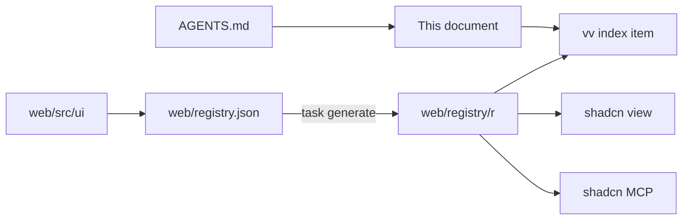

# vv design system

- Status: adopted in part; each tier's section is written by the change that
  builds it ([038 plan](../../specs/038-design-system/plan.md#documentation-ownership))
- Scope: the tokens, components, rules and page patterns every screen in
  `web/src` is built from, and how agents and checks reach them

Every screen is built from one shadcn/ui-based design system, kept as a shadcn
registry in `web/`, which agents read through the shadcn CLI and MCP server.

The diagram shows where each part lives and who reads it.

## Registry and agent route

The registry is built into the repository and read by path: `web/registry.json`
declares the items, and `task generate` runs `shadcn build` into
`web/registry/r/`, which is version controlled and never edited by hand.
`task check` (`generate-check`) fails when the built items are older than their
sources.

The shadcn CLI and MCP server cannot search a registry on disk, so the `vv`
item is the list of every item, its tier and when to use it. Start from it.

| Tool | Call, from `web/` |
| --- | --- |
| CLI | `npx shadcn view ./registry/r/vv.json`, then `./registry/r/<item>.json` |
| MCP | `view_items_in_registries` with `./registry/r/<item>.json`; it returns the item's description and files |
| Plain read | `web/registry/r/<item>.json` |

The CLI prints each file's content and the item's `docs` line, which names the
section of the usage rules that applies. The item list, the file layout and
the checks are fixed in
[038 contracts/registry.md](../../specs/038-design-system/contracts/registry.md).

Agents are routed here from `AGENTS.md`. The official shadcn skill is vendored
in `.agents/skills/shadcn/` and runs the CLI pinned in `web/package.json`
([VENDORED.md](../../.agents/skills/shadcn/VENDORED.md)); the shadcn MCP server
is registered for Claude in `.mcp.json` and for Codex in `.codex/config.toml`.
A feature's `ui-design.md` composes registry components and page patterns, and
adds a missing one to the design system first.

| Rejected | Why |
| --- | --- |
| A `@vv` registry on a localhost URL | Every agent session would have to start a server first |
| A GitHub address (`syudead/vv/<item>`) | Sees only pushed commits, so a component added on a working branch is invisible to the agent using it |

The decisions behind the setup are R-3, R-4 and R-7 of
[038 research](../../specs/038-design-system/research.md).

## Checks and exceptions

`task check` fails on code written outside the design system. ESLint
(`task lint-web`) checks every file under `web/src` except tests
(`*.test.ts`, `*.test.tsx`) and `src/testing/`, which render harnesses rather
than screens. `eslint-plugin-better-tailwindcss` reads the theme from
`web/src/index.css` and checks `className` and the string arguments of `cn()`
and `cva()`.

| Fails on | Rule | Message |
| --- | --- | --- |
| `<button>`, `<input>`, `<select>`, `<textarea>` outside `web/src/ui` | `no-restricted-syntax` | `Use the design-system component (web/registry/rules/components.md).` |
| A class with an arbitrary value or property, or the `(--var)` shorthand | `better-tailwindcss/no-restricted-classes` | `Arbitrary value outside the design-system scale (web/registry/rules/foundations.md).` |
| A class the theme does not generate | `better-tailwindcss/no-unknown-classes` | `Unknown class detected: <class>` |
| A raw colour outside the tokens, a default palette class, a contrast pair below its minimum | `web/src/theme/tokens.test.ts` | The test's own |

Arbitrary variants (`data-[state=open]:`, `has-[...]:`, `max-[49.5rem]:`)
pass: the arbitrary-value rule checks only the utility after the last variant.
`h-[3px]` and `[overflow-wrap:anywhere]` fail; `data-[state=open]:bg-primary-soft`
passes.

`noInlineConfig` turns off `eslint-disable` comments, so every exception is an
entry in `web/design-exceptions.js`:

| Field | Meaning |
| --- | --- |
| `file` | Path under `web/src`, such as `player/VideoPage.tsx` |
| `rules` | The rule names from the table above that the entry exempts |
| `classes` | Optional: regular expressions for the only classes allowed, each matched against the whole class; without it the file is exempt from `rules` |
| `kind` | `migration`, removed by the PR that migrates the file, or `special`, which stays |
| `reason` | Required for `special`: why the design system cannot express the look |

An exemption from `no-restricted-syntax` lifts only the raw-control check; the
i18n checks that share the rule still apply. `classes` applies to the two class
rules only.

The list started with every file that broke the checks when they landed, as
`migration` entries. A new file that breaks a check fails from then on, and
each migration PR deletes its files' entries
([research.md R-9](../../specs/038-design-system/research.md#r-9-screens-migrate-one-area-per-pr-behind-a-shrinking-exception-list)).
`web/src/theme/designExceptions.test.ts` (`task test-web`) fails when an entry
names a missing file, names an unknown rule, has an unknown `kind`, repeats a
file, or is `special` without a `reason`.

| Rejected | Why |
| --- | --- |
| `eslint-disable` comments at each offender | `noInlineConfig` forbids them, and scattered comments cannot be counted or removed by area |
| Checking tests as well | Tests render bare `<button>` harnesses that are not screens; listing them would keep `migration` entries that no screen migration removes |

The decisions behind the checks are R-8 and R-9 of
[038 research](../../specs/038-design-system/research.md).

## Foundations

Every visual value is a token in `@theme` in `web/src/ui/tokens.css` (registry
item `vv-theme`), and screens use only the utility classes generated from it.
vv keeps dark neutral surfaces with cyan as its one interaction colour, in
shadcn/ui's flat style: thin borders, no gradients, and shadows only on
floating layers. Which token to use where is in
[foundations.md](../../web/registry/rules/foundations.md) (item `vv-rules`).

Colour tokens use shadcn/ui's semantic names, so upstream component code needs
no renaming, plus vv's own roles that shadcn lacks.

| Token | Role |
| --- | --- |
| `navbar`, `background`, `muted`, `card`, `popover` | The five surfaces, darkest first; no two look the same |
| `foreground`, `muted-foreground` (and the `-foreground` of each surface) | Body and secondary text; two greys of text are enough |
| `secondary`, `accent` | Secondary fills and hover rows; `accent` is shadcn's hover role, not the brand colour |
| `primary`, `primary-hover`, `primary-active`, `primary-foreground`, `primary-soft` | Cyan: the main action, selection, progress |
| `border`, `input`, `ring` | Dividers, control edges, keyboard focus |
| `destructive`, `warning`, `success`, each with `-foreground` and `-soft`; `destructive-strong` | Status, always with words and an icon |
| `favorite`, `overlay` | The favorite heart only; the one translucent colour, behind dialogs and over thumbnails |

Values are six-digit hex, so `web/src/theme/tokens.test.ts` can check every
text and border pair on every surface; one dark set exists
([library-ui.md, Dark scheme only](library-ui.md#dark-scheme-only-without-a-lightdark-switch)).
The tokens sit in their own file because `shadcn add` writes an upstream
theme's variables into `index.css`, where the raw-colour scan fails them.

The scales are closed:

| Scale | Steps |
| --- | --- |
| Type | `text-2xs` (thumbnail text) to `text-xl` (page titles), six steps; `font-normal`, `font-medium`, `font-semibold` |
| Spacing and sizes | One 4px scale (`0` to `16`, with `9` for control heights) and named layout steps (`navbar`, `sidebar`, `card-0` to `card-3`, list columns, popover widths) |
| Radius | `sm`, `md`, `lg`, `full` |
| Shadow | `shadow-card-hover`, `shadow-elevated`, `drop-shadow-mark`; none on resting surfaces |
| Motion | `fade-in`, `pop-in`, `slide-up`, `shimmer`; off under reduced motion |

The library is denser than the video page: `h-8` controls, `gap-2` between
controls, `gap-3` between cards, `text-sm` body, against `h-9`, `gap-3`,
`gap-4` and `text-base`.

Until every screen is migrated, a `no-restricted-classes` pattern fails a
numeric step outside the scale (`p-7`, `gap-2.5`, `text-2xl`, `rounded-xl`,
`font-bold`) with `Step outside the design-system scale
(web/registry/rules/foundations.md).`, and the previous token names (`surface`,
`fg-muted`, `link`, ...) stay defined as `var()` aliases of the new ones, so
unmigrated screens keep working. The cyan `accent` was renamed to `primary`
everywhere at once, because shadcn uses `accent` for the hover fill.

| Rejected | Why |
| --- | --- |
| Keeping vv's names (`surface`, `fg-muted`) | Every shadcn/ui component added later would be translated by hand |
| oklch values, as shadcn's defaults | The contrast test parses hex only |
| A white primary button, as shadcn's default | Cyan is the brand's action colour |

The decisions behind the foundations are R-5 and R-8 of
[038 research](../../specs/038-design-system/research.md) and
[038 UI design, Foundations](../../specs/038-design-system/ui-design.md#foundations).

## Components

Written by
[Rebuild the action and input components on shadcn/ui](https://github.com/syudead/vv/issues/770).

### Overlays and feedback, and vv components

These are shadcn/ui components on the Radix base, taken with their upstream
structure and variants and dressed only through the foundations' tokens; vv's
own components follow the same shape. Each is a `registry:ui` item whose
`docs` names its section in
[components.md](../../web/registry/rules/components.md), which says what it is
for, what it combines with and when not to use it. They are new components for
new screens: existing screens keep their current components until the
maintainer approves this tier on the showcase and each screen migrates.

| Component | Will replace | Notes |
| --- | --- | --- |
| `Dialog`, `AlertDialog` | `ModalFrame` | `AlertDialog` confirms what cannot be undone |
| `Popover`, `DropdownMenu`, `Tooltip`, `Tabs` | `Popover`, `Menu`, `Tooltip`, `Tabs` | Radix positions the layers |
| `Sonner` | `Toast` | The app switches to it in one change for every screen |
| `Badge` | `Chip`, tag chips, counts | Adds `soft`, `warning`, `success` to the upstream variants |
| `Skeleton`, `Progress`, `Spinner` | `Skeleton`, scan and watch bars | `Skeleton` shimmers; `Progress` takes a `max` |
| `Alert`, `Empty` | Stall warning, autoplay notice, inline errors, empty blocks | `Alert` adds `warning` and `success` |
| `Separator`, `Kbd`, `Breadcrumb` | Dividers, search keys, folder path | |
| `Sidebar`, with `Sheet` | `shell/Sidebar` | Expanded, icon rail, and a drawer below 640px |
| `VideoThumbnail`, `FavoriteToggle`, `TentativeMark`, `ScrubPreview`, `ThumbnailBackdrop`, `BrandHomeLink` | Thumbnail markup in cards and rows, `videoList/FavoriteToggle` | vv components |

Upstream files keep shadcn's kebab-case names (`dropdown-menu.tsx`). Where an
old component has the same name in another case (`Popover.tsx`), the new one
lives in `web/src/ui/next/` until the migration deletes the old file:
TypeScript and case-insensitive file systems refuse two such names in one
folder.

The showcase shows each state through `data-state-preview`: `index.css`
redefines the `hover`, `focus`, `focus-visible` and `active` variants to also
match an element carrying `data-state-preview="hover"`, `"focus"` or
`"active"`, so one page shows every state side by side. Screens never set the
attribute.

Three upstream class patterns read values that Radix computes at runtime or
that no utility names: the floating layers' transform origin and available
height, and the `Alert` icon column. They are `special` entries in
`web/design-exceptions.js`.

| Rejected | Why |
| --- | --- |
| Restyling the components to look like the ones they replace | The components are for building new screens, not for repeating the old look |
| Moving the old components aside so the new ones take their names now | Every screen's imports would change before the tier is approved |
| Separate `sidebar-*` colour tokens, as upstream | The sidebar uses `navbar`, `accent` and `secondary`, the roles it already had |

The decisions behind the components are in
[038 UI design, Components](../../specs/038-design-system/ui-design.md#components).

## Page patterns

Written by
[Define the page patterns and finish the library screen on them](https://github.com/syudead/vv/issues/772).
