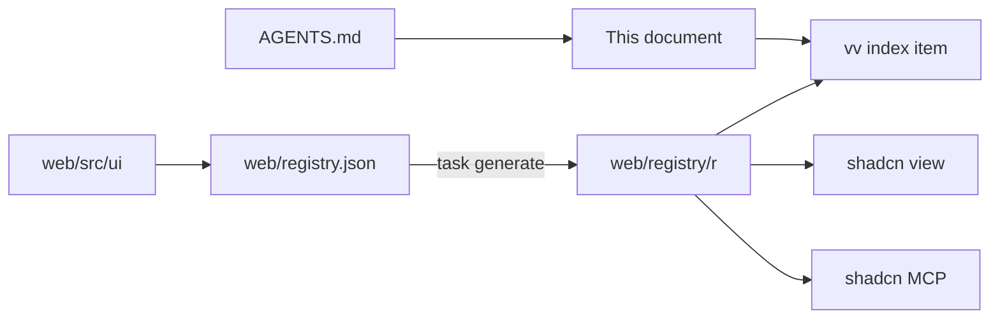

# vv design system

- Status: adopted in part; each tier's section is written by the change that
  builds it ([038 plan](../../specs/038-design-system/plan.md#documentation-ownership))
- Scope: the tokens, components, rules and page patterns every screen in
  `web/src` is built from, and how agents and checks reach them

Every screen is built from one shadcn/ui-based design system, kept as a shadcn
registry in `web/`, which agents read through the shadcn CLI and MCP server.

The diagram shows where each part lives and who reads it.

## Registry and agent route

The registry is built into the repository and read by path: `web/registry.json`
declares the items, and `task generate` runs `shadcn build` into
`web/registry/r/`, which is version controlled and never edited by hand.
`task check` (`generate-check`) fails when the built items are older than their
sources.

The shadcn CLI and MCP server cannot search a registry on disk, so the `vv`
item is the list of every item, its tier and when to use it. Start from it.

| Tool | Call, from `web/` |
| --- | --- |
| CLI | `npx shadcn view ./registry/r/vv.json`, then `./registry/r/<item>.json` |
| MCP | `view_items_in_registries` with `./registry/r/<item>.json`; it returns the item's description and files |
| Plain read | `web/registry/r/<item>.json` |

The CLI prints each file's content and the item's `docs` line, which names the
section of the usage rules that applies. The item list, the file layout and
the checks are fixed in
[038 contracts/registry.md](../../specs/038-design-system/contracts/registry.md).

Agents are routed here from `AGENTS.md`. The official shadcn skill is vendored
in `.agents/skills/shadcn/` and runs the CLI pinned in `web/package.json`
([VENDORED.md](../../.agents/skills/shadcn/VENDORED.md)); the shadcn MCP server
is registered for Claude in `.mcp.json` and for Codex in `.codex/config.toml`.
A feature's `ui-design.md` composes registry components and page patterns, and
adds a missing one to the design system first.

| Rejected | Why |
| --- | --- |
| A `@vv` registry on a localhost URL | Every agent session would have to start a server first |
| A GitHub address (`syudead/vv/<item>`) | Sees only pushed commits, so a component added on a working branch is invisible to the agent using it |

The decisions behind the setup are R-3, R-4 and R-7 of
[038 research](../../specs/038-design-system/research.md).

## Checks and exceptions

Written by
[Fail lint on raw controls, arbitrary values and unknown Tailwind classes](https://github.com/syudead/vv/issues/768).

## Foundations

Written by
[Define the design-system foundations and apply them to the library screen](https://github.com/syudead/vv/issues/769).

## Components

Written by
[Rebuild the action and input components on shadcn/ui](https://github.com/syudead/vv/issues/770).

## Page patterns

Written by
[Define the page patterns and finish the library screen on them](https://github.com/syudead/vv/issues/772).
