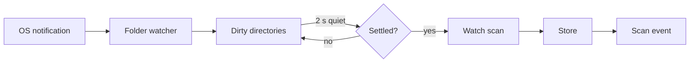
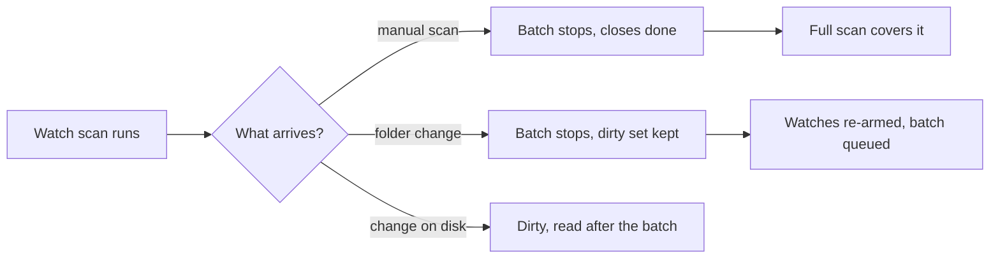

# Folder watching: importing changed media folders

VVMDM learns of a file added, deleted, moved or renamed in a media folder from
the operating system's change notification and re-reads only the directories
that changed, so the library follows without a manual scan
([`internal/app/auto_import.go`](../../internal/app/auto_import.go)).
Background: [specs/042-folder-watch-import/](../../specs/042-folder-watch-import/plan.md)
(parent Issue #786). Nothing reads the media folders while nothing changes, and
the full scan stays manual.

The diagram shows the path of one change, from the notification to the library.

## The watcher reports directories

[`internal/watcher`](../../internal/watcher) places one fsnotify watch on every
directory below each media folder, reading directory entries only, and reports
each change as a directory and a recursive flag. Directories the scanner
skips (names starting with `.`, `@eaDir`, `#recycle`, `lost+found`) and
symbolic links get no watch.

| Event | Reported directory |
| --- | --- |
| A file is created, written, removed or renamed | Its parent, not recursive |
| A directory is created, removed or renamed | Itself, recursive |

A created directory is watched before it is reported, so a file written into it
first is covered by the recursive report
([R-2](../../specs/042-folder-watch-import/research.md#r-2-a-change-marks-a-directory-dirty-and-only-dirty-directories-are-re-read)).

## A batch waits for quiet and for settled files

`AutoImport` keeps the dirty directories and starts a batch 2 s after the last
report. Before it starts, a directory whose newest file changed less than 10 s
ago stays dirty and is checked again when that time has passed, so a file still
being copied is not read
([R-3](../../specs/042-folder-watch-import/research.md#r-3-a-batch-waits-for-quiet-imports-settled-files-then-removes)).

The batch is a scan with origin `watch`: the scanner reads exactly the dirty
directories, writes every addition before any removal, and removes only
locations inside them, so a file moved between two dirty directories keeps its
video, tags and playback position
([R-4](../../specs/042-folder-watch-import/research.md#r-4-a-watch-batch-is-a-scan-row-with-origin-watch)).

## A manual scan or a folder change supersedes a batch

Starting a manual scan, or adding, replacing or deleting a media folder, stops
a running batch at the next file; it removes nothing and closes `done`. Changes
that arrive while any scan runs are read after it finishes. A running batch
does not make the app busy for the desktop close prompt
([R-5](../../specs/042-folder-watch-import/research.md#r-5-a-manual-scan-or-a-media-folder-change-supersedes-a-watch-batch)).

## Setting and watch state

`settings.library.auto_import` holds `true` or `false`, and an absent key is
on. Turning it on arms the watches and starts no scan; turning it off removes
every watch, drops the dirty set and stops a running batch
([R-7](../../specs/042-folder-watch-import/research.md#r-7-the-setting-is-a-stored-key-that-defaults-to-on)).

| Watch state | Meaning |
| --- | --- |
| `off` | Disabled, or no media folder exists |
| `starting` | The watches are being added |
| `active` | Every directory is watched |
| `limited` | A problem is recorded: watch limit, lost events, unreachable folder or permission |

A problem is shown, never repaired by a scan
([R-6](../../specs/042-folder-watch-import/research.md#r-6-lost-events-and-watch-limits-are-reported-never-repaired-by-a-scan)).
It clears when auto-import is turned off and on, when the media folders change,
or, for lost events, when a manual scan finishes `done` and no further loss was
reported since that scan started. A loss reported while the scan ran stays
visible as `limited`, because the scan may already have read the affected
directory; the next manual scan clears it.

| Rejected | Why |
| --- | --- |
| Periodic re-read of the tree | Reads the media folders while nothing changed |
| Re-reading the whole media folder after each change | That is a full scan, which stays manual |
| Starting a scan when a problem is found | The owner decides when to read the whole tree |
