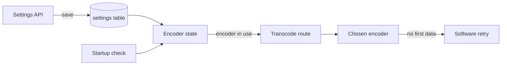
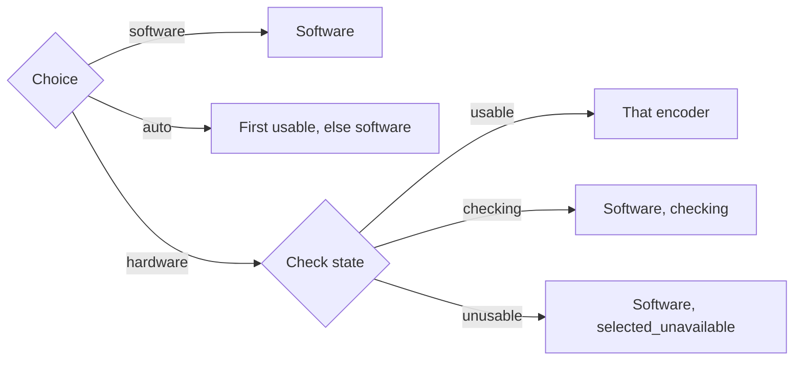
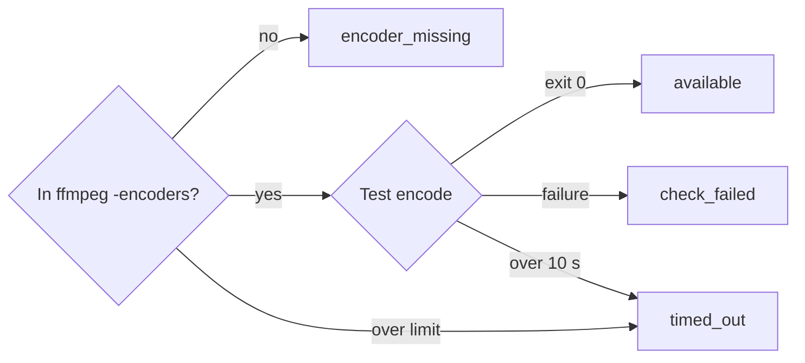
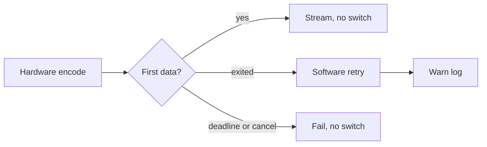

# Hardware encoding for live transcoding

The owner chooses the video encoder for live transcoding
(`GET /api/videos/{id}/transcode.mp4`); a startup check decides which hardware
encoders work, and a failing one falls back to software within the request
([`internal/app/transcode_settings.go`](../../internal/app/transcode_settings.go)).
Background: [specs/025-hardware-encoding/](../../specs/025-hardware-encoding/plan.md)
(parent Issue #370). Starting a live transcode is in
[live-transcode-seek.md](live-transcode-seek.md), and the MOV inputs are in
[mov-live-transcoding.md](mov-live-transcoding.md).

The saved choice and the check results decide the encoder in use, which each
transcode request reads from memory.

## Encoders and the encoder in use

The encoder in use follows from the owner's choice and the startup check
results; anything not checked and usable becomes software.

A GPU lowers the CPU load of encoding, but an encoder in the ffmpeg build is
still unusable without its device or driver (inside the bundled Docker image,
without permission on `/dev/dri`, without the NVIDIA libraries).

The choice is one of `software`, `nvenc`, `qsv`, `vaapi`, `videotoolbox` and
`auto`, saved under `transcode.video_encoder` in the SQLite `settings` table. A
missing row or unknown string counts as `software`, and the saved value is not
rewritten.

`auto` tries `nvenc`, `qsv`, `vaapi`, `videotoolbox` in that order; software
there is not a fallback and carries no reason. Check results live only in
memory and are rebuilt at every start. The choice, encoder in use and reason
are logged at `Info` when the check finishes and on every save.

Each request reads the encoder in use, so a change applies from the next
request without a restart; transcodes already streaming keep their encoder. A
video that can be copied is copied whatever the encoder.

| Trade-off | Effect |
| --- | --- |
| State read from memory per request | Starting a transcode adds no SQLite read |
| No event on an encoder change | Other tabs and devices see it when they next open **Video conversion** in Settings or save |

## Startup check

Each candidate encoder gets a short real encode in the background at startup,
and HTTP listening does not wait for it.

`ffmpeg -encoders` does not show whether the device or driver exists, so only
a real encode proves an encoder works. The synthetic `lavfi` input exists in
every build and needs no file.

The OS decides the candidates:

| OS | Candidates |
| --- | --- |
| linux | NVENC, Quick Sync, VAAPI |
| windows | NVENC, Quick Sync |
| darwin | VideoToolbox |
| any other | `unsupported_os` |

The candidates are checked concurrently, each within 10 seconds:

The `-encoders` list is read once and shared. The test encodes
`-f lavfi -i testsrc2=size=256x144:rate=30 -frames:v 8` to `-f null -` with
the live transcoding arguments. A failed check's stderr tail is logged at
`Warn` and not exposed through the API. Until the check ends, the settings API
returns `checking: true` and requests use software; even with one encoder
hanging, that lasts about 20 seconds. A stop signal cancels the check, and the
scan and workers stop after it.

## Fallback within a request

When the chosen hardware encoder ends without first data, the request restarts
with `libx264` on the same probe and answers 200 with software output
([live-transcode-seek.md](live-transcode-seek.md#copy-path-and-gap-limit)).

Hardware initialization failures (session limit, missing device, unsupported
input) exit at once, so the single `StartupDeadline` leaves time for the retry.
Session limits are often temporary, so a failure changes neither the settings
state nor the next request, which tries the chosen encoder again.

The `Warn` log names the video, the encoder and the error with FFmpeg's stderr
tail. The response shape and headers are the same as without a fallback.

## Encoder arguments

Every encoder produces H.264 High, Level 5.1, 4:2:0 8-bit at constant quality
with forced keyframes as IDR; only the encoder specification differs.

The filters (scale, pad, setsar, fps), `-force_key_frames expr:gte(t,n_forced*2)`,
audio and `-movflags` are shared. Keyframes are IDR because `frag_keyframe`
cuts fragments only at IDR frames, and a later cut delays the first data.
Decoding is software for every encoder.

| Encoder | Encoder specification |
| --- | --- |
| `software` | `-c:v libx264 -profile:v high -level:v 5.1 -pix_fmt yuv420p -preset superfast -crf 23` |
| `nvenc` | `-c:v h264_nvenc -profile:v high -level:v 5.1 -pix_fmt yuv420p -preset p4 -rc vbr -cq 23 -b:v 0 -forced-idr 1` |
| `qsv` | `-c:v h264_qsv -profile:v high -level 51 -pix_fmt nv12 -preset veryfast -global_quality 23 -look_ahead 0 -forced_idr 1` |
| `vaapi` | `-vaapi_device /dev/dri/renderD128`, `format=nv12,hwupload` at the end of the filter, `-c:v h264_vaapi -profile:v high -level 5.1 -rc_mode CQP -qp 23` |
| `videotoolbox` | `-c:v h264_videotoolbox -profile:v high -level:v 5.1 -pix_fmt yuv420p -q:v 60 -realtime 1` |

A transcode with a quality adds that quality's cap `<cap>` with a buffer of
twice the cap ([values and dimensions](playback-quality.md#transcoding)).
Software and NVENC keep constant quality under the cap, so low-motion scenes come
out lighter. QSV, VAAPI and VideoToolbox honour a cap on constant quality only
on some drivers, so they switch to VBR. A software fallback uses the same
quality arguments.

| Encoder | Specification with a quality |
| --- | --- |
| `software`, `nvenc` | Keep `-crf 23` / `-cq 23` and append `-maxrate <cap>k -bufsize <cap×2>k` |
| `qsv` | Replace `-global_quality 23` with `-b:v <cap>k -maxrate <cap>k -bufsize <cap×2>k` |
| `vaapi` | Replace `-rc_mode CQP -qp 23` with `-rc_mode VBR -b:v <cap>k -maxrate <cap>k -bufsize <cap×2>k` |
| `videotoolbox` | Replace `-q:v 60` with `-b:v <cap>k -maxrate <cap>k -bufsize <cap×2>k` |

| Rejected | Why |
| --- | --- |
| Hardware decoding (`-hwaccel`) | Support differs widely by input format; left out of this feature's scope |
| Keyframes with `-g 60` | The frame count after the fps filter drifts from time, so time-based `-force_key_frames` is used |

## Settings API

`GET` and `PUT /api/settings/transcoding` (body `{"videoEncoder": …}`) are
owner-only and both return the current `TranscodingSettings` with
`Cache-Control: no-store`
([contract](../../specs/025-hardware-encoding/contracts/transcoding-settings-api.md);
source of truth [api/openapi.yaml](../../api/openapi.yaml)).

The response carries the choice, the encoder in use, `fallbackReason`,
`checking`, and the check result with its reason for `nvenc`, `qsv`, `vaapi`
and `videotoolbox`, in that order. `software` and `auto` are always accepted.

| Case | Response |
| --- | --- |
| Value not in the enumeration, or body not JSON | 400 `invalid_request` |
| Hardware encoder not usable, including while checking | 409 `conflict`, reason `encoder_unavailable`; saved value unchanged |
| Save failure | 500 `internal` |
