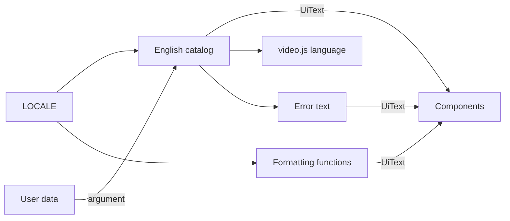
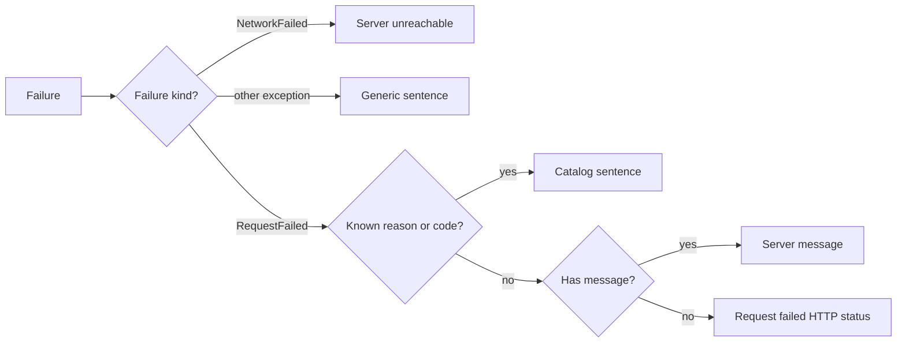

# Screen text and formatting (i18n)

Screen text and the formatting of dates and numbers in `web/src` come from
[`web/src/i18n/`](../../web/src/i18n); English is the only language and there
is no language selection. Background:
[specs/023-english-i18n/research.md](../../specs/023-english-i18n/research.md)
(R-1 to R-3, R-5, R-6, R-9).

Every piece of screen text reaches a component through the catalog or a
formatting function, both fixed to one locale.

## Catalog

`en.ts` is the English catalog, a nested object per screen area, imported
statically (`import { t } from "../i18n"`); text with embedded values is a
function (`t.count.videos(n)`).

The language is one constant decided at startup (`LOCALE` in `intl.ts`) and
never changes at runtime, so there is no React context or provider.

| Rule | Behaviour |
| --- | --- |
| Adding a language | Write a TypeScript object of type `MessageSource` (`typeof en`); type checking finds missing keys and wrong arguments |
| Translation tooling | None: no management tool, no extraction step |
| User data (video, folder and tag names, paths) | Not translated; passed as an argument and embedded |
| Japanese font (Noto Sans JP) | Kept, so Japanese names render on the English screen |

## UiText

Catalog values and formatting output have the branded type `UiText`
(`uiText.ts`), and text props that show screen text accept only `UiText`, so an
English literal outside the catalog fails type checking.

| Typed `UiText` | Stays `string` |
| --- | --- |
| Text props in `web/src/ui/`: `IconButton` `label`, `ModalFrame` `title`, toast text, `placeholder`, `Combobox` `aria-label` and reasons | Props carrying user data: `ComboboxOption.label`, `Chip` `title` |
| Error text returned by hooks in `api/` | |

## Video player (video.js)

The control bar's accessible names and tooltips come from a custom language,
`en-x-vv`, built from `t.player.controls`
([`VideoPlayer.tsx`](../../web/src/player/VideoPlayer.tsx)).

Buttons with a keyboard shortcut show the key: `Play (Space)`, `Mute (M)`,
`Fullscreen (F)`, and `Restart (0)`, a button added to the control bar. The
language is registered again for every new player, so the pseudo-locale
reaches it. Video.js also uses the name as the player's `lang` attribute, and
text missing from the table falls back to the `en` defaults.

## Formatting

`format.ts` and `intl.ts` format through `Intl` with the catalog's `LOCALE`.

| Function | Output |
| --- | --- |
| `formatNumber` | A number with digit grouping |
| `formatDate`, `formatDateTime` | `Intl.DateTimeFormat` with a `medium` date and a `short` time |
| `formatRelative` | "3 days ago" from `Intl.RelativeTimeFormat`, with the pre-English thresholds; under 45 seconds, `t.time.justNow` |
| `selectPlural` | `one` or `other` from `Intl.PluralRules`, for the catalog's count functions |
| `formatList` (`intl.ts`) | "A, B, and C" from `Intl.ListFormat`, for catalog text lists such as the "being created" line on the playback screen |

Locale-independent formatting (duration, file size, resolution, quality labels)
is in `web/src/lib/format.ts`.

## API error display

`errorText` in `i18n/errors.ts` turns a failed request into screen text from
the response's `status`, `code`, `message`, `reason`, `limit` and `tagName`
([contracts/error-api.md §1](../../specs/023-english-i18n/contracts/error-api.md)).

The text is chosen in this order:

A known `reason` wins over a known `code`, and the catalog sentence embeds
`limit` and `tagName`. "No message" covers a body that is not JSON, is empty,
or lacks `message`; the text is `Request failed (HTTP <status>)`. Browser and
exception messages are never shown.

The error tables are typed `Record<ErrorCode, …>` and `Record<ErrorReason, …>`
from the generated types, so a code or reason added to `api/openapi.yaml` fails
type checking until it has a sentence. Analysis and import failures are
explained from `ProbeErrorCode` and `ScanErrorCode` (with `errorPath`), not
from the free-text `probeError` and `Scan.error`; past failures without a code
get a generic sentence.

## Detecting untranslated text

Three checks catch English or Japanese that bypasses the catalog, each at a
different point.

| Check | What it reports |
| --- | --- |
| ESLint `no-restricted-syntax` ([`web/eslint.config.js`](../../web/eslint.config.js)) | In non-test code outside `i18n/`: string literals and templates with Japanese, JSX text with letters, string literals for `aria-label`, `title`, `placeholder` and `alt`, `"ja-JP"`, and `toLocaleString` / `toLocaleDateString` / `toLocaleTimeString` without a locale. Comments are not inspected |
| Types | `UiText` props and the `Record` error tables |
| Pseudo-locale screen tests | Visible text, `aria-label`, `title`, `placeholder` or `alt` that is neither wrapped in `⟦ ⟧` nor user data supplied by the test |

The pseudo-locale (`enablePseudoLocale()` in `i18n/pseudo.ts`) wraps every
catalog sentence and formatting output in `⟦ ⟧`, so English passed through a
`string` variable, which the types miss, shows up unmarked;
`web/vitest.setup.ts` restores English after each test. Text that reaches the
screen through a `string` variable in a state no test renders is caught by
neither.

## Wording in ui-design.md

The English catalog ([`web/src/i18n/en.ts`](../../web/src/i18n/en.ts)) is the
source of truth for screen text; the Japanese quoted in a feature's
`ui-design.md` predates the English conversion and states that screen's
intent.
