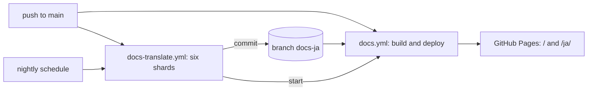

# Japanese translation of the documents

The repository's documents are written in English. A workflow translates the
published ones into Japanese with a translation-specialised model run on the
GitHub Actions runner. The site publishes the result under `/ja/`. The code is
in `docs-site/translate/`, the workflow in
`.github/workflows/docs-translate.yml`, and the operating steps in
[docs-site.md](../how-to/docs-site.md).

## Translation engine

### Context

The translation has to be produced without a person, follow the English
source, keep one Japanese rendering per term, and keep Markdown structure.
The requester asked for a recent translation-specialised model.

### Decision

`HY-MT1.5-7B` (Tencent, quantised to GGUF `Q4_K_M`), served by `llama.cpp`
`llama-server` on the `ubuntu-latest` runner. `docs-site/translate/model.json`
pins the Hugging Face repository, revision, file, sha256 and the `llama.cpp`
release.

Candidates were run on the same eight English segments on a 4-vCPU runner
(2026-10-03):

| Model | Size | Speed | Result |
| --- | --- | --- | --- |
| `HY-MT1.5-1.8B` `Q8_0` | 1.9 GB | 18 tokens/s | Wrong terms ("seek bar" as `検索バー`, "orphan branch" garbled) and one paragraph with the opposite meaning |
| **`HY-MT1.5-7B` `Q4_K_M`** | 4.6 GB | 7.6 tokens/s | Correct and natural on every sample; kept `<sN>` tags and glossary terms |
| `TranslateGemma` 4B `Q8_0` | 4.1 GB | 8.6 tokens/s | Kept tags and terms, but mistranslated "seek bar" (`スクロールバー`) and "main" |
| `plamo-2-translate` `Q4_K_M` | about 6 GB | below 1 token/s | Did not finish eight short segments in 25 minutes |

Services and general-purpose LLM APIs were not run:

| Option | Why not |
| --- | --- |
| DeepL, Google Translation, Azure Translator, Amazon Translate | The requester prefers a translation model the repository runs; each needs an account and a secret |
| `PLaMo翻訳` API | No public API |
| Claude or OpenAI API | Not translation-specialised |
| Argos, opus-mt, NLLB | Poor technical Japanese; NLLB is non-commercial |

### Trade-offs

At 7.6 tokens/s, translating everything takes about a day of runner time. The
workflow splits the sources across six parallel jobs and stops each one after
five hours, so the first full translation completes in one or two nightly runs.
Later runs translate only changed segments and finish in minutes.

`HY-MT`'s license does not apply in the EU, the UK or South Korea. The workflow
runs on GitHub-hosted runners. Moving it to self-hosted runners needs a check
against that license.

## Segments instead of whole files

### Decision

`segments.mjs` parses each document with `remark` and sends only the inline
text of paragraphs, headings and table cells, plus Mermaid labels. Inline code,
link destinations, HTML and identifier-like words (paths, `snake_case`,
`camelCase`) become numbered `<sN>` tags. The tags go through HY-MT's
formatted-translation prompt and come back byte for byte. The translated file is
the English file with each segment's span replaced.

| Check | When it fails |
| --- | --- |
| Every tag appears once, nested as in the source | The segment is retried once, then kept in English and listed in the run summary |
| Same block structure, code blocks, inline code and link destinations as the source | The file is not written; the previous translation stays |
| Each glossary term's Japanese rendering appears | Listed in the run summary; the translation is kept |

Each heading gets an explicit `{#slug}` with its English GitHub slug, so links
between Japanese pages keep working.

### Trade-offs

Whole-file translation by the model was rejected: a 7B model drops table and
list structure over long inputs, and every small edit would retranslate the
whole file.

## Terms

`docs-site/translate/glossary.tsv` maps each English term to one Japanese
rendering. Only the entries that occur in a segment go into its prompt, through
HY-MT's terminology template. The screen is English only
([i18n.md](i18n.md)), so a UI label maps to itself and stays as the screen shows
it.

## Storage and freshness

### Decision

Translations live on the orphan branch `docs-ja`, never on `main`, so nobody
edits them. For each source the branch holds the translation, `.meta/<path>.json`
(hashes of the source, model and glossary) and `.memory/<path>.json` (segment
translations keyed by source text, terms and model).

| Situation | Behaviour |
| --- | --- |
| A source changed | Only segments missing from memory reach the model |
| A glossary line changed | Segments with that term miss memory and are retranslated |
| `model.json` changed | Every segment is retranslated |
| A source was deleted or renamed | Its translation, metadata and memory are removed |
| The translation run failed or ran out of time | The site deploys anyway; affected pages show the out-of-date or untranslated notice until a later run |
| A source is still listed in `scripts/sddguard/japanese-pending.txt` | It is not translated: it has no English text yet |

`site.mjs` builds `ja/` before every site build and compares each translation's
recorded source hash with the current English file. That comparison decides the
notice on the page.

### Trade-offs

Committing translations to `main` through bot pull requests was rejected: every
change would wait for a merge, and an editable copy would sit beside the
source. Keeping them only in the Actions cache was rejected: the cache is
evicted after seven days unused, and a full retranslation takes a day of runner
time.
