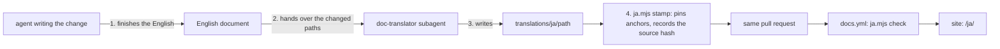

# Japanese translation of the documents

The English documents are the source of truth. Their Japanese translations are
written by a translation-only subagent, `doc-translator`, in the same pull
request that changes the English. They live in `translations/ja/`, and the
documentation site publishes them under `/ja/`
([docs-site.md](../how-to/docs-site.md)).

## Who translates

### Decision

The agent that changes an English document finishes the English first, then
hands the changed paths to `doc-translator` (`.claude/agents/doc-translator.md`,
`.codex/agents/doc-translator.toml`). The subagent reads only the English
source, the current translation when there is one, and the rules below. It
does not write or edit English. It translates, compares its translation with
the source sentence by sentence, fixes what it added, dropped or changed, and
runs `node docs-site/translate/ja.mjs stamp <path>`.

### Trade-offs

Translation-specialised models run on CI were tried first (2026-10-03, on six
real documents):

| Engine | Result |
| --- | --- |
| `HY-MT1.5-7B` `Q4_K_M` on a 4-vCPU runner, segment by segment with context | Paragraphs readable. Headings and table cells mistranslated ("Say each thing once" as "read each item once", the column "Not" as "no"), repository terms wrong ("Issues and PR bodies" as "problems and proposals"), polite and plain forms mixed, segments with many code spans left in English |
| `HY-MT1.5-1.8B`, `TranslateGemma` 4B | Worse than 7B on the same samples |
| `plamo-2-translate` | Under 1 token/s on the runner |
| Claude subagent, translate then compare with the source | Correct terms and headings, consistent plain form, nothing left in English; the comparison pass caught three sentences whose force had changed |

The model cannot follow style rules, and short segments lose their meaning
without the document. A subagent reads the whole document and the rules.
Writing the English first and translating it in a separate context keeps the
English authoritative and stops the author from writing the Japanese it
intended rather than the English it wrote.

A scheduled translation job was rejected: the translation would land in a
later commit than the English, and every run would scan the whole tree. Doing
it in the pull request puts the translation under the same review.

## Storage and checks

### Decision

`translations/ja/<path>` mirrors `<path>`. Its front matter records the source
path and the SHA-256 of the English file it translates (`sourceHash`), and every
heading ends with the English heading's anchor (`{#slug}`), so links between
Japanese pages resolve. `stamp` writes both; nobody edits them by hand.

`node docs-site/translate/ja.mjs check` runs in `docs.yml`:

| Situation | Result |
| --- | --- |
| Headings, lists, tables, code blocks, inline code, link destinations or Mermaid structure differ from the source | Error |
| A heading lacks its English anchor | Error |
| The English source no longer exists | Error; delete or move the translation |
| The English source changed after `stamp` | Warning; the page shows an out-of-date notice |
| A Japanese paragraph is broken across lines | Warning; the break renders as a space |
| A published document has no translation | Counted; the page shows the English under an untranslated notice |

A stale or missing translation never fails CI, so a change to English is never
blocked by its translation. The next change that touches the document, or a
run of `ja.mjs status` and the subagent, brings it up to date.

`TestDocumentsAreWrittenInEnglish` and the link guards in `scripts/sddguard`
skip `translations/`: the prose there is Japanese, and its links mirror the
checked English ones.

## Translation rules

The subagent follows these rules. They are part of its prompt.

### Faithfulness

- Translate every sentence. Do not add explanations, examples, softeners,
  summaries or emphasis. Do not merge or drop sentences.
- Keep the force of every statement: "must", "never", "only when" and "unless"
  keep their strength; a statement stays a statement and an instruction stays
  an instruction.
- Translate terse text (headings, table cells, labels) by its meaning in
  context. A column "Not" next to "Write" is `書かない例`, not `いいえ`.
- When translating a changed document that already has a translation, keep the
  existing Japanese for sentences whose English did not change.

### Structure

- Keep every Markdown element where it is, with the same heading levels, list
  items, table rows and columns, code blocks, links and images.
- Never change inline code, fenced code, link destinations or image paths. In a
  `mermaid` block, translate only node and edge labels.
- Keep identifiers, file paths, commands, API names, HTTP status codes and UI
  labels as the English screen shows them (**Versions**, Library).
- Write each paragraph on one line. A line break inside a Japanese paragraph
  renders as a space.
- `stamp` adds the heading anchors; do not write them.

### Style

- Use the plain form (`だ・である`) throughout, never `です・ます`.
- Write short, direct sentences. Avoid translationese:

| Avoid | Write |
| --- | --- |
| `〜することができる` | `〜できる` |
| `〜を行う`, `〜を実施する` | the verb itself (`確認する`) |
| `〜に関して`, `〜について` where not needed | drop it |
| `〜というものは`, `〜ということ` | drop the padding |
| `それは`, `これらの` where the subject is clear | omit the pronoun |
| `一切`, `明らかに`, `非常に` not in the source | omit |

- Prefer an established Japanese technical term to katakana (response →
  `応答`, discovery → `検出`). Keep katakana Japanese engineers use as is
  (`ブランチ`, `コミット`, `キャッシュ`, `ワークフロー`).
- An HTTP status is not an error unless the source says so (`304 を返す`).

### Terms

| English | Japanese |
| --- | --- |
| Issue, parent Issue, child Issue | `Issue`, `親 Issue`, `子 Issue` |
| pull request, PR, PR body | `プルリクエスト`, `PR`, `PR 本文` |
| requirement, acceptance criterion | `要件`, `受け入れ条件` |
| repository, root documents | `リポジトリ`, `ルートの文書` |
| design document, how-to guide | `設計文書`, `手順書` |
| documentation site | `文書サイト` |
| skill, document type, skeleton | `スキル`, `型`, `雛形` |
| feature branch | `feature ブランチ` |
| live transcoding | `ライブ変換` |
| seek bar, seek thumbnail | `シークバー`, `シーク用サムネイル` |
| sidecar subtitle file | `隣の字幕ファイル` |
| owner, guest | `所有者`, `ゲスト` |
| tentative tag, folder group, content key | `仮のタグ`, `フォルダのグループ`, `内容の鍵` |
| workflow, runner | `ワークフロー`, `ランナー` |
| Mermaid | `Mermaid` |

Add a row when a term is translated inconsistently; existing translations keep
their wording until their English changes.
