# Library UI: visual rules and list layout

- Status: adopted
- Scope: the visual rules that the screens in `web/` (shell, lists, video page)
  follow, and how compliance with those rules is checked

The screens share one set of visual values in CSS, and tests check what a
machine can check. The values (colours, radii, card widths) live only in
`@theme` in [`web/src/index.css`](../../web/src/index.css) and the checked
pairs only in [`tokens.test.ts`](../../web/src/theme/tokens.test.ts); they are
not copied here.

The diagram shows where the values live and who checks each part.

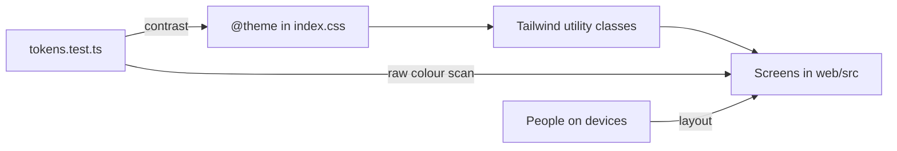

## 1. Visual values in one CSS location, with contrast guaranteed by tests

Screens set visual values only through the utility classes Tailwind generates
from `@theme` (`bg-surface`, `text-fg-muted`, `rounded-md`), and
`tokens.test.ts` checks that every listed text/surface pair reaches a WCAG 2
contrast of at least 4.5.

CSS is the source because it leaves screens no option other than token names.
With the values in one file, the contrast check reads only that file.

The test applies these checks:

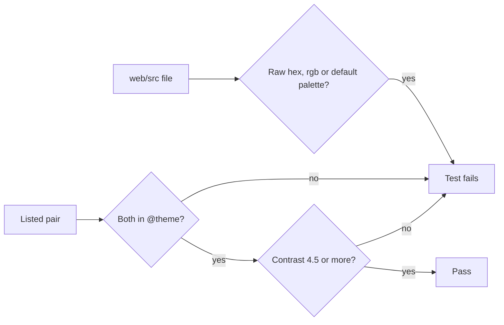

Default palette names are `neutral-*`, `sky-*` and the rest. A colour missing
from the pairs is not checked, so **a new text or surface colour must be added
to the pairs**; the test catches a listed pair missing from CSS, not the
reverse.

| Role | Token |
| --- | --- |
| Shell and surfaces | Supplied dark `navbar`, `bg`, `surface` |
| Primary action | Cyan `accent`; `accent-hover` on hover; `accent-active` pressed and selected |
| Borders of shared controls | `control-border` |
| Keyboard focus | `link` |
| Danger, warning, success | Own semantic colour, always with text and an icon |
| Favorite mark | Pink `favorite`, used by nothing else ([035 UI design, Mark](../../specs/035-favorites/ui-design.md)) |

The semantic colours and the pink stay apart from cyan so they are not read as
interaction states. The test covers body text on surfaces, the main borders and
focus.

| Rejected | Why |
| --- | --- |
| Values in TypeScript, CSS generated | Screens use Tailwind class names anyway, so names are duplicated and one more generated file appears |
| axe or Lighthouse in CI | Needs a real browser; beyond contrast it adds findings people review anyway |

## 2. Dark scheme only, without a light/dark switch

`html` declares `color-scheme: dark` and one dark set of values exists, with no
`prefers-color-scheme` branch and no switch.

A switch doubles the sets under contrast checking, and one set would go stale
unseen. Token names describe roles (`bg`, `surface`, `elevated`, `fg`,
`fg-muted`, `accent`, `danger`, `warning`), not colours (`neutral-850`), so a
later light scheme is a second set of values with no screen changes.

## 3. No virtual scrolling

Lists render every loaded item without a virtual scrolling library; the goal is
immediate response to input, not fewer DOM elements.

The list is a wrapping grid whose cards per row change with screen and card
width, so virtualization would mean computing that count and rebuilding scroll
restoration in virtual coordinates. Pages load 60 items
([`PAGE_SIZE`](../../web/src/api/client.ts)), so the DOM holds only what the
user loaded. **Revisit only after measuring what is slow.**

The tag admin list (`/tags`) is the measured exception: with thousands of tags,
opening, search and scrolling froze, so it draws only the rows near the
viewport (`@tanstack/react-virtual`'s `useWindowVirtualizer`,
[036 research R-2](../../specs/036-tag-admin-scale/research.md)). Neither
reason above applies there: it is one column, and rows arrive 100 at a time
from the server for the current conditions. The document stays the scroll
owner, the list keeps the focused row drawn, and Tab crosses the edge of the
drawn range, so keyboard order reaches every row. Its toolbar, tab and column
headings stay as one sticky band under the top bar; the page measures the band
and passes its height to the virtualizer and to `scroll-padding-top`, so a
focused row never hides under it
([036 UI design, Band](../../specs/036-tag-admin-scale/ui-design.md)).

## 4. Width breakpoints in CSS, and the sidebar exception

Width variations use Tailwind's default breakpoints in CSS; only the sidebar
reads width in JavaScript ([`useSidebar.ts`](../../web/src/shell/useSidebar.ts)).

Watching width in JavaScript brings a watcher, a one-frame flicker on the first
render, and a `matchMedia` stub in tests. The sidebar is the exception because
it interprets the user's open/close choice per width and keeps the drawer's
open state, which CSS cannot express. Its breakpoints equal `lg` and `sm`:

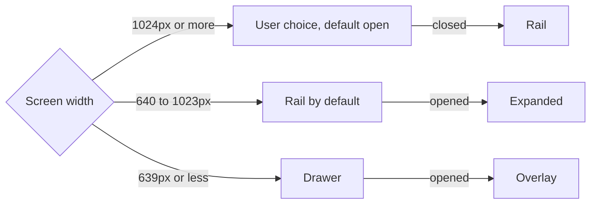

Reduced motion (`prefers-reduced-motion`) is also handled in CSS: the
`motion-reduce:` variant stops decorative transitions, while the final colour
and the target marker still apply, so the result of an action stays visible.

## 5. Layout verified by people, not machines

Machines check contrast, the absence of raw colours and component behaviour;
**people check the layout and its width variations on real devices**.

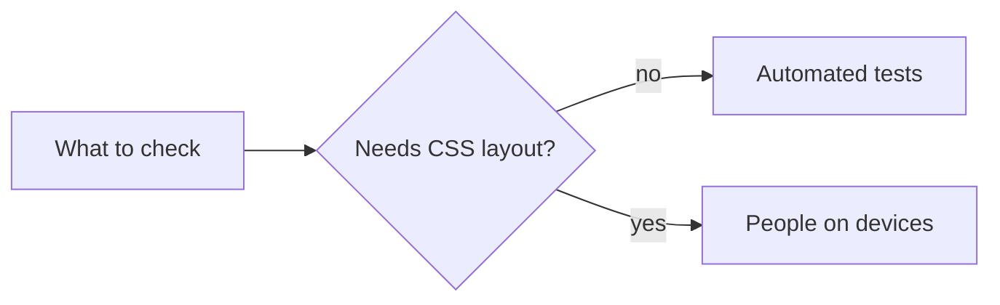

jsdom does not apply CSS, so `position: fixed`, media queries and wrapping are
unresolved, and faking them gives passing tests on a broken screen.

| Rejected | Why |
| --- | --- |
| Visual regression tests | New dependencies, false positives from glyph differences between environments, and every UI change updates reference images |

## 6. List layout

Lists use a dense management-screen layout: a top bar, a filter band and boxed
cards, shared by the library and folder pages through one grid
([`Grid.tsx`](../../web/src/videoList/Grid.tsx)).

The diagram shows the parts of a list screen.

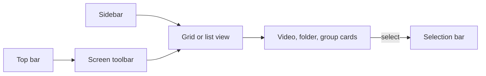

### Shell and toolbar

The top bar ([`TopBar.tsx`](../../web/src/shell/TopBar.tsx)) holds ☰, the
logo and `Refresh library`, and each screen inserts its toolbar between them.
The sidebar has three states (expanded, rail, drawer; see
[section 4](#4-width-breakpoints-in-css-and-the-sidebar-exception)); collapsing
it widens the grid, while card width follows the zoom level. Guest rules are in
[016 UI design, Shell entries, Guest degradation](../../specs/016-single-account-auth/ui-design.md).

| Part | Owner | Guest |
| --- | --- | --- |
| Sidebar, upper | All entries | `Library` and `Folders` only |
| Sidebar, lower | `Settings`, `Sign out` | `Sign in` |
| Refresh button and import progress | Shown | Hidden |
| Sort orders | 9 | 7 |
| Watch status and `Favorites only` filters | Shown | Hidden |

The toolbar holds search, filters, view (library only), zoom and sort.

| Width | Toolbar |
| --- | --- |
| Wide | All controls inline |
| Narrow | View, zoom and sort move into `View and sort` |
| Below `md` | Sort orders fill two radio columns row-first: 5 rows owner, 4 guest |
| Below `sm` | One full-width column at any zoom; zoom hidden |

The count sits in the row above the grid for the library and search results,
and in the section heading for a folder's direct contents.

The sort orders are date added, date modified, date created, title, duration,
file size, recently played, date favorited and random; guests lose the
owner-only recently played and date favorited. Date created sits
with the other dates ([033 UI design](../../specs/033-video-dates/ui-design.md));
date favorited follows recently played and sorts newest first
([035 UI design, Sort and direction](../../specs/035-favorites/ui-design.md)).

The filter popover lists watch status, `Favorites only` (URL `fav=1`) and
playability, in that order. `Clear filters` clears favorites only with the
other filters and keeps the sort. A guest URL with `fav=1` or `sort=favorited*`
is reset to the defaults before the request and the URL is corrected.

### Cards

A video card ([`VideoCard.tsx`](../../web/src/videoList/VideoCard.tsx)) shows
the thumbnail, the duration at its bottom right, playback progress along the
bottom edge and the title.

| Card | Rules |
| --- | --- |
| Video, library and folder pages | Tag row under the title, none without tags ([014 UI design, Library card](../../specs/014-video-tags/ui-design.md)) |
| Video, folder search results | Location row under the title |
| Folder | Video card's width and border, folder artwork, Folder icon in the title |
| Group (library only) | Video card's box and size, folder artwork of up to 4 member thumbnails |

Video card behaviour:

| Case | Behaviour |
| --- | --- |
| Tag pressed in the library | Filters by the tag |
| Tag pressed on a folder page | Opens `/?tag=<id>` |
| Tag from a folder name only | Same size, no fill, dashed border, Folder marker; no × on the video page; not offered by `Remove tag` ([017 UI design](../../specs/017-folder-groups/ui-design.md)) |
| Hover preview | One at a time on any screen |
| Zoom changed | Returns to the card that was at the top |

A folder card shows its name on up to two lines with the full name in `title`.
The owner also sees the media folder path, truncated to favour its end, full in
`title`. An empty registered root says to place files there and import.

The library reads `GET /api/library`, which mixes folder groups in with videos;
folder pages and their search results list videos one by one. A group card
shows a panel with the count (`12 videos`) and total duration, a watched-share
bar only while some members are in progress, the group name and the members'
tags. Pressing it opens the member to continue (`/videos/{openVideoId}`).
Guests see no watch status, watched count or bar.

Ungroup, group a folder's direct videos and turn a group into a tag are not on
the card. They sit in the owner's menu at the right end of a folder page's
`Videos N` heading row
([`FolderGroupingMenu.tsx`](../../web/src/folders/FolderGroupingMenu.tsx)) and
on the video page's group name row. After an action the cached library list is
discarded and reloads on the next visit.

### Favorite mark

The owner's favorite mark is one heart that is both mark and toggle, at the
top right of the thumbnail on video and group cards
([`FavoriteToggle.tsx`](../../web/src/videoList/FavoriteToggle.tsx),
[035 UI design, Mark, Card](../../specs/035-favorites/ui-design.md)).

| Aspect | Rule |
| --- | --- |
| Shape | 22px heart in a 28px hit area, no fill or border behind it |
| Readability | Dark `drop-shadow-mark` on cards; none in list view |
| On | Filled pink `favorite`, everywhere |
| Off | White outline, shown only on hover or focus (always where hover is impossible) |
| Pressing | Outside the card link: does not open or select |
| Filtered to favorites | Item stays until the next fetch |
| Guests | Not shown |

The mark changes only after the server answers:

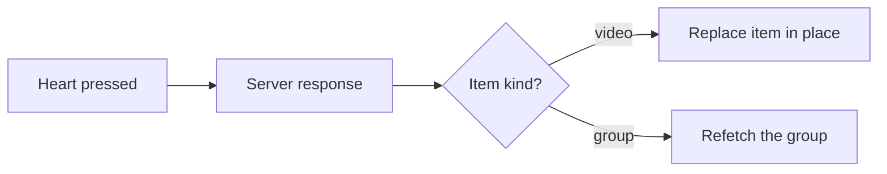

A group is refetched with `GET /api/folders/{rootId}/group`.

### List view and selection

List view (library only) shows title, favorite (owner), watched, duration,
quality, size and date added. A group row uses the same columns: first member's
thumbnail, Folder marker and count under the title, `3 / 12` watched, total
duration and size, empty quality
([017 UI design, List view row](../../specs/017-folder-groups/ui-design.md)).

Selection is library- and owner-only. Its check shows on hover or focus in the
grid (always where hover is impossible), always faintly in list view, and on
every item during selection. What a group's check selects is in
[017 UI design, Pressing and selection](../../specs/017-folder-groups/ui-design.md#pressing-and-selection).

### Selection bar

The selection bar is fixed to the bottom of the screen from the first selected
item, without moving or resizing the toolbar. Action names are never shortened,
so they read on devices without hover.

Its items, in order, are `N selected`, `Add tag`, `Remove tag`, `Favorite`,
`Visibility`, `Bundle as versions` (2 or more videos), a separator, `Select
all` and clear. Lines are decided by measuring the actual widths:

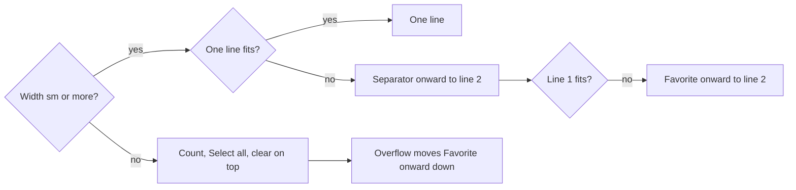

At `sm` and above the bar spans the full width instead of overflowing with
`nowrap`, and moved items sit at the right end of line 2, `Favorite` and the
rest before the separator. Below `sm`, the bottom line holds the two tag
actions, `Favorite` and `Visibility`; what does not fit moves to the right end
of the next line, then the line after.

Details: tag actions in
[014 UI design, Selection bar](../../specs/014-video-tags/ui-design.md#selection-bar),
the visibility menu in
[016 UI design, Selection bar](../../specs/016-single-account-auth/ui-design.md#selection-bar),
and `Favorite` and wrapping in
[035 UI design, Selection bar](../../specs/035-favorites/ui-design.md#selection-bar).

`Favorite` decides per selected group whether to send it as a group:

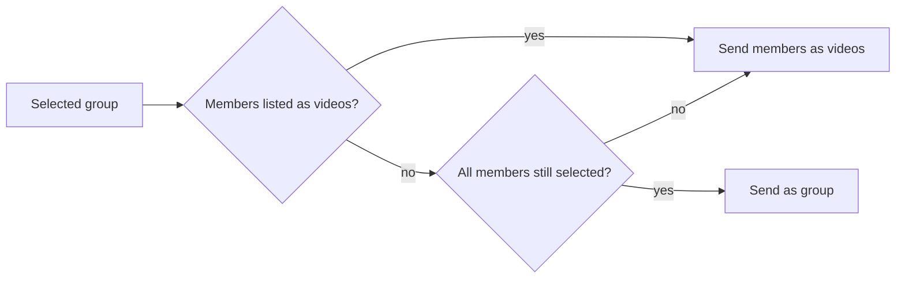

A group is selected through its card's check or through `Select all`. Members
appear as video items, or the group gains members, when the list is refetched
with the selection kept, for example after an import.

### Interaction states

Normal, hover, focus-visible, active, selected and disabled are distinct and
consistent across components. Keyboard focus is an outer outline in the accent
colour; the search field draws it on its outer frame, not the inner `input`, to
avoid a double outline.

## 7. Sidebar navigation

Each sidebar item goes to its screen.

## 8. Video page layout

The video page (`/videos/:id`) is for watching, so it is less dense than the
lists; shapes and text are in
[012 UI design](../../specs/012-video-detail-ia/ui-design.md).

The page is layered over the list with no shell and closes with × or Esc. The
diagram shows its parts.

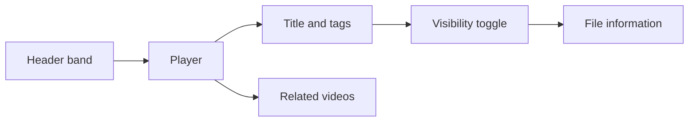

| Part | Rule |
| --- | --- |
| Header band | Logo (home), breadcrumb to the folder, the only × |
| Return target | The list before the page opened, kept through related videos and `Play next` |
| Tags | Right below the title as one unit ([014 UI design, Video page tags](../../specs/014-video-tags/ui-design.md#video-page-tags)) |
| Visibility toggle | `role="switch"`, below the title unit, above file information |
| Guests | No tags, visibility toggle, `Open file` or `Copy path` ([016 UI design, Visibility toggle](../../specs/016-single-account-auth/ui-design.md#visibility-toggle)) |

Width variations stay in CSS, as in
[section 4](#4-width-breakpoints-in-css-and-the-sidebar-exception): at `lg` and
above related videos form a right column, below that everything stacks, and
below `md` the breadcrumb shows only its last segment.

### Information rows

Two rows under the title carry no lines, frames or labels.

| Row | Content |
| --- | --- |
| First | Duration, size, date added with icons; actions at the right end |
| Second | Resolution, container, codec; smallest and most subdued |

No path appears under the title, because the breadcrumb already shows the
location.

The owner's favorite toggle opens the right-hand action group, left of
`Use current frame as thumbnail` (`FavoriteToggle` `page` form: `IconButton`
`sm`, `aria-pressed`). It is the group's only control with state, so the eye
lands on it first; even so, it is no more prominent than the title: on is a small
`bg-accent-soft` fill with the pink heart. It is absent on group rows and for
guests ([035 UI design, Video page](../../specs/035-favorites/ui-design.md#video-page)).

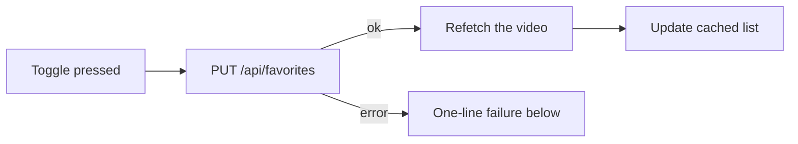

Updating the cached list means the library card has changed on return. The
failure line sits directly below the information row, like open and capture
failures, with no toast.

### Player states

Loading, import stages, read failure, playback failure, video gone and playback
ended show one at a time from a single container over the player, which decides
the order. Only the "being created" line sits below the player. Layer text
sits on opaque `bg-navbar`, because `tokens.test.ts` cannot check text on the
translucent `bg-overlay`.

The stall warning ([`StallWarning.tsx`](../../web/src/player/StallWarning.tsx),
`role="status"`) is a separate small banner at the player's top left: it
neither stops playback nor blocks controls, so it stays out of the
one-at-a-time container.

| Aspect | Rule |
| --- | --- |
| Stacking | Above the video, below the container and the control bar |
| Input | Passes through to the controls, except its × |
| Hidden while | Playback failure, playback ended, up next, reconnecting or importing shows |
| Loading spinner | Shown together with it during a data wait |
| Dismissed | Not shown again for the same video |
| Actions | None; no quality change |

Rules: [Playback quality, Stall warning](playback-quality.md#stall-warning);
details:
[027 UI design, Stall warning](../../specs/027-playback-quality/ui-design.md#stall-warning).

### Playback errors

Playback errors are classified by kind
([`playbackRecovery.ts`](../../web/src/player/playbackRecovery.ts)), checking
the cause when the `video` element's code does not say it:

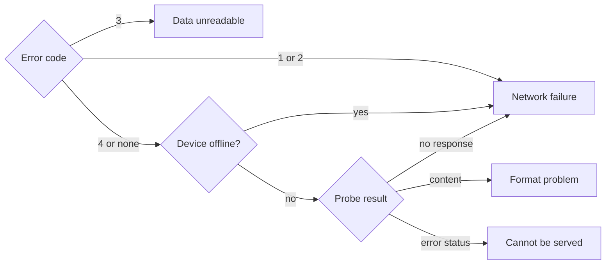

Direct playback probes the first byte of the file. Transcoding probes only
whether `/api/health` answers, because a request to the stream would start a
transcode; any answer counts as a format problem.

A network failure reloads on the current route from where it broke off,
without switching to transcoding:

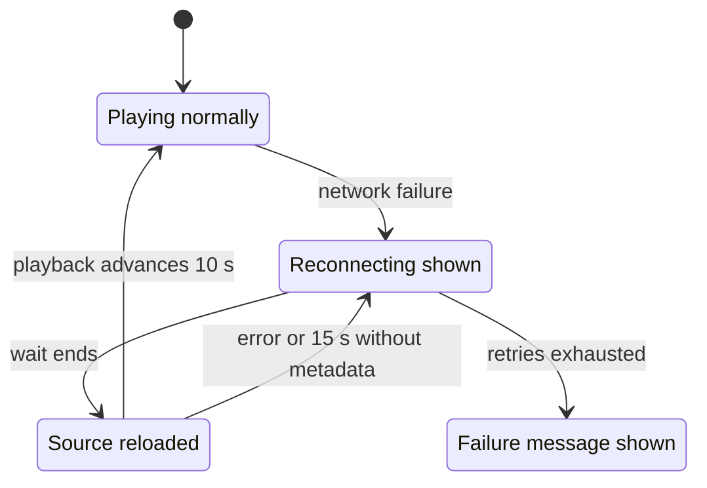

| Rule | Value |
| --- | --- |
| Waits | 1, 2, 4, 8, 15 s (about 30 s in total) |
| Early end of a wait | Device comes back `online`, or the viewer presses play |
| Retry count reset | 10 s of real playback after a reload; seeks and paused changes do not count |
| Pause during a wait | Playback stays paused after the reload |
| Seek during a wait | Becomes the reload position; during a request, applied after metadata |
| Paused state | Answered from the viewer's intent; the play/pause button follows it |
| Switch to transcoding | Once, only from direct playback, only for data-unreadable and format failures |

Viewer input during the wait never reaches the broken source. The final
message says which applies: the server cannot be reached, the data cannot be
read (corrupt), or the video cannot be served (moved, gone, format).

### Control bar

Only control bar parts are video.js components: restart, quality, subtitles,
playback speed, current time/duration and the transcode indicator. The status
display is React, because a video.js component could not share state with the
rest of the screen.

| Control | Rule |
| --- | --- |
| Right-hand group | Transcode indicator, quality, playback speed, PiP, full screen, in that order |
| Quality | `MenuButton` matching playback speed in box, padding, opening and Esc ([`qualityMenu.ts`](../../web/src/player/qualityMenu.ts)) |
| Quality label | The current quality; for the original, the video's short side |
| Choosing a quality | Replaces the source at the same position without recreating the player |
| Esc in an open menu | Closes only the menu |
| Subtitle button | Next to playback speed; absent for videos without subtitles |
| Subtitle menu | Subtitle names and `Off`; no appearance settings |
| Subtitle choice | Remembered per browser; the next video with the same label starts with it |
| Subtitle position | Raised above the control bar and progress bar while they show |

Quality: [Playback quality, Switching](playback-quality.md#switching) and
[027 UI design, Control bar: quality menu](../../specs/027-playback-quality/ui-design.md#control-bar-quality-menu).
Subtitles use video.js's `vjs-text-track-display`
([sidecar-subtitles.md](sidecar-subtitles.md)).

Keyboard shortcuts work on the whole screen: video.js components stop key
propagation, so keys are caught in the capture phase on `window`, passing
through only keys that operate the focused button or slider. Space, F, M, C
(subtitles), 0 and Esc are handled.

### Group members

A video in a group only gains parts on the same page; a video outside any group
is unchanged ([017 UI design, Video page](../../specs/017-folder-groups/ui-design.md#video-page)).

| Part | Rule |
| --- | --- |
| Above the title | Group name and position in the group |
| Related videos column | `Up next` member list and a divider at the top |
| Playback ended | Next-member notice instead of the layer: 5 s, cancellable, Esc cancels |
| Group name row (owner) | Menu with `Ungroup` and `Turn the group into a tag`; Esc closes only the menu |
| After a menu action | Video and related videos refetched; page returns to the plain form |
| Previous/next handles | Move within the group |

`matchMedia` reads the `lg` width only to scroll the current member's row into
view on wide screens; on narrow widths scrolling would move the whole page and
hide the player.

Central touch controls appear on `pointer: coarse` devices through a CSS media
condition, without `matchMedia`, for the reason in
[section 4](#4-width-breakpoints-in-css-and-the-sidebar-exception).
