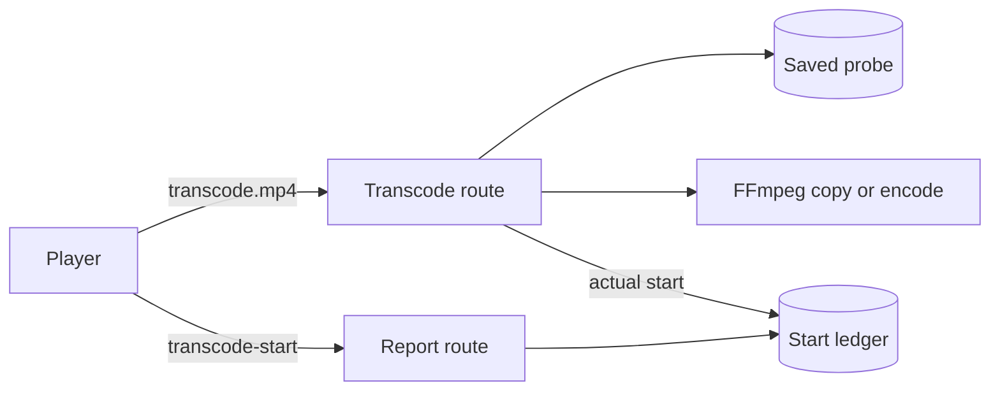
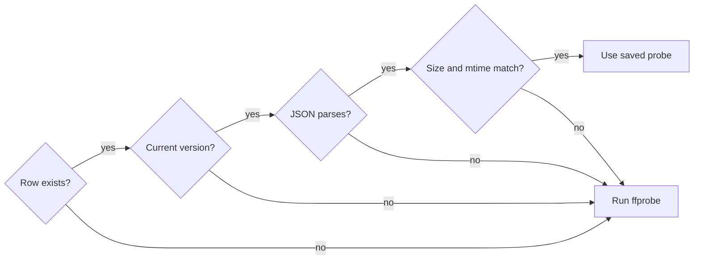
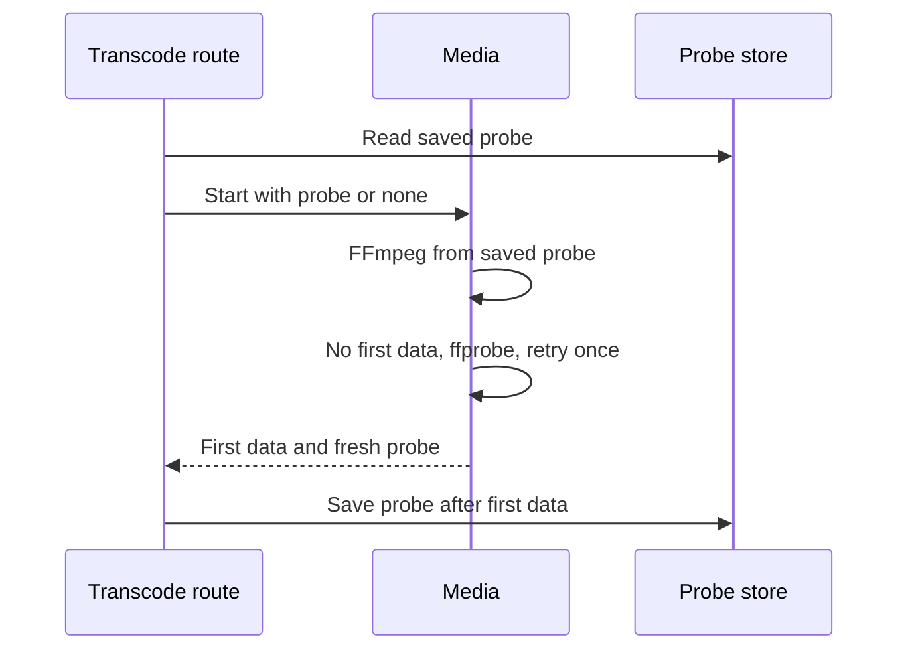
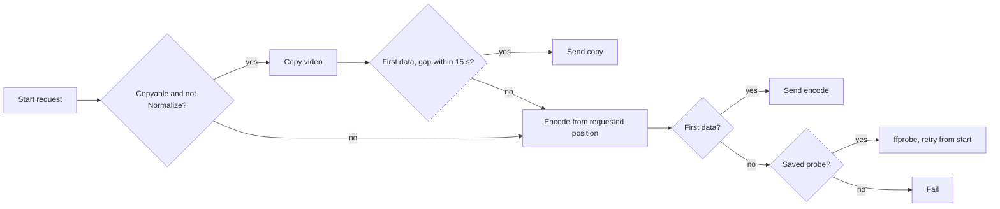
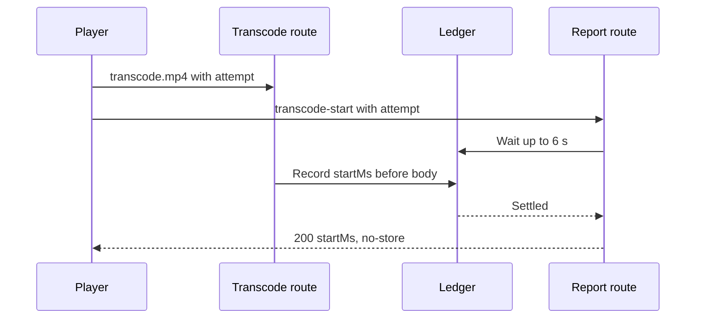
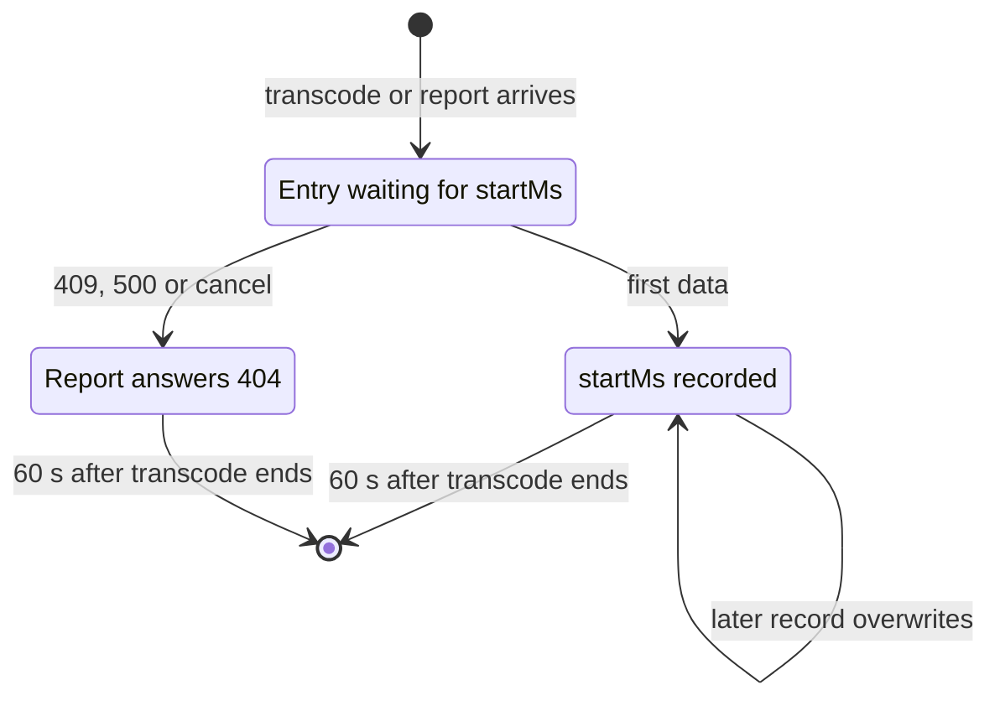

# Live transcoding seek and probe reuse

Live transcoding (`GET /api/videos/{id}/transcode.mp4`) starts FFmpeg from a
saved probe, copies the video stream from a mid-file position when it can, and
tells the player the actual start position through
`GET /api/videos/{id}/transcode-start`
([`internal/httpapi/transcode.go`](../../internal/httpapi/transcode.go),
[`internal/media`](../../internal/media)). Background:
[research.md](../../specs/018-live-transcode-seek/research.md).

The player makes two requests per transcode from a mid-file position; the
transcode records its actual start position in a ledger that the report reads.

## Probe reuse

Import analysis saves the ffprobe facts that live transcoding needs
(`domain.TranscodeProbe`) in `video_transcode_probes`, and a transcode runs
ffprobe only when no usable saved value exists.

The FFmpeg arguments (stream choice, copy or encode, dimensions, rotation, fps,
the [two MOV inputs](mov-live-transcoding.md)) depend on ffprobe, and on a
network drive ffprobe is a large part of the time to first data. A row holds
the parsed values as JSON with a version, plus the size and modification time
(nanoseconds) of the analysed file.

A saved value is usable only when every check passes against the file the
transcode actually opened, even when another location has the same content.

The current version is `domain.TranscodeProbeVersion`. A transcode started from
a saved value that ends without first data probes again and retries once,
inside the same startup deadline:

| Case | Behaviour |
| --- | --- |
| Startup deadline | 6 s (`transcodeStartupTimeout`) covers probing, retry and every switch; it is not reapplied after first data |
| Failure after an on-the-spot probe, cancellation, deadline expiry | No retry, nothing saved |
| Save | After first data, alongside delivery, with its own 10 s deadline that survives request cancellation |
| File stamp changed while probing | Result used for this transcode, not saved |
| ffprobe cut off partway | Error, not saved |
| Import and transcode save at once | Single upsert; the later row remains |
| Imported video without a row | Its first transcode fills it; no startup backfill |

The table is an index: if lost, the next transcode or reanalysis fills it. Fit
is judged by size and modification time only, so a file rewritten with both
unchanged is transcoded with the stale probe; if that fails before first data,
the retry replaces the saved value. Media never calls the store: the route
decides usability and saves, so media tests without ffmpeg need no SQLite.

| Rejected | Why |
| --- | --- |
| Media reads the store | An adapter would depend on an adapter, against the dependency direction in ARCHITECTURE.md |
| Store ffprobe's raw JSON | Interpretation would depend on the ffprobe version at save time, and each video would hold tens of KB |
| Typed columns on `videos` | Listing rows would grow with unused columns, and each new field would need a migration |

## Copy path and gap limit

A video whose stream can be copied (`videoCanCopy`, for example H.264 in MKV)
is copied from a mid-file position unless the copy starts more than
`domain.CopySeekAllowance` (15 seconds) before the requested position; then it
is encoded from the requested position.

A copy starts at the preceding keyframe, so the server has to learn the time it
actually started
([research.md R-1](../../specs/018-live-transcode-seek/research.md#r-1-source-of-the-actual-start-position)).
For one probe, FFmpeg starts are tried in this order:

`Normalize` marks a switch from direct playback. Deadline expiry and
cancellation never switch. The actual start position goes to the
[start position ledger](#start-position-report).

| Start | Actual start position |
| --- | --- |
| Copy from 0 | 0; arguments unchanged |
| Copy from a mid-file position | Earliest track start in the output `moov` |
| Keyframe after the requested position (seek before the first keyframe) | That later time, used as is |
| Encode | The requested position |

A mid-file copy adds `-copyts -start_at_zero` and `+delay_moov` to the
input-side `-noaccurate_seek -ss`. The mp4 muxer then writes each track's start
time as an empty edit in its edit list (`elst`). The server reads the output up
to `moov`, takes the earliest track start, and rewrites `elst` so that track is
at 0 and the others keep their difference
([`fmp4.go`](../../internal/media/fmp4.go)); `moof` and `mdat` pass untouched.
In videos whose audio starts slightly before the keyframe, the actual start is
the audio start, which matches the picture because the display uses the same
reference.

Audio is copied when the request is not `Normalize` and `audioCanCopy` holds,
and encoded to AAC otherwise. When video is copied from a mid-file position,
audio starts at the same keyframe time through `-noaccurate_seek`. The two MOV
inputs get the same `-ss`, and the track difference stays in `elst`, so audio
and video do not drift.

The first data of a copy arrives after one keyframe interval of the source is
read; a video over the limit pays that read before switching to encoding.

### Why the gap limit is 15 seconds

The x264/x265 default keyframe interval is 250 frames: 8.3 seconds at 30 fps
and 10.4 seconds at 23.976 fps, so a 10-second limit would re-encode every
film-rate video made with the default. Camera and streaming videos use 1 to 10
seconds, and 15 seconds copies all of them. Videos with keyframes only at scene
changes (tens of seconds to minutes) would jump back too far from the chosen
position, so they are re-encoded
([research.md R-2](../../specs/018-live-transcode-seek/research.md#r-2-allowed-gap-to-the-keyframe-when-copying)).

| Rejected | Why |
| --- | --- |
| Output the `-copyts` timestamps | Chrome and Firefox shift the first time to 0 in progressive playback, so the player cannot learn the start |
| Find keyframes before FFmpeg | One more process per request, bringing back the wait probe reuse removed |
| Rewrite `tfdt` in each `moof` | Every sent byte would pass through the rewriter; one `moov` rewrite suffices |
| Copy audio on a mid-file copy | A copied stream keeps data from the demuxer's keyframe, so audio alone would start before the requested position, by over ten seconds with sparse keyframes |

## Start position report

The player adds a per-request `attempt` to the transcode URL and asks
`GET /api/videos/{id}/transcode-start` with the same `attempt` for the actual
start position
([contract](../../specs/018-live-transcode-seek/contracts/transcode-start-api.md)).

Playback through `<video src>` exposes neither response headers nor body
structure to JavaScript, so the transcode response cannot carry the start
position. Without the report, the displayed time and the saved playback
position would run ahead of the picture by up to the gap limit
([research.md R-4](../../specs/018-live-transcode-seek/research.md#r-4-path-that-reports-the-actual-start-position-to-the-player)).

The browser may send either request first, so the report waits for the ledger
entry:

Each ledger entry moves through these states
([`transcode_start.go`](../../internal/httpapi/transcode_start.go)):

| Rule | Behaviour |
| --- | --- |
| Key | Video ID and `attempt`, so another video's route cannot read it |
| Entry from a transcode | Created after the video is found and `attempt` is well formed |
| Entry from a report only | Removed once no waiter remains |
| Transcode without `attempt` | Not recorded |
| Malformed `attempt` | 400 on both routes |
| Not settled within 6 s, failed | 404 |
| Guest, non-public video | Same 404 as a missing video |
| Server restart | Ledger is lost; recreated transcodes use new `attempt` values |

The player ([`liveOffset.ts`](../../web/src/player/liveOffset.ts)) creates an
`attempt` (16 random bytes in hex, since `crypto.randomUUID` is unavailable over
plain http on a LAN) only when `startMs > 0`; a start from 0 sends no report.
It asks for the report after setting each source, including a rebuild for an
unbuffered seek, and shows the requested position until the answer arrives.
The ledger is written before first data, so the answer arrives before the
picture moves.

| Report result | Player behaviour |
| --- | --- |
| 200 | Offset becomes `startMs`; `vvOffsetChanged` fires; saved position aligns to it |
| 404 or error | Keeps the requested position |
| For a stale `attempt` | Discarded |
| While waiting for a rebuild after an unbuffered seek | Only the offset changes, so the saved position stays at the chosen one; notified if a seek within the buffer cancels the rebuild |

Sidecar subtitles follow this offset: `vvOffsetPending` fires when waiting
starts and `vvOffsetSettled` when the offset settles (200, 404, error, or a
source without `attempt`)
([sidecar-subtitles.md](sidecar-subtitles.md#live-transcoding-time-alignment)).

| Rejected | Why |
| --- | --- |
| Deliver over `/api/events` SSE | Guests need it too, and the playback screen would handle subscription state and arrival order |
| A start route launches FFmpeg and the video request attaches | The process would span two requests, and unattached processes need cleanup |
| MSE with `fetch` reading response headers | Rebuilds delivery; outside the parent Issue's scope |
