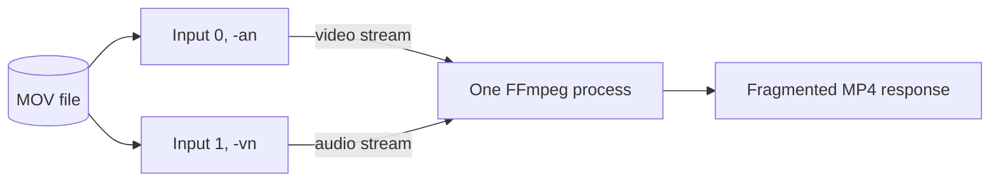
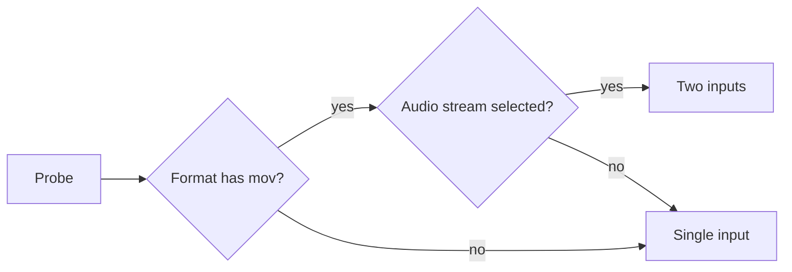

# Separate track inputs for MOV live transcoding

For a MOV with audio, live transcoding opens the same file as two FFmpeg
inputs, one for video and one for audio, so neither demuxer seeks back and
forth between tracks ([`transcodeArgs`](../../internal/media/transcode.go)).

One FFmpeg process reads the file twice, and each input feeds one stream of the
request-scoped fragmented MP4.

## Decision

FFmpeg gets the path as two inputs only when the format name in the
[live transcoding probe](live-transcode-seek.md#probe-reuse) contains `mov` and
there is an audio stream to select.

The MOV demuxer returns packets in time order by seeking between tracks, and on
a network drive this makes the first output and ongoing transcoding very slow.
A demuxer that follows one track does not seek between tracks.

| Input | Flag | Maps |
| --- | --- | --- |
| 0 | `-an` (audio disabled) | The selected video stream only |
| 1 | `-vn` (video disabled) | The selected audio stream only |

| Case | Behaviour |
| --- | --- |
| Start at a seek position | Both inputs get the same `-ss`; the demuxer seeks to a video keyframe and the `-vn` input aligns audio to that time |
| Video copied from a mid-file position | Audio starts at the video keyframe time; the track difference stays in the output `elst` ([copy path](live-transcode-seek.md#copy-path-and-gap-limit)) |
| Video encoded | Both inputs start at the requested position |
| Several video or audio streams | Only the first video stream that is not an attached picture, and the audio stream the probe chose, are output |
| `interleaved_read` | Not set; the demuxer keeps its default |
| Request cancelled | Both inputs stop with the one process; nothing is written to disk or the database |

## Added load

Each MOV with audio costs two demuxers: more file handles, demux work and
metadata reads than a single input, and the two inputs can read the same region
depending on track layout and the OS cache. The method guarantees fewer seeks
between tracks, not less I/O for every MOV.

This is accepted because the expected use is one user with 1 to 2 concurrent
viewing sessions, so no shared cache or transcoding worker is added. If
concurrent transcodes grow, re-measure the file handle limit, network bandwidth
and server CPU, and revisit this decision.

| Rejected | Why |
| --- | --- |
| `interleaved_read=0` | Reads in file order can run one track far ahead, so the muxer waits and the first output misses its deadline or playback stops; older FFmpeg builds lack the option |
| Copy to a local temporary file | The whole video is copied before playback starts, and local storage needs managing, against the request-scoped design |
| Two inputs for every format | The observed problem is the MOV demuxer; nothing justifies the extra load for other formats |
