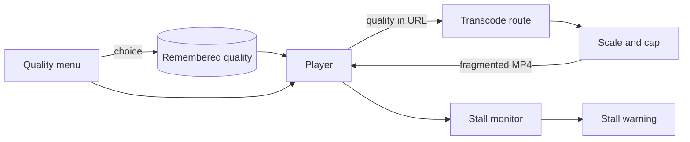
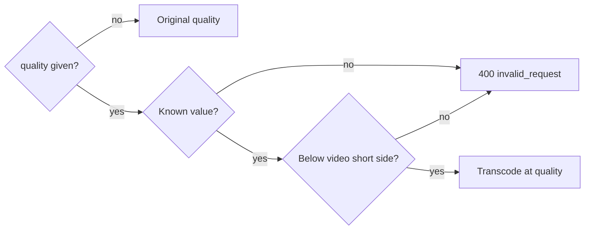
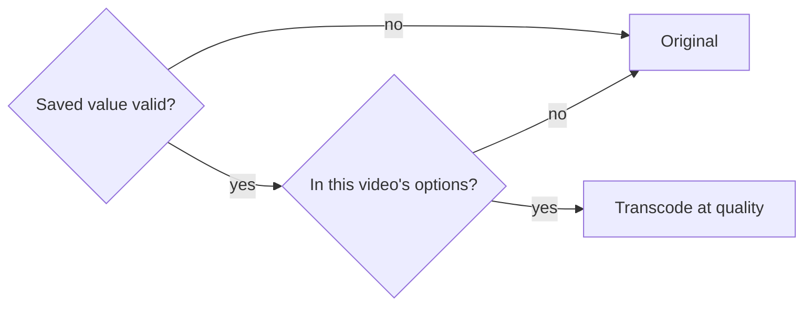
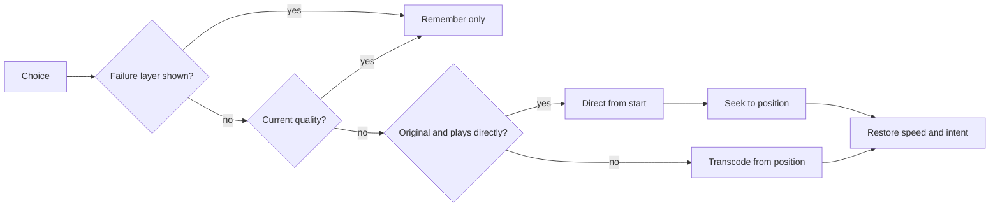
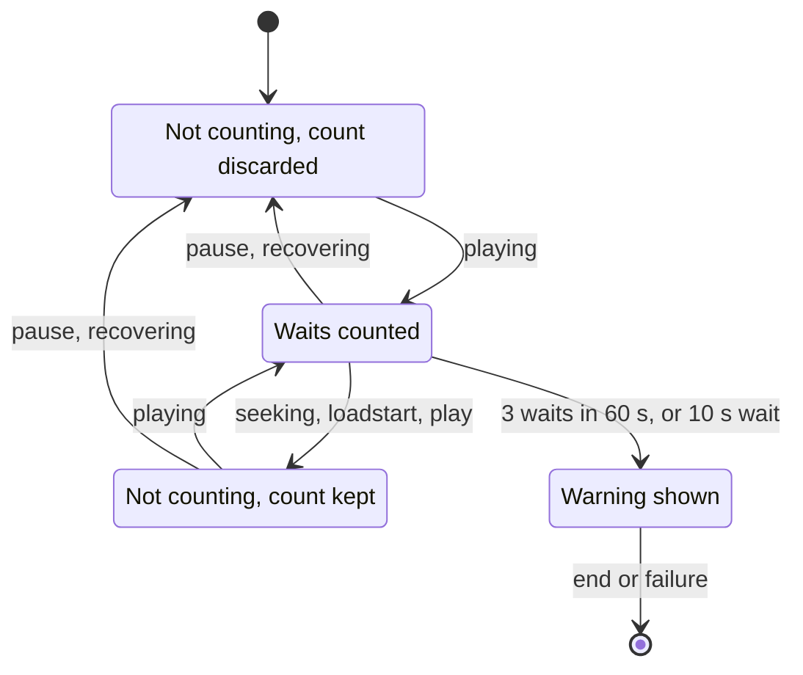

# Playback quality

A viewer on a slow connection picks a smaller quality, and the live transcode
(`GET /api/videos/{id}/transcode.mp4`) downscales the video and caps its
bitrate; the player switches quality in place and warns when playback stalls
([`internal/domain/transcode_quality.go`](../../internal/domain/transcode_quality.go)).
Background: [specs/027-playback-quality/](../../specs/027-playback-quality/plan.md)
(parent Issue #521). Starting a live transcode is in
[live-transcode-seek.md](live-transcode-seek.md); the encoder choice is in
[hardware-encoding.md](hardware-encoding.md).

The browser remembers the quality, the player puts it in each transcode URL,
and the server encodes to that quality's limits.

## Transcoding

A quality sets the display short side, a video bitrate cap and an AAC audio
bitrate, and all three come down together; a transcode without a quality is
unchanged.

On a slow connection the original quality (copied video, or constant quality
when encoding) exceeds the connection speed, so dimensions, video bitrate and
audio bitrate all have to drop.

| Quality | Short side | Video cap (`-maxrate`) | `-bufsize` | Audio (AAC) |
| --- | --- | --- | --- | --- |
| `1080p` | 1080 | 5000 kbps | 10000 kbps | 128 kbps |
| `720p` | 720 | 2500 kbps | 5000 kbps | 128 kbps |
| `480p` | 480 | 1200 kbps | 2400 kbps | 96 kbps |
| `360p` | 360 | 700 kbps | 1400 kbps | 64 kbps |

A quality is available only when its short side is smaller than the video's
display short side (rotation applied); a video without dimensions has none.
Upscaling or encoding at the same size only makes the stream heavier.

A transcode with a quality differs from one without in these ways:

| Aspect | With a quality |
| --- | --- |
| Video | Always encoded, never copied, so the stream starts exactly at the requested position |
| Dimensions | Scale factor is the smaller of the ratio to the quality's short side and the ratio to the 3840×2160 frame; each side rounded to an even number |
| Encoder | Gets the table's cap ([encoder arguments](hardware-encoding.md#encoder-arguments)); the software fallback uses the same dimensions and cap |
| Audio | Always AAC (`-ac 2 -ar 48000`) at the table's rate; a copy would keep 256–320 kbps |
| Unchanged | H.264 High, Level 5.1, 4:2:0 8-bit, a keyframe every 2 seconds, `-movflags`, fps, `setsar` |

Because the short side decides, a portrait 1080×1920 at `480p` becomes
480×854, the same weight as landscape. Only a video whose long side exceeds the
frame ends up smaller: 1200×12000 becomes 384×3840 at `1080p`, `720p` and
`480p`, and 360×3600 at `360p`.

A Go test transcodes full-frame noise at `480p` and requires a short side of
480 and an average video bitrate of at most 1.2 × 1200 kbps. CI cannot check
hardware encoders; they are checked on real hardware with
[quickstart.md](../../specs/027-playback-quality/quickstart.md).

| Rejected | Why |
| --- | --- |
| Scale by the long side | A portrait `720p` would be 405×720, lighter than landscape |
| Average bitrate with `-b:v` only | No instantaneous cap, so high-motion scenes exceed the connection |
| `scale=-2:480` in ffmpeg | ffmpeg would also need the orientation, duplicating the Go calculation and its tests |
| Keep the short side beyond the frame | 1080×10800 exceeds the H.264 Level 5.1 frame limit |

## API

The transcode route takes an optional `quality` (`1080p`, `720p`, `480p`,
`360p`), and the server decides the quality from each request alone
([contract, `quality` on `GET /api/videos/{id}/transcode.mp4`](../../specs/027-playback-quality/contracts/transcode-quality-api.md#quality-on-get-apivideosidtranscodemp4)).

The viewer switches quality during playback; a server-side memory or a route
per quality would have to track which quality goes with each seek and resume
request.

The route checks the value before starting a transcode:

A video without dimensions has no available quality, so it also gets 400. The
start log (Debug) carries `quality`, or `quality=original`. `startMs` and
`attempt` work as before, and `transcode-start` equals `startMs` because the
video is always encoded. The response and error shapes are unchanged, and the
route stays open to guests for public videos.

| Rejected | Why |
| --- | --- |
| A route per quality | The start position ledger and the public boundary would be duplicated per route |
| The server remembers the quality | Guests have no viewer identity, and the URL alone would no longer decide the output |
| Map an unavailable quality to another | The quality on screen and the quality played would disagree |

## Options and remembered quality

The browser remembers one quality for every video, and a video plays at it
when it is one of that video's options, otherwise at the original quality
([`playbackQuality.ts`](../../web/src/preferences/playbackQuality.ts)).

Quality suits the connection, not the video, so it has to survive the next
video, a seek, and a reload after a network failure.

| Rule | Behaviour |
| --- | --- |
| Storage | `localStorage` key `vv.playback-quality.v1`, a JSON string (`"480p"`, `"original"`); never sent to the server |
| Missing, broken or unknown value, or no storage | Original quality |
| Options | Qualities below the video's short side, largest first; none without dimensions |
| Frame-forced downscaling | Not considered; the rule matches the server's short-side check |
| Unavailable remembered quality | Original plays; the remembered value is kept for the next larger video |
| Quality other than original | Transcoded from the resume position, even for a video that can play directly |
| Unbuffered seek, network reload | Rebuilt with the same quality, never without one |
| Transcode indicator | `Converting to 480p` with how to go back ([ui-design.md](../../specs/027-playback-quality/ui-design.md#control-bar-transcode-indicator)); quality names are not translated |

| Rejected | Why |
| --- | --- |
| The server remembers the quality | Guests have no viewer identity (see [API](#api)) |
| Overwrite an unavailable remembered quality | One small video would lose the quality chosen for the connection |
| Options in the server response | The rule is a dimension comparison; it would add to the `Video` shape and to round trips |

## Switching

A quality chosen from the control bar replaces the source in the same player
at the current position and keeps playing or paused as before
([`qualityMenu.ts`](../../web/src/player/qualityMenu.ts)).

Connection speed changes during playback, and a switch that restarted from the
beginning or from a stopped state would itself interrupt viewing.

The menu sits before playback speed. Its items are the original quality
(`Original (1080p)`) and the video's options; a video without options shows the
note `No smaller sizes for this video`. The button reads the current quality,
the short side for the original, or `Orig` without dimensions.

Each choice is remembered at once, then goes through these branches:

A video that fell back to transcoding because direct playback could not be read
stays transcoded at the original quality. When the original plays because the
remembered quality is unavailable, choosing the original replaces the
remembered value. The retry after a failure recreates the player with the
remembered quality.

Only the latest switch is pending. A new choice replaces the waiting one, and
metadata counts only when it belongs to the element's current source; once the
new source has reached the element (`loadstart`), the switch finishes even if
an unbuffered seek changes the URL. The browser aborts the old request, which
stops its transcode on the server, and stale start-position reports are
discarded by attempt. A choice during a pending network reload cancels the wait
and loads the chosen quality; a failure of the new source goes through the
usual error path and retries from the switch position.

| Rejected | Why |
| --- | --- |
| Recreate the player | Returns to the poster, hides the control bar and rebuilds full-screen state |
| A React popover menu | The speed menu's look, opening and keyboard handling would have to be rebuilt and kept in sync (research.md R-4) |

## Stall warning

Playback is judged stalled when 3 or more counted data waits start within
60 seconds, or one lasts over 10 seconds; a banner then says so without
stopping playback or changing quality
([`stallMonitor.ts`](../../web/src/player/stallMonitor.ts)).

A viewer cannot tell whether the connection or the video is at fault. Waits
right after a seek, a start or a switch happen on fast connections too, so
counting them would warn too often.

A data wait runs from `waiting` to the next `playing`. Counting moves through
these states:

`loadstart` covers the first load, quality switches and reloads. Once stalled,
the judgement stays until the end of playback or a failure.

| Warning behaviour | Rule |
| --- | --- |
| Place | Small banner at the player's top left, outside the status overlay container |
| Controls | Only the × takes pointer input; `role="status"` |
| Hidden while | Failure, playback-ended, up-next, reconnecting or importing layers show |
| Loading spinner | Shown together, since the 10-second judgement happens during a wait |
| Dismissal | Kept per video id, also across a retry; forgotten on another video |
| Action | None; no quality suggestion and no automatic reduction |

| Rejected | Why |
| --- | --- |
| Estimate speed from `buffered` or `progress` | Leads toward automatic switching, and `progress` intervals differ widely between browsers |
| A layer of the status overlay container | It shows one layer at a time, exclusive with the central controls, so it would block them |
| A toast in a screen corner | Invisible in full screen and not tied to the player |
