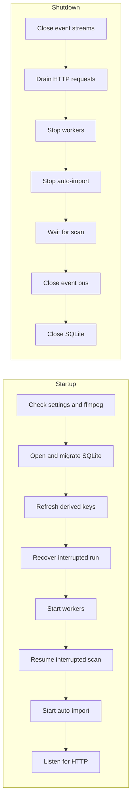

# Process lifecycle: startup and shutdown order

`cmd/mdm` starts the parts of the server in dependency order and stops them in
the reverse order of what feeds what
([`cmd/mdm/main.go`](../../cmd/mdm/main.go)). The desktop app runs the same
steps when its window opens and closes ([windows-app.md](windows-app.md)).

The diagram shows the two orders: startup from top to bottom, shutdown from
the listener back to the database.

## Startup order

Every step that writes derived data finishes before anything reads it, and the
listener opens last.

| Step | On failure |
| --- | --- |
| Settings, `ffmpeg`/`ffprobe` on `PATH`, SQLite, migrations | Startup stops |
| Search keys of locations and tag names | Startup stops, so search never runs on keys built by an older rule ([013 data-model, When keys are built, and `search_version`](../../specs/013-library-search/data-model.md#when-keys-are-built-and-search_version)) |
| Folder index | Logged; the previous index stays until the next rebuild ([017 data-model, When the index is rebuilt](../../specs/017-folder-groups/data-model.md#when-the-index-is-rebuilt)) |
| Unfinished artifacts under `.tmp` | Logged |
| Resuming the interrupted scan | Logged; the user can start a scan |
| Starting auto-import | Logged; the watches are added in the background and never delay the listener, and no scan starts ([folder-watching.md](folder-watching.md)) |
| Encoder checks | Run in the background and never delay the listener ([hardware-encoding.md](hardware-encoding.md)) |

The folder index is refreshed after the search keys because it reads the title
keys they produce. Unfinished artifacts are removed before the workers start,
so nothing still being generated is deleted.

## Recovery after an interrupted run

A run that stopped mid-work leaves running rows behind, and startup returns
them to a state the next run continues from: interrupted scans are closed as
`failed` with the reason `interrupted`, running jobs go back to `queued`, and
once the workers run one new manual scan starts. An interrupted watch scan is
closed and not resumed, so startup reads no directory for it
([folder-watching.md](folder-watching.md);
[037 research R-9](../../specs/037-windows-app/research.md#r-9-an-interrupted-last-scan-restarts-automatically-at-startup-for-every-way-of-starting)).

## Shutdown order

Shutdown stops each part before the parts it feeds, so nothing writes to a part
that has already stopped and a running job returns to the queue.

The `/api/events` streams never end on their own, so they close before the
10-second request grace starts. A cancelled job stays `running` and the next
startup requeues it; a job is never lost between the queue and a worker.

Auto-import stops before the scan is cancelled, so it removes its watches and
starts no new watch scan while the running one is being stopped.

## Artifact removals drained, not unsubscribed

The artifact-removal subscription is never dropped; closing the event bus
delivers every queued removal before SQLite closes
([`cmd/mdm/events.go`](../../cmd/mdm/events.go)).

A scan that removes videos publishes their released content as it stops.
Dropping the subscription first would discard those notices and leave
generated files that nothing removes later, since nothing else sweeps the
thumbnails directory.

## Scan grace period

Shutdown waits at most 10 seconds for the scan to stop, separately from the
request grace.

A read from an unresponsive mount does not return on cancellation, so an
unbounded wait could hang shutdown. Past the grace, shutdown continues, the
scan row stays `running`, and the next startup closes it (see
[Recovery after an interrupted run](#recovery-after-an-interrupted-run)).

| Rejected | Why |
| --- | --- |
| Wait for the scan without a limit | A hung mount would keep the process from exiting |
| Close the bus without waiting for the scan | The scan's removal notices would be discarded |
