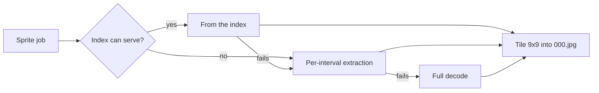
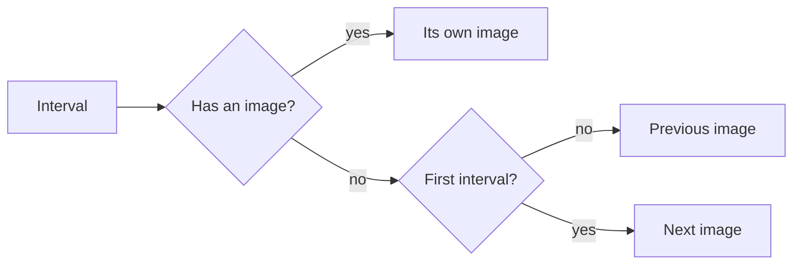
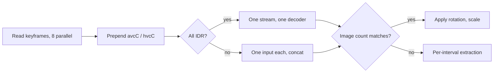
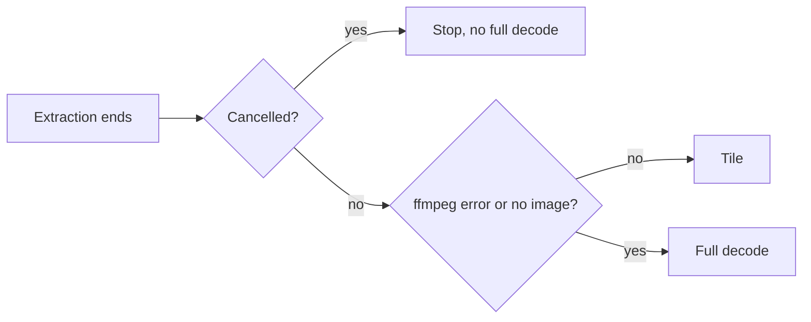

# Seek sprite generation

A seek preview is one 9×9 sprite of at most 81 frames, each within 320px on the
long side and encoded as JPEG at `-q:v 2`
([`internal/media/seek_thumbnail.go`](../../internal/media/seek_thumbnail.go)).
The interval is `max(1 s, ceil(durationMs / 81))`, so videos up to 81 seconds
get one frame per second and longer ones spread 81 frames evenly; a video of
unknown length gets one frame. The floor was 5 seconds, which gave a 30-second
video only 6 frames. Published sprites carry their own interval, so sprites
made with the old floor stay readable. Frame k covers `[k × intervalMs, (k + 1) × intervalMs)`, and the
player picks a frame from `intervalMs`, `frameCount`, `columns` and `rows` in
the layout ([`domain.SeekSpriteLayout`](../../internal/domain/seek_sprite.go)).

Generation tries the cheapest method first and falls back on failure.

## Frame selection

An interval with no image of its own uses the previous interval's image; only
the first interval, which has no previous one, uses the next.

Empty intervals are normal, not failures: a container slightly longer than its
video stream leaves the last interval past the end, and some keyframe gaps are
longer than the sprite interval. A later scene is never pulled forward
otherwise.

## Generation from the index (H.264/HEVC in MP4/MOV)

When the first video track of an MP4/MOV is H.264 or HEVC, the `moov` sample
table is read once and each interval uses one keyframe: the first inside it,
or else the last before it.

Keyframe times come from `stts`, `ctts` and the edit list; keyframes after the
edit list's end are not candidates. A frame is therefore a nearby keyframe, not
the exact interval start, which differs little because most videos have
keyframes a few seconds apart. In exchange, a video reads only the index and
the chosen keyframes (tens to hundreds of KB each), with no `ffmpeg` start or
index reread per frame and no decoding up to a target time.

The chosen keyframes go through these steps:

| Step | Rule |
| --- | --- |
| Shared keyframe | Intervals that share a keyframe read and decode it once and duplicate the image |
| All IDR | Concatenated into one stream: an IDR resets the order count and the decoder state |
| Some not IDR (CRA in an open GOP, non-IDR I-frame) | One input per keyframe joined by the `concat` filter; in one stream the order count would carry over and frames would reorder across keyframes. Slower by the per-input start-up |
| Image count differs | Frames would be misaligned, so the result is discarded |
| Rotation | The raw stream loses the `tkhd` display matrix; a 90-degree-step rotation is reapplied (`transpose`, `hflip,vflip`) before scaling |
| Deadline or stop | Reads return without waiting, so an unresponsive storage location cannot hang the job |

These inputs go straight to per-interval extraction:

| Input | Why |
| --- | --- |
| No `moov` (fragmented MP4 and the like) | No sample table to read |
| Not MP4/MOV, or video not H.264/HEVC | Outside what the index path reads |
| More than one sample description | Resolution or similar changes midway |
| More than one non-empty edit | A middle section is cut out |
| Display matrix beyond rotation (a flip, for example) | The transform is not reapplied |

Inputs whose keyframes are sparse for the layout also go to per-interval
extraction. When fewer than three quarters of the frames would get a keyframe
of their own, the index would repeat the same scene across many frames, as in
a 30-second clip with a keyframe every 10 seconds at 1-second frames.
Per-interval extraction decodes to each interval start instead; its cost
follows the frame count and the keyframe gap, not the video length. This is
the normal path for such inputs, so no warning is logged.

A read or decode failure, such as a broken index, logs a warning and switches
to per-interval extraction.

## Per-interval extraction

For inputs the index cannot serve, `ffmpeg` starts once per frame, seeks on the
input side to the interval start, stops at the interval end and writes a BMP
named by frame number; up to 4 run at once.

Naming by frame number makes placement independent of finishing order. Inputs
with several video streams use the first that is not an attached picture.
Temporary BMPs are deleted on success, failure and cancellation, and
`internal/artifacts` checks the finished output before publication.

Generation falls back to a full decode, with the same frame count, size and
layout, in two cases.

The 30-minute processing limit covers extraction, tiling and fallback together.

A full decode is a substitution: it is logged and recorded as a recent import
problem `seek_thumbnail_full_decode`
([specs/024-import-progress/research.md](../../specs/024-import-progress/research.md)
R-7). Per-interval extraction is the normal path for its inputs and is not a
substitution.

| Case | Recorded problem |
| --- | --- |
| Full decode in this run | Substitution recorded; `fullDecode` stored in `sprite.json` |
| Rerun after a stop between publication and completion | `fullDecode` read back from `sprite.json` and recorded |
| Another video with the same content adopts the sprite | `fullDecode` read back and recorded |
| Older `sprite.json` without `fullDecode` | Problem row left unchanged |

Older sprites of up to 600 frames on 6 sheets stay readable. They are not
regenerated in bulk; the new method applies to newly processed jobs, so the
queue does not grow.

## Frame size and quality

Library cards stretch one frame to the card width (220–480px), so frame size
sets the card scrub preview's sharpness. A 160px frame was stretched 2–3 times,
and 4–6 times on high-density screens. Frames are therefore 320px on the long
side, with JPEG quantiser 2 so block edges stay hidden when stretched.

Decoding takes the same time at any output size. Only scaling, tiling and
encoding grow, by about 0.04–0.07 s per video. Measured with `scripts/previewbench`
on `testsrc2` H.264 inputs, 4-core Xeon 2.1 GHz:

| Input | 160px, `-q:v 4` | 320px, `-q:v 2` |
| --- | --- | --- |
| 2 hours, 640×360 | 0.23–0.25 s, 207 KiB | 0.29 s, 758 KiB |
| 2 minutes, 1280×720 | 0.17 s, 67 KiB | 0.24 s, 236 KiB |
| 21 minutes, 1920×1080 | 0.40–0.41 s, 160 KiB | 0.45–0.48 s, 615 KiB |

A sheet is about 3.5 times larger. The browser holds a 2880×1620 sheet (about
19 MB decoded) only while a card's sheet is loaded; cards release it when they
leave the viewport. Existing 160px sprites stay as they are until their video
is processed again.

Video fingerprints are built from the sprite, and old and new sprites of the
same video still match. A fingerprint shrinks each frame to 32×32 luma by area
averaging and hashes its low frequencies, so frame size and JPEG quality barely
reach it: in `TestSpriteFingerprintMatchesAcrossSpriteSizes` a 160px `-q:v 4`
sprite and a 320px `-q:v 2` sprite of the same video differ by a median of 2
bits, against a match limit of 12.

## Speed and limits

Measured on a 21-minute 1080p H.264 video on local disk, 81 frames of 160px,
all keyframes IDR; each measurement checks the content as well as the time:

| Method | Time | Data read |
| --- | --- | --- |
| Per-interval extraction (4 parallel) | 5.6–5.9 s | Several hundred MB: each frame rereads the index and decodes from its keyframe |
| From the index | 0.37 s | About 15 MB (index about 4 MB plus 81 keyframes) |
| From the index, 81 separate inputs | 1.6–1.8 s | — (the non-IDR path) |

On storage with slow random reads, time follows the read count (one for the
index plus one per keyframe) times the latency. Generation from the index is
still faster than per-interval extraction there, but keeps one read per frame.
