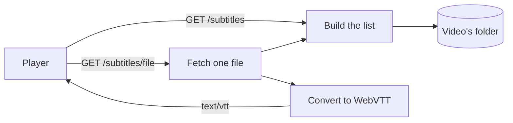
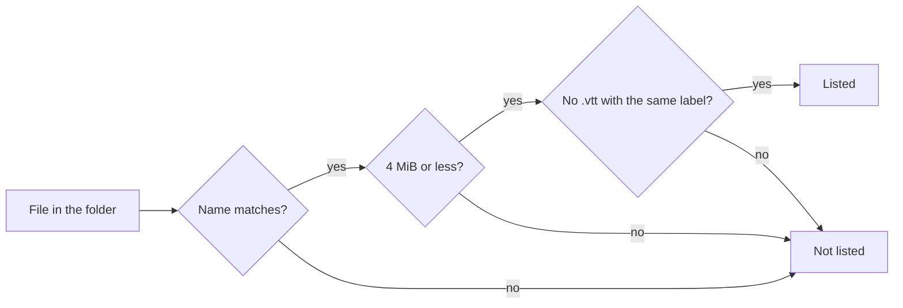
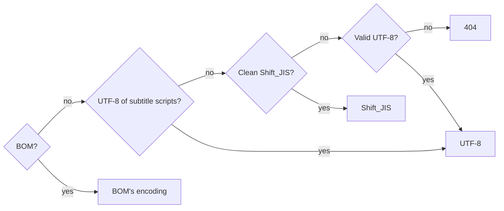
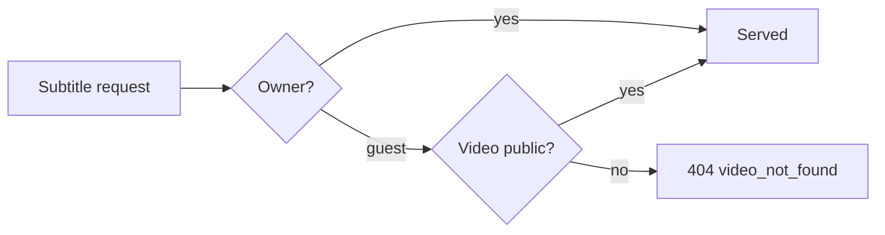
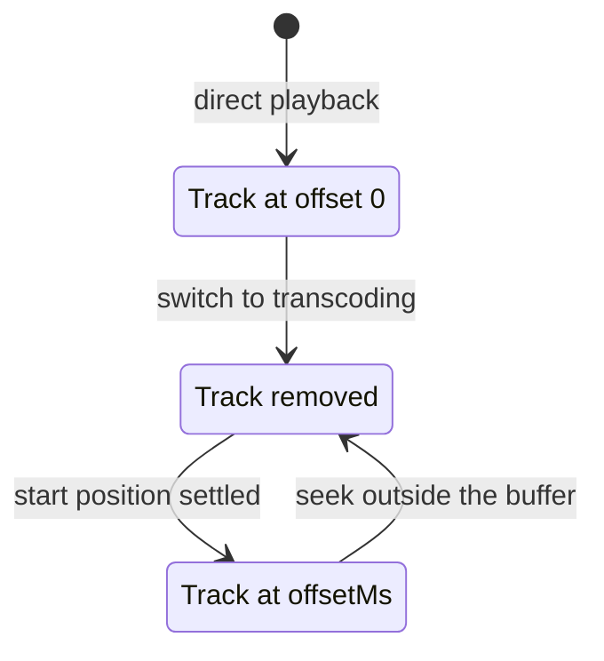

# Sidecar subtitle files

VVMDM shows SRT and WebVTT files placed next to a video as subtitles, converted
to WebVTT on each request ([`internal/httpapi/subtitles.go`](../../internal/httpapi/subtitles.go)).
Background: [research.md](../../specs/028-sidecar-subtitles/research.md);
API: [contracts/subtitles-api.md](../../specs/028-sidecar-subtitles/contracts/subtitles-api.md).

The player makes two requests: one lists the subtitles, the other fetches one
of them. Both read the video's folder; nothing is stored.

## Discovery

Subtitles are found by reading the video's folder on each request, not indexed
([`domain.SubtitleSidecars`](../../internal/domain)).

Adding or removing a file then shows in the next listing without a rescan, and
no table or job has to stay in sync with the folder. Listing reads only names
and sizes, so it stays cheap.

Each file in the folder of the location used for playback goes through these
checks. `<name>` is the video name without its extension, compared
case-insensitively after NFC.

A name matches when it is `<name>.srt`, `<name>.vtt`, `<name>.<label>.srt` or
`<name>.<label>.vtt`.

The list puts the file without a label first, then labels in natural order.

| Case | List response |
| --- | --- |
| Broken file | Listed; fetching it returns 404 |
| No location opens | 404 `file_unavailable` |
| Folder unreadable | Empty list; the reason is logged |

| Rejected | Why |
| --- | --- |
| Index subtitles during a scan | A subtitle added later would need a rescan to appear |

## Fetching and conversion

A file is served only when its name is in the freshly built list, and the
conversion runs in Go without `ffmpeg` ([`internal/media`](../../internal/media)).

Matching against the list means the request string never becomes a path, so
`..` cannot escape the media folder. The open re-checks the media folder rules,
so a file swapped for a symlink after listing is not followed.

The encoding is decided in this order:

Clean Shift_JIS decodes without `U+FFFD` or C1 control characters.

| Input | Behaviour |
| --- | --- |
| SRT | Rewritten to WebVTT; cues with an unreadable time are dropped |
| `offsetMs` | Subtracted from every cue; cues ending at or before 0 are dropped |
| Unknown name, `.srt` hidden by a `.vtt`, over 4 MiB, unreadable | 404 `subtitle_unavailable` |
| Bad `offsetMs` | 400 `invalid_request` |
| Matching `If-None-Match` | 304 |

| Rejected | Why |
| --- | --- |
| Convert with `ffmpeg` | It does not detect the encoding, so Go has to anyway; what remains is a small text rewrite, not worth a process per request |

## Access control

Guests may fetch the subtitles of a video they may play, under the same rules
as the video itself ([`internal/httpapi/auth.go`](../../internal/httpapi/auth.go)).

A private video answers like a video that does not exist, and making a video
private cuts off requests in progress.

## Live transcoding time alignment

During live transcoding the server shifts subtitles by `offsetMs`, and the
player reattaches the track whenever the start position is settled
([`subtitleTracks.ts`](../../web/src/player/subtitleTracks.ts)).

The player selects cues by the transcoded stream's time, which starts at 0
from the seek position. The offset the player adds to its clock does not reach
subtitles, so the server has to shift them
([research.md R-6](../../specs/028-sidecar-subtitles/research.md)).

The track follows the start position through these states:

Reattaching keeps the label shown before. Removing the track while waiting
means shifted subtitles never show, even briefly. Reattaching happens only when
transcoding restarts, which takes seconds anyway, and the subtitle button hides
meanwhile.
