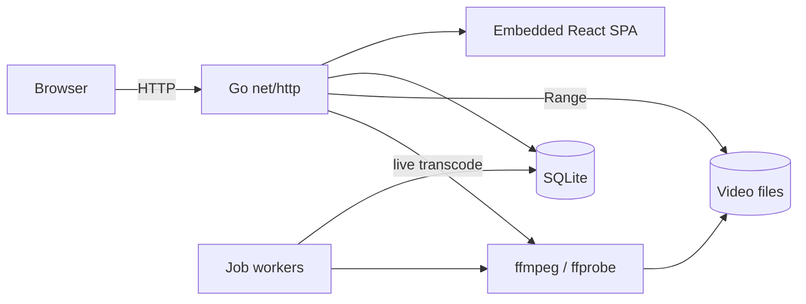
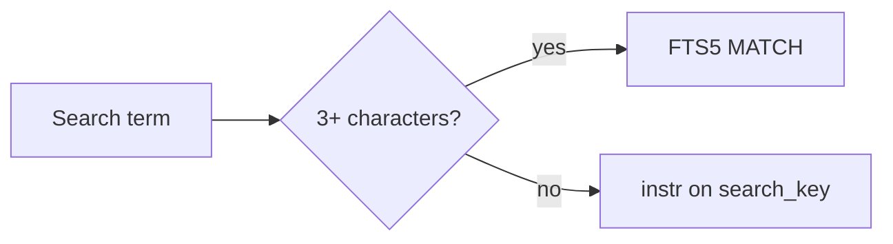

# Technology selection: MDM (Media Data Management)

VVMDM is one Go binary that indexes video files and plays them in a browser;
this document records which technology each layer uses and why. Feature and
data boundaries are in [`ARCHITECTURE.md`](../../ARCHITECTURE.md).

The binary holds every part except the media files and `ffmpeg`, which it runs
as child processes.

## 1. Premises

| Item | Decision |
| --- | --- |
| Deployment | Self-hosted on one machine: Docker on a NAS or small server |
| Client | Web browser only, on PC and smartphone |
| Video handling | Supported formats are served from the original file; others are live-transcoded per request |
| Users | One account; guests can view public videos |
| Library size | Up to tens of thousands of videos, several TB, on local disk |

## 2. Selection criteria

The system serves one user on their own machine, so **simple operation** and
**recovery after failure** take priority over throughput.

1. **One process in one container.** No always-running middleware (Redis, a
   message broker, a separate DB server).
2. **Rebuildable index apart from user data.** A scan restores the index from
   the video files; it cannot restore playback positions or credentials
   ([data classification](../../ARCHITECTURE.md#rebuildable-and-user-data)).
3. **Boundaries enforced by tools.** Lint stops the domain layer from depending
   on HTTP, the DB or `ffmpeg`.
4. **Heavy processing inside a boundary.** Code that runs `ffmpeg` stays in an
   adapter, apart from HTTP and storage.

## 3. Decisions

| Layer | Choice | Main reason |
| --- | --- | --- |
| Backend language | Go (version in `go.mod`) | A single binary; the standard library covers a resident process and child processes; small memory use on a NAS |
| HTTP server | Standard `net/http` (Go 1.22+ `ServeMux`) | Method routing and path wildcards are built in, and `http.ServeContent` implements Range serving |
| Video delivery | `http.ServeContent` for supported formats; per-request fragmented MP4 for others | Transcoded output is not stored ([live transcoding seek](live-transcode-seek.md)) |
| Frontend | React + Vite + React Router + Tailwind CSS | An SPA whose static build is embedded in the binary with `embed` |
| API contract | OpenAPI 3.1 as source; Go from `oapi-codegen`, TypeScript from `openapi-typescript` | Type drift between the two languages becomes a compile error |
| DB | SQLite (`modernc.org/sqlite`, no CGO, WAL mode) | Cross-compiles as a static binary for a small alpine image |
| Queries | Hand-written SQL through `database/sql` | SQL, including FTS5, stays the primary source |
| Migrations | `goose`, migrations in an `embed.FS` | The binary applies them with no external tool |
| Full-text search | SQLite FTS5 (`tokenize='trigram'`) | Substring search of Japanese with no added tokenizer or search engine |
| Media analysis | `ffprobe` / `ffmpeg` through `os/exec`, timeout via `context` | No wrapper, so arguments and failure reasons stay explicit |
| Authentication | Username and password (Argon2id, `golang.org/x/crypto/argon2`) + HttpOnly cookie session stored in SQLite | Enough for one user; public exposure needs an HTTPS reverse proxy |
| Asynchronous work | SQLite job table + goroutine workers, stopped via `context` | No separate process or broker; jobs resume after a restart |
| Logging | `log/slog` with the JSON handler | Structured logs with no added dependency |
| Tests | Go `testing` + `net/http/httptest` + Playwright | Only end-to-end tests show that playback starts |
| Lint | `golangci-lint` with `depguard` | CI rejects imports across layers |
| Distribution | Docker (multi-stage, alpine + `ffmpeg`) + Compose; on Windows, a zip of `VVMDM.exe` and `ffmpeg` on each GitHub Release ([Windows desktop app](windows-app.md#distribution)) | Without CGO the binary runs on alpine and cross-compiles for Windows; the zip needs neither Docker nor an `ffmpeg` install |

Package responsibilities and dependency direction are in
[ARCHITECTURE.md](../../ARCHITECTURE.md#intended-dependency-direction). SQLite
holds both the index and user data; the
[data classification](../../ARCHITECTURE.md#rebuildable-and-user-data) tells
them apart during recovery.

The content key identifies a video across a move or rename: SHA-256 of the
first and last 1 MiB plus the file size. It needs no full read and only the
standard library.

## 4. Rejected alternatives

| Candidate | Reason rejected |
| --- | --- |
| TypeScript / Node.js backend | Range serving and process management would be hand-written, and `better-sqlite3` needs native rebuilds |
| Python + FastAPI | Heavy distribution, and a resident worker plus dependency management cost too much for self-hosting |
| Echo / Gin / Fiber | The standard `ServeMux` is enough; Fiber is not `net/http`-compatible and would lose `ServeContent` |
| GORM / ent / `sqlc` | SQL, including FTS5, is kept as written rather than abstracted or generated |
| `mattn/go-sqlite3` | Needs CGO, which complicates cross-compilation and alpine builds |
| PostgreSQL | A separate container and backup procedure for a single-account deployment |
| Meilisearch / Elasticsearch | Better search quality, but a resident process; FTS5 trigram is practical at tens of thousands of items |
| SvelteKit | A strong candidate; React won only on ecosystem and future staffing |
| Bulk HLS transcoding at startup | Large storage and CPU cost; per-request live transcoding replaces it |
| Redis + an external job queue | Each stage processes one item at a time, which a SQLite table and goroutines handle |
| S3 / MinIO | Conflicts with local disk as the source of truth and adds a relay to Range serving |
| Adopting Jellyfin / Plex | This repository is built from scratch by design; they serve only as feature references |

## 5. Known risks and mitigations

| Risk | Mitigation |
| --- | --- |
| Two languages for frontend and backend | `api/openapi.yaml` generates both sides, so drift is a compile error; `task build` runs SPA build, embed and Go build as one task |
| FTS5 trigram misses short terms | Search routes by term length (below) |
| Unicode normalization of file names | Only display names and search strings are normalized to NFC; real paths keep the file system's spelling, because on Linux a normalized path can name a different, missing entry |
| I/O saturation during a large scan | Analysis, thumbnails and previews each run one item at a time; progress is counted from the `jobs` table and sent over `/api/events` |

Trigram `MATCH` cannot match a term of two characters or fewer, so each search
term takes one of two paths
([`internal/store/search.go`](../../internal/store/search.go)).

