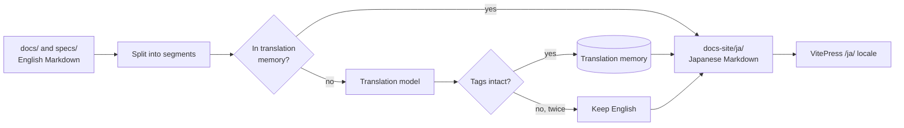

# Documentation translation pipeline

The documentation site publishes the English source under `/` and a Japanese
edition under `/ja/`. The Japanese edition is generated by
[scripts/translate](../../scripts/translate/) and a translation model; nobody
writes Japanese documents by hand.

| | |
| --- | --- |
| **Status** | Current |
| **Code** | `scripts/translate/`, `scripts/internal/mdslug/`, `docs-site/.vitepress/config.mts`, `.github/workflows/docs.yml` |
| **Entry points** | `task docs-translate`, the `Docs site` workflow |

## Context

- The documents are written in technical English
  ([writing-style.md](writing-style.md)). The maintainer and many readers
  prefer Japanese.
- A general chat model paraphrases, drops sentences and adds explanation. A
  model trained only for translation does not, but it follows no instructions,
  so it cannot be told to keep Markdown intact.
- Documents change a few paragraphs at a time. Re-translating whole files on
  every push wastes requests and rewrites text that did not change.

## Design

1. `scripts/translate` lists the tracked Markdown under `docs/` and `specs/`
   (except `docs/templates/`) and the site's home page.
2. It splits each document into segments: a paragraph, a list item, a table
   cell, a heading, a blockquote, or a front-matter display string. Code
   blocks, HTML comments and HTML blocks are copied unchanged.
3. Inline Markdown that must survive is replaced by tags before translation:
   code spans, URLs and HTML become `<x0/>`, and link text is wrapped as
   `<a1>text</a1>` with the target held back. The model sees plain prose.
4. A segment found in the translation memory is reused. Others go to the model.
   A reply that drops, repeats or reorders a tag is rejected; after two
   rejections the segment stays English.
5. The output mirrors the source tree under `docs-site/ja/`. Each page starts
   with a note linking the English original.

### Links and anchors

| Link in the source | In the Japanese page |
| --- | --- |
| Another translated document (`hosting-vv.md#setup`) | Unchanged: the mirrored tree keeps relative paths valid. |
| Anything else relative (image, source file) | Re-anchored to the original location, which the site then serves or sends to GitHub. |
| A heading anchor | Kept English: each translated heading carries `{#english-slug}`, so `#anchor` links work in both editions. |

### Backends

Both backends speak the OpenAI-compatible HTTP API, which vLLM, Ollama,
llama.cpp and most hosted services serve.

| `VV_TRANSLATE_PROVIDER` | Endpoint | Model family | Glossary |
| --- | --- | --- | --- |
| `plamo` | `/completions` | PLaMo Translate (`pfnet/plamo-2-translate`), a translation-only model | Not sent: the model takes no instructions. |
| `chat` (default) | `/chat/completions` | Any chat model, including translation-tuned ones such as TranslateGemma | Matching entries of [glossary.tsv](../../docs-site/i18n/glossary.tsv) are added to the instruction. |

| Variable | Meaning |
| --- | --- |
| `VV_TRANSLATE_BASE_URL` | API base, e.g. `http://localhost:8000/v1` |
| `VV_TRANSLATE_MODEL` | Model name the server expects |
| `VV_TRANSLATE_API_KEY` | Bearer token; empty for a local server |

### Where the memory lives

| Run | Memory | Requests |
| --- | --- | --- |
| Pull request | Read from the `translation-memory` branch | None (`-offline`). New prose shows in English on the preview build. |
| Push to `main` | Read, updated, and force-pushed back as a single commit | Only new or changed segments |
| Local `task docs-translate` | `docs-site/.translation/ja.json` (ignored by git) | Only when `VV_TRANSLATE_*` is set; otherwise offline |

Entries no document uses any more are dropped on every run, so the memory
tracks the current documents.

## Decisions

### D-1: Translate segments, not files

| | |
| --- | --- |
| **Decision** | The unit of translation and of caching is one paragraph, item, cell or heading. |
| **Why** | An edit re-translates only the prose it touched, and a translation-only model gets input the size it was trained on. |
| **Rejected** | Whole files: every edit re-translates the file and the model must preserve Markdown it does not understand. Diff-based patching: fragile when a paragraph moves. |

### D-2: Protect Markdown with tags and reject broken replies

| | |
| --- | --- |
| **Decision** | Code, URLs and link targets never reach the model; tags stand in for them and are checked on return. |
| **Why** | A mistranslated sentence is visible; a mangled link or command is silently wrong. Rejection keeps the English text instead. |
| **Rejected** | Asking the model to keep Markdown: works with some chat models, never with a translation-only model. |

### D-3: Keep the memory off `main`

| | |
| --- | --- |
| **Decision** | CI stores the memory on the orphan `translation-memory` branch and the generated pages are not committed. |
| **Why** | No generated Japanese enters the source tree that agents read, and no bot pull request follows every documentation change. |
| **Rejected** | Committing `docs-site/ja/`: doubles the documents agents search. `actions/cache`: evicted after 7 days without use, which forces a full re-translation. |

### D-4: Pull requests build offline

| | |
| --- | --- |
| **Decision** | Pull request builds use the stored memory and make no requests. |
| **Why** | Pull requests from forks get no secrets, and a preview build must not spend the translation budget. |
| **Rejected** | Translating on every pull request: cost scales with pushes, not with merged changes. |

## Limits

| Limit | Effect | Workaround |
| --- | --- | --- |
| Mermaid labels and code comments are not translated | Diagrams and code blocks read in English on `/ja/` | Keep labels short. |
| A segment the model keeps breaking stays English | A sentence in English inside a Japanese page | Split or simplify the source sentence; the next run retries it. |
| The first run translates everything | About 5,000 segments | `-max-new N` spreads it over several runs. |
