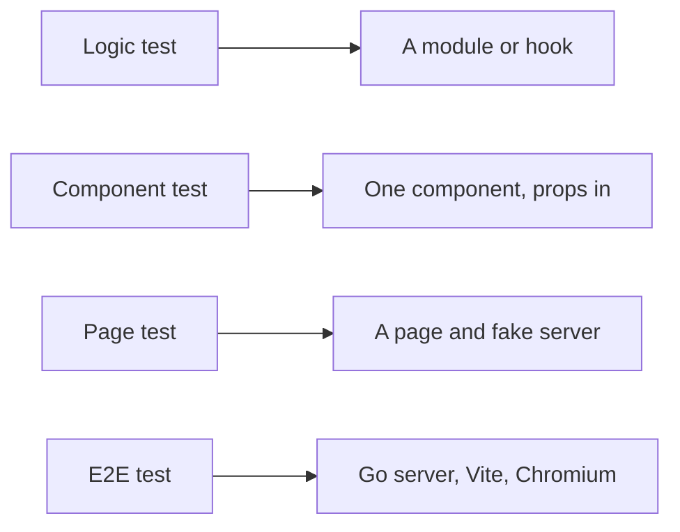
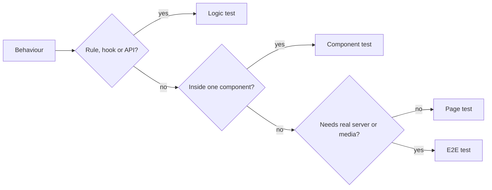

# Web test levels

A behaviour of the Web client is tested at the lowest level that fails when the
behaviour breaks. Unit tests run in Vitest with Testing Library on jsdom
(`task test-web`); browser tests run in Playwright against the real server
(`task test-e2e`).

The diagram shows the four levels and what each one renders.

## Test levels

Each level proves a different kind of behaviour, at a different cost per test.

| Level | Proves | Renders | Cost per test |
| --- | --- | --- | --- |
| Logic test | A rule (ordering, filtering, validation, formatting), a hook, or an API module | Nothing, or a hook through `renderHook`; `fetch` stubbed where the module calls it | 0.01 s |
| Component test | What one component shows and emits for given props | That component inside its providers | 0.10 s |
| Page test | A flow across components, request ordering, focus moving between parts, URL state | A `*Page` component with `fetch` replaced by a fake server | 0.35 s |
| E2E test | What only the real server, browser and media show: playback, setup and login, scanning | The app from the Vite development server in Chromium, against the built Go server | Seconds; runs only on a push to `main` |

The costs are the mean worker time per test in a full Vitest run.

E2E does not cover the production Vite build or its embedding in the Go binary:
`task test-web` builds the SPA, and no test serves that build.

## Choosing the level

Pick the first level in the diagram whose test fails when the behaviour breaks.

A page test also fails when a rule or a component breaks, but it costs about 35
times a logic test and its failure does not point at the broken part. A rule
that only a page test can reach is a sign the rule lives inside the page
component; [Rules out of pages](#rules-out-of-pages) covers that case.

| Behaviour | Level |
| --- | --- |
| Tags sorted by name compare by natural sort key, then by id | Logic ([`tagPageRows.ts`](../../web/src/tags/tagPageRows.ts)) |
| A name already used by a tag shows the catalog's reason, not the server's message | Logic ([`tagNameField.ts`](../../web/src/tags/tagNameField.ts)) |
| Loading more videos sends the previous response's `nextCursor` | Logic ([`useVideos.ts`](../../web/src/api/useVideos.ts)) |
| A tag row that enters rename mode fills in the name, focuses and selects it | Component ([`TagRow`](../../web/src/tags/TagRow.tsx)) |
| A response that arrives after a newer request does not replace the newer rows | Page |
| Focus returns to the next row after a delete | Page |
| A video starts playing after a seek | E2E |

## Page tests

A page test covers one flow, and the variations of a rule inside that flow are
logic or component tests. A page with many flows shares its fake server and
helpers through a module under `web/src/testing/`, as the tag admin screen does
with [`tagsPage.tsx`](../../web/src/testing/tagsPage.tsx), and splits its tests
into files by topic.

Vitest runs the files of one CI shard in parallel and runs the tests of one file
in order, so one long file sets the shard's duration
([development.md](../how-to/development.md#validate-changes)).

## Rules out of pages

A rule a page computes moves to a pure module next to the page, and the page
test keeps one case that shows the page uses it. Which empty state the tag admin
screen shows is such a rule: it lives in
[`tagListView.ts`](../../web/src/tags/tagListView.ts) with logic tests, and the
component that renders each empty state has a component test.

## Existing tests

Existing page tests stay until their page changes. A change to a page moves the
tests of the rules it touches to the lower level, in the same pull request;
there is no separate rewrite.

| Rejected | Why |
| --- | --- |
| Every behaviour as a page test | 0.35 s per test, and a failure names the page rather than the broken rule |
| Snapshot tests of rendered markup | A snapshot fails on every markup change and does not state the behaviour |
| `isolate: false` or Testing Library's `defaultHidden` to speed page tests up | Tests share module state, or role queries also match hidden elements, so a test can pass on what the user cannot see |
| Rewriting the existing page tests at once | Thousands of lines of churn with no behaviour change; moving tests with each page change spreads the cost |
