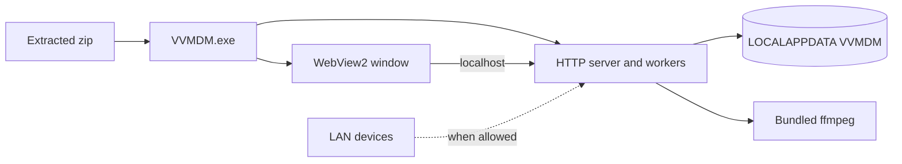
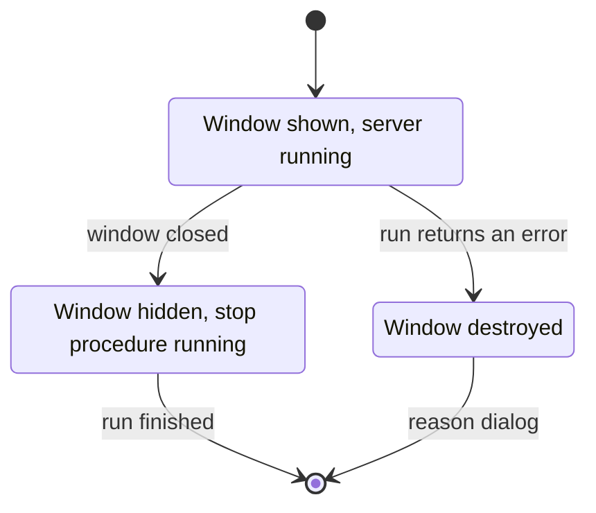
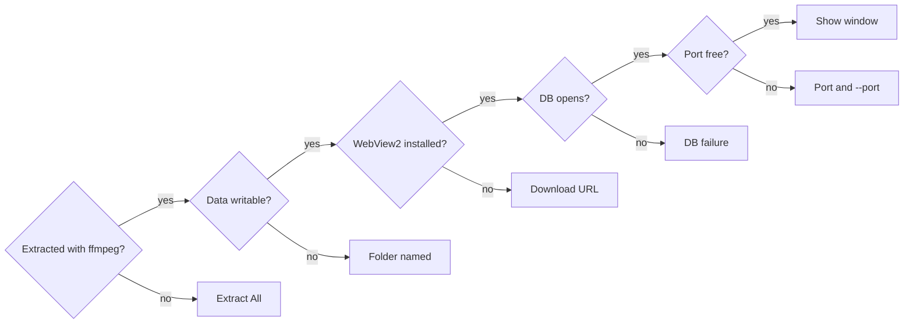
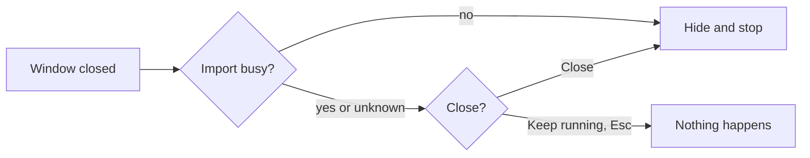
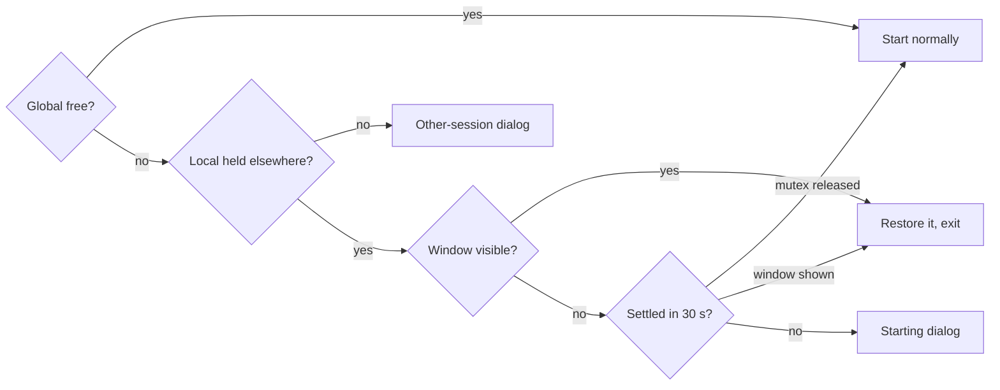
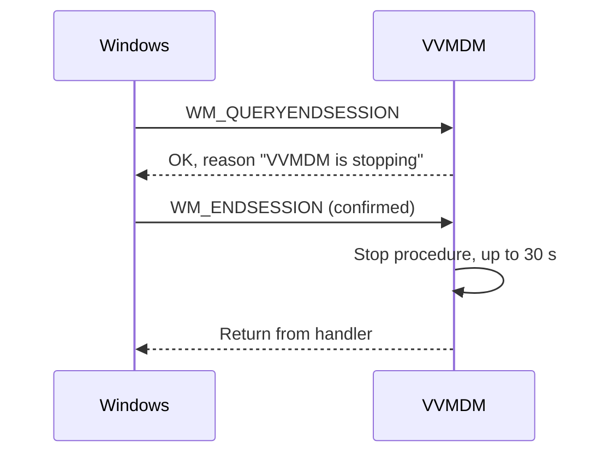
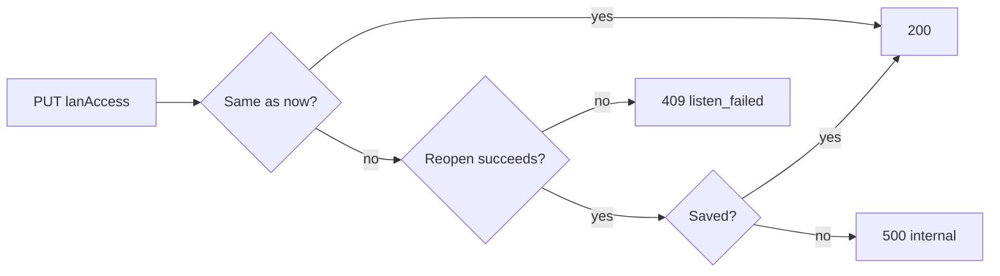
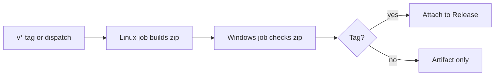

# Windows desktop app (VVMDM.exe)

On Windows, VVMDM runs its server and UI in one GUI process, `VVMDM.exe`,
built from `cmd/mdm` with the `desktop` build tag; the Windows-specific parts
live in [`internal/desktop`](../../internal/desktop).
Background: [specs/037-windows-app/](../../specs/037-windows-app/plan.md)
(parent Issue #653); zip contents, startup arguments, dialog texts and data
locations: [contracts/windows-app.md](../../specs/037-windows-app/contracts/windows-app.md).
The Docker and direct-run forms are in
[running-vv.md](../how-to/running-vv.md).

The exe hosts the same HTTP server as a direct run; a WebView2 window is just
another client of it.

## Process and window

`cmd/mdm` stays the only composition root: the desktop entry point
(`cmd/mdm/desktop_windows.go`, `//go:build windows && desktop`) and the
untagged server entry point call the same start and stop procedure `run`,
and the desktop build compiles out environment variables and `mdm account`.

The build is a GUI exe
(`GOOS=windows GOARCH=amd64 CGO_ENABLED=0 go build -tags desktop -ldflags "-H=windowsgui" ./cmd/mdm`),
so no console window appears. `internal/desktop` owns the Win32 window,
WebView2, dialogs, the job object and the data location, and imports no other
`internal/*` package (the depguard sibling rule).

Startup runs in this order; the window appears only once the listener exists,
so it is never blank.

| Aspect | Behaviour |
| --- | --- |
| Listener | `127.0.0.1:<port>`, or `0.0.0.0:<port>` when [LAN access](#connections-from-the-lan) is on |
| Port | `47880` by default; `--port <1-65535>` changes it |
| Other arguments | "Unusable argument" dialog, then exit |
| Forwarding headers | Ignored, as with `MDM_TRUSTED_PROXIES=none`; no proxy sits in front |
| Window | Win32 window, title `VVMDM`, class `VVMDMWindow`, embedding `go-webview2` `pkg/edge` |
| Page | `http://localhost:<port>/`; the cookie, same-origin and "open in default app" checks work as in a direct run |
| Initial size | 1280×800 scaled for DPI; shrunk to fit the primary work area and centred |
| Video full screen | Borderless `WS_POPUP` over its monitor; the previous placement returns on exit |
| Renderer crash or hang | The page reloads |
| Browser process ends | Unrecoverable-error dialog, then the stop procedure |

Closing the window and `run` failing end the process along one path:

| Rejected | Why |
| --- | --- |
| A new `cmd/vvmdm` with composition in `internal/server` | Two composition roots, or 3,500 lines of composition moved ([research.md](../../specs/037-windows-app/research.md) R-1) |
| A launcher exe starting `mdm.exe` as a child | A GUI parent cannot send a graceful stop to a console child (R-1) |
| `jchv/go-webview2` high-level API, Wails, Edge `--app=`, Electron, Tauri | Each cannot receive the close action, changes the asset origin, or adds a runtime (R-2) |

## Data and ffmpeg

Data lives in the per-user `%LOCALAPPDATA%\VVMDM` (`FOLDERID_LocalAppData`),
never next to the exe, and the bundled `ffmpeg` comes first on `PATH`.

Users set no environment variables and install no `ffmpeg`. The zip is
replaced on each update and may sit in `Program Files` or a read-only share,
so writing next to the exe would lose data or fail.

| Item | Rule |
| --- | --- |
| `data\` | Same contents as `MDM_DATA_DIR` (`mdm.db`, `thumbnails\`); no `MDM_*` variable is read |
| `webview2\` | WebView2 user data |
| `logs\vvmdm.log` | Existing JSON format; each start moves the previous log to `vvmdm.1.log` and deletes the older one |
| `PATH` | `<exe folder>\ffmpeg` is prepended, so the bundled build wins over an installed one |
| `ffmpeg`/`ffprobe` processes | Started with `CREATE_NO_WINDOW` in every form of the app |
| Job object | Joined first with `JOB_OBJECT_LIMIT_KILL_ON_JOB_CLOSE`, so a killed process leaves no transcoding `ffmpeg`; a failure to join is logged and startup continues |

| Rejected | Why |
| --- | --- |
| Data next to the exe, or in `%APPDATA%` (Roaming) | Lost when the zip is replaced, or large generated files sync at every sign-in (R-5) |
| `ffmpeg`/`ffprobe` paths as settings in `internal/media` | The desktop app is the only caller, and the change would spread (R-11) |

## Startup failures

Before showing the window, the app runs these checks in order and shows only
the first failure in a `MessageBox` (title `VVMDM`, OK only, English text),
then exits ([`internal/desktop` `Message*`](../../internal/desktop/messages.go)).

A GUI exe has no standard output, so a silent exit would look like nothing
happened.

The first check fails when `VVMDM.exe` runs from the temporary folder (as a
long path) or `ffmpeg\ffmpeg.exe` and `ffmpeg\ffprobe.exe` are missing beside
it; opening the exe inside the zip in Explorer causes this. Every message
names the log location, except the data-folder one, where the log cannot be
written.

The DB and port checks happen inside `run`, which tags its error with the
failing stage (`startupStage`) without changing the error text, so the server
entry point's output stays the same. Any other failure, before or after the
window appears (`ffmpeg` not on `PATH`, an unrecoverable WebView2 error, a lost
listener), shows a summary and the log location.

| Rejected | Why |
| --- | --- |
| A failure page in WebView2 | Cannot show when the WebView2 Runtime is missing or fails to initialise (R-10) |

## Closing, second launch and sign-out

The app asks before a close that would interrupt an import, lets only one
instance per user and data location run, and stops without asking when
Windows ends the session.

A user may not know closing interrupts an import (parent Issue requirement 6),
and two instances would open the same DB (requirement 7). On sign-out Windows
does not wait for a confirmation.

Closing asks only when an import is busy: a scan running, or a job `queued` or
`running` (`app.Scans.Busy`). Live transcoding does not resume, so it is not
counted.

The question is a TaskDialog titled `VVMDM`, "Import is in progress", saying
the import resumes on the next start, with buttons `Close` and `Keep running`
(default). TaskDialog needs Common Controls v6, selected by the exe manifest;
without it the same text is a Yes/No `MessageBox`, default No.

A second launch is detected with two named mutexes, taken first thing at
startup before the log and DB open: `Local\` (per session), then
`Global\VVMDM-<user SID>-<hash of the data location>` with the DACL
`D:P(A;;GA;;;<SID>)`. Both are held until exit, so the owner of `Global\`
always holds `Local\`.

To test `Local\`, the app releases its own and checks again. A missing window
means the other process is stopping or not yet shown.

Sign-out and shutdown follow the session-end messages:

The reason is set with `ShutdownBlockReasonCreate` and removed if the end is
cancelled. If the process dies before stopping, the scan restart and
`RequeueRunningJobs` on the next start resume the work.

| Rejected | Why |
| --- | --- |
| `beforeunload` or a confirmation in the SPA | The close action does not reach WebView2, or the window cannot close before the SPA loads or after a renderer failure (R-7) |
| Only a `Local\` mutex, a lock file, or a port conflict | Allows the same DB across sessions, is left behind by a kill, or cannot be told from another program's port (R-6) |
| Refusing in `WM_QUERYENDSESSION` to confirm | Windows moves on without waiting (R-8) |

## Connections from the LAN

LAN access is off by default and switches by reopening the listener on
`0.0.0.0` or `127.0.0.1`, so while it is off no TCP connection from the LAN is
possible and the first start shows no Windows Firewall dialog (parent Issue
requirements 8 and 9, acceptance criterion 7).

The setting is the key `desktop.lan_access` in the existing `settings` table;
anything but `true`, or no row, means off, and no migration is added. `run`
reads it after the DB migrates and before the jobs and listener start; a read
failure is a DB-stage [startup failure](#startup-failures).

The owner switches it with `GET`/`PUT /api/settings/network`
(`lanAccess`, `port`, `addresses`), behind the same authentication and
same-origin boundary as `/api/settings/transcoding`
([contracts/network-settings-api.md](../../specs/037-windows-app/contracts/network-settings-api.md)).
Outside the desktop app the route answers `404` `not_found`, and the SPA hides
the Network section.

A switch is serialised by a lock and saves only after the listener reopens
([`NetworkSettings.SetLANAccess`](../../internal/app)):

On `409` and `500` the listener returns to the previous address and the stored
value is unchanged. Saving ignores the request's cancellation, so a cancelled
request cannot leave the listener and the stored value apart. The same
`http.Server` serves the new listener, so open connections (this request, the
`/api/events` stream, video in delivery) survive; after access is turned off,
new LAN connections are refused at the TCP level.

| Case | `addresses` |
| --- | --- |
| Access on | One `http://<address>:<port>/` per non-loopback IPv4 address of each interface that is up |
| Access off | Empty |
| Interfaces unreadable | Empty; access stays on and the failure is logged |

| Rejected | Why |
| --- | --- |
| Always listen on `0.0.0.0` and drop LAN connections while off | The firewall dialog appears on the first start (R-14) |
| Add a `0.0.0.0` listener beside `127.0.0.1` | A wildcard and a specific address on one port depend on Windows socket options (R-14) |
| A settings file in the data location | A second storage mechanism (R-14) |

## Distribution

A `v*` tag publishes `VVMDM-<version>-windows-amd64.zip`, with `ffmpeg`
bundled, to the GitHub Release; the exe is not code-signed, and `windows/amd64`
is the only target.

Users need a download that works alone and updates by replacement (parent
Issue requirements 1, 2 and 10), while CI otherwise publishes only the Docker
image on a push to `main`.

| Item | Rule |
| --- | --- |
| `<version>` | Tag without the leading `v`, or `sha-<12 characters>` without a tag; a numeric `a.b.c.d` also goes into the exe version information |
| Zip layout | One folder of the same name: `VVMDM.exe`, `README.txt`, `ffmpeg\` (`ffmpeg.exe`, `ffprobe.exe`, `LICENSE.txt`, a `README.txt` with version and source) |
| READMEs | CRLF line endings for Notepad; the top one covers extracting, SmartScreen, data location and updating |
| Build | `task build-windows-app`; writes the zip to `dist/` |
| Exe manifest | Per-monitor v2 DPI and Common Controls v6, from `cmd/mdm/winres/` through `go-winres` (pinned in `tools/go.mod`) |
| `.syso` | Generated during the build and deleted afterwards, never committed |
| FFmpeg source | `GyanD/codexffmpeg` `essentials_build` zip at the version and SHA-256 pinned in `scripts/build/windows_app.go` |
| FFmpeg cache | `dist/cache/`, re-hashed on each use; a mismatch deletes it and fails with expected and actual hashes |
| Hardware encoders | NVENC and QSV as in [hardware-encoding.md](hardware-encoding.md); no AMF |
| Windows check | Layout, and `ffmpeg -hide_banner -encoders` lists `h264_nvenc` and `h264_qsv`; GPU transcoding is checked on real hardware ([quickstart.md](../../specs/037-windows-app/quickstart.md)) |
| Release | Created when missing, the zip replaced when present |
| SmartScreen | Steps in `README.txt` and [running-vv.md](../how-to/running-vv.md#windows-app) |

The `.syso` would otherwise enter every `cmd/mdm` build for the same
`GOOS`/`GOARCH`. The Windows runner has no GPU, so CI stops at the encoders
being compiled in. Workflow: `.github/workflows/windows-app.yml`.

| Rejected | Why |
| --- | --- |
| A zip on every push to `main` | No user-facing version boundary (R-13) |
| `windows/arm64` too | No pinnable arm64 `ffmpeg` exists, and the x64 exe runs under emulation (R-13) |
| `ffmpeg` from BtbN/FFmpeg-Builds | No fixed Release per version, so a pin cannot be fetched later (R-12) |
| Committing the `.syso` | The untagged `mdm.exe` would get the icon and manifest, and the version information would go stale |
