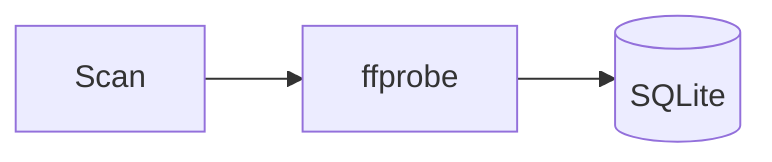

# Writing style for repository documents

Every document in this repository is written in technical English. The
Japanese edition of the documentation site is generated from the English
source by a translation pipeline
([translation-pipeline.md](translation-pipeline.md)); nobody writes or edits
Japanese documents by hand.

| Rule | Why |
| --- | --- |
| One language, English | One source of truth, no drift between editions, and fewer tokens for agents that read the docs as context. |
| Technical register | Short declarative sentences survive machine translation. Rhetorical prose does not. |
| Shape before prose | A reader scans a table, a list or a diagram faster than a paragraph that carries the same facts. |

## Scope

| Applies to | Does not apply to |
| --- | --- |
| `docs/`, `specs/`, `README.md`, `ARCHITECTURE.md`, `AGENTS.md` | Code comments (they follow the file they are in) |
| `.agents/`, `.claude/agents/`, `.github/` templates | UI strings (the catalog in `web/src/i18n/` owns them) |
| New parent Issue bodies and PR bodies | Quoted user data, such as a Japanese file name in a test fixture |

Japanese text inside a code span or a fenced block is allowed, because it is
data, not prose. `task check-docs` enforces the rest
([scripts/sddguard](../../scripts/sddguard/)).

## Sentences

- Lead with the fact or the decision. Put the reason after it.
- One claim per sentence. Aim for 25 words or fewer.
- Use the present tense and the active voice: "The worker retries twice", not
  "Retries will be performed".
- Name the thing. Write `internal/media` or `GET /api/videos`, not "the
  relevant module" or "the endpoint".
- Use the same term for the same thing across the whole repository. The
  glossary in [docs-site/i18n/glossary.tsv](../../docs-site/i18n/glossary.tsv)
  lists the product terms and their fixed Japanese renderings.
- Write numbers with units (`2 s`, `360 px`, `100 MB`).

## Words to cut

These add length without adding a fact. A reviewer removes them on sight.

| Pattern | Examples | Replace with |
| --- | --- | --- |
| Filler openers | "It is important to note that", "Note that", "Basically" | Delete; state the fact. |
| Inflated verbs | "leverage", "utilize", "facilitate", "empower" | "use", "let", "allow" |
| Vague praise | "robust", "seamless", "comprehensive", "powerful" | The measurable property, or nothing. |
| Hedging stacks | "may potentially", "could possibly" | One modal, or none. |
| Signposting | "In this section we will", "As mentioned above" | A heading, or a link. |
| Summary echoes | "In summary", "Overall", a closing paragraph that repeats the list | Delete. |
| Empty contrast | "not just X, but Y", "X is more than Y" | State Y. |

## Choosing the shape

Pick the shape from the content, not from habit.

| The content is | Use |
| --- | --- |
| Three or more items that share the same attributes | A table, one row per item |
| Steps a reader performs in order | A numbered list with one action per step |
| Independent facts or constraints | A bulleted list |
| A flow, a state machine or a sequence across components | A Mermaid diagram, plus a short list for what the diagram cannot show |
| A decision | The decision record block below |
| A command, a request or a file excerpt | A fenced block with a language tag |
| A warning the reader must not miss | A `> [!WARNING]` or `> [!NOTE]` alert |

Limits that `task check-docs` enforces on English prose:

| Limit | Value | Fix when exceeded |
| --- | --- | --- |
| Words in one prose paragraph | 90 | Split it, or turn the parallel parts into a list or a table. |
| Words in one bulleted or numbered item | 70 | Split the item, or move the detail to a sub-list. |
| Consecutive prose paragraphs without a list, table, block or heading | 4 | Add a heading, or restructure. |

### Decision record

Every decision in a design doc, a `plan.md` or a `research.md` uses this block.
The heading carries the decision itself, so the table of contents reads as a
list of decisions.

```markdown
### R-3: The domain layer picks the encoder; the app layer caches it

| | |
| --- | --- |
| **Decision** | `domain.PickEncoder` chooses from the saved setting and the probe results. `app.TranscodeSettings` keeps the result in memory. |
| **Why** | The choice is a pure function of two inputs, so it belongs in `domain` and needs no I/O in tests. |
| **Rejected** | Choosing inside `internal/media`: it would couple the ffmpeg adapter to the settings store. |
```

### Diagrams

Use Mermaid in a fenced `mermaid` block. GitHub and the documentation site both
render it. Keep node labels short and in English; the translation pipeline
translates them. Draw only what the text relies on.



## Headings

- Headings are noun phrases or decisions, not questions.
- The H1 is the page title and is unique across the repository. The
  documentation site shows it in the sidebar.
- Changing a heading changes its anchor. Update every link to that anchor in
  the same change; `task check-docs` fails on a broken anchor.

## Document types

Each document type has a template that fixes its sections. Start from the
template, and delete a section that has nothing to say rather than filling it.

| Type | Location | Template |
| --- | --- | --- |
| Design doc | `docs/design-docs/` | [docs/templates/design-doc.md](../templates/design-doc.md) |
| How-to | `docs/how-to/` | [docs/templates/how-to.md](../templates/how-to.md) |
| Plan | `specs/<feature>/plan.md` | [.agents/skills/sdd-plan/assets/plan-template.md](../../.agents/skills/sdd-plan/assets/plan-template.md) |
| Research | `specs/<feature>/research.md` | [docs/templates/research.md](../templates/research.md) |
| Data model | `specs/<feature>/data-model.md` | [docs/templates/data-model.md](../templates/data-model.md) |
| API contract | `specs/<feature>/contracts/*.md` | [docs/templates/contract.md](../templates/contract.md) |
| Quickstart | `specs/<feature>/quickstart.md` | [docs/templates/quickstart.md](../templates/quickstart.md) |
| UI design | `specs/<feature>/ui-design.md` | [docs/templates/ui-design.md](../templates/ui-design.md) |
| PR body | GitHub | [.github/pull_request_template.md](../../.github/pull_request_template.md) |

The PR body of an SDD stage copies the key points of the artifact it adds, so a
reviewer can judge the stage without opening the files. The format is in
[.agents/skills/issue-handoff/references/pr-digest.md](../../.agents/skills/issue-handoff/references/pr-digest.md).
