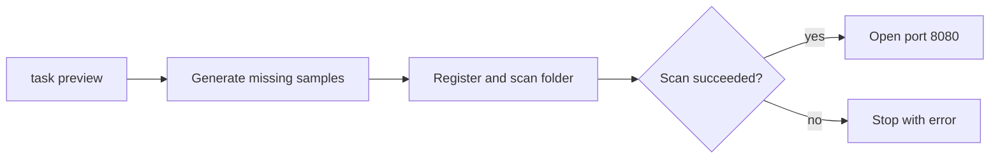
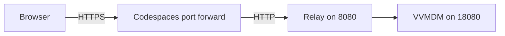
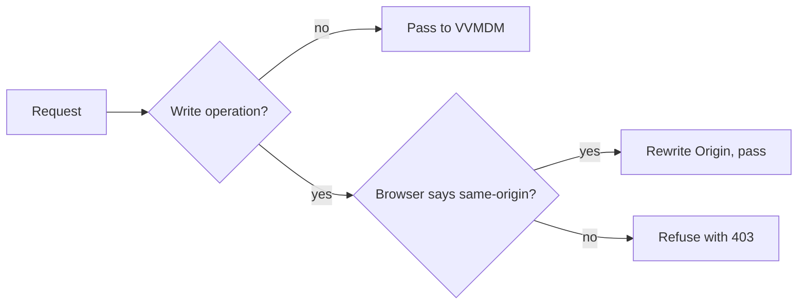

# Check a PR in Codespaces

Opening a PR's branch in GitHub Codespaces starts VVMDM with sample videos
already scanned, so you can try the change in the browser. Each Codespace is
disposable and belongs to one PR.

## Steps

1. On the PR page, choose **Code → Codespaces → Create codespace on `<branch
   name>`**.
2. Wait for the first build, which installs ffmpeg and the Go and Node
   dependencies in a few minutes.
3. Use the browser tab that opens on port 8080 when the build finishes and
   `task preview` starts. If no tab opens, use the globe icon of `VVMDM` in the
   **Ports** tab.
4. After new commits land on the PR, run `git pull`, stop the preview with
   Ctrl+C, and start it again:

   ```sh
   mise exec -- task preview
   ```

Reopening the Codespace runs `task preview` again; if the previous instance is
still running, it prints the URL and exits.

## What the preview contains

Each start of `task preview` prepares the library before opening port 8080.



| Path or item | Content |
| --- | --- |
| `.local/preview/media/` | Sample videos made by `ffmpeg` in varied formats, including ones the browser cannot play |
| `.local/preview/data/` | The database and thumbnails; delete `.local/preview/` to start from scratch |
| Scan on every start | Completes the library even after an interrupted scan or added files |
| Your own videos | Drag the files into the Explorer, then add that folder on the Settings screen |

`task preview` also runs locally as is; it needs ffmpeg.

## Visibility

Keep the forwarded port **Private**, the Codespaces default, so only your GitHub
account can open it; VVMDM itself asks for account authentication. **Do not
change it to Public.**

Codespaces terminates HTTPS and forwards plain HTTP, so VVMDM's same-origin
check would reject every write with `403`. `task preview` therefore runs VVMDM
on `127.0.0.1:18080` and a relay on port 8080.



The relay decides per request as follows.



Writes from another site or without an `Origin` never reach VVMDM. The relay
does not rewrite Host, because VVMDM treats a loopback Host as a local
operation. Because every request reaches VVMDM from the loopback address,
the loopback-only "open file" feature is disabled in the preview (`DISPLAY` is
not passed).

## Cost

Personal accounts have a monthly free Codespaces quota. Delete a Codespace you
are done with at <https://github.com/codespaces>; a stopped one still uses
storage quota. Check the free quota and spending limits in GitHub under
**Settings → Billing and licensing**.
