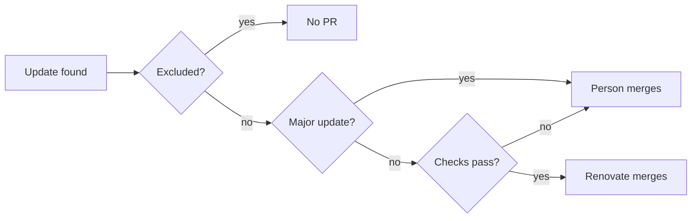

# Handle dependency updates (Renovate)

The [Renovate](https://docs.renovatebot.com/) GitHub App opens dependency update
PRs according to `renovate.json`; the intent behind that configuration lives
here.

## What Renovate does

Renovate decides per update whether it merges the PR itself.

- PRs open early every Monday morning (JST) in 6 groups: Go modules, web npm,
  tools npm, GitHub Actions, mise tools and container images. Vulnerability fix
  PRs open at any time.
- Minor, patch, pin, digest and lockfile maintenance updates are merged
  automatically once the required `Checks` and `Browser E2E` checks pass.
  The Docker image runs on the push to `main` after the merge.
- A person reads the breaking changes of a major update before merging it.
- GitHub Actions are pinned to commit hashes, with the tag name in a comment
  (the `config:best-practices` default).
- Base images in `Dockerfile` are pinned as `tag@sha256:digest`; when the
  content behind a tag changes, Renovate opens a digest update PR.

## Excluded dependencies

| Dependency | Treatment | Reason |
| --- | --- | --- |
| `golang` / `node` images in `Dockerfile`; `go` / `node` in `mise.toml` | Version updates are excluded; digest updates of the `Dockerfile` images stay in scope | The runtime version must match the `go` line in `go.mod`, so a person changes them together |
| `task` and `jq` in `mise.toml`; `alpine` in `Dockerfile` | In scope, in the mise tools and container images groups | — |
| FFmpeg bundled in the Windows zip (`ffmpegVersion` and `ffmpegSHA256` in `scripts/build/windows_app.go`) | Raised by a person ([Raise the bundled FFmpeg version](#raise-the-bundled-ffmpeg-version)) | Renovate does not read these constants |
| Dependabot security updates | Disabled in the repository settings | Renovate's `vulnerabilityAlerts` does the same job |

The exclusion uses `matchDepNames`, not `matchPackageNames`, because the mise
manager names `go` as `golang/go` and `node` as `nodejs`, while the dependency
name is shared by both managers.

## Raise the bundled FFmpeg version

The Windows zip bundles Gyan.dev's essentials build
(`ffmpeg-<version>-essentials_build.zip`) from the GitHub Releases of
`GyanD/codexffmpeg`, pinned by version and SHA-256
([Windows desktop app distribution](../design-docs/windows-app.md#distribution)).
Raise it in one PR:

1. Check that the new release has `ffmpeg-<version>-essentials_build.zip` and
   that its SHA-256 matches the `.sha256` value at
   <https://www.gyan.dev/ffmpeg/builds/>.
2. Change `ffmpegVersion` and `ffmpegSHA256` in `scripts/build/windows_app.go`.
   On a mismatch, `task build-windows-app` fails and prints the expected and
   actual values.
3. Build the zip with `task build-windows-app` and check the version in its
   `ffmpeg/README.txt`.
4. After the merge, check that the `Windows app` workflow run on `main` passes,
   which confirms the bundled `ffmpeg` has `h264_nvenc` and `h264_qsv`.

When `ffmpeg` changes encoder names or arguments, update
[hardware-encoding.md](../design-docs/hardware-encoding.md) and
`internal/media` to match.

## Update the vendored shadcn skill

The shadcn CLI is the `shadcn` devDependency in `web/package.json`, which
Renovate updates with the web npm group. The shadcn skill in
`.agents/skills/shadcn/` is a copy that Renovate does not read; refresh it in
one PR:

1. Copy `skills/shadcn/` from the new commit of
   [shadcn-ui/ui](https://github.com/shadcn-ui/ui), without `evals/`.
2. Replace every `npx shadcn@latest`, `pnpm dlx shadcn@latest` and
   `bunx --bun shadcn@latest` with `npm --prefix web exec shadcn --`, and update
   the commit in `.agents/skills/shadcn/VENDORED.md`.
3. Run `task test-web`; `vendoredSkill.test.ts` fails while `shadcn@` remains.

## Renovate PRs that need a person

- A PR left open has a CI failure, a conflict, or is a major update; Renovate's
  Dependency Dashboard Issue lists them.
- To pause an update, close the PR (the same version is not opened again) or set
  `enabled: false` in `packageRules` in `renovate.json`.

## Changing the configuration

Validate with `npx --package renovate renovate-config-validator` before pushing.
