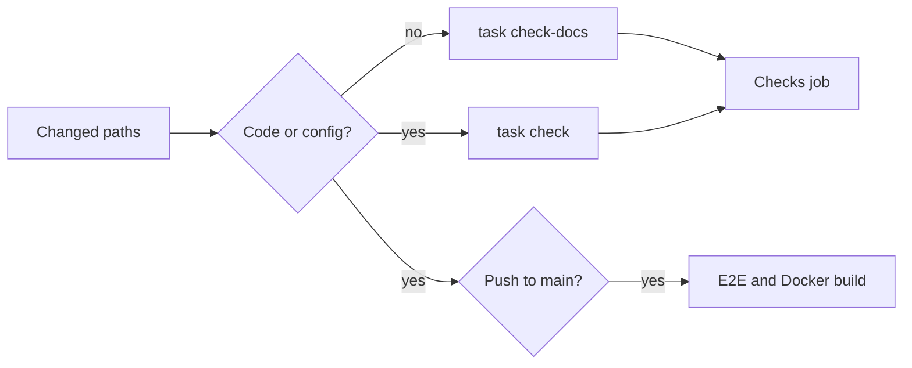

# Development

## Set up the toolchain

Go, Node.js and Task versions are pinned in `mise.toml`. `ffmpeg`, Docker, Git
and bash are system dependencies, checked by `task doctor`.

```bash
mise trust
mise install
mise exec --command "task setup"
mise exec --command "task doctor"
```

`task setup` is the only task that installs npm dependencies. On Windows, stop
a running development server before repeating it, because native dependency
files may be locked.

## Run locally

```bash
mise exec --command "task dev"
```

Open <http://localhost:5173>. The command starts the Go server with automatic
restart and the Vite development server.

| Setting | Effect |
| --- | --- |
| `MDM_ADDR` | Go listen address and the default Vite API proxy target |
| `MDM_API_TARGET` | Vite API proxy target, when it differs from `MDM_ADDR` |
| `MDM_DATA_DIR` | Data folder; a Go binary started directly on Windows needs an absolute path with the drive letter (`task dev` supplies one) |

## Validate changes

```bash
mise exec --command "task check"
```

`task check` runs formatting checks, static analysis, unit tests,
generated-file checks, migration checks and the Windows build check. Before
every push, run it for a code or configuration change and `task check-docs` for
a change to Markdown, `docs/` or `specs/`; a skipped run tends to come back as a
formatting or lint fix from CI. `task fmt` rewrites Go and Web sources into the
checked format.

Lint findings are fixed in the code, never silenced: `task check` fails on any
`//nolint` comment in Go sources (`scripts/nolintguard`) and on any
`eslint-disable*` or other inline ESLint configuration comment in `web/`
(`linterOptions.noInlineConfig`).

Browser tests are a separate command:

```bash
mise exec --command "task test-e2e"
```

`task help` lists every command; `Taskfile.yml` is the supported entry point
for developer commands.

CI picks its jobs from the changed paths and reports through the required
`Checks` job.



"No" means only Markdown, `docs/` or `specs/` changed. A push to `main` is a
merged pull request, so browser E2E and the Docker image build never run on a
pull request.

When the OpenAPI contract changes, edit `api/openapi.yaml` (or
`api/external-v1.yaml` for the external API) and run `task generate`. Never edit
`internal/httpapi/gen/`, `internal/httpapi/extgen/` or `web/src/api/gen/`
directly.
