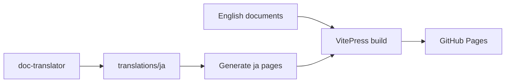

# Work with the documentation site

The documents in `docs/`, `specs/` and `ARCHITECTURE.md` are published to GitHub
Pages on every merge to `main`, in English at <https://syudead.github.io/vv/>
and in Japanese under <https://syudead.github.io/vv/ja/>. Agent instructions
(`.agents/`, `.claude/`), `AGENTS.md` and the root `README.md` are not
published. The design behind the Japanese pages is in
[japanese-translation.md](../design-docs/japanese-translation.md).

Both languages are built from the repository as follows.



The `doc-translator` subagent writes `translations/ja/`; the build generates
the Japanese pages from it into `ja/` (not version controlled).

## Prerequisites

- `task setup` has installed the `docs-site/` dependencies.

## Preview the site locally

1. Start the development server:

   ```bash
   mise exec --command "task docs"
   ```

2. Open the printed URL (<http://localhost:5174/vv/>). Edits to a document show
   at once.

The sidebar is built when the server starts, so restart `task docs` after
adding or removing a document or changing its first heading.

`task docs-build` builds as CI does, into `docs-site/.vitepress/dist/` (not
version controlled). A document without a translation shows its English text
under an "untranslated" notice.

## How publishing works

`.github/workflows/docs.yml` runs on every pull request and push to `main` that
touches published paths, `translations/` or `docs-site/`. It tests the
translation tools, checks the translations and builds the site; on `main` it
also deploys. Repository Settings → Pages must have Source set to "GitHub
Actions".

## Translate a changed document

Translate after the English of the change is final, in the same pull request.

1. Hand the changed paths to the `doc-translator` subagent (for example,
   "translate `docs/how-to/docs-site.md`"). It writes
   `translations/ja/<path>` and runs `stamp` on it.
2. For a deleted or renamed document, name both paths; the subagent deletes or
   moves the translation.
3. Run the check, then commit the translations with the change:

   ```bash
   mise exec --command "task docs-test"
   ```

Never edit a translation by hand. Fix the English source, or the
[translation rules](../design-docs/japanese-translation.md#translation-rules),
and translate again.

### Commands

| Command | What it does |
| --- | --- |
| `node docs-site/translate/ja.mjs stamp <path>...` | Pins each heading's English anchor, records the source hash, and checks the structure |
| `node docs-site/translate/ja.mjs check` (`task docs-test`) | Fails on a broken translation or one whose source is gone; warns on a stale one |
| `node docs-site/translate/ja.mjs status` (`task docs-ja-status`) | Lists published documents whose translation is stale or missing |

### What readers see

| Situation | What the reader sees | What fixes it |
| --- | --- | --- |
| The English document changed after its translation | The old translation with an out-of-date notice | Translating the document again |
| A document without a translation | The English text with a not-translated-yet notice | Translating the document |
| The English document was deleted or renamed | No Japanese page at the old path; `check` fails | Deleting or moving the translation |

## Writing notes

- Link between documents with relative paths. A `README.md` becomes its
  directory's index page (`/docs/how-to/`).
- Links to files outside the published set (code, configuration, root
  documents other than `ARCHITECTURE.md`) point at GitHub on the site.
- A broken link fails the build. `http://localhost:…` examples are allowed.
- Heading anchors follow GitHub's rules, so the same `#anchor` works on GitHub
  and on the site. Japanese pages keep the English anchors.
- Write documents to [writing-quality.md](../design-docs/writing-quality.md).

## Configuration

The site configuration is `docs-site/.vitepress/config.mts`.

`docs-site/package.json` overrides vite to 6.4.3 because VitePress 1.6.4
depends on vite 5 and esbuild 0.21, which have known vulnerabilities
(GHSA-4w7w-66w2-5vf9 and others) that no stable VitePress release fixes. Remove
the override when a fixed VitePress is released.
