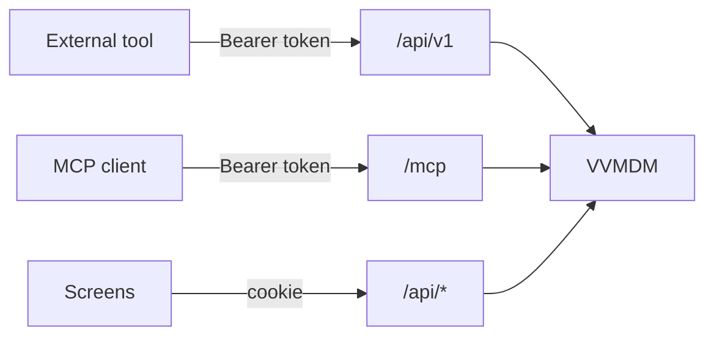
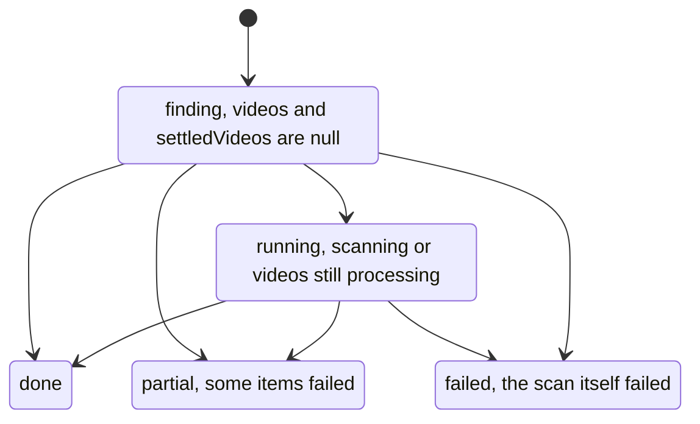
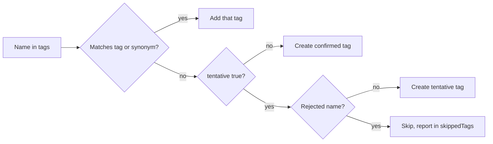
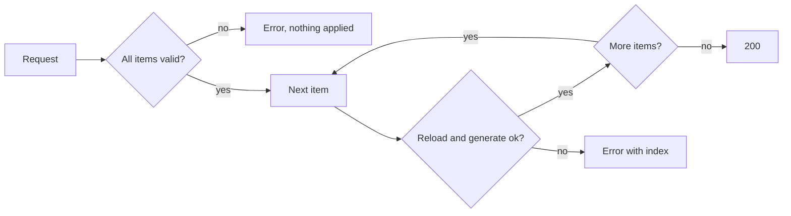
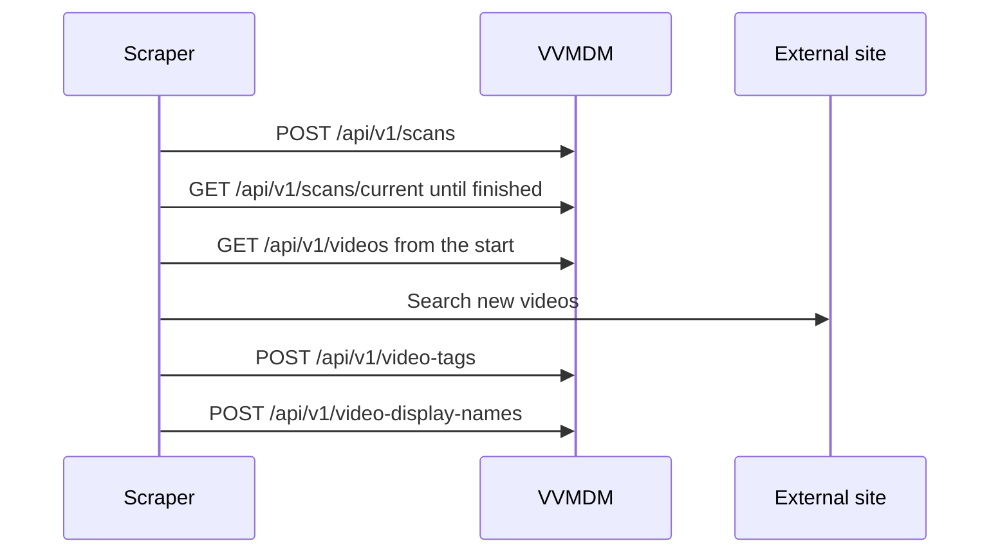

# Use the external API

With an API token, an external tool such as a scraper reads the video list,
starts scans, and sets tags, display names and cover thumbnails through
`/api/v1` or the MCP server at `/mcp`. Reasons behind the decisions are in
[specs/026-external-api/research.md](../../specs/026-external-api/research.md).

External tools use only `/api/v1` and `/mcp`; the screens' `/api/*` changes
without notice.



## Contract

[api/external-v1.yaml](../../api/external-v1.yaml) (OpenAPI 3.1) is the source
of truth for the operations, the fields, and the error `code` and `reason`
values. The server does not serve it. The screens' contract is
[api/openapi.yaml](../../api/openapi.yaml).

## Compatibility policy

| Change | Where it goes |
| --- | --- |
| A new field, operation, `code` or `reason` | Added to `v1`; clients skip values they do not know |
| A changed meaning, type or requiredness, or a removed operation | A new `v2`; `v1` stays unchanged |

## Create a token

1. Sign in as the owner, open the "API tokens" section of the Settings page,
   enter a name for the token's purpose, and create the token.
2. Copy the plaintext token (47 characters starting with `vvt_`) now. It is
   shown only once; if you lose it, revoke it and create a new one.
3. Revoke tokens you no longer use in the same section. Changing the username
   or password (`mdm account`) revokes every token.

A token has the owner's rights, including reading private videos; store it like
a password.

## Call the API

Send `Authorization: Bearer <token>` with every request; cookies are not read.

```sh
BASE=http://localhost:8080
TOKEN=vvt_...

curl -H "Authorization: Bearer $TOKEN" "$BASE/api/v1/tags"
curl -H "Authorization: Bearer $TOKEN" "$BASE/api/v1/videos?limit=100"
curl -X POST -H "Authorization: Bearer $TOKEN" "$BASE/api/v1/scans"
curl -H "Authorization: Bearer $TOKEN" "$BASE/api/v1/scans/current"
```

| Case | Behaviour |
| --- | --- |
| Token missing, malformed, invalid or revoked | `401` (`code: unauthenticated`) with `WWW-Authenticate: Bearer`; the cause is not distinguished |
| Request sends `Origin` | Accepted; there is no same-origin check |
| Operation takes a body | Requires `Content-Type: application/json` |
| Token revoked during a request | The request is cut off |

- The error body is `{ code, message, reason?, limit?, index? }`. `message` is
  English text; branch on `code` and `reason`.
- The token list on the Settings page shows the last-used time, updated at most
  once a minute.

## Scans

`POST /api/v1/scans` takes no body. It returns `201` when it starts a scan,
`200` with the running scan when one is already running, and `409`
(`media_folders_not_configured`) when no media folder is registered.

`GET /api/v1/scans/current` returns the latest scan, or `404` (`no_scan`) if
none has run. Its `status` moves as follows; the scan has finished in `done`,
`partial` or `failed`.



## Read the video list

`GET /api/v1/videos` returns the videos under registered folders, private ones
included, oldest added first (`addedAt`, then `id`). `limit` sets the page size:
default 100, 1 to 200, `400` outside that range.

The response is `{ items, nextCursor }`. Pass a non-empty `nextCursor` unchanged
as `cursor` for the next page; an empty string means the end. Do not parse the
cursor. An unparsable cursor returns `400` (`invalid_cursor`); start again from
the beginning.

```sh
cursor=""
while :; do
  page=$(curl -s -G -H "Authorization: Bearer $TOKEN" "$BASE/api/v1/videos" \
    --data-urlencode "cursor=$cursor")
  echo "$page" | jq -c '.items[]'
  cursor=$(echo "$page" | jq -r '.nextCursor')
  [ -z "$cursor" ] && break
done
```

| Case | Behaviour |
| --- | --- |
| New videos after a scan | Not tracked; read the list again from the start |
| Videos added, removed or moved while paging | The next request still succeeds; videos can be missed or repeated |
| A video removed | It disappears from the list; no field reports the removal |
| A video left only outside registered folders | Treated as removed |

To check whether a video you hold still exists, [look it up](#look-up-one-video);
`404` (`video_not_found`) means it is gone.

| Field | Meaning |
| --- | --- |
| `locations` | Current locations under registered folders, ordered by path; the first is the primary location |
| `title` | `displayName` when set, otherwise `fileTitle`, derived from the primary location's file name |
| `displayName` | The display name; `null` when unset |
| `thumbnailPositionMs` | Cover thumbnail position in milliseconds; `null` when unset |
| `durationMs` | `null` before analysis |
| `tags.manual` | Tags added by hand |
| `tags.fromFolder` | Tags derived from ancestor folder names |
| `tags.tentative` | Tentative tags ([Add tags as tentative tags](#add-tags-as-tentative-tags)) |
| `updatedAt` | Last edit of display name, tags, visibility or cover thumbnail, including through this API; equals `addedAt` if never edited; a request that changes nothing leaves it |
| `fileCreatedAt` | Creation time of the primary location's file; its mtime when the file system has none |

## Look up one video

`GET /api/v1/videos/lookup` takes exactly one of `id`, `contentKey` and `path`;
none or more than one returns `400`. The response has the shape of a list item.

```sh
curl -G -H "Authorization: Bearer $TOKEN" "$BASE/api/v1/videos/lookup" \
  --data-urlencode "path=/media/videos/clip.mp4"
```

- `path` is compared byte for byte, without normalization. For names spelled in
  NFD (as on macOS), pass `locations[].path` from the list unchanged.
- A video that does not exist, or has no location under a registered folder,
  returns `404` (`video_not_found`).

## Tag videos

`POST /api/v1/video-tags` adds, removes or replaces tags, by name, on several
videos in one request.

```json
{ "videos": [{ "path": "/media/videos/clip.mp4" }, { "contentKey": "…" }, { "id": 12 }],
  "action": "add",
  "tags": ["猫", "ねこ"] }
```

Every action changes only hand-added tags; `fromFolder` tags stay.

| `action` | Effect |
| --- | --- |
| `add` | Adds the named tags, creating a tag for an unknown name |
| `remove` | Removes the named tags; an unknown name does nothing |
| `replace` | Makes the hand-added tags exactly `tags`, creating unknown names; an empty `tags` removes them all |

| Item | Rule |
| --- | --- |
| `videos` element | Exactly one of `id`, `contentKey`, `path`, resolved as in [lookup](#look-up-one-video) |
| `videos` count | 1 to 20000, else `400` `too_many_videos` with `limit` |
| `tags` | Names or synonyms; names resolving to one tag merge; up to 100, at least 1 for `add` and `remove`, else `400` `too_many_tags` with `limit` |
| Tag name errors | `400` `tag_name_empty`, `tag_name_control_characters` or `tag_name_too_long`, `index` in `tags` |
| Body size | At most 32 MiB (33554432 bytes), else `400` `invalid_request`; split requests with many long paths |
| Unknown video | `404` `video_not_found`, `index` in `videos` |

- The response is `{ items: [{ video: { id, contentKey }, tags }], skippedTags }`,
  one item per video in the order of `videos`, with tags after the operation in
  the list item's shape.
- The request runs in one transaction: on any error it applies nothing and
  creates no tag.
- Repeating a request leaves the state unchanged and returns `200`, so resend it
  as is after a network failure.

### Add tags as tentative tags

`"tentative": true` makes the tags that `add` and `replace` newly create
**tentative tags**. The screens show them as tentative until the user confirms
or rejects them on the Tags page.

```json
{ "videos": [{ "path": "/media/videos/clip.mp4" }],
  "action": "add",
  "tags": ["猫", "高画質"],
  "tentative": true }
```

`tentative` is a boolean, default `false`; any other value returns `400`
(`invalid_request`). With `remove` it changes nothing. Each name in `tags`
resolves as follows.



- An existing tag keeps its tentative or confirmed state.
- A rejected name matches by exact spelling. Creating it as a confirmed tag
  removes it from the rejected names.
- A skipped name does not fail the request (`200`) and is not in a `replace`
  result. `skippedTags` lists each skipped name once, normalized, in the order
  of `tags`, and is an empty array when nothing was skipped.
- Each tag in the response and in `GET /api/v1/tags` reports `tentative`.
- Confirming and rejecting tentative tags, and viewing and clearing rejected
  names, are only on the screens.

## Set display names

`POST /api/v1/video-display-names` sets or clears the display names of several
videos. A display name is shown on the screens and as this API's `title`, and is
used for sorting and search; the file is not renamed.

```json
{ "items": [{ "video": { "path": "/media/videos/clip.mp4" }, "displayName": "旅行 2024 夏" },
            { "video": { "id": 12 }, "displayName": null }] }
```

- `video` has exactly one of `id`, `contentKey` and `path`. `displayName` is
  required; `null` or a string that is empty after trimming clears it, and the
  title returns to `fileTitle`. 1 to 20000 items; the body is limited to 32 MiB.
- A display name belongs to the content (`contentKey`): it survives a move, and
  every location with the same content shows it. Several videos can share a
  name.
- The response is
  `{ items: [{ video: { id, contentKey }, title, fileTitle, displayName }] }`,
  with values after the change, in the order of `items`.
- The request runs in one transaction; any of these errors applies nothing and
  gives `index` in `items`:

  | Condition | Error |
  | --- | --- |
  | The video cannot be found | `404` (`video_not_found`) |
  | The name contains control characters | `400` (`display_name_control_characters`) |
  | The name is longer than 200 characters | `400` (`display_name_too_long`, `limit: 200`) |

## Change the cover thumbnail position

`POST /api/v1/video-thumbnails` regenerates the cover thumbnails of several
videos from the given positions.

```json
{ "items": [{ "video": { "contentKey": "…" }, "positionMs": 12500 },
            { "video": { "id": 12 }, "positionMs": null }] }
```

- `positionMs` is required: milliseconds from the start, at least 0 and less
  than the duration. `null` clears it and regenerates at the automatic position.
- A request takes 1 to 20 items, because each item generates an image; more
  returns `400` (`too_many_videos`, `limit: 20`). Send larger sets 20 at a time
  in sequence.
- The response is `{ items: [{ video: { id, contentKey }, thumbnailPositionMs }] }`.
  It returns after generation, which can take several seconds per item.

The request validates every item, then generates one item at a time in the
order of `items`, stopping at the first failure.



| Condition | Error |
| --- | --- |
| The video cannot be found | `404` (`video_not_found`) |
| No location of the video can be opened | `404` (`file_unavailable`) |
| The position is negative, or at or past the duration | `400` (`thumbnail_position_out_of_range`, duration in `limit`) |
| The video has not been analysed yet | `409` (`duration_unknown`) |
| The image cannot be generated | `409` (`thumbnail_frame_unavailable`) |
| Unexpected failure during generation | `500` |

Every error carries `index`. Because a scan can change videos during
generation, each item reloads its video and location just before generating,
so a validation error can also stop the request partway. When it stops, items
before `index` are applied, and that item and the rest are not. To continue,
fix or drop the item at `index` and resend from `index` on; resending an applied
item only regenerates it at the same position.

## Example: integrate a scraper

This flow looks up newly scanned videos on an external site and tags them with
what it finds.



1. Start a scan and wait until `status` is `done`, `partial` or `failed`
   ([Scans](#scans)).
2. Read the list from the start and treat each unrecorded `contentKey` as a new
   video. `contentKey` survives a file move, so key your records on it.
3. Search the external site by `locations[].path` or `title`. To recheck a video
   later, use `GET /api/v1/videos/lookup?contentKey=…`.
4. Add the names found with `POST /api/v1/video-tags`, one request per set of
   videos that get the same names. Send names produced automatically, such as
   by an LLM, with `"tentative": true` so the user confirms them; a rejected
   name is not created again and returns in `skippedTags`.
5. Set the official title found as the display name with
   `POST /api/v1/video-display-names`.

```sh
# 2. Pick up contentKey and the primary path from the list (paging is in "Read the video list").
curl -s -H "Authorization: Bearer $TOKEN" "$BASE/api/v1/videos?limit=200" |
  jq -r '.items[] | [.contentKey, .locations[0].path] | @tsv'

# 4. Add the tags found. Names produced automatically are created as tentative tags.
curl -X POST -H "Authorization: Bearer $TOKEN" -H "Content-Type: application/json" \
  "$BASE/api/v1/video-tags" \
  -d '{"videos":[{"contentKey":"…"}],"action":"add","tags":["猫","旅行"],"tentative":true}'

# 5. Set the title found as the display name.
curl -X POST -H "Authorization: Bearer $TOKEN" -H "Content-Type: application/json" \
  "$BASE/api/v1/video-display-names" \
  -d '{"items":[{"video":{"contentKey":"…"},"displayName":"旅行 2024 夏"}]}'
```

- `replace` also overwrites tags added by hand on the screens. When people use
  the screens too, send only the difference with `add` and `remove`.
- On `404`, drop the video at `index` from your records or look it up again,
  then resend.

## Use from MCP

The MCP server at `/mcp` (Streamable HTTP) exposes the same operations as tools,
with the same token.

```sh
claude mcp add --transport http vv https://vv.example/mcp --header "Authorization: Bearer vvt_…"
```

| Tool | Operation |
| --- | --- |
| `list_videos` | `GET /api/v1/videos` |
| `get_video` | `GET /api/v1/videos/lookup` |
| `list_tags` | `GET /api/v1/tags` |
| `update_video_tags` | `POST /api/v1/video-tags` |
| `start_scan` | `POST /api/v1/scans` |
| `get_current_scan` | `GET /api/v1/scans/current` |
| `update_video_display_names` | `POST /api/v1/video-display-names` |
| `update_video_thumbnails` | `POST /api/v1/video-thumbnails` |

- Tool arguments have the shape of the operation's query and body, and the
  structured result the shape of its response body. An operation error is a
  tool result with `isError: true` and the [error body](#call-the-api).
- Only `POST /mcp` is accepted, with `application/json` responses; the server
  keeps no session, so `GET` and `DELETE` return `405`.
- A missing or invalid token returns `401` with `WWW-Authenticate: Bearer`
  before MCP processing. Revoking the token cuts off tools in progress.
