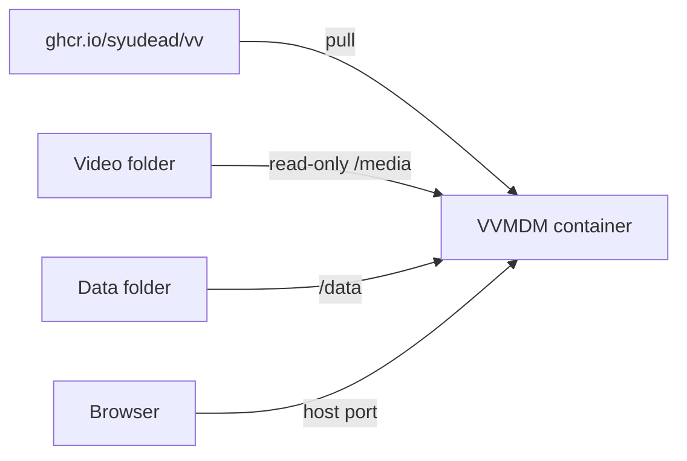

# Hosting VVMDM with the published image

On a Docker host without the VVMDM source, such as a NAS or a home server, run
the published image; nothing is built on the host. From a clone, use `task up`
instead ([Running VVMDM](running-vv.md)).

The host pulls the image and mounts two of its own folders into the container.



## Image

The CI `Docker image` job publishes `ghcr.io/syudead/vv` for `linux/amd64` and
`linux/arm64` on every merge into `main`. The package is public, so hosts pull
it without logging in.

| Tag | Points to |
| --- | --- |
| `latest` | The latest build of `main` |
| `sha-<12 chars>` | The build of that commit; use it to pin a version |

The image uses software encoding only. To use the host's GPU, run VVMDM
directly on the host ([Hardware encoding](running-vv.md#hardware-encoding)).

## Start

1. Copy [`compose.hosting.yaml`](../../compose.hosting.yaml) and change the
   lines marked `変える`:

   | Line | Set to |
   | --- | --- |
   | Left of `8080:8080` | The host port; QNAP and some other NAS use 8080 for their management page, so pick another such as `18080` |
   | Left of `:/media:ro` | A host folder high enough that every video folder you want is below it |
   | Left of `:/data` | The host folder for the database and thumbnails |

2. Create the data folder.
3. Paste the file into the NAS's container manager as a new application
   (QNAP Container Station, Synology Container Manager and similar), or save
   it as `compose.yaml` on the host and run `docker compose up -d` in its
   folder.
4. Open `http://<host>:<port>/api/health` to check that VVMDM is up.
5. Open VVMDM in a browser and finish the
   [Account setup](running-vv.md#account-setup) right away.
6. Add folders below `/media` in Settings and start a scan.

`MDM_LOG_LEVEL` works as in
[Runtime settings](running-vv.md#runtime-settings). A reverse proxy on the NAS
or the home network works without further settings; read
[Network exposure](running-vv.md#network-exposure) before making VVMDM
reachable from the internet.

## Update

1. Back up the data folder ([Back up and restore](#back-up-and-restore)). A
   database migrated by a newer version may not open with an older one.
2. Pull the image again and recreate the container, in the container manager
   or with the commands below. Recreating alone reuses the image already on
   the host.

   ```bash
   docker compose pull
   docker compose up -d
   ```

The data folder survives the update, and migrations run when the new version
starts. To stay on a version or go back to one, replace `latest` in `image:`
with its `sha-` tag.

## Back up and restore

1. Stop the container, so that the SQLite database is not written during the
   copy.
2. Copy the data folder, for example with the NAS's file manager or backup
   tool.
3. Start the container again.

To restore, stop the container, replace the contents of the data folder with
the copy, and start it again. The data folder holds settings and user data
that a scan cannot recover
([Data and recovery](running-vv.md#data-and-recovery)). If it was lost
without a backup, finish a new account setup and register the media folders
again before starting a scan.
