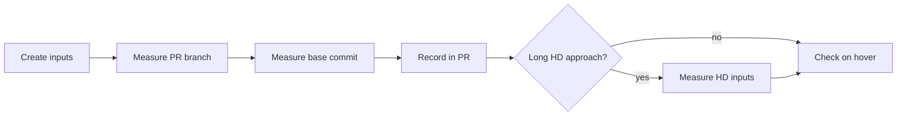

# Measure motion preview and seek thumbnail generation

A PR that changes how motion previews (hover playback on library cards) or seek
thumbnails (the preview over the player's seek bar) are generated records
wall-clock time and peak memory before and after the change, with the same
inputs on the same environment. `scripts/previewbench` runs the production
generation code; the reasoning is in
[specs/019-preview-input-seek/research.md R-4](../../specs/019-preview-input-seek/research.md#r-4-measurement-method).

The measurement runs in this order; step 4 applies only when comparing
approaches for long HD videos.



## Prerequisites

- Go and `ffmpeg` (with `ffprobe`).
- A checkout of the PR branch.

## Steps

### 1. Create the inputs

Generate the inputs from `ffmpeg`'s `testsrc2` into `.local/bench/` (git
ignores `.local/`; any folder outside the repository also works).

```sh
mkdir -p .local/bench

# 2 hours, 640x360, 30 fps, H.264 (long input; takes a few minutes)
ffmpeg -nostdin -v error -f lavfi -i testsrc2=size=640x360:rate=30:duration=7200 \
  -c:v libx264 -preset ultrafast -pix_fmt yuv420p .local/bench/long-2h.mp4

# 2 minutes, 1280x720, H.264/AAC (short input)
ffmpeg -nostdin -v error -f lavfi -i testsrc2=size=1280x720:rate=30:duration=120 \
  -f lavfi -i sine=frequency=440:duration=120 \
  -c:v libx264 -preset ultrafast -pix_fmt yuv420p -c:a aac -shortest .local/bench/short-2m-720p.mp4

# For the hover check: a portrait input with rotation metadata (90 degrees, 1 minute)
ffmpeg -nostdin -v error -f lavfi -i testsrc2=size=640x360:rate=30:duration=60 \
  -c:v libx264 -preset ultrafast -pix_fmt yuv420p .local/bench/landscape.mp4
ffmpeg -nostdin -v error -display_rotation 90 -i .local/bench/landscape.mp4 \
  -c copy .local/bench/portrait-rotated.mp4
```

`ffprobe .local/bench/portrait-rotated.mp4` prints `rotation of 90.00 degrees`
(displaymatrix) when the rotation metadata is present.

### 2. Measure

```sh
go run ./scripts/previewbench [-kind preview|seek] [-runs N] <video>
```

`-kind` is `preview` (the default, motion previews) or `seek` (seek
thumbnails). The tool runs the generation `-runs` times per input (default 2)
and prints:

| Output | Shown on |
| --- | --- |
| Wall-clock time of each run | All OSes |
| ffmpeg peak memory (the maximum over all runs) | Linux and macOS; not on Windows |
| File count and total bytes in the output directory, per run | `-kind seek` only |

The tool deletes its output after each run. A missing input or an ffmpeg
failure prints the reason and exits with a non-zero code.

Peak memory is the maximum over all finished child processes, so **run each
input separately**: with several inputs in one run, a later input carries the
earlier input's value.

Measure before and after back to back on the same environment. When the base
commit has no `scripts/previewbench`, copy the PR branch's program into a
worktree of the base commit.

```sh
# After (the PR branch)
go run ./scripts/previewbench .local/bench/long-2h.mp4
go run ./scripts/previewbench .local/bench/short-2m-720p.mp4

# Before (the PR's base commit)
bench="$PWD/.local/bench"
git worktree add ../vv-before <base commit>
cp -r scripts/previewbench ../vv-before/scripts/   # only when the base lacks it
(cd ../vv-before && go run ./scripts/previewbench "$bench/long-2h.mp4")
(cd ../vv-before && go run ./scripts/previewbench "$bench/short-2m-720p.mp4")
git worktree remove --force ../vv-before
```

Times vary with the disk cache, so report the first and second run separately.

### 3. Record the results in the PR

Record the environment (OS, CPU, ffmpeg version) and, per input, the wall-clock
time of each run and the peak memory. The template is Japanese because PR
bodies are.

```markdown
環境: Linux x86_64, <CPU>, ffmpeg <版>

| 入力 | 変更前 1 回目 | 変更前 2 回目 | 変更前ピーク | 変更後 1 回目 | 変更後 2 回目 | 変更後ピーク |
| --- | --- | --- | --- | --- | --- | --- |
| 2 時間・640×360・H.264 | 00.000 秒 | 00.000 秒 | 0.0 MiB | 00.000 秒 | 00.000 秒 | 0.0 MiB |
| 2 分・1280×720・H.264/AAC | 00.000 秒 | 00.000 秒 | 0.0 MiB | 00.000 秒 | 00.000 秒 | 0.0 MiB |
```

| Case | Cell content |
| --- | --- |
| The "before" side failed (for example, out of memory) | That fact and the printed reason |
| Windows, peak columns | `測らない` (not measured) |

#### Seek thumbnails

Measure `long-2h.mp4` and `short-2m-720p.mp4` with `-kind seek`, one run per
input. The file count and total cover everything the generation wrote to the
output directory; report the total in MiB.

```sh
go run ./scripts/previewbench -kind seek .local/bench/long-2h.mp4
go run ./scripts/previewbench -kind seek .local/bench/short-2m-720p.mp4
```

```markdown
環境: Linux x86_64, <CPU>, ffmpeg <版>

| 入力 | 変更前 1 回目 | 変更前 2 回目 | 変更前ピークメモリ | 変更前ファイル数 | 変更前合計 | 変更後 1 回目 | 変更後 2 回目 | 変更後ピークメモリ | 変更後ファイル数 | 変更後合計 |
| --- | --- | --- | --- | --- | --- | --- | --- | --- | --- | --- |
| 2 時間・640×360・H.264 | 00.000 秒 | 00.000 秒 | 0 MiB | 0 | 0.0 MiB | 00.000 秒 | 00.000 秒 | 0 MiB | 0 | 0.0 MiB |
| 2 分・1280×720・H.264/AAC | 00.000 秒 | 00.000 秒 | 0 MiB | 0 | 0.0 MiB | 00.000 秒 | 00.000 秒 | 0 MiB | 0 | 0.0 MiB |
```

Where peak memory is not available (such as Windows), write `取得不可` (not
available) in the peak memory columns.

### 4. Measure long HD input-side seeking

When comparing approaches for long HD videos, add these 1080p inputs to the
360p one. They repeat a 30-second source by stream copy, so the 2 hours need no
re-encoding; the content does not reproduce real videos or NAS I/O performance.

```sh
ffmpeg -nostdin -v error -f lavfi -i testsrc2=size=1920x1080:rate=30:duration=30 \
  -c:v libx264 -preset veryfast -crf 28 -g 75 -keyint_min 75 -sc_threshold 0 \
  -pix_fmt yuv420p .local/bench/h264-hd-seed.mp4
ffmpeg -nostdin -v error -stream_loop -1 -i .local/bench/h264-hd-seed.mp4 \
  -t 7200 -c copy .local/bench/h264-hd-2h.mp4

ffmpeg -nostdin -v error -f lavfi -i testsrc2=size=1920x1080:rate=30:duration=30 \
  -c:v libx265 -preset veryfast -crf 28 -g 75 \
  -x265-params keyint=75:min-keyint=75:scenecut=0:pools=8 \
  -pix_fmt yuv420p10le .local/bench/hevc-hd-seed.mp4
ffmpeg -nostdin -v error -stream_loop -1 -i .local/bench/hevc-hd-seed.mp4 \
  -t 7200 -c copy .local/bench/hevc-hd-2h.mp4

go run ./scripts/previewbench -kind seek .local/bench/h264-hd-2h.mp4
go run ./scripts/previewbench -kind seek .local/bench/hevc-hd-2h.mp4
```

The copy can end slightly past 7200 seconds at a frame boundary, so use the
length the benchmark reads from ffprobe, not a hand-computed 7200. The
conditions that select an approach and the behaviour when frames are missing
are in the [design document](../design-docs/seek-sprite-generation.md).

## Check the result on hover

The built-in samples of `task preview` are 20 seconds or shorter, so put the
generated inputs in `.local/preview/media/`, which `task preview` scans on every
start ([Check a PR in Codespaces](codespaces-preview.md)).

```sh
mkdir -p .local/preview/media
cp .local/bench/long-2h.mp4 .local/bench/portrait-rotated.mp4 .local/preview/media/
task preview   # if it is running, stop it with Ctrl+C first, then start it again
```

After preview generation finishes, hover over the library cards:

| Input | Expected |
| --- | --- |
| 2-hour input | Scenes from start to end (see the `testsrc2` clock) play in order for about 9 seconds, silently, in a loop |
| Portrait input | It plays in portrait without a distorted aspect ratio |
