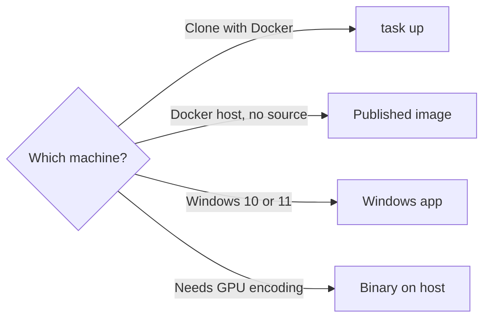
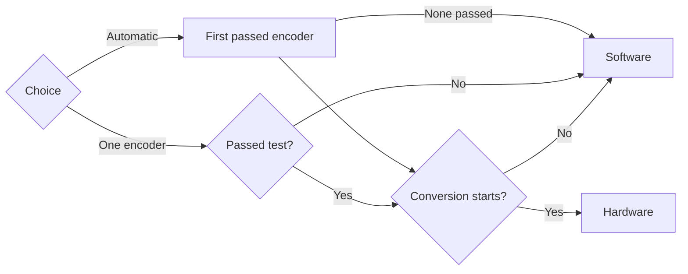
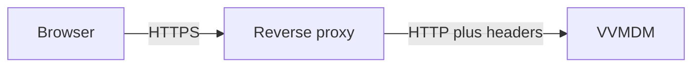
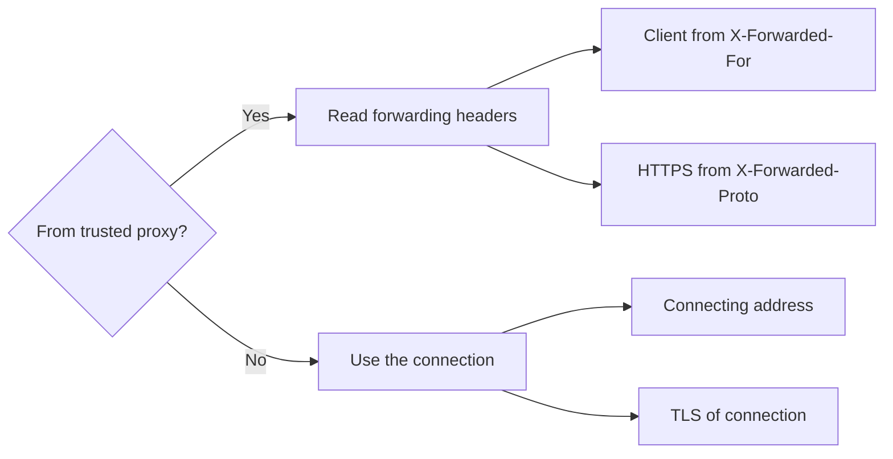

# Running VVMDM

VVMDM runs in one of four ways; pick the one that matches the machine.



| Way | Section | Hardware encoding |
| --- | --- | --- |
| `task up` from a clone | [Start the container](#start-the-container) | No |
| Published image on a NAS or home server | [Hosting VVMDM](hosting-vv.md) | No |
| Windows desktop app | [Windows app](#windows-app) | No |
| `bin/mdm` on the host | [Run VVMDM directly on the host](#run-vvmdm-directly-on-the-host) | Yes |

## Start the container

You need Task and Docker.

1. Start VVMDM from the repository root, choosing the media folder and host
   port when the defaults (`./media`, `8080`) do not fit:

   ```bash
   task up
   MDM_MEDIA_HOST_DIR=/path/to/videos MDM_HOST_PORT=18080 task up
   ```

   The media folder is mounted read-only at `/media`. Only the host side of
   the port mapping changes; VVMDM listens on 8080 inside the container.
2. Open <http://localhost:8080> (or the port you chose) and finish the
   [Account setup](#account-setup). The health endpoint is
   `/api/health`.
3. Add the mounted folder in Settings and start a scan.
4. Stop VVMDM with `task down`.

A change in a media folder (a file added, deleted, moved or renamed) is read
without a scan: VVMDM re-reads only the directories that changed, about 15 s
after the last change, and nothing is read while nothing changes
([Folder watching](../design-docs/folder-watching.md)). The full scan stays
manual, and changes made while VVMDM was stopped or auto-import was off wait
for it. Source videos are never modified, moved, deleted or converted. During
and after a scan:

- the library and player stay available while indexing continues;
- moved or renamed files keep their identity and playback position;
- files a browser cannot play stay listed and play through live conversion
  when conversion succeeds;
- titles can be searched from the first character.

## Windows app

On Windows 10 or 11 (x64), VVMDM runs as a desktop app without Docker, Go,
Node or FFmpeg. It opens in its own window and stops when the window closes.

### Get it

Download `VVMDM-<version>-windows-amd64.zip` from the
[GitHub Releases](https://github.com/syudead/vv/releases). A `v*` release is a
version; the [`nightly`](https://github.com/syudead/vv/releases/tag/nightly)
prerelease is the newest build of `main`. The zip holds
`VVMDM.exe`, a `README.txt` and an `ffmpeg` folder with `ffmpeg.exe`,
`ffprobe.exe` and FFmpeg's license and source information.

To build the same zip from source, run `task build-windows-app`. It writes
`dist/VVMDM-<version>-windows-amd64.zip`, where the version is `VERSION`
without a leading `v`, or `sha-<12 characters of the commit>` when `VERSION`
is unset.

### Start it

1. Right-click the zip and choose **Extract All**. `VVMDM.exe` run from inside
   the zip asks you to extract it first.
2. Run `VVMDM.exe` in the extracted folder. Keep the `ffmpeg` folder next to
   it; VVMDM uses that FFmpeg even when another one is installed.
3. VVMDM is not code-signed, so on the first run Windows SmartScreen may show
   "Windows protected your PC". Click **More info**, then **Run anyway**.
4. Finish the [Account setup](#account-setup) in the window, add your media
   folders in Settings and start a scan.

| Situation | What VVMDM does |
| --- | --- |
| The WebView2 Runtime is missing | Says so and where to get it (Windows 10 and 11 normally include it) |
| The port is busy or the data folder cannot be written | Shows the problem in a dialog |
| `VVMDM.exe` is run again while open | Brings the open window to the front |
| The window is closed during a scan or import | Asks first; the work resumes on the next start |

The Windows app does not read the [Runtime settings](#runtime-settings)
variables and has no `mdm account` command.

### Data

VVMDM keeps everything for the signed-in Windows user under
`%LOCALAPPDATA%\VVMDM` and writes nothing next to `VVMDM.exe`:

| Path | Contents |
| --- | --- |
| `data\mdm.db` (with `-wal` and `-shm`) | The database, the same as `MDM_DATA_DIR/mdm.db` |
| `data\thumbnails\` | Generated thumbnails |
| `webview2\` | The window's browser data, including the sign-in cookie |
| `logs\vvmdm.log`, `logs\vvmdm.1.log` | JSON logs of this run and the previous run |

To back up, close VVMDM and copy the `data` folder.
[Data and recovery](#data-and-recovery) applies here too.

### Update

1. Close VVMDM.
2. Replace the contents of the extracted folder with the new zip's contents,
   or extract the new zip to a new folder and delete the old one.
3. Start VVMDM. The data in `%LOCALAPPDATA%\VVMDM` stays, and the new version
   updates the database on start.

To remove VVMDM, delete the folder, and `%LOCALAPPDATA%\VVMDM` as well to
delete the library.

### Port

VVMDM listens on port `47880`. When another program uses it, VVMDM shows the
port in a dialog. Start on another port with `--port`, for example from a
shortcut whose target is:

```text
"C:\path\to\VVMDM-<version>-windows-amd64\VVMDM.exe" --port 47881
```

### Open it from other devices

By default VVMDM listens on `127.0.0.1` only, so only the PC running it can
open it. To allow a phone or another computer on the same network:

1. Open **Settings** as the owner and turn on **Allow connections from the
   local network** in **Network**.
2. When Windows Firewall asks, allow VVMDM on **private networks**.
3. Open one of the addresses the section lists, such as
   `http://192.168.1.20:47880/`.

The setting is kept across restarts; turning it off stops new connections from
other devices. The connection is plain HTTP, so use it only on a network you
trust. The Windows app never reads forwarding headers (it behaves as
`MDM_TRUSTED_PROXIES=none`); read [Network exposure](#network-exposure)
before putting it behind a reverse proxy.

## Subtitles

VVMDM shows subtitle files placed next to a video, named after the video
without its extension. Nothing is registered and no rescan is needed: add or
remove a file, then reopen the video's page.

| Video | Subtitle file | Listed as |
| --- | --- | --- |
| `movie.mp4` | `movie.srt` or `movie.vtt` | "Default" |
| `movie.mp4` | `movie.<label>.srt` or `movie.<label>.vtt`, such as `movie.ja.srt` or `movie.en.forced.vtt` | The label |

| Rule | Value |
| --- | --- |
| Name and extension matching | Case-insensitive |
| Same label as `.srt` and `.vtt` | Only the `.vtt` is used |
| Formats | SubRip (`.srt`) and WebVTT (`.vtt`) |
| Text encodings | UTF-8 (with or without a BOM), UTF-16 with a BOM, Shift_JIS |
| Size limit | Files over 4 MiB are ignored |
| Folders searched | Only the folder of the played file; a `Subs/` folder is not |

When a video has subtitles, the player shows a subtitles button next to the
playback speed, and `C` turns subtitles on or off. The browser remembers the
last choice, and a video with the same label starts with it turned on.

## Runtime settings

| Variable | Default | Purpose |
| --- | --- | --- |
| `MDM_ADDR` | `:8080` | Server listen address |
| `MDM_DATA_DIR` | `/data` | Absolute path for the database and generated media |
| `MDM_LOG_LEVEL` | `info` | `debug`, `info`, `warn` or `error` |
| `MDM_TRUSTED_PROXIES` | private | Reverse proxies whose forwarding headers are trusted; see [Network exposure](#network-exposure) |

Docker Compose sets these for the container. Media folders are managed in
Settings, not in a configuration file. All invalid values are reported
together at startup.

## Account setup

VVMDM has a single account, and until it exists the first person to reach the
server can create it. Right after installing, before anyone else can reach the
server, open VVMDM and choose the username and password on the setup screen.

## Changing the username or resetting the password

After setup, the username and password change only from a shell on the host.
The commands read `MDM_DATA_DIR` alone, apply migrations, do not need
`ffmpeg`, and work whether the server is running or stopped.

1. Run the command. With Docker Compose and the container running:

   ```bash
   docker compose exec mdm mdm account set-username NEW_NAME
   docker compose exec mdm mdm account set-password
   ```

   With the container stopped:

   ```bash
   docker compose run --rm mdm account set-password
   ```

2. For `set-password`, type the new password twice (echo is off). From a
   script, pipe it in; when standard input is not a terminal, the first line
   without its trailing newline is read:

   ```bash
   docker compose exec -T mdm mdm account set-password < new-password.txt
   ```

The password is never accepted as an argument or an environment variable, so
it stays out of shell history, process listings and `docker inspect`. The
username is 1 to 128 characters without control characters or leading and
trailing spaces; the password is 1 to 1024 bytes. The commands never create
the account: on an unconfigured server they change nothing and point to the
setup screen.

| Exit code | Meaning |
| --- | --- |
| `0` | Saved; every session is signed out and API tokens are revoked |
| `1` | The database could not be opened or written |
| `2` | Not configured yet, an invalid value, a mismatched confirmation, or an unknown command |

## Hardware encoding

Videos a browser cannot play are converted while they stream, with the CPU
(software encoding) by default. A GPU can encode the video part instead, which
lowers the CPU load.

Hardware encoding works only when VVMDM runs directly on the host (Windows,
Linux or macOS). The Docker image, from `task up` or
[Hosting VVMDM](hosting-vv.md), carries no GPU drivers; passing a GPU to the
container does not help, and Settings shows every hardware encoder as not
available there.

### What each encoder needs

On a direct install VVMDM bundles neither FFmpeg nor GPU drivers. It runs the
`ffmpeg` on `PATH`, so that build must include the encoder, and the host must
have the driver and the device.

| Encoder in Settings | Operating system | GPU and driver |
| --- | --- | --- |
| NVENC (NVIDIA) | Linux, Windows | An NVIDIA GPU with NVENC and the NVIDIA driver |
| Quick Sync (Intel) | Linux, Windows | An Intel GPU supported by the oneVPL GPU runtime (Iris Xe, 11th-generation Core or newer), the Intel driver and that runtime |
| VAAPI (Intel/AMD) | Linux | An Intel GPU (Broadwell or newer) or an AMD GPU with a video encoder, a VA-API driver, and access to `/dev/dri/renderD128` |
| VideoToolbox (macOS) | macOS | A Mac; the driver is part of macOS |

1. On Linux, for Quick Sync and VAAPI, give the user that runs VVMDM read and
   write access to `/dev/dri/renderD128`, usually through its group (often
   `render` or `video`):

   ```bash
   ls -l /dev/dri/renderD128
   sudo usermod -aG render "$USER"   # then sign out and in again
   ```

2. Check that the `ffmpeg` on `PATH` lists the encoder (`h264_nvenc`,
   `h264_qsv`, `h264_vaapi` or `h264_videotoolbox`). If it does not, install
   a build that includes it, for example one linked from
   [ffmpeg.org](https://ffmpeg.org/download.html).

   ```bash
   ffmpeg -hide_banner -encoders
   ```

A listed encoder does not prove the GPU works; VVMDM tests it on start
([Turn it on in Settings](#turn-it-on-in-settings)). VAAPI uses `renderD128`,
the first GPU. Consumer NVIDIA GPUs limit concurrent NVENC sessions; a
conversion the GPU refuses falls back to software.

### Run VVMDM directly on the host

1. Set up the toolchain as in
   [Development](development.md#set-up-the-toolchain).
2. Build the single binary `bin/mdm` (the SPA is embedded) from the
   repository root:

   ```bash
   mise exec --command "task build"
   ```

3. Start it with an absolute data directory (on Windows, including the drive
   letter) and any other [Runtime settings](#runtime-settings):

   ```bash
   MDM_DATA_DIR=/absolute/path/to/vv-data ./bin/mdm
   ```

4. Open <http://localhost:8080>, finish the [Account setup](#account-setup)
   and add your media folders in Settings.

### Turn it on in Settings

VVMDM tests each hardware encoder with a short encode on every start. Open
**Settings** as the owner and go to **Video conversion**:

- encoders that passed can be selected; the others show the reason, such as
  "Not supported on this server's operating system", "Not found on this
  server" or "The test encode failed";
- choose one encoder, or **Automatic**;
- **In use now** shows the encoder conversions use.

The choice is kept across restarts. Each conversion picks its encoder as
follows.



Automatic tries NVENC, Quick Sync, VAAPI and VideoToolbox in that order. When
the chosen encoder is unavailable after a restart (the driver was removed, or
VVMDM now runs in the Docker image), Settings says that software is in use.
A conversion the encoder cannot start, for example because the GPU is busy,
uses software. The startup log shows each test's result
(`transcode video encoder checks finished`), and a failed test is logged with
the end of FFmpeg's error output.

## Data and recovery

The Docker setup stores application data in the `vv_data` volume: the SQLite
database `MDM_DATA_DIR/mdm.db` and thumbnails under
`MDM_DATA_DIR/thumbnails/`. The database holds user and configuration data
that scanning cannot restore, next to an index that a scan rebuilds:

| Category | Tables and files | Recovered by |
| --- | --- | --- |
| Rebuildable index | `videos`, `video_locations`, `location_search_fts`, `jobs`, `scans`, `scan_videos`, `scan_issues`, the folder index (`folder_groups`, `folder_group_members`, `video_folder_names`, `folder_index_state`), `video_transcode_probes`, `video_successions`, `video_fingerprints`, `video_version_candidates`, and the generated thumbnails and previews | Scanning the registered media folders again |
| User data | `playback_progress`, `tags`, `tag_names`, `video_tags`, `rejected_tag_names`, `public_videos`, `video_overrides`, `video_edits`, `video_favorites`, `folder_favorites`, `video_bundles`, `video_bundle_members`, `video_version_dismissals`, `folder_group_overrides` | A backup only |
| Configuration | `account`, `media_folders`, `settings`, `api_tokens` | A backup, or setting it up again |
| Session | `sessions` | Logging in again |

User data is keyed by values a rescan reproduces (the content key, a version
bundle's key, a folder's absolute path), never by a video row's id, so it
survives a rebuild of the index. A scan cannot start until a media folder is
registered, and a lost API token has to be issued again.

Back up the **whole** `vv_data` volume, including `mdm.db`, before resetting
or updating VVMDM:

1. Stop the container with `task down`. SQLite runs in WAL mode, so a copy
   taken during writes may be inconsistent.
2. Copy the volume with your Docker volume backup tool.
3. Start again with `task up`.

`task down` keeps the volume; `docker compose down -v` deletes it.

| Situation | Recovery |
| --- | --- |
| A backup exists | Stop VVMDM, restore the volume, start VVMDM |
| The database is lost without a backup | Set up a new account, register the media folders again in Settings, scan; user and configuration data is gone |
| VVMDM stopped during a scan (`task down`, a restart, a shutdown) | The next start scans again automatically and passes quickly over files already indexed and unchanged |
| VVMDM stopped during an import | The import continues after the restart |

## Network exposure

Plain HTTP is fine on a trusted home network. To reach VVMDM from the
internet, put it behind a reverse proxy that serves HTTPS, and never expose
VVMDM's own HTTP port: over HTTP the password and session cookie travel
unencrypted.



The reverse proxy must:

- terminate HTTPS and forward to VVMDM over HTTP;
- pass `Host` through unchanged (VVMDM compares it with `Origin` to accept
  only same-origin changes, and does not read `X-Forwarded-Host`);
- set or append the client address in `X-Forwarded-For` and set
  `X-Forwarded-Proto` to `https`.

VVMDM trusts forwarding headers from loopback and private addresses by default
(`127.0.0.0/8`, `10.0.0.0/8`, `172.16.0.0/12`, `192.168.0.0/16`, `::1`,
`fc00::/7`), so a proxy on the same PC, the home network or the same Docker
network needs no setting. Set `MDM_TRUSTED_PROXIES` only to narrow this, as
CIDR ranges or single addresses separated by commas or spaces, or to `none`
to never read forwarding headers:

```bash
MDM_TRUSTED_PROXIES=172.18.0.0/16 task up
```

VVMDM decides the client address and HTTPS for each connection as follows.



From a trusted proxy, the client address is found by walking
`X-Forwarded-For` from the right to the first untrusted address, and HTTPS
comes from the last `X-Forwarded-Proto` value. A client on the internet cannot
fake either. With the default, a device on the home network can: it can claim
another address and get around the login attempt limit, so narrow
`MDM_TRUSTED_PROXIES` to the proxy's address if you do not trust every device
on the network. The `Forwarded` header (RFC 7239) is not read. Invalid entries
are reported with the other invalid settings at startup.

The client address and HTTPS decide:

- the login attempt limit and the address in authentication logs;
- the session cookie: `__Host-vv_session` with `Secure` over HTTPS,
  `vv_session` over HTTP;
- the same-origin check;
- whether "open in default app" counts as coming from the server's own PC.
  That action is refused for remote clients even when the proxy runs on the
  same PC, and also requires the connection itself to come from loopback, so
  a device on the network cannot claim `127.0.0.1` in `X-Forwarded-For`.

| Symptom | Cause | Fix |
| --- | --- | --- |
| One person's failed logins lock everyone out | The proxy's address is not trusted, so every client shares its address and one login attempt limit | Add the proxy to `MDM_TRUSTED_PROXIES`, or give it a private address |
| Every change (`POST`, `PUT`, `PATCH`, `DELETE`), including login, fails with 403 | The proxy is not trusted, so requests count as HTTP and the browser's `https://` `Origin` does not match | Same as above |

A minimal Caddy configuration, with VVMDM and Caddy in the same Docker
network:

```caddyfile
vv.example.com {
	reverse_proxy mdm:8080
}
```

Caddy obtains the certificate, passes `Host` through, and sets
`X-Forwarded-For` and `X-Forwarded-Proto` by default. Docker networks use
private addresses, so `MDM_TRUSTED_PROXIES` needs no setting.
