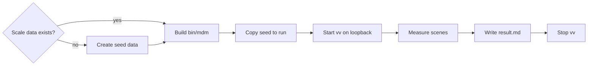
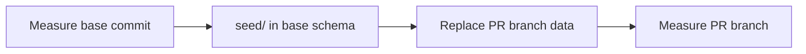

# Measure the tag admin screen with scale data

A PR that changes how the tag admin screen (`/tags`) renders records its
timings before and after the change, measured from headless Chromium against
the production build with three libraries: 1,000 tags and 10,000 videos, 3,000
tags and 30,000 videos, and 30,000 tags and 30,000 videos. What is measured and
what is expected is in
[specs/036-tag-admin-scale/quickstart.md](../../specs/036-tag-admin-scale/quickstart.md);
the reasoning for this setup is in
[research.md R-9](../../specs/036-tag-admin-scale/research.md#r-9-scriptstagsbench-builds-scale-data-and-a-playwright-script-measures-the-production-build).

The benchmark is not part of `task check`, `task test-e2e` or CI. Run it by
hand on a PR that changes how the screen renders.

## Prerequisites

- An environment where `task build` passes (Go, Node, `ffmpeg`, `ffprobe`; see
  [Local development](development.md)). The benchmark creates no video files,
  so `ffmpeg` is used only by vv's startup check.
- Playwright's Chromium for `web/` is installed (as for `task test-e2e`). Where
  it cannot be installed, pass a local Chromium with `-chromium`.

## Steps

### Measure

```sh
go run ./scripts/tagsbench -scale 1000
go run ./scripts/tagsbench -scale 3000
go run ./scripts/tagsbench -scale 30000 -videos 30000
```

Each run of `scripts/tagsbench` goes through these stages.



| Stage | Behaviour |
| --- | --- |
| Create seed data | Written to `.local/tagsbench/<data name>/seed/` only when it is missing |
| Build `bin/mdm` | `go run ./scripts/build` builds the single binary; `-skip-build` skips it |
| Copy seed to run | The measurement rewrites rows by confirming and renaming, so every run starts from a copy of `seed/` in `run/` |
| Start vv | `bin/mdm` serves the `run/` data on a free loopback port |
| Measure scenes | `web/bench/tags-admin.bench.ts` (configured by `web/bench/playwright.config.ts`) prints the table |
| Write result | The table goes to `.local/tagsbench/<data name>/result.md`; vv stops afterwards |

| Flag | Meaning |
| --- | --- |
| `-scale N` | The scale (number of tags). Required |
| `-videos N` | The number of videos (1 or more). Defaults to 10 times `-scale` |
| `-skip-build` | Use the existing `bin/mdm` without rebuilding it |
| `-chromium PATH` | A Chromium executable to use instead of Playwright's |

The seed data follows these rules:

| Property | Value |
| --- | --- |
| Videos at the 30,000-tag scale | 30,000, the same as the 3,000-tag scale, so the only difference is the number of tags (R-9) |
| Data name | The scale (`1000`) when videos are 10 times the tags; otherwise the video count is appended (`30000-videos-30000`) |
| Tags with 0 videos | 1 in 11 (about 9%); every other tag has videos |
| Tentative tags | Half of the tags |
| How rows are written | Through the public operations of `internal/store` |
| Video files | None; only location rows under the media folder `.local/tagsbench/<data name>/media/` |
| First-run time | About 1 minute at 1,000, a few minutes at 3,000, about 10 minutes at 30,000 |

To recreate the scale data, delete `.local/tagsbench/<data name>/`. Delete it
also after changing how the data is built (`planTags` in `scripts/tagsbench`).

### Compare before and after

Measure before and after back to back on the same environment. When the commit
before the change has no `scripts/tagsbench` or `web/bench/`, or an old one,
copy the PR branch's versions into a worktree and run them there.

Measure the base commit first, because the seed data only works forward across
schema versions:



`scripts/tagsbench` writes `seed/` in the schema of the `internal/store` it was
built with. vv migrates only the copy (`run/`) on each start and never
rewrites `seed/`, so a `seed/` created with the base schema works for both
sides. A `seed/` created by the PR branch's `scripts/tagsbench` (a newer
schema) does not open in the base commit's vv. Data already in the PR branch's
`.local/tagsbench` was created by the PR branch, so do not copy it to the base
side. When the copied `scripts/tagsbench` does not build against the base
commit's `internal/store` operations, adapt only the data creation part to the
base operations.

```sh
# Before (the PR's base commit) first; seed/ is created in the base schema
git worktree add ../vv-before <base commit>
cp -r scripts/tagsbench ../vv-before/scripts/   # only when the base lacks it or has an old one
cp -r web/bench ../vv-before/web/               # only when the base lacks it or has an old one
ln -s "$PWD/web/node_modules" ../vv-before/web/node_modules
(cd ../vv-before && go run ./scripts/tagsbench -scale 1000)
(cd ../vv-before && go run ./scripts/tagsbench -scale 3000)
(cd ../vv-before && go run ./scripts/tagsbench -scale 30000 -videos 30000)

# After (the PR branch); replace its data with the data the base created
rm -rf .local/tagsbench
mkdir -p .local && cp -r ../vv-before/.local/tagsbench .local/
go run ./scripts/tagsbench -scale 1000
go run ./scripts/tagsbench -scale 3000
go run ./scripts/tagsbench -scale 30000 -videos 30000
git worktree remove --force ../vv-before
```

### Record the results in the PR

Record the environment (OS, CPU, browser version) and, per scale, the value of
each scene. Scales are told apart by the column headings (1,000, 3,000,
30,000). The template is Japanese because PR bodies are.

```markdown
環境: Linux x86_64, <CPU>, Chromium <版>

| 場面 | 1,000 変更前 | 1,000 変更後 | 3,000 変更前 | 3,000 変更後 | 30,000 変更前 | 30,000 変更後 | 期待 |
| --- | --- | --- | --- | --- | --- | --- | --- |
| 開いてから最初の行が出るまで（中央値） | 0 ms | 0 ms | 0 ms | 0 ms | 0 ms | 0 ms | 1 秒以内 |
| 開いたときに受け取るタグ（items / 本文） | 0 / 0 B | 0 / 0 B | 0 / 0 B | 0 / 0 B | 0 / 0 B | 0 / 0 B | 3 つの規模で同じ（±5%） |
| GET /api/tags の応答（内訳） | 0 ms | 0 ms | 0 ms | 0 ms | 0 ms | 0 ms | — |
| 検索の 1 文字目（最長のタスク） | 0 ms | 0 ms | 0 ms | 0 ms | 0 ms | 0 ms | 0.2 秒を超えない |
| Esc での取り消し（最長のタスク） | 0 ms | 0 ms | 0 ms | 0 ms | 0 ms | 0 ms | 0.2 秒を超えない |
| 1 件の確定（最長のタスク） | 0 ms | 0 ms | 0 ms | 0 ms | 0 ms | 0 ms | 0.2 秒を超えない |
| 1 件の改名（最長のタスク） | 0 ms | 0 ms | 0 ms | 0 ms | 0 ms | 0 ms | 0.2 秒を超えない |
| スクロール（50 ms 超が続いた回数 / 最長のフレーム） | 0 / 0 ms | 0 / 0 ms | 0 / 0 ms | 0 / 0 ms | 0 / 0 ms | 0 / 0 ms | 2 つ続かない |
| まとめての確定（最長のタスク） | 0 ms | 0 ms | 0 ms | 0 ms | 0 ms | 0 ms | 0.2 秒を超えない |
```

## Read the table

The scenes are the eight in quickstart.md plus one breakdown row. Values vary
by machine and browser, so read them next to the before values measured on the
same environment rather than against the expected column.

| Scene | Value |
| --- | --- |
| Open to first row | Time from the start of navigation to `/tags` until the list's first row appears in the DOM; 3 reloads, each value and the median |
| Tags received on open | The number of `items` in the `GET /api/tags` response on open and the body size (bytes of Playwright's `response.body()`) |
| `GET /api/tags` response (breakdown) | Response time of `GET /api/tags` on open (`responseEnd` of `response.timing`) |
| First search character, cancel with Esc, confirm one, rename one, bulk confirm | The longest task (Long Task) between the action and the visible result |
| Scroll | `requestAnimationFrame` intervals while the mouse wheel scrolls the list from the top to the end, loading more on the way |

Details per scene:

- Tags received on open: the note adds the transfer size (`request.sizes()`)
  and whether `nextCursor` is present. The same count and the same size (±5%)
  at all three scales means the transfer on open does not grow with the number
  of tags.
- `GET /api/tags` response: a long response means the server side takes the
  time; a short one means rendering does
  ([quickstart.md](../../specs/036-tag-admin-scale/quickstart.md#breakdown)).
- Longest task: the browser records only tasks over 50 ms, so with none the
  value is `なし（50 ms 以下）` (none, 50 ms or less). The `〜まで` ("until …")
  values in the note include Playwright's round trip and are for reference
  only.
- Scroll: the benchmark reopens `/tags` first. It reports how many times
  frames over 50 ms came in a row and the longest frame; the note adds the
  number of loaded rows, the number of load-more requests and their response
  times. The end is reached at the bottom edge after the last page is
  rendered: `nextCursor` is exhausted and N in the column header's "Select all
  N loaded tags" reaches the tag count in the page header (in the first form
  of 036, after
  " · N loaded" next to the count disappears). When neither the position nor
  the loaded rows change for 60 seconds, scrolling stops and the note shows
  `末尾に届かず` (did not reach the end).
- Bulk confirm: the benchmark reopens `/tags`, selects every loaded tentative
  tag with "Tentative only" (inside the toolbar's "Filter", in the top bar before 038; a toggle button in
  the first form of 036) and "Select all N loaded tags" ("Select all shown
  tags" on the screen before the change), and measures from the selection
  bar's "Confirm" until the result notice ("Confirmed N tags") or "No
  tentative tags" appears. On a commit whose screen has no way to select in
  bulk, the value is `測れない` (not measurable).
