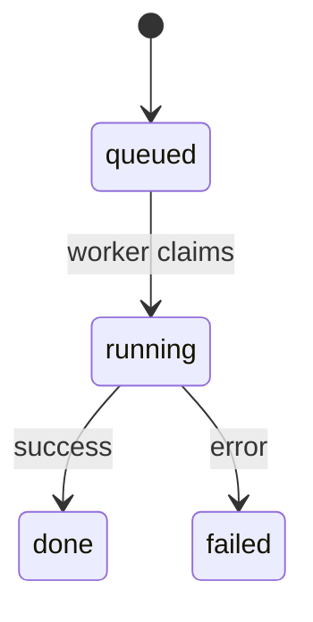

# Data model: {{Feature title}}

**Plan**: [plan.md](plan.md)

Only the entities, columns and states this feature adds or changes.

## {{Entity or table name}}

| Field | Type | Null | Meaning |
| --- | --- | --- | --- |
| `{{column}}` | `{{TEXT / INTEGER / ...}}` | {{no}} | {{What it holds and its unit.}} |

**Invariants**:

- {{A rule the store enforces, and where it is enforced.}}

## States

{{Replace the example states and events below with this feature's.}}

| State | Entered when | Left when |
| --- | --- | --- |
| `{{state}}` | {{event}} | {{event}} |

## Migration

| Migration | Change | Backfill |
| --- | --- | --- |
| `internal/store/migrations/{{NNNNN}}_{{name}}.sql` | {{What it adds or changes}} | {{How existing rows get values, or "None"}} |
