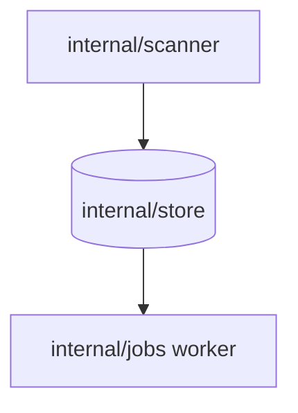

# {{Topic: a noun phrase, unique across the repository}}

{{One or two sentences: what this document decides and which code it governs.}}

| | |
| --- | --- |
| **Status** | {{Current / Superseded by [link]}} |
| **Code** | {{`internal/...`, `web/src/...`}} |
| **Origin** | {{Parent Issue or PR link}} |

## Context

- {{A constraint or a fact that forces a decision. One per bullet.}}

## Design

{{The mechanism as it works today. Prefer a diagram plus a short list over
paragraphs.}}

{{Replace the example nodes below with this design's components.}}

## Decisions

### D-1: {{The decision itself, as a sentence}}

| | |
| --- | --- |
| **Decision** | {{What was chosen.}} |
| **Why** | {{The reason specific to this repository.}} |
| **Rejected** | {{Alternative}}: {{why not}}. |

## Limits

| Limit | Effect | Workaround |
| --- | --- | --- |
| {{What does not work}} | {{What the user or operator sees}} | {{What to do, or "None"}} |
