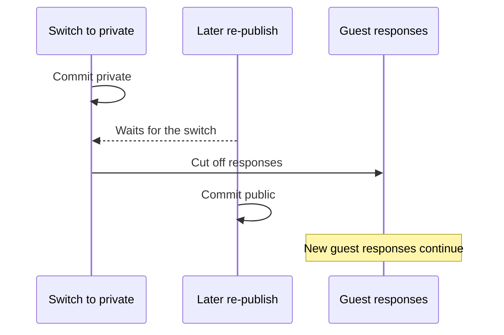

# Contract: Guest responses and the public flag API

Parent Issue: #135.

Source of truth: [api/openapi.yaml](../../../api/openapi.yaml). This document
covers only how responses differ when a "Guest too" request
([auth-api.md §1](auth-api.md#1-three-access-classes)) is handled as a guest,
and the route that switches the public flag. List parameters and response
shapes stay as in
[013 list-api.md](../../013-library-search/contracts/list-api.md) and
[014 tags-api.md](../../014-video-tags/contracts/tags-api.md); only the
differences here are added.

## 1. What guests see

Guest responses contain only public videos as defined in
[data-model.md §3](../data-model.md#3-audience-and-the-public-video-condition).
This applies to list entries and `total`, `getVideo`, related videos, folder
lists with their counts and previews, and streaming, thumbnails, seek previews,
hover previews and live transcoding (requirement 16).

These fields are removed from guest responses (requirement 18):

| Schema | For guests |
| --- | --- |
| `Video.location` (absolute path on the server) | Omitted (stays optional) |
| `Video.progress` | Omitted |
| `Video.tags` | Empty array (stays required) |
| `Video.probeError` (the `ffprobe` error text contains the file's absolute path) | Omitted |
| `FolderSummary.rootPath` (absolute path of the registered folder) | Omitted, so it changes from required to optional |

`Video.folder` (path relative to the registered folder) and
`FolderSummary.name` stay: they are the names shown on screen when browsing
folders. For guests the screen builds the registered folder's display name from
`name`, not from `rootPath`.

Video and folder `id`s and `rootId`s are the same sequential numbers as for the
owner. That the `id`s of public videos let a guest estimate the library's size
is allowed by requirement 16 of the parent Issue.

## 2. Videos hidden from guests

When `getVideo`, `getRelatedVideos`, `streamVideo`, `getVideoPreview`,
`transcodeVideo`, `getVideoThumbnail` or `getVideoSeekThumbnail`, handled as a
guest, points at a video that is not public, the response is the same as for a
nonexistent video (the existing `404 not_found` `その動画はありません`,
requirement 11). The body, headers and cache directives match the nonexistent
case.

Folders behave the same way:

- For guests, `listRootFolders` omits registered folders that contain no
  location of a public video.
- `getFolder` and `listFolderVideos` pointing at a folder that contains no
  location of a public video return the same `404` as a nonexistent folder,
  including the registered folder itself (a request without `path`). Today the
  registered folder itself always "exists"; this check is added so a guest
  cannot enumerate registered folder `rootId`s.

## 3. Conditions guests cannot use

These list conditions depend on the owner's data (playback position, tags), so
guests cannot use them.

| Condition | For guests |
| --- | --- |
| `watch` other than `all` | `400 invalid_request` |
| `sort` of `playedAsc` or `playedDesc` | `400 invalid_request` |
| `tag` | `400 invalid_request` |
| `query` | Matched against the title and relative path only, not tag names or synonyms (the matching of [014 data-model.md §7](../../014-video-tags/data-model.md#7-matching-tag-names-in-the-search-box) is removed) |

For guests the screen does not offer these options. When they remain in the
URL, the screen rounds them to the defaults before requesting.

## 4. Switching the public flag

`Video` gains a required `public: boolean`, filled by every route that returns
`Video`.

| Route | Body | Success | Errors |
| --- | --- | --- | --- |
| `PUT /api/video-visibility` | `{ videoIds, public }` | 200 `{ applied }` | 400 |

- An "Owner only" route. A single video on the details page and several videos
  in the selection bar both use it.
- The limit on the number of `videoIds`, the handling of duplicates, the
  meaning of `applied` and applying in one transaction are the same as adding
  and removing tags
  ([014 tags-api.md §4](../../014-video-tags/contracts/tags-api.md#4-adding-and-removing-tags-on-videos)).
- A video already in the requested state is not an error.
- Added to `requiresJSONBody` and the mapping in `openapi_routes_test.go`.

## 5. Cache of generated files

Successful responses for thumbnails, seek previews and hover previews drop the
current `public, max-age=31536000, immutable` (`cacheImmutable` in
`internal/httpapi/router.go`) and carry `private, no-cache` and an `ETag` for
both the owner and guests.

- `private` keeps shared caches such as reverse proxies from storing the
  owner's response and serving it to someone else.
- `no-cache` makes the browser check with the server on every use, so private
  generated files do not keep coming from the browser cache after logout or
  after a video is made private (acceptance criterion 12, Edge Case
  `非公開にした場合`). Unchanged content returns `304`, so bandwidth barely
  grows.
- The video file itself (`private, max-age=0, must-revalidate`) and live
  transcoding (`no-store`) already have the same property and do not change.

## 6. Streams when a video stops being public

When a video is made private, streaming, live transcoding and preview responses
for it that are in progress as a guest are cut off (Edge Case
`公開の動画を見ている間に非公開にした`). Lists exclude the video from the next
fetch on. Responses in progress as the owner are not cut off.

The cut-off runs only after the switch to private commits, and switches run one
at a time from commit to cut-off, so an earlier switch to private cannot cut
off a guest response started after a later re-publish
([`visibility.go`](../../../internal/httpapi/visibility.go)).

