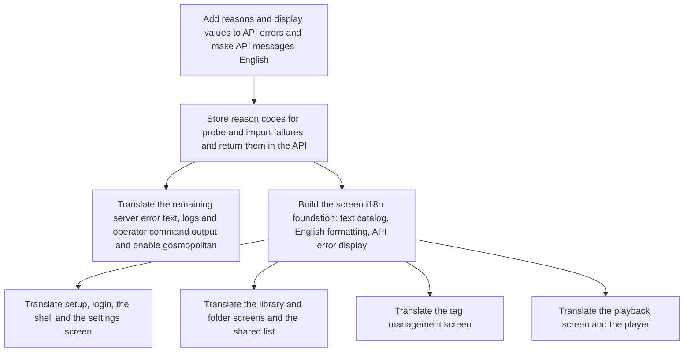

# Implementation Plan: Translate the service fully into English and set up the i18n foundation

**Branch**: `feature/023-english-i18n` | **Parent Issue**: #408

**Input**: The parent Issue. It is this feature's specification.

## Summary

Replace the fixed Japanese text scattered across the screen, the API, the logs
and the stored failure reasons with English, and build an i18n foundation that
handles screen text and formatting in one place. English is the only language
offered, and there is no language choice.

- Screen text is collected in a typed catalog in `web/src/i18n/`, and
  components read from it. Embedded values are function arguments, singular and
  plural use `Intl.PluralRules`, and dates, numbers and relative time use `Intl`
  with the same locale
  ([research.md R-1](research.md#r-1-screen-text-in-a-typed-in-house-catalog),
  [R-2](research.md#r-2-formatting-and-plurals-through-browser-intl)).
  `index.html` has `lang="en"`, and video.js's custom language is also built
  from the catalog ([R-9](research.md#r-9-videojs-text-built-from-the-catalog)).
- The screen does not use the API's `message` for normal display; it shows
  English text from `code` and the new `reason`, `limit` and `tagName`. Existing
  `code`s and HTTP statuses do not change, and situations within the same
  `code` are distinguished by `reason`
  ([contracts/error-api.md, `reason`, `limit` and `tagName` on `Error`](contracts/error-api.md#reason-limit-and-tagname-on-error),
  [R-4](research.md#r-4-api-error-specificity-added-through-reason-without-changing-codes),
  [R-5](research.md#r-5-the-screen-shows-known-errors-from-reason-and-code-others-as-a-safe-summary)).
- Probe and import failures store a reason code in a separate column, and the
  screen explains from the code without showing free text (ffprobe output, past
  Japanese). Stored free text is not rewritten
  ([data-model.md](data-model.md),
  [R-6](research.md#r-6-store-a-machine-readable-failure-code-and-show-no-free-text-on-screen)).
- The server's `message`s, logs and `cmd/mdm` output are written in English
  directly in Go
  ([R-7](research.md#r-7-english-written-directly-in-the-server-with-no-text-catalog)).
- Missing translations are detected: on the screen by ESLint's
  `no-restricted-syntax`, the branded type `UiText` for values that carry fixed
  text, and screen tests rendered with a pseudo-locale; for known errors by the
  catalog's `Record<ErrorCode | ErrorReason, …>` types; on the server by
  `gosmopolitan`
  ([R-3](research.md#r-3-missing-translations-caught-by-lint-and-types)).
- Comments, OpenAPI `description`s, design documents and `scripts/` are out of
  scope ([R-8](research.md#r-8-what-stays-untranslated)).

## Technical Context

**Canonical definitions**:

| Topic | Source |
| --- | --- |
| Boundaries and dependency direction, Web layer responsibilities | [ARCHITECTURE.md](../../ARCHITECTURE.md) ("Intended dependency direction", "Web layer") |
| API source of truth and generation | [api/openapi.yaml](../../api/openapi.yaml) (`Error`, `Video.probeError`, `Scan.error`), `task generate` |
| How error responses are written | [internal/httpapi/router.go](../../internal/httpapi/router.go) (`writeError`, `invalidRequest`, `notFound`, `internalError`) |
| Screen API calls and errors | [web/src/api/client.ts](../../web/src/api/client.ts) (`RequestFailed`, `toRequestFailed`, `errorMessage`) |
| Formatting | [web/src/lib/format.ts](../../web/src/lib/format.ts) |
| Player text | [web/src/player/VideoPlayer.tsx](../../web/src/player/VideoPlayer.tsx) |
| Where failure reasons are written | `internal/store/jobs.go` (`recordTerminalFailure`), `internal/store/scans.go` (`FinishScan`, `FailInterruptedScans`), `internal/app/scans.go` |
| Lint | [.golangci.yml](../../.golangci.yml), [web/eslint.config.js](../../web/eslint.config.js) |
| Screen look and text design | [docs/design-docs/library-ui.md](../../docs/design-docs/library-ui.md) and each `ui-design.md` listed in the [design document index](../../docs/design-docs/index.md) |
| Check entry points | [Taskfile.yml](../../Taskfile.yml) (`task check`, `task check-docs`, `task test-e2e`) |

**Feature-specific context**:

- No dependency is added. The screen uses `Intl`; lint uses ESLint's built-in
  rule and `gosmopolitan`, bundled with golangci-lint.
- Migration `00016` adds three columns to SQLite ([data-model.md](data-model.md)).
- The API changes are additions only (`Error.reason`, `Error.limit`,
  `Error.tagName`, `Video.probeErrorCode`, `Scan.errorCode`, `Scan.errorPath`).
  Existing `code`s, HTTP statuses and state values do not change.
- The English catalog becomes the source of truth for the Japanese text quoted
  in each `ui-design.md`.

## Constitution Check

| Gate | Verdict |
| --- | --- |
| **Dependency direction** (ARCHITECTURE.md) | Pass. The failure codes and the type that wraps them live in `internal/domain`; `internal/media` and `internal/scanner` wrap; `internal/app`, `internal/jobs` and `internal/store` extract with `errors.As`. No new imports between adapters. |
| **`api/openapi.yaml` is the API source of truth** (ARCHITECTURE.md, AGENTS.md) | Pass. `reason` and the failure codes are added as enums, and `task generate` produces Go and TypeScript. Generated files are not hand-edited. |
| **Only `web/src/api/` talks to the server** (ARCHITECTURE.md, "Web layer") | Pass. `client.ts` puts `reason`, `limit` and `tagName` on `RequestFailed`, and `web/src/i18n/` produces the screen text. |
| **Index versus user data** (ARCHITECTURE.md, "Rebuildable and user data") | Pass. The added columns are on the rebuildable `videos` and `scans`; user names and tags are not touched (requirement 8). |
| **Constraints are kept by checks** (core-beliefs.md) | Pass. Missing translations, fixed locales and missing error displays fail `task check` through lint and type checking (acceptance criterion 8). |
| **Documents are fixed in the same PR as the change** (core-beliefs.md, AGENTS.md) | Pass. The foundation unit adds the i18n design document and its index link; the units that change the API, data and Web layer descriptions of ARCHITECTURE.md fix them. |

The verdicts are the same after Phase 1. There is no violation for Complexity
Tracking.

## Project Structure

### Documentation (this feature)

```text
specs/023-english-i18n/
├── plan.md               # This file
│                         # No spec.md — the parent Issue is the specification
├── research.md           # Decisions on the catalog, formatting, detection, error reasons, failure codes, exclusions
├── data-model.md         # videos.probe_error_code, scans.error_code and error_path
├── quickstart.md         # Checks for leftover Japanese, failure display, past Japanese data, formatting
└── contracts/
    └── error-api.md      # Error.reason, limit, tagName; Video.probeErrorCode; Scan.errorCode, errorPath
```

No `ui-design.md`: the parent Issue has no `ui` label, and the text is replaced
without changing the screens' structure, interactions or look. Places where
English changes the length are handled by each unit's visual check.

### Source Code

**Affected boundaries**:

| Boundary | What changes |
| --- | --- |
| `api/openapi.yaml`, `internal/httpapi` | `Error.reason`, `limit`, `tagName`; the failure code fields; English `message`s |
| `internal/domain` | Failure codes and the wrapping type; the reason-carrying error of `NormalizeTagName`; English error text |
| `internal/media`, `internal/scanner`, `internal/app`, `internal/jobs`, `internal/store` | Attaching and storing failure codes; English error text and logs |
| `internal/artifacts`, `internal/mediafs`, `internal/opener`, `internal/password`, `internal/eventbus`, `cmd/mdm` | English error text, logs, configuration and account operation output |
| `web/src/i18n` (new) | Catalog, formatting, error display |
| `web/src/api/client.ts` | `reason`, `limit`, `tagName` |
| Each area of `web/src/*`, and `web/e2e` | Using the catalog and verifying English |
| `web/index.html` | `lang="en"` |
| `.golangci.yml`, `web/eslint.config.js` | Detecting missing translations |
| `ARCHITECTURE.md`, `docs/design-docs/` | The i18n design document and index; API, data and Web layer descriptions |

**New paths**: `web/src/i18n/`,
`internal/store/migrations/00016_failure_codes.sql`, `docs/design-docs/i18n.md`.

**Structure decision**: Screen text and formatting live in `web/src/i18n/`, and
the locale-dependent functions of `web/src/lib/format.ts` (date-time, relative
time) move there. Locale-independent functions (duration, size, resolution)
stay in `lib/`. `i18n/` is not placed inside `lib/` so that the ESLint rule can
mark it, by directory, as the only place where Japanese and text literals are
allowed.

## Implementation Work

How the units are split: the server into three (the API, meaning
`internal/httpapi` and domain errors; failure codes, following the data flow;
translating the remaining packages), and the screen into the foundation plus
four areas whose files do not overlap. The screen lint is enabled in the
foundation with the not-yet-translated directories excluded, and each area
removes its own
([R-3](research.md#r-3-missing-translations-caught-by-lint-and-types)).

The units depend on each other as follows:



### Add reasons and display values to API errors and make API messages English

**Scope**: `Error.reason`, `limit`, `tagName` and the `message` description in
`api/openapi.yaml` ([contracts/error-api.md, Every `message` in English](contracts/error-api.md#every-message-in-english) and [`reason`, `limit` and `tagName` on `Error`](contracts/error-api.md#reason-limit-and-tagname-on-error));
every `message`, log and the plain-text responses of `spa.go` in
`internal/httpapi` in English; attaching `reason`, `limit` and `tagName` in the
table's situations; English error text in `internal/domain` and the
reason-carrying error of `NormalizeTagName`; expected values in Go tests; the
API description in ARCHITECTURE.md.

**Dependencies**: None

**Acceptance**: Tests in `internal/httpapi` pass, checking for each situation
in the table the same HTTP status and `code` as before plus the table's
`reason`, `limit` and `tagName`. Temporarily enabling `gosmopolitan` on
`internal/httpapi` and `internal/domain` reports 0 findings. The diff from
`task generate` touches only generated files, and `task check` passes.

### Store reason codes for probe and import failures and return them in the API

**Scope**: Migration `00016` and the three columns of
[data-model.md](data-model.md); the failure codes and wrapping type in
`internal/domain`; attaching codes and translating error text and logs in
`internal/media` (probe) and `internal/scanner`; passing them on and
translating in `internal/app` and `internal/jobs`; writing and reading in
`internal/store`; `Video.probeErrorCode`, `Scan.errorCode` and `Scan.errorPath`
([contracts/error-api.md, `Video.probeErrorCode`](contracts/error-api.md#videoprobeerrorcode) and [`Scan.errorCode` and `Scan.errorPath`](contracts/error-api.md#scanerrorcode-and-scanerrorpath)); the data
description in ARCHITECTURE.md.

**Dependencies**: Add reasons and display values to API errors and make API
messages English

**Acceptance**: Go tests check that a probe failure on a non-video file makes
`GET /api/videos/{id}` return `probeErrorCode: "probe_failed"` and an English
`probeError`, and that importing an unreadable media folder makes
`GET /api/scans/current` return `errorCode: "media_folder_unreadable"` with the
path in `errorPath`. Store tests check that Japanese `probe_error` and
`scans.error` inserted before the migration keep the same values after it, with
the code `null`. `task check` passes.

### Translate the remaining server error text, logs and operator command output and enable gosmopolitan

**Scope**: `internal/store`, `internal/artifacts`, `internal/mediafs`,
`internal/opener`, `internal/password`, `internal/eventbus`, `cmd/mdm`
(configuration checks, startup failures, usage and input/output of account
operations, subscriber names), plus the remaining text and logs in
`internal/media` (thumbnails, previews, seek thumbnails), `internal/jobs` and
`internal/app` that the previous two units did not touch, and test expected
values. `.golangci.yml` enables `gosmopolitan` for non-test code in `cmd/` and
`internal/` ([R-3](research.md#r-3-missing-translations-caught-by-lint-and-types)).

**Dependencies**: Store reason codes for probe and import failures and return
them in the API

**Acceptance**: `gosmopolitan` in `task lint` passes with 0 findings. The logs
from the operations in
[quickstart.md, Server output is in English](quickstart.md#server-output-is-in-english) contain no
fixed Japanese text. `task check` passes.

### Build the screen i18n foundation: text catalog, English formatting, API error display

**Scope**:

- In `web/src/i18n/`: the catalog type and the English catalog, singular/plural
  and `Intl` formatting functions, and the error display (`reason` → `code` →
  `message` for an unknown code → HTTP status summary; network failure)
  ([R-1](research.md#r-1-screen-text-in-a-typed-in-house-catalog),
  [R-2](research.md#r-2-formatting-and-plurals-through-browser-intl),
  [R-5](research.md#r-5-the-screen-shows-known-errors-from-reason-and-code-others-as-a-safe-summary)).
- `reason`, `limit` and `tagName` on `RequestFailed` in `client.ts`; the
  `UiText` type and text props of the `ui/` components; the pseudo-locale and
  the test helper that checks that all text on a rendered screen comes from the
  catalog or is user data; moving the locale-dependent functions of
  `lib/format.ts`.
- Text in `web/src/api/`, `web/src/lib/`, `web/src/ui/`, `web/src/app/` and
  `main.tsx`; `lang="en"` in `index.html`.
- The ESLint rule and the exclusion list of untranslated directories
  ([R-3](research.md#r-3-missing-translations-caught-by-lint-and-types)).
- `docs/design-docs/i18n.md` and its index link; a note in the index that the
  catalog is the source of truth for the text in each `ui-design.md`; the Web
  layer description in ARCHITECTURE.md.

**Dependencies**: Store reason codes for probe and import failures and return
them in the API

**Acceptance**: Vitest passes, checking: every `ErrorCode`, `ErrorReason`,
`ProbeErrorCode` and `ScanErrorCode` has English text (type check); `limit` is
embedded; the display for unknown codes, empty bodies, non-JSON bodies and
`fetch` failures; counts of one and many; English dates, date-times and
relative times; the pseudo-locale helper detects a component that renders an
English literal passed through a `string` variable. ESLint checks that
`web/src/api/`, `lib/`, `ui/` and `app/` contain no Japanese or fixed text
outside `i18n/`. `task check` passes. The text of shared components (combobox,
toast) changes, so visual and assistive technology checks are done.

### Translate setup, login, the shell and the settings screen

**Scope**: Move the text, accessible names and formatting of `web/src/auth/`,
`web/src/shell/` and `web/src/settings/` to the catalog. Import failures are
displayed from `Scan.errorCode` and `errorPath`, and `Scan.error` is not shown.
Media folder, folder picker and login failures use the API error display.
Update the expected values in each directory's Vitest tests and in `web/e2e`
`auth`, `guest` (the relevant parts), `settings`, `scan-progress` and
`unconfigured`, and remove these three directories from the ESLint exclusion
list.

**Dependencies**: Build the screen i18n foundation: text catalog, English
formatting, API error display

**Acceptance**: ESLint passes with the exclusion removed. Tests rendering the
normal, empty, in-progress and failure states with the pseudo-locale pass,
confirming no text outside the catalog. Vitest and `task test-e2e` check that
English explanations appear for initial setup, login (wrong password, attempt
limit) and the settings screen (nonexistent or overlapping media folders,
import failure, a past failure without `errorCode`). The screen changes, so
visual and assistive technology checks are done.

### Translate the library and folder screens and the shared list

**Scope**: Move the text, accessible names, count and date formatting, search
descriptions, selection and bulk actions, and group cards of
`web/src/library/`, `web/src/videoList/` and `web/src/folders/` to the catalog.
Update the expected values in each directory's Vitest tests and in `web/e2e`
`search`, `folders`, `guest` (the relevant parts) and `hover-preview`, and
remove these three directories from the ESLint exclusion list.

**Dependencies**: Build the screen i18n foundation: text catalog, English
formatting, API error display

**Acceptance**: ESLint passes with the exclusion removed. Tests rendering the
normal, empty, in-progress and failure states with the pseudo-locale pass,
confirming no text outside the catalog. Vitest and `task test-e2e` check the
display of counts of one and many, the empty state, load failure, and the
search term length and bulk action limits (with `limit` embedded), and that
videos and folders with Japanese names display and can be searched under their
original names. The screen changes, so visual and assistive technology checks
are done.

### Translate the tag management screen

**Scope**: Move the text, accessible names and counts of `web/src/tags/` to
the catalog, and show invalid, conflicting and failed-merge tag names through
the API error display (`tag_name_*`, `merge_same_tag`, `tag_name_taken`,
`tag_merge_required`). Update the expected values in Vitest and
`web/e2e/tags.e2e.ts`, and remove `tags/` from the ESLint exclusion list.

**Dependencies**: Build the screen i18n foundation: text catalog, English
formatting, API error display

**Acceptance**: ESLint passes with the exclusion removed. Tests rendering the
normal, empty, in-progress and failure states with the pseudo-locale pass,
confirming no text outside the catalog. Vitest and `task test-e2e` check that
specific English explanations appear for an empty tag name, a tag name that is
too long (with `limit` embedded), a name in use, a name that is another tag's
synonym, a name that needs a merge (each including the colliding tag's name),
and merging a tag with itself, and that Japanese tag names and synonyms display
and can be searched as they are. The screen changes, so visual and assistive
technology checks are done.

### Translate the playback screen and the player

**Scope**: Text, accessible names and date formatting in `web/src/player/`;
building video.js's custom language from the catalog
([R-9](research.md#r-9-videojs-text-built-from-the-catalog)); displaying probe
failures from `probeErrorCode` without showing `probeError`; the API error
display for playback and file operation failures. Update the expected values in
Vitest and `web/e2e/playback.e2e.ts`, remove `player/` from the ESLint
exclusion list, and remove the list itself.

**Dependencies**: Build the screen i18n foundation: text catalog, English
formatting, API error display

**Acceptance**: ESLint passes with no exclusion list. Tests rendering the
normal, empty, in-progress and failure states with the pseudo-locale pass,
confirming no text outside the catalog. Vitest and `task test-e2e` check that
the control bar buttons' accessible names and tooltips are English and include
the key; the explanation for each `probeErrorCode`; that a past Japanese
`probeError` without a code is not shown and an English summary appears
instead; the failure of `開く` when the file is missing; and that keyboard
shortcuts do not change. The screen changes, so visual and assistive
technology checks are done.
