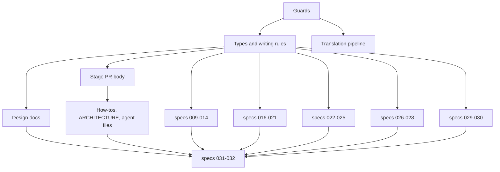

# Implementation Plan: Typed technical-English documents, automatic Japanese translation, and summarised stage PRs

**Branch**: `feature/034-english-docs` | **Parent Issue**: #628

**Input**: The parent Issue. It is this feature's specification.

## Summary

Every repository document in the scope of requirement 1 is rewritten in
technical English. Each document follows a type for its kind and the new
writing rules. A guard keeps Japanese out of prose while the rewrite proceeds in
batches.

On every push to `main`, a translation job translates the published English
documents with `HY-MT1.5-1.8B`, a recent translation-specialised model, run by
`llama.cpp` on the hosted runner. It works segment by segment over the Markdown
AST and reuses unchanged segments from memory. The job
stores the results on the `docs-ja` branch, and the site publishes them under
`/ja/`. A failed run never blocks publishing, and stale or missing translations
are labelled on the page.

Document stages (`plan`, `design`) write a Japanese PR body that summarises
decisions, scope, validation and open items as tables.

| Decision | Chosen | Rejected | Detail |
| --- | --- | --- | --- |
| Engine | `HY-MT1.5-1.8B` on the runner via `llama.cpp` | `HY-MT1.5-7B`, `TranslateGemma`, `plamo-2-translate`, `PLaMo翻訳` API, DeepL, Google, Azure, Amazon, general LLM, classic MT | [R-1](research.md#r-1-translation-engine) |
| Structure | Translate mdast text segments in place; pin English heading slugs | Whole-file translation | [R-2](research.md#r-2-segment-translation-over-the-markdown-ast) |
| Terms | `glossary.tsv` through the model's terminology template; UI labels stay English as on screen | Japanese UI terms; whole glossary in every prompt | [R-3](research.md#r-3-glossary-and-product-terms) |
| Storage | Orphan branch `docs-ja` with a segment memory, written by its own workflow; site locale `/ja/` | Bot PRs into `main`; Actions cache; a job inside `docs.yml` | [R-4](research.md#r-4-where-translations-live-and-how-they-follow-the-english-source) |
| Translation scope | Site's published set, plus `ARCHITECTURE.md` | Every requirement-1 path | [R-5](research.md#r-5-translation-scope-and-the-sites-published-set) |
| Rewrite guard | Japanese-in-prose check with a shrinking pending list; anchor check | Check only at the end | [R-6](research.md#r-6-guarding-the-english-rewrite-while-it-is-in-progress) |
| Types | One skeleton per kind beside its skill; `writing-quality.md` for shared rules | One template directory | [R-7](research.md#r-7-document-types) |
| Stage PR body | `stage-pr-body.md` in `issue-handoff` | Changing the repository PR template | [R-8](research.md#r-8-stage-pr-body) |

## Technical Context

**Canonical definitions**:

- Documentation site, its published set, and link rewriting:
  [docs-site/.vitepress/config.mts](../../docs-site/.vitepress/config.mts),
  [docs/how-to/docs-site.md](../../docs/how-to/docs-site.md)
- Site build and Pages deploy: [.github/workflows/docs.yml](../../.github/workflows/docs.yml)
- Document guards: [scripts/sddguard/sddguard_test.go](../../scripts/sddguard/sddguard_test.go),
  run by `task check-docs` ([Taskfile.yml](../../Taskfile.yml))
- Document quality rules: [plan-quality.md](../../docs/design-docs/plan-quality.md),
  [spec-quality.md](../../docs/product-specs/spec-quality.md)
- SDD stages and PR contract: [issue-handoff](../../.agents/skills/issue-handoff/references/README.md)
- Screen text: [web/src/i18n/en.ts](../../web/src/i18n/en.ts), English only
  ([i18n.md](../../docs/design-docs/i18n.md))

**Feature-specific context**:

- New dependencies in `docs-site/package.json`: `unified`, `remark-parse` and
  `remark-gfm`, for the translation script. Renovate already covers this
  manifest.
- New pinned external artifacts in `docs-site/translate/model.json`: a
  `llama.cpp` release binary and the `HY-MT1.5-1.8B` GGUF file, each with a
  sha256. No secret or account is needed.
- Runner time: the first full translation takes about 10 hours and is spread
  over runs with a 5-hour budget. Later runs take minutes
  ([R-1](research.md#r-1-translation-engine)).
- New branch: `docs-ja`, created by the translation job on its first run, and
  written only by that job.
- Size of the rewrite: about 1.35 MB of Japanese Markdown (`specs/` 1.17 MB,
  `docs/` 0.18 MB) plus `ARCHITECTURE.md` (66 KB). The rewrite units below keep
  each PR at or below about 200 KB of source.
- `feature/033-video-dates` is in flight with Japanese documents. Whichever of
  the two integrates second meets the guard and rewrites them
  ([R-6](research.md#r-6-guarding-the-english-rewrite-while-it-is-in-progress)).

## Constitution Check

| Rule | Source | Verdict |
| --- | --- | --- |
| Keep documentation close to the code and update it with behaviour changes | [AGENTS.md](../../AGENTS.md) | Pass. Each unit updates the documents it changes; `docs-site.md` changes in the translation unit. |
| Prefer focused, reviewable changes with automated checks | [AGENTS.md](../../AGENTS.md) | Pass. The rewrite is split into batches of 200 KB or less, and the two guards make its progress checkable. |
| No hand-edited generated files | [AGENTS.md](../../AGENTS.md) | Pass. Translations are not in `main`, so there is nothing generated to hand-edit. |
| Do not add a `spec.md`; the parent Issue is the specification | [AGENTS.md](../../AGENTS.md) | Pass. Issue and PR bodies stay Japanese (requirement 2). |
| Plan template lives with the skill that fills it | [issue-handoff README](../../.agents/skills/issue-handoff/references/README.md#directory-ownership) | Pass. New skeletons follow the same rule (R-7). |
| No extra runtime just for checks | [Taskfile.yml](../../Taskfile.yml) header | Pass. The guard is Go in `sddguard`; the translator is Node in `docs-site/`, which already exists. |

Phase 1 leaves the verdicts unchanged. There is no Complexity Tracking entry.

## Project Structure

### Documentation (this feature)

```text
specs/034-english-docs/
├── plan.md          # This file
├── research.md      # R-1..R-8
└── quickstart.md    # First live translation run after integration
```

There is no `data-model.md`, because the feature stores no entity. The
translation file's front matter is described in
[R-4](research.md#r-4-where-translations-live-and-how-they-follow-the-english-source).
There is no `contracts/`, because no API or interface visible to users or other
systems changes.

### Source Code

**Affected boundaries**:

| Path | Change |
| --- | --- |
| `scripts/sddguard/` | Japanese-in-prose guard, pending list, anchor guard |
| `docs-site/` | `translate/` script and glossary, `/ja/` locale, banners, English root locale, `ARCHITECTURE.md` published |
| `.github/workflows/` | New `docs-translate.yml`; `docs.yml` reads `docs-ja`; both trigger on `ARCHITECTURE.md` |
| `.agents/skills/` | Skeletons per kind, stage PR body, English rewrite of the remaining Japanese |
| `docs/`, `specs/`, `ARCHITECTURE.md`, `README.md`, `AGENTS.md` | English rewrite to the types |

**New paths**: `docs/design-docs/writing-quality.md`,
`docs-site/translate/`, `.github/workflows/docs-translate.yml`,
`scripts/sddguard/japanese-pending.txt`,
`.agents/skills/issue-handoff/references/stage-pr-body.md`, and the skeletons in
[R-7](research.md#r-7-document-types).

**Structure decision**: the translator lives with the site because only the site
consumes its output (R-2). Translations live outside `main` (R-4).

## Implementation Work



Every rewrite unit follows the type for each file's kind and the W-rules,
removes its files from `japanese-pending.txt`, and fixes inbound links whose
anchors it changes. Each one shows the following acceptance evidence besides
its own:

- `task check-docs` passes.
- `task docs-build` passes.

### Add guards for Japanese prose and link anchors in repository documents

**Scope**: the two guards in `scripts/sddguard/` and the initial
`japanese-pending.txt`, listing every file in the requirement-1 scope that has
Japanese prose today
([R-6](research.md#r-6-guarding-the-english-rewrite-while-it-is-in-progress)).
The anchor guard uses GitHub slug rules and also accepts explicit `{#id}`
anchors.

**Dependencies**: None.

**Acceptance**: `task check-docs` passes on the feature branch. Guard tests show
three failures, each naming its file:

- an unlisted file with Japanese prose
- a listed file with none
- a relative link whose `#fragment` matches no heading

Japanese inside fenced or inline code passes.

### Define document types and English writing rules

**Scope**: `docs/design-docs/writing-quality.md` with W-rules. They cover
register, the anti-slop list (requirement 9), when to use tables and Mermaid,
and one term per concept. Add the seven new skeletons in
[R-7](research.md#r-7-document-types) and align `plan-template.md` with the
table/diagram rules. Point `sdd-plan`, `sdd-design`, `sdd-implement`,
`self-review` and `AGENTS.md` at the types and W-rules. Rewrite
`plan-quality.md` and `spec-quality.md` in English and link them from their
indexes.

**Dependencies**: Add guards for Japanese prose and link anchors in repository
documents.

**Acceptance**:

- Each of the eight kinds has a skeleton that the writing skill names (acceptance 4).
- The skeleton marks at least one section as a table or a diagram.
- `writing-quality.md` lists the anti-slop rules, with one example each.
- The two rule files are off the pending list.

### Summarise decisions, scope, validation and open items in document stage PR bodies

**Scope**: `stage-pr-body.md` ([R-8](research.md#r-8-stage-pr-body)), and
pointers from `issue-handoff/references/plan.md`, `design.md` and the
`sdd-autopilot` stage brief.

**Dependencies**: Define document types and English writing rules.

**Acceptance**: the next `plan` or `design` PR opened from these skills shows
the four sections as tables in its body, without opening the artifact
(acceptance 5). This plan's own PR body uses the same format.

### Translate published English documents into Japanese automatically

**Scope**: R-1 to R-5.

- `docs-site/translate/`: segmenter, `llama-server` client with the model's
  templates, segment memory, assembler, placeholder and structure validators,
  term check, `model.json`, and `glossary.tsv`. The client is replaceable by a
  fake engine in tests.
- `docs-translate.yml`: a new workflow on pushes to `main`, a nightly
  `schedule` and `workflow_dispatch`, in its own `docs-translate` concurrency
  group. It downloads and verifies the pinned binary and model (cached),
  honours a 5-hour budget, commits to `docs-ja`, writes a run summary, then
  builds and deploys the site whether translation succeeded or failed.
- `docs.yml`: builds from the current `docs-ja`, so the site deploys at once and
  never waits for translation.
- Both workflows add `ARCHITECTURE.md` to their `push` and `pull_request` path
  filters.
- `config.mts`: English root locale, `/ja/` locale with today's labels and
  tokenizer, stale and untranslated banners, and `ARCHITECTURE.md` in the
  published set.
- Rewrite `docs/how-to/docs-site.md` in English to describe all of the above.

**Dependencies**: Add guards for Japanese prose and link anchors in repository
documents.

**Acceptance**: tests with the fake engine show:

- headings, table rows and columns, list items, link destinations and code
  blocks are identical to the source except for translated text, and Mermaid
  differs only in labels (acceptance 3)
- every heading carries its English `{#slug}`
- a changed source sends only its changed segments to the engine, and an
  unchanged one sends none
- a deleted source removes its translation and memory
- a glossary change retranslates only segments containing the changed term
- a `model.json` change retranslates every file
- a segment that drops a placeholder twice stays English and is reported
- an engine error leaves the old translation and exits non-zero with the file
  listed
- reaching the time budget commits the finished files and lists the rest
- files on the pending list are skipped

`task docs-build` with a fixture `docs-ja` produces `/ja/` pages, a stale banner
on a hash mismatch, and an untranslated banner when the translation is missing.
In both workflow files, `ARCHITECTURE.md` is in the path filters, and
`docs.yml` has no job that waits on translation.
A run of the real model on the runner, over a fixed sample of five documents,
records tokens per second and the translated sample in the PR. The maintainer
reads the sample to judge quality before merge; if it falls short, the
`HY-MT1.5-7B` row in R-1 is the fallback, as a `model.json` change. The live run
on `main` is checked after integration with [quickstart.md](quickstart.md).

### Rewrite the design documents and product-spec index in English

**Scope**: `docs/design-docs/*.md` (except `plan-quality.md` and
`writing-quality.md`) and `docs/product-specs/index.md`, as design-doc type.

**Dependencies**: Define document types and English writing rules.

**Acceptance**: the files are off the pending list.

### Rewrite the how-to guides, ARCHITECTURE.md and agent-facing files in English

**Scope**: `docs/how-to/*.md` (except `docs-site.md`) as how-to type, plus
`ARCHITECTURE.md`, `README.md`, `AGENTS.md`, `specs/README.md`,
`docs-site/index.md`, and the remaining Japanese in `.agents/skills/` and
`.claude/agents/`. Japanese Issue headings stay as inline code.

**Dependencies**: Summarise decisions, scope, validation and open items in
document stage PR bodies (it edits the same skill files).

**Acceptance**: only `.github/pull_request_template.md` and `specs/` files remain
outside the guard's English set, and the pending list holds only `specs/` paths.

### Rewrite specs 009 to 014 in English

**Scope**: `specs/009-*` to `specs/014-*`, each file as its kind's type. Quoted
Japanese screen text from before the English UI becomes inline code.

**Dependencies**: Define document types and English writing rules.

**Acceptance**: the files are off the pending list.

### Rewrite specs 016 to 021 in English

**Scope**: `specs/016-*` to `specs/021-*`, as above.

**Dependencies**: Define document types and English writing rules.

**Acceptance**: the files are off the pending list.

### Rewrite specs 022 to 025 in English

**Scope**: `specs/022-*` to `specs/025-*`, as above.

**Dependencies**: Define document types and English writing rules.

**Acceptance**: the files are off the pending list.

### Rewrite specs 026 to 028 in English

**Scope**: `specs/026-*`, both `specs/027-*` directories, and `specs/028-*`, as
above.

**Dependencies**: Define document types and English writing rules.

**Acceptance**: the files are off the pending list.

### Rewrite specs 029 and 030 in English

**Scope**: `specs/029-*` and `specs/030-*`, as above.

**Dependencies**: Define document types and English writing rules.

**Acceptance**: the files are off the pending list.

### Rewrite specs 031 and 032 in English

**Scope**: `specs/031-*` and `specs/032-*`, as above. Also delete
`japanese-pending.txt` and its skip path once the list is empty. Any directory
merged in from `main` since then (such as `033`) is rewritten in the same PR.

**Dependencies**: Rewrite the design documents and product-spec index in
English; Rewrite the how-to guides, ARCHITECTURE.md and agent-facing files in
English; Rewrite specs 009 to 014 in English; Rewrite specs 016 to 021 in
English; Rewrite specs 022 to 025 in English; Rewrite specs 026 to 028 in
English; Rewrite specs 029 and 030 in English.

**Acceptance**: `japanese-pending.txt` no longer exists, and the guard passes
over the whole requirement-1 scope (acceptance 1).
