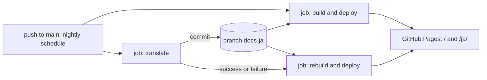

# Research: English documents, automatic Japanese translation, and stage PR summaries

Inherited decisions: the documentation site is VitePress in `docs-site/`
([docs/how-to/docs-site.md](../../docs/how-to/docs-site.md)), published by
[.github/workflows/docs.yml](../../.github/workflows/docs.yml); repository guards
run as `task check-docs` ([scripts/sddguard](../../scripts/sddguard/sddguard_test.go)).
This file records only the decisions this feature adds.

Facts about external services were gathered on 2026-10-01. Items marked
*unverified* come from secondary sources because the vendor page could not be
fetched.

## R-1: Translation engine

The requester asked for a recent translation-specialised model. The candidates
below are those models, plus the translation services and general-purpose LLMs
that requirement 5 asks to compare.

**Decision**: Tencent `HY-MT1.5-1.8B`, quantised to GGUF `Q8_0`, served by a
pinned `llama.cpp` release (`llama-server`) inside the `translate` job on a
GitHub-hosted `ubuntu-latest` runner. The model is downloaded from Hugging Face
at a pinned revision, checked against a pinned sha256, and kept in the Actions
cache. The job sends text segments, never whole files (R-2). It uses the
model's own prompt templates for terminology intervention (R-3) and for
formatted translation (`<sn>` tags, R-2).

**Comparison**:

| Option | Kind | EN→JA quality | Terms and markup | Runs where | Cost | Verdict |
| --- | --- | --- | --- | --- | --- | --- |
| **`HY-MT1.5-1.8B`** | Translation-specialised model, 2025 | WMT25 winner in 30 of 31 directions (7B model); 1.8B is its distilled sibling | Built-in templates for terminology and tagged formatting | CPU runner, about 2 GB at `Q8_0` | Free | **Chosen** |
| `HY-MT1.5-7B` | Same family | Higher | Same | CPU runner at about a quarter of the speed | Free | Rejected: about 4× slower on CPU, and the 1.8B model's quality is the open question either way (see the check in plan.md) |
| `TranslateGemma` 4B / 12B | Translation-specialised model, 2026-01 | Good; JA not benchmarked separately | Prompt only | CPU runner (4B) | Free, Gemma terms | Rejected: no terminology template, and 4B is about 2× slower than 1.8B |
| `plamo-2-translate` (PFN) | Translation-specialised model, 2025 | Best reputation for natural JA | Prompt only | About 10B; 3–5 tokens/s on CPU | Free under PLaMo Community License | Rejected: the first full run (about 0.7M output tokens) would take 40+ hours on a hosted runner |
| `PLaMo翻訳` API | Same model, hosted | Same | Product glossary | — | Subscription | Rejected: no public API yet |
| DeepL API | Translation service (NMT and LLM) | Strong | Managed v3 glossary, XML tags | API | About $30 for the first run | Rejected: the requester prefers a translation model the repository runs itself |
| Google Translation LLM, Azure Translator, Amazon Translate | Translation services | Good, decent, middling | Glossary or dictionary, `translate="no"` | API | $12–20 | Rejected: same reason as DeepL, plus a cloud account to manage |
| General-purpose LLM API (Claude, OpenAI) | General LLM | Best at following context | Prompt plus validation | API | $10–20 | Rejected: not translation-specialised (parent Issue `概要`) |
| Argos / LibreTranslate, opus-mt, NLLB | Classic MT | Poor for technical JA | None | CPU | Free | Rejected: quality; NLLB is non-commercial |

**Rationale**: `HY-MT1.5-1.8B` is the recent translation-specialised model that
is small enough to run on a free hosted runner and that ships templates for the
two things this feature needs: fixed terms (requirement 6) and preserved
markup (acceptance 3). Running it in the job needs no account, no secret and
no quota.

**Operational facts the workflow depends on**:

- The throughput target is 15–25 output tokens/s on a 4-vCPU runner. This
  figure is *unverified* and is measured in the translation unit. The first full
  run (about 0.7M output tokens) then takes about 10 hours. The job therefore
  stops at a time budget of 5 hours, below the 6-hour job limit, and commits
  what it has. A nightly `schedule` trigger continues the backlog until no file
  is out of date (R-4).
- Incremental runs translate only changed segments (R-4). A typical document
  change finishes in minutes.
- `HY-MT`'s license does not apply in the EU, the UK or South Korea. The job
  runs on GitHub-hosted runners, and the output is documentation. This is
  recorded so that a later move to self-hosted runners is checked against it.
- The model reference (repository, revision, file, sha256) lives in one file,
  `docs-site/translate/model.json`. Changing the model is a one-file change that
  retranslates everything (R-4).

**Sources**: [Tencent-Hunyuan/HY-MT](https://github.com/Tencent-Hunyuan/HY-MT)
(README, prompt templates, `License.txt`),
[TranslateGemma](https://blog.google/innovation-and-ai/technology/developers-tools/translategemma/),
[pfnet/plamo-2-translate](https://huggingface.co/pfnet/plamo-2-translate),
[`PLaMo翻訳` announcement](https://www.preferred.jp/ja/news/pr20260701),
[DeepL API docs](https://github.com/DeepL/api-docs),
[Google Cloud Translation pricing](https://cloud.google.com/translate/pricing),
[Azure Translator limits](https://github.com/MicrosoftDocs/azure-ai-docs).

## R-2: Segment translation over the Markdown AST

**Decision**: Parse each English file with `remark-parse` and `remark-gfm`
(mdast with source positions). Translate only these nodes:

| Node | Sent as |
| --- | --- |
| Paragraph, heading, table cell, list-item paragraph, blockquote paragraph | One segment each |
| Image `alt` text | One segment |
| Mermaid label: `["…"]`, `("…")`, `{"…"}`, unquoted `[…]`, edge `\|…\|`, `participant X as …` | One segment each |

Inside a segment, inline code, link destinations, autolinks, HTML, and
identifier-like runs (paths, `snake_case`, `CamelCase` with a dot or slash) are
replaced with numbered `<sN>` placeholders, sent through the model's
formatted-translation template. Link text is translated, but the link is kept as
a paired `<sN>…</sN>`, so its destination never reaches the model. Fenced code (except Mermaid labels), front
matter, and HTML blocks are copied verbatim.

The translated file is the English source with each segment's source span
replaced by its translation. Nothing is re-serialised, so headings, tables,
lists, links and Mermaid keep their structure by construction (acceptance 3).

Each heading gets an explicit `{#slug}` attribute holding the English
GitHub slug. Links from other Japanese pages keep their English anchors and
still resolve.

**Validation per segment**: the output must hold every placeholder exactly
once, in an order that keeps pairs nested. A segment that fails is retried once.
If the retry also fails, the segment stays in English and is reported in the run
summary. A small model drops tags more often than a large one, and one English
sentence costs a reader less than a missing page.

**Validation after assembly**: the translated file must have the same mdast
node-type sequence as the source with text removed, identical code blocks
(Mermaid compared with labels masked), and identical link destinations. A file
that fails is not written (R-4).

**Alternatives considered**: whole-file translation by the model (a 1.8B model
loses table and list structure over long inputs, and every small edit would
retranslate the file); `izznat/deepmark` (the same mdast idea, but tied to DeepL,
with no Mermaid labels and no anchor pinning); a Go implementation in `scripts/`
(goldmark has no positions for inline nodes, so span replacement would need a
second parser). The script sits in `docs-site/translate/`, beside the site's
existing Markdown tooling and `github-slugger`.

## R-3: Glossary and product terms

**Decision**: `docs-site/translate/glossary.tsv` holds `english<TAB>japanese`
pairs and is the only source of term choices. For each segment, the script
puts the entries whose English term occurs in it into the model's
terminology-intervention template. A segment with no matching term uses the
plain or formatted template.

The product's screen is English only, and has no Japanese catalog
([docs/design-docs/i18n.md](../../docs/design-docs/i18n.md)). "The same
translation as the screen" (requirement 6) therefore means a UI label is kept in
English, exactly as `web/src/i18n/en.ts` shows it. Such entries map a term to
itself (`Versions<TAB>Versions`).

After translation a term check runs for each segment: if the source contains a
glossary term, the target must contain its Japanese entry. A miss is reported in
the run summary and does not block the run. The glossary therefore grows from
evidence in the summaries.

**Alternatives considered**: deriving terms from a Japanese UI catalog (none
exists); translating UI labels to Japanese (contradicts "same as the screen",
because the screen shows English); putting the whole glossary into every prompt
(a long prefix slows a CPU run, and a small model follows a few relevant terms
better than a long list).

## R-4: Where translations live, and how they follow the English source

**Decision**: translations are generated on `main` and stored on a bot-owned
orphan branch, `docs-ja`, as `<source path>` with front matter
`sourcePath`, `sourceHash` (sha256 of the English file), `glossaryHash` and
`modelHash` (sha256 of `model.json`). Beside each translation, `docs-ja` keeps a
segment memory, `.memory/<source path>.json`, that maps the hash of a segment's
source text and its matched glossary entries to its translation. An unchanged
segment is never sent to the model again. They
are published as the site's `/ja/` locale. They are never in `main`, so nobody
edits them there (requirement 3).

The English site deploys at once and never waits for the translation, which can
run for hours on the first pass. When `translate` ends, a second build deploys
whatever `docs-ja` then holds. Both deploys share the existing `pages`
concurrency group, so they run in order.

| Situation | Behaviour |
| --- | --- |
| English file added or changed | `sourceHash` differs → only segments missing from memory are translated; file committed |
| Glossary entry changed | Segments containing that term miss memory → retranslated |
| `model.json` changed | `modelHash` differs → memory discarded, all files retranslated |
| English file deleted or renamed | Translation without a source is deleted in the same commit |
| Model download fails, `llama-server` does not start, or a file fails validation | `translate` job fails red and lists the files in its summary; `build` still runs and publishes |
| Time budget reached | Finished files are committed; the job ends green with the remaining files listed; the nightly run continues |
| Translation older than its source | `/ja/` page shows a banner: the translation is out of date, with a link to the English page |
| No translation yet | `/ja/` page renders the English text under a "not translated yet" banner |
| File still listed as Japanese source (R-6) | Skipped; it has no English source yet |

The next push, the nightly `schedule`, or a manual `workflow_dispatch` retries
every file whose hashes differ, so a failed run catches up without a human edit (requirement 4).

**Alternatives considered**: committing translations to `main` through a bot PR
(needs a human or auto-merge per change, puts editable copies beside the
source); generating at build time with only the Actions cache (the cache is
evicted after seven days unused, so the whole set would be retranslated, about
10 hours of runner time); a translation-management service such as Crowdin (adds a second
account and a sync loop for a one-language need).

## R-5: Translation scope and the site's published set

**Decision**: the Japanese translation covers what the site publishes. The
published set grows from `docs/` and `specs/` to also include `ARCHITECTURE.md`,
the main human-facing design document.

`AGENTS.md`, `CLAUDE.md`, `README.md`, skills, agent definitions, and templates
are written in English (requirement 1) and are not translated. Their readers are
agents, or contributors following an instruction they are about to execute.

The site's root locale becomes English (`lang: 'en'`). `/ja/` keeps today's
Japanese labels and the existing bigram search tokenizer.

**Alternatives considered**: translating every requirement-1 path, skills
included (adds a rendering of agent instructions nobody reads in Japanese);
leaving `ARCHITECTURE.md` unpublished (Japanese readers would lose the largest
design document).

## R-6: Guarding the English rewrite while it is in progress

**Decision**: a `task check-docs` guard fails when a Markdown file in the
requirement-1 scope has Japanese characters outside fenced code and inline code.
Quoted screen text and user-data examples are written as inline code.

`scripts/sddguard/japanese-pending.txt` lists the files still to rewrite. The
guard skips them, and fails when a listed file no longer has Japanese, so the
list shrinks with each rewrite unit. A Japanese document added by another
feature, or merged from `main` while this feature is open, is not on the list
and fails the guard. That keeps it in scope, as the parent Issue's Edge Cases
require.

`.github/pull_request_template.md` is exempt: its headings are the skeleton of a
PR body, and PR bodies stay Japanese (requirement 2). The same holds for the
Issue-body headings quoted by `issue-spec`, which are written as inline code.

A second guard resolves `#fragment` in relative links against the target file's
headings using GitHub's slug rules, so a heading rewritten in English cannot
silently break an inbound link.

**Alternatives considered**: an inline opt-out marker for allowed Japanese
(noisier than inline code and invisible when rendered); checking only at the
end of the feature (an in-flight Japanese addition would be found only at
integration).

## R-7: Document types

**Decision**: each document kind in requirement 7 gets a skeleton file. The
skeleton fixes the headings, and its comments say which content is a table or a
diagram. Each skeleton sits with the skill that fills it, following the existing
plan-template rule ([issue-handoff README](../../.agents/skills/issue-handoff/references/README.md#directory-ownership)).

| Kind | Skeleton | Written by |
| --- | --- | --- |
| plan | `.agents/skills/sdd-plan/assets/plan-template.md` (exists) | `sdd-plan` |
| research | `.agents/skills/sdd-plan/assets/research-template.md` | `sdd-plan` |
| data-model | `.agents/skills/sdd-plan/assets/data-model-template.md` | `sdd-plan` |
| contracts | `.agents/skills/sdd-plan/assets/contract-template.md` | `sdd-plan` |
| quickstart | `.agents/skills/sdd-plan/assets/quickstart-template.md` | `sdd-plan` |
| ui-design | `.agents/skills/sdd-design/assets/ui-design-template.md` | `sdd-design` |
| design doc | `.agents/skills/sdd-implement/assets/design-doc-template.md` | `sdd-implement`, and any change per `AGENTS.md` |
| how-to | `.agents/skills/sdd-implement/assets/how-to-template.md` | `sdd-implement`, and any change per `AGENTS.md` |

Rules that apply to every kind live in a new
`docs/design-docs/writing-quality.md` (W-rules). It covers English register,
the anti-slop rules from requirement 9, when to use a table or a Mermaid
diagram, and the glossary as the term list. `plan-quality.md` keeps P-1..P-7 and
links to it.

**Alternatives considered**: one shared template directory (breaks the
"template lives with the skill that fills it" rule); types described only in
prose in `writing-quality.md` (a skeleton is what an agent copies, and prose
alone drifts).

## R-8: Stage PR body

**Decision**: `.agents/skills/issue-handoff/references/stage-pr-body.md`
defines the body for PRs from stages that create or revise documents
(`plan`, `design`). The body is in Japanese and has four sections, each a
table, plus a Mermaid graph for the plan's unit dependencies.

| Section | Content |
| --- | --- |
| `決めたこと` | Decision, rejected alternative, reason, link to the artifact section |
| `範囲` | In scope and out of scope, by area |
| `検証の方法` | Check, what it proves, where it runs |
| `決まっていないこと` | Open item, who decides, when |

The body replaces the `概要` and `変更点` sections of the repository PR template
for these PRs. `plan.md`, `design.md` and the `sdd-autopilot` stage brief point
to it.

**Alternatives considered**: changing `.github/pull_request_template.md` (it
serves every PR, and most PRs are not document stages); generating the body
from the artifact with a script (the summary is a judgement about what matters,
and an extract repeats the document).
