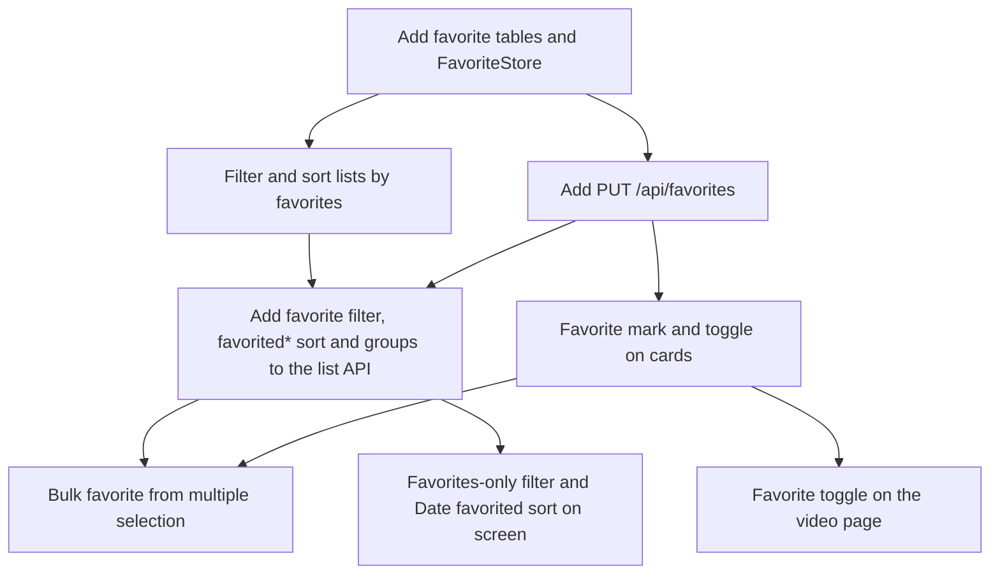

# Implementation Plan: Favorite videos and groups

**Branch**: `feature/035-favorites` | **Parent Issue**: #574

**Input**: The parent Issue. It is this feature's specification.

## Summary

The owner can turn a favorite (on or off) on videos and on folder groups separately, see the current state at
three entry points (the video page, library cards and multiple selection), limit the library and folder lists
to favorites only, and sort them by the date favorited. Guests see neither the state nor the entry points.

| Area | Approach |
| --- | --- |
| Storage | Two tables: `video_favorites` keyed by the user key, `folder_favorites` keyed by the folder key. Rescans, moves, bundling and succession follow the existing paths of public flags and manual group settings ([research.md R-1](research.md#r-1-two-tables-video_favorites-by-user-key-folder_favorites-by-folder-key), [data-model.md, Migration](data-model.md#migration)) |
| Toggling | The owner-only `PUT /api/favorites` takes video ids and group folders in one transaction and skips, uncounted, what does not exist and folders that are not groups now ([R-2](research.md#r-2-one-owner-only-put-apifavorites-for-videos-and-folders-in-one-transaction), [contracts/screen-api.md, `PUT /api/favorites`](contracts/screen-api.md#put-apifavorites)). It does not advance the edit time ([R-8](research.md#r-8-favoriting-does-not-advance-video_edits)) |
| Lists | `favorite=true` judges each item by its own favorite, and the favorite members of a group that is not a favorite become video items. `favoritedAsc` and `favoritedDesc` put non-favorite items last. Guests get `400` ([R-3](research.md#r-3-favorites-only-filter-applied-where-libraryitemscte-builds-items), [R-4](research.md#r-4-favoritedasc-and-favoriteddesc-sorts-with-non-favorites-last), [R-5](research.md#r-5-favorites-hidden-from-guests-filter-and-sort-return-400), [data-model.md, Reads and lists](data-model.md#reads-and-lists)) |
| Screens | No domain event; lists and the video page update through the same subscriptions as the visibility toggle ([R-6](research.md#r-6-no-domain-event-screens-reuse-the-visibility-subscription-pattern)). Multiple selection remembers chosen groups as groups, and "Select all" learns them from `groups`, added to `GET /api/library/ids` ([R-7](research.md#r-7-selection-keeps-chosen-groups-as-groups)) |

The Issue has the `ui` label, so the look, placement and wording of the mark and the toggle and the names of
the filter and the sort are decided by `ui-design.md` in the next design stage, judged against the parent
Issue's `UI品質`. Cards gain no row, and on the video page the toggle sits in the secondary actions row (parent
Issue).

## Technical Context

**Canonical definitions**:

| Topic | Source |
| --- | --- |
| Boundaries, dependency direction, index versus user data, role type rules, domain events, authentication boundary | [ARCHITECTURE.md](../../ARCHITECTURE.md), [.golangci.yml](../../.golangci.yml) (depguard) |
| User key and its writes | [specs/030-video-versions/data-model.md, User key](../030-video-versions/data-model.md#user-key), [Carry-over of content at the same path](../030-video-versions/data-model.md#carry-over-of-content-at-the-same-path) and [Store operations (`VersionStore`)](../030-video-versions/data-model.md#store-operations-versionstore), [internal/store/user_keys.go](../../internal/store/user_keys.go) (`userKeyExpr`, `userKeysForVideoIDs`), [internal/store/visibility.go](../../internal/store/visibility.go) (`VisibilityStore`, `publicColumn`), [internal/store/successions.go](../../internal/store/successions.go) (`moveUserData`), [internal/store/versions.go](../../internal/store/versions.go) (`userDataTables`), [internal/store/roles.go](../../internal/store/roles.go) |
| Folder key and group index | [specs/017-folder-groups/data-model.md](../017-folder-groups/data-model.md), [internal/domain/folder_group.go](../../internal/domain/folder_group.go) (`FolderKey`), [internal/store/folder_groups.go](../../internal/store/folder_groups.go) |
| Lists and items | [internal/store/listing.go](../../internal/store/listing.go) (`filteredFrom`, `listOrders`), [internal/store/library_items.go](../../internal/store/library_items.go) (`libraryItemsCTE`, `itemOrderValues`, `loadGroups`, `LibraryIDs`), [internal/domain/library.go](../../internal/domain/library.go) (`VideoQuery`, `VideoSort`), [internal/domain/library_item.go](../../internal/domain/library_item.go), [specs/013-library-search/contracts/list-api.md](../013-library-search/contracts/list-api.md), [specs/027-partial-group-search/contracts/library-api.md](../027-partial-group-search/contracts/library-api.md) |
| Guests | [specs/016-single-account-auth/contracts/guest-api.md](../016-single-account-auth/contracts/guest-api.md), [internal/domain/auth.go](../../internal/domain/auth.go) (`CheckVideoQuery`), [internal/httpapi/videos.go](../../internal/httpapi/videos.go) (`parseVideoQuery`, `forAudience`) |
| Screen API and mapping | [api/openapi.yaml](../../api/openapi.yaml), [internal/httpapi/library.go](../../internal/httpapi/library.go), [internal/httpapi/folders.go](../../internal/httpapi/folders.go) (`resolveFolderRootIn`), [internal/httpapi/video_tags.go](../../internal/httpapi/video_tags.go) (`parseIDsQuery`, `writeVideoIDs`) |
| Screens | [web/src/api/visibility.ts](../../web/src/api/visibility.ts), [useVideos.ts](../../web/src/api/useVideos.ts), [listSnapshot.ts](../../web/src/api/listSnapshot.ts) (how a visibility change is applied), [web/src/videoList/VideoCard.tsx](../../web/src/videoList/VideoCard.tsx), [web/src/library/GroupCard.tsx](../../web/src/library/GroupCard.tsx), [web/src/library/LibraryPage.tsx](../../web/src/library/LibraryPage.tsx), [SelectionBar.tsx](../../web/src/library/SelectionBar.tsx), [web/src/player/VideoFacts.tsx](../../web/src/player/VideoFacts.tsx) (secondary actions row), [web/src/videoList/listCriteria.ts](../../web/src/videoList/listCriteria.ts), [FilterMenu.tsx](../../web/src/videoList/FilterMenu.tsx), [SortControls.tsx](../../web/src/videoList/SortControls.tsx), [web/src/folders/useConditions.ts](../../web/src/folders/useConditions.ts), [web/src/i18n/en.ts](../../web/src/i18n/en.ts), [docs/design-docs/library-ui.md](../../docs/design-docs/library-ui.md), [specs/016-single-account-auth/ui-design.md](../016-single-account-auth/ui-design.md) "Visibility toggle", [specs/017-folder-groups/ui-design.md](../017-folder-groups/ui-design.md) "Pressing and selection" |
| Generation and check entry points | [Taskfile.yml](../../Taskfile.yml) (`task check`, `task check-docs`, `task generate`) |

**Feature-specific context**:

- One migration (`00029_favorites.sql`, [data-model.md, Migration](data-model.md#migration)). No Go or npm
  dependency is added. No domain event and no `/api/events` kind is added (R-6). `FolderIndexVersion` and
  `SearchKeyVersion` are not raised.
- The external API (`api/external-v1.yaml`) and MCP do not change (out of scope).
- No `quickstart.md`: the store, httpapi and Vitest tests verify the acceptance criteria, and there are no
  feature-specific steps. The next design stage writes `ui-design.md`.

## Constitution Check

| Rule | Verdict |
| --- | --- |
| Dependency direction (ARCHITECTURE.md "Intended dependency direction") | Pass. `internal/domain` gains values, two `VideoSort` values and one line in `CheckVideoQuery`. `internal/store` gains the migration, `FavoriteStore`, the read column and the list SQL. `internal/httpapi` gains the endpoint, validation and mapping. `internal/app` and `cmd/mdm` are untouched (`cmd/mdm` gains only one line that wires `db.Favorites()`) |
| A role type does not call another role's public methods (the `store.DB` paragraph) | Pass. `FavoriteStore` uses only `userKeysForVideoIDs` (a package function) and its own SQL, and reads `folder_groups` in its own transaction |
| Index versus user data | Pass. Both tables are user data without foreign keys; index rebuilds, media folder removal and generated-file cleanup do not touch them (data-model.md, [Migration](data-model.md#migration)). Added to the list in ARCHITECTURE.md |
| API source of truth and generated files (AGENTS.md) | Pass. Edit `api/openapi.yaml` and run `task generate`. The authentication classification puts `/api/favorites` in the default owner-only class, and `openapi_routes_test.go` checks it against `security` |
| Guests do not see the owner's data (guest-api.md) | Pass. The field is only in owner responses, and the conditions return `400` (R-5) |
| Server output in English, screen text in the catalog (gosmopolitan in `.golangci.yml`, i18n.md) | Pass |
| Design documents describe the current state (docs/design-docs/index.md) | Pass. Each unit updates its part of ARCHITECTURE.md (the user data list, the role type list, "fifteen sort orders", the `GET /api/library` paragraph) and of `docs/design-docs/library-ui.md` |

The verdicts are the same after Phase 1. There is no violation for Complexity Tracking.

## Project Structure

### Documentation (this feature)

```text
specs/035-favorites/
├── plan.md               # This file
│                         # No spec.md — the parent Issue is the specification
├── research.md           # R-1 to R-8
├── data-model.md         # two tables, domain values, read column, FavoriteStore, list rules
└── contracts/
    └── screen-api.md     # favorite on Video and LibraryGroup, PUT /api/favorites, favorite and favorited*, groups on ids
```

The next design stage writes `ui-design.md` (`ui` label). There is no `quickstart.md` (see Technical Context
above).

### Source Code

**Affected boundaries**:

| Boundary | Changes |
| --- | --- |
| `internal/domain` | `Video.Favorite`, `LibraryGroup.Favorite`, `VideoQuery.FavoriteOnly`, two `VideoSort` values, `FavoriteChange`, `LibrarySelection`, `CheckVideoQuery` |
| `internal/store` | Migration, `FavoriteStore`, the `favorite` column, `loadGroups`, `filteredFrom`, `listOrders`, `libraryItemsCTE`, `itemOrderValues`, `LibraryIDs`, `moveUserData`, `userDataTables`, invariants |
| `internal/httpapi` and generated files | `favorites.go`; `favorite` in `parseVideoQuery`, `parseIDsQuery` and `listFolderVideos`; `forAudience`; the group response; `groups` in `writeVideoIDs`; `api/openapi.yaml` and generated files; wiring in `cmd/mdm` |
| `web/src/api` | `favorites.ts`; `videoSorts` and `ListFilterParams` in `client.ts`; subscriptions in `useVideos`, `useVideoDetail` and `listSnapshot` |
| `web/src/videoList` | Card mark and toggle, filter and sort |
| `web/src/library` | Group cards, selection, selection bar |
| `web/src/folders` | Wiring of the conditions |
| `web/src/player` | Secondary actions row |
| `web/src/preferences`, `web/src/i18n` | Preferences and catalog |
| Documents | `ARCHITECTURE.md`, `docs/design-docs/library-ui.md`. `guest-api.md`, `list-api.md` and the 027 contract are not edited; this feature's [contracts/screen-api.md](contracts/screen-api.md) and [data-model.md, Reads and lists](data-model.md#reads-and-lists) hold the changes |

**New paths**:

- `internal/store/migrations/00029_favorites.sql`, `internal/store/favorites.go` (`FavoriteStore`),
  `internal/httpapi/favorites.go` (`PUT /api/favorites`)
- `web/src/api/favorites.ts`, `web/src/videoList/FavoriteToggle.tsx` (the toggle shared by cards, rows and the
  video page; it may be renamed to follow `ui-design.md`)

**Structure decision**: Toggling lives in a new role type, `FavoriteStore`. Like `VisibilityStore` it holds
only the SQL connection, and it writes both the video and the folder table in one transaction. It is not added
to `FolderGroupStore` because video favorites have nothing to do with the folder index, and
`FolderGroupStore` operations rebuild the index while favorites do not touch it. The list rule sits in the
item-building step of `libraryItemsCTE` (R-3). On screen, the shape of `api/visibility.ts` is copied to
`api/favorites.ts`, and the subscriptions in `useVideos`, `useVideoDetail` and `listSnapshot` gain one kind
(R-6).

## Implementation Work

The units depend on each other as follows.



### Add favorite tables and `FavoriteStore`, and expose favorites on video and group reads

**Scope**: `00029_favorites.sql` and the invariants ([data-model.md, Migration](data-model.md#migration));
`Video.Favorite`, `LibraryGroup.Favorite`, `FavoriteChange` and `FavoriteApplied` in `domain`
([`domain` values added](data-model.md#domain-values-added)); the `favorite` column and the `loadGroups` join
([Read columns](data-model.md#read-columns)); `FavoriteStore.SetFavorites` and `db.Favorites()`
([Writes (`FavoriteStore`)](data-model.md#writes-favoritestore)); additions to `moveUserData` and `userDataTables`. The user data
list and the role type list in ARCHITECTURE.md.

**Dependencies**: None

**Acceptance**: `task check` passes. Store tests show:

- After `SetFavorites`, `Video.Favorite` from `GetVideo`, `ListVideos` and `ListLibrary`, and
  `LibraryGroup.Favorite` from `ListLibrary` and `FolderGroup`, are true, and become false again when removed
  (acceptance criterion 1).
- Favoriting a group leaves its members' `Favorite` false, and favoriting a member leaves the group false
  (acceptance criterion 3, requirement 4).
- An id not in the library, a folder that is not a group now and a path outside the registered folders are not
  counted in `Applied` and are not errors; items already in the state are counted and keep their time (Edge
  Case).
- Sending two ids of the same bundle gives `Applied.Videos` 2 (the number of ids, not keys; data-model.md, [Writes (`FavoriteStore`)](data-model.md#writes-favoritestore)).
- With a frozen clock, the later of two consecutive favorites has the larger `favorited_at`.
- `EditedAt` of a favorited video does not change (R-8).
- Moving the same content to another folder with `UpsertVideo` and deleting the old location keeps
  `Favorite` true (acceptance criterion 2). Marking the playback position complete keeps it true (acceptance
  criterion 6).
- Bundling makes every version in the bundle true, and a removed version returns to its own value.
  Same-path succession moves it to the new content.
- Rows in both tables survive `rebuildFolderIndex`, media folder removal and `RemoveContent` (Edge Case).
- After the migration both tables are empty and the invariants pass.

### Filter lists to favorites only and sort them by the date favorited

**Scope**: `VideoQuery.FavoriteOnly`, `FolderVideoQuery.FavoriteOnly`, `SortFavoritedAsc`,
`SortFavoritedDesc`, `Valid` and `CheckVideoQuery` in `domain` ([data-model.md, `domain` values added](data-model.md#domain-values-added));
`filteredFrom` and `listOrders` ([data-model.md, Video lists](data-model.md#video-lists-listvideos-listfoldervideos-countvideos));
the item conditions, the `favorited_at` column and `itemOrderValues` in `libraryItemsCTE`
([data-model.md, Library items](data-model.md#library-items-libraryitemscte-listlibrary-libraryids));
`domain.LibrarySelection` from `LibraryIDs` (`internal/httpapi` builds the existing `ids` as the union;
`groups` belongs to the next API unit). The `GET /api/library` paragraph and "fifteen sort orders" in
ARCHITECTURE.md.

**Dependencies**: `Add favorite tables and FavoriteStore, and expose favorites on video and group reads`

**Acceptance**: `task check` passes. Store tests on the fixture group G (members A, B, C) show:

- Favoriting only A: `ListLibrary` with `FavoriteOnly` returns one item, A's video item, with `total` 1, and
  no item for G (acceptance criterion 4).
- Favoriting G: one group item for G and no video items for A, B or C (acceptance criterion 5).
- Favoriting all of A, B and C but not G: three video items (requirement 9).
- Combined with a tag on only two videos: only the videos that match and are favorites (acceptance
  criterion 9).
- It combines with `WatchUnwatched` (requirement 8).
- `LibraryIDs` returns the ids of the same items and the folders and members of the groups.
- `FavoriteOnly` on `ListVideos` and `ListFolderVideos` returns only favorite videos (requirement 11).
- With `favoritedDesc` the last favorited comes first, non-favorite items go last in both directions, and the
  order holds across cursors (acceptance criterion 8, Edge Case). Removing and favoriting again moves an item
  to the top. Of two videos favorited in separate transactions at the same time (frozen clock), the later one
  comes first under `favoritedDesc`.
- A guest's `CheckVideoQuery` turns `FavoriteOnly` and `favorited*` into `ErrGuestQueryNotAllowed`.

### Add `PUT /api/favorites` and `favorite` in responses

**Scope**: `/api/favorites`, `FavoritesRequest`, `FavoritesResponse`, `Video.favorite` and
`LibraryGroup.favorite` in `api/openapi.yaml`, and the generated files
([contracts/screen-api.md, Fields added to `Video` and `LibraryGroup`](contracts/screen-api.md#fields-added-to-video-and-librarygroup) and [`PUT /api/favorites`](contracts/screen-api.md#put-apifavorites));
`internal/httpapi/favorites.go` (validation, resolving `folders` to absolute paths, calling `FavoriteStore`);
`favorite` in `toAPIVideo` and in the group response; omitting it for guests in `forAudience` and
`itemLookup.group`; wiring in `cmd/mdm`; `openapi_routes_test.go`.

**Dependencies**: `Add favorite tables and FavoriteStore, and expose favorites on video and group reads`

**Acceptance**: `task check` passes. httpapi tests show:

- Sending two videos and one group to `PUT /api/favorites` returns `appliedVideos` 2 and `appliedFolders` 1;
  `GET /api/videos/{id}` for both videos and `GET /api/folders/{rootId}/group` return `favorite: true`, and the
  group's members return `false` (acceptance criterion 7).
- A total of 0 or 20001 for `videoIds` and `folders` returns `400 too_many_videos`, an invalid `path` returns
  `400 invalid_folder_path`, and a missing `rootId`, a folder that is not a group now and a missing id are not
  counted.
- A guest `PUT` returns `401`, and guest responses of `GET /api/videos/{id}`, `GET /api/library` and
  `GET /api/folders/{rootId}/group` have no `favorite` (acceptance criterion 10).
- `Video` in the owner's lists, related videos, versions and `GET /api/folders/{rootId}/videos` carries
  `favorite`.
- `openapi_routes_test.go` and the generated-file check pass.

### Add the `favorite` filter, the `favorited*` sorts and `groups` on `ids` to the list API

**Scope**: `favorite` on the four endpoints, the two `VideoSort` values, `VideoIdsResponse.groups` and
`LibraryGroupIds` in `api/openapi.yaml`, and the generated files
([contracts/screen-api.md, List `favorite` parameter and new `VideoSort` values](contracts/screen-api.md#list-favorite-parameter-and-new-videosort-values) and [Fields added to `GET /api/library/ids`](contracts/screen-api.md#fields-added-to-get-apilibraryids));
`favorite` in `parseVideoQuery`, `parseIDsQuery` and `listFolderVideos`; the `message` in
`checkAudienceQuery`; `groups` in `writeVideoIDs` (building `VideoFolder` from the registered folders);
`videoSorts`, `ListFilterParams.favorite` and the `listLibraryIds` type in `web/src/api/client.ts`
([`web/src/api` changes](contracts/screen-api.md#websrcapi-changes)).

**Dependencies**: `Filter lists to favorites only and sort them by the date favorited`,
`Add PUT /api/favorites and favorite in responses` (because `VideoSort` and the `description` in
`api/openapi.yaml` are edited in the same section)

**Acceptance**: `task check` passes. httpapi tests show:

- The owner's `GET /api/library?favorite=true` returns only favorite items with a matching `total`
  (acceptance criteria 4 and 5), and with `&tag=` only items matching both (acceptance criterion 9).
- `ids` and `groups` from `GET /api/library/ids?favorite=true` come from the same items, and a group's
  `folder` equals `group.folder` from `GET /api/library`.
- `favorite=true` and `sort=favoritedDesc` work on `GET /api/videos` and `GET /api/folders/{rootId}/videos`
  (requirement 11, acceptance criterion 8).
- A guest's `favorite=true` and `sort=favoritedAsc` or `favoritedDesc` return `400 guest_filter_not_allowed`
  on all three of `GET /api/videos`, `GET /api/folders/{rootId}/videos` and `GET /api/library` (acceptance
  criterion 10).
- The owner-only `GET /api/library/ids` still returns `401` to a guest with `favorite=true`
  (contracts/screen-api.md, [List `favorite` parameter and new `VideoSort` values](contracts/screen-api.md#list-favorite-parameter-and-new-videosort-values)).
- `openapi_routes_test.go` and the generated-file check pass.

### Put the favorite mark and toggle on library and folder cards

**Scope**: `web/src/api/favorites.ts` (`updateFavorites`, subscriptions for the result and partial results,
applying results to the list snapshot; the same shape as `api/visibility.ts`,
[R-6](research.md#r-6-no-domain-event-screens-reuse-the-visibility-subscription-pattern)); subscriptions in
`useVideos`, `videosData` and `listSnapshot` (video items are replaced in place; group items are refetched
with `GET /api/folders/{rootId}/group` and removed on 404); `FavoriteToggle` (owner only, `aria-pressed`,
outside the link) on `VideoCard`, `VideoRow`, `GroupCard` and `GroupRow` (look and placement follow
`ui-design.md` "Card"); English catalog text; adding the favorite mark and `/api/favorites` to the "not shown
on the guest screen" scenario in `web/e2e/guest.e2e.ts`. The card description in
`docs/design-docs/library-ui.md`, [List layout](../../docs/design-docs/library-ui.md#list-layout).

**Dependencies**: `Add PUT /api/favorites and favorite in responses`

**Acceptance**: This unit changes a screen, so it needs a visual and interaction review. `task check` passes.
Vitest tests show:

- Pressing the toggle on the owner's video card or row sends `videoIds: [id]` to `PUT /api/favorites`; after
  the response the mark in the same place is on, and pressing again turns it off (requirement 7, acceptance
  criterion 1).
- A group card sends `folders: [folder]`; after the response the group card is refetched and its mark changes,
  without affecting its members (acceptance criterion 3).
- When `appliedFolders` is 0 the group card is refetched and removed on 404.
- Pressing does not trigger the card link (open) or the selection checkbox, and the toggle works in selection
  mode (`UI品質`: `操作の優先順位`).
- Guest cards and rows have neither the mark nor the toggle (acceptance criterion 10).
- A restored list snapshot reflects the favorite results.

Run the guest scenario of `task test-e2e` locally and write the result in the PR body.

### Put the favorite toggle on the video page

**Scope**: Put `FavoriteToggle` in the secondary actions row of `VideoFacts` (inside the same `actionsRef` as
open file, copy path and use current frame as thumbnail; position and look follow `ui-design.md` "Video
page"), and after success refetch the video with `refresh()` on `VideoPage` (R-6). Through the
`useVideoDetail` subscription, a toggle on the list side updates the single video on the video page. English
catalog text. The video page description in `docs/design-docs/library-ui.md`, [Video page layout](../../docs/design-docs/library-ui.md#video-page-layout).

**Dependencies**: `Put the favorite mark and toggle on library and folder cards`

**Acceptance**: This unit changes a screen, so it needs a visual and interaction review. `task check` passes.
Vitest tests show:

- Pressing the toggle on the owner's video page sends `videoIds: [id]` to `PUT /api/favorites`; after the
  response `GET /api/videos/{id}` is refetched and the state changes (acceptance criterion 1).
- No second request is sent while one is in flight.
- On failure a message appears and the state does not change.
- In the library list (snapshot) returned to from the video page, that card's mark has changed (acceptance
  criterion 1).
- A watched video keeps its mark and plays from the start (acceptance criterion 6, requirement 5).
- The guest video page has neither the mark nor the toggle (acceptance criterion 10).

### Favorite chosen videos and groups in bulk from multiple selection

**Scope**: Add "chosen groups" (the folder and member ids) to the selection in `LibraryPage`, and keep them
across a group's checkbox, toggling a tag row, deselecting a single member, a change of conditions, and
`groups` from "Select all"
([R-7](research.md#r-7-selection-keeps-chosen-groups-as-groups)). Put the favorite action (add, remove; shape
follows `ui-design.md` "Selection bar") in `SelectionBar`, send `videoIds` (selected ids that are not members
of a chosen group) and `folders` to `updateFavorites`, report the result in a toast, and keep the selection.
The limit (20000) is checked against the total of `videoIds` and `folders` sent. The selection count `count`
counts every member of a group, so reusing the tag and visibility `overLimit` would block favoriting even a
single group with more than 20000 members. Whether "Select all" is done (`allSelected`) also checks that the
chosen groups match `groups` in the response, besides the set of video ids: after deselecting one member and
selecting it again the ids match but the group is not chosen as a group, so "Select all" can be pressed again.
English catalog text. The selection bar description in `docs/design-docs/library-ui.md`, [List layout](../../docs/design-docs/library-ui.md#list-layout).

**Dependencies**: `Add the favorite filter, the favorited* sorts and groups on ids to the list API`,
`Put the favorite mark and toggle on library and folder cards`

**Acceptance**: This unit changes a screen, so it needs a visual and interaction review. `task check` passes.
Vitest tests show:

- Checking two videos and one group and choosing add sends exactly those two in `videoIds` and that one group
  in `folders` to `PUT /api/favorites`; after the response the three cards show the mark and the group's
  members do not (acceptance criterion 7).
- After deselecting one member of a group, the remaining members go into `videoIds` and the group does not go
  into `folders`.
- A bulk action after "Select all" sends `groups` from the response as `folders` and the rest as `videoIds`.
- Including items that are already favorites is not an error, and the toast shows
  `appliedVideos + appliedFolders` (Edge Case).
- Remove splits what it sends the same way.
- Choosing only one group with more than 20000 members leaves tags and visibility disabled by the limit, while
  favorite add and remove are enabled and send one entry in `folders`.
- After "Select all", deselecting one member of a group and selecting it again enables "Select all", and
  pressing it makes the group a chosen group again.
- What tags, visibility and bundling send does not change.

### Add the favorites-only filter and the "Date favorited" sort to the library and folder screens

**Scope**: `favorite` in `listCriteria` (URL `fav=1`; normalisation in `hasConditions`, `clearConditions` and
`guestListCriteria`; `criteriaKey`); `ListKey.favorite` and `normalize` in `api/listSnapshot.ts` (included in
the key that `LibraryPage` and `FolderView` spread the conditions into, so the snapshots of a favorites-only
list and an unfiltered list are not confused); `favorited` in `sortKinds` (descending when chosen, added to
`ownerOnlySort`); favorites only in `FilterMenu` (owner only, counted in the badge); the kind in
`SortControls` (name, icon and the combined panel below `md` follow `ui-design.md` "Filter menu" and "Sort
and direction"); the `viewPreferences` round trip; wiring in `useConditions`, `LibraryPage` and `FolderPage`
(passing `favorite` to `listLibrary`, `listLibraryIds` and `listFolderVideos`); the conditions shown by
`listSummary`; English catalog text. The toolbar description in `docs/design-docs/library-ui.md`, [List layout](../../docs/design-docs/library-ui.md#list-layout) (nine sort
kinds).

**Dependencies**: `Add the favorite filter, the favorited* sorts and groups on ids to the list API`

**Acceptance**: This unit changes a screen, so it needs a visual and interaction review. `task check` passes.
Vitest tests show:

- Checking favorites only in the filter popover fetches the list with `favorite=true`, adds `fav=1` to the URL,
  is counted in the button's badge, and is cleared by "Clear filters" (requirement 8).
- Combined with a tag filter, both are sent (acceptance criterion 9).
- The sort menu shows "Date favorited"; choosing it sends `sort=favoritedDesc`, the direction toggle gives
  `favoritedAsc`, and the choice round-trips through the URL and the device preferences (requirement 10,
  acceptance criterion 8).
- The folder screen offers the same filter and sort (requirement 11).
- Guests see neither, and when the URL still has them the request uses the normalised defaults (acceptance
  criterion 10).
- Opening a video from a `fav=1` list and going back restores the `fav=1` snapshot, and moving to an
  unfiltered list with otherwise equal conditions refetches instead of using the snapshot (the `listSnapshot`
  key; a `takeListSnapshot` test).
