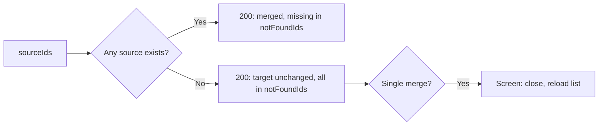
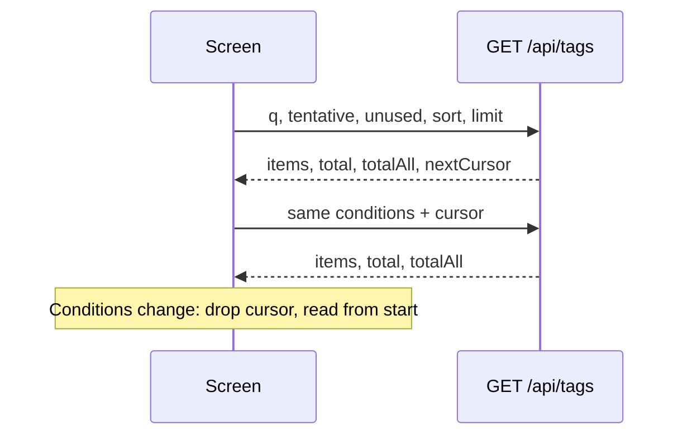

# Contract: Paged reads, bulk actions and `createdAt` in the screen API

Source of truth: [api/openapi.yaml](../../../api/openapi.yaml). This document
lists only the added fields, routes, parameters and errors. The error shape,
the same-origin check, JSON body reading, and the additions to
`requiresJSONBody` and `openapi_routes_test.go` stay as in
[specs/014-video-tags/contracts/tags-api.md](../../014-video-tags/contracts/tags-api.md).
The decisions are in [research.md R-1, R-4 to R-6, R-8, R-13 and R-14](../research.md).
Every route is owner-only (`security` as for the existing tag operations). The
external API (`api/external-v1.yaml`) does not change.

| Part | Status |
| --- | --- |
| §1 to §3, and `Tag.createdAt` and the bulk action schemas in §0 | Merged into the feature branch; unchanged by the revision of the parent Issue |
| The list schemas in §0, §5, §6 and their functions in §4 | Added by the revision |

## 0. Schema changes

| Schema | Added field | Rule |
| --- | --- | --- |
| `Tag` | `createdAt: string, format: date-time` (`required`) | `tags.created_at`. Appears in `GET /api/tags` and in the responses of create, rename, merge, synonym and confirm (merged) |
| `TagList` | `total: integer` (`required`), `totalAll: integer` (`required`), `nextCursor: string` (optional) | `total` is the number of tags matching the conditions (`q`, `tentative`, `unused`); `totalAll` is the number of all tags. `nextCursor` is present only on a request with `limit` when more remain (as in `LibraryPage`) |
| `RejectedTagNameList` | `total: integer` (`required`), `nextCursor: string` (optional) | `total` is the number of all rejected names |

New schemas (merged bulk actions):

```yaml
TagBatchRequest:
  type: object
  required: [action, ids]
  additionalProperties: false
  properties:
    action: { type: string, enum: [confirm, reject, delete] }
    ids:
      type: array
      minItems: 1
      maxItems: 20000
      items: { type: integer, format: int64 }

TagBatchResponse:
  type: object
  required: [appliedIds, notFoundIds, notApplicableIds]
  additionalProperties: false
  properties:
    appliedIds:        { type: array, items: { type: integer, format: int64 } }  # ids processed
    notFoundIds:       { type: array, items: { type: integer, format: int64 } }  # ids that no longer existed
    notApplicableIds:  { type: array, items: { type: integer, format: int64 } }  # ids of a kind the action does not apply to

TagMergeResponse:
  type: object
  required: [tag, notFoundIds]
  additionalProperties: false
  properties:
    tag:         { $ref: "#/components/schemas/Tag" }                            # the merge target after the merge
    notFoundIds: { type: array, items: { type: integer, format: int64 } }        # sources that no longer existed

TagImpactRequest:
  type: object
  required: [action, ids]
  additionalProperties: false
  properties:
    action: { type: string, enum: [reject, delete, merge] }   # the action being confirmed; it decides which kinds are counted
    ids:
      type: array
      minItems: 1
      maxItems: 20000
      items: { type: integer, format: int64 }

TagImpactResponse:
  type: object
  required: [tagCount, videoCount]
  additionalProperties: false
  properties:
    tagCount:   { type: integer }   # ids that exist now and that action applies to
    videoCount: { type: integer }   # videos now in the library carrying any of them (no duplicates)
```

New schema (added by the revision):

```yaml
TagSort:
  type: string
  enum: [name, countDesc, countAsc, createdDesc, createdAsc]
  default: name
  # name is the natural name order (no direction). Tags with the same value sort by
  # natural name order, then by id (specs/036-tag-admin-scale/data-model.md §0, §2)
```

`ErrorReason` gains `too_many_tags` (with `limit`, the same shape as
`too_many_videos`; merged).

## 1. `POST /api/tags/batch`

Confirms, rejects or deletes several tags in one transaction.

| Body | Success | Error |
| --- | --- | --- |
| `TagBatchRequest` | 200 `TagBatchResponse` | 400 `invalid_request` (`action` is not one of the 3 values, `ids` is empty, `too_many_tags`) |

| Case | Rule |
| --- | --- |
| Duplicate `ids` | Treated as one. The three response arrays do not overlap and together equal the deduplicated `ids`, in the order they appear in `ids`. An empty array is `[]`, never `null` |
| Kinds the action applies to | `TagBatchApplies` in [data-model.md §1](../data-model.md#1-values-added-to-domain): `confirm` and `reject` apply to tentative tags, `delete` to confirmed tags. Other ids change nothing and go to `notApplicableIds` |
| Missing ids | `notFoundIds` |
| The rest | Processed in one transaction ([data-model.md §2](../data-model.md#2-store-operations)). If the transaction fails, `500` and nothing changes |
| Routing | `/api/tags/batch` and `/api/tags/impact` are told apart from `/api/tags/{id}` by the `ServeMux` rule that literal segments win. `openapi_routes_test.go` checks that `{id}` takes neither (as for `/api/tags/rejected-names`) |
| Screen after `reject` | Reads the first page of rejected names again (§6), as after a single reject |
| Single-tag routes | `POST /api/tags/{id}/confirm` and `/reject` and `DELETE /api/tags/{id}` do not change; row actions keep using them |

## 2. `POST /api/tags/{id}/merge` changes

Merges one or more source tags into the tag `{id}`.

| Body | Success | Error |
| --- | --- | --- |
| `{ sourceIds: int64[] }` (1 to 20,000) | 200 `TagMergeResponse` | 400 `invalid_request` (`sourceIds` empty, `too_many_tags`, or `sourceIds` containing `{id}`: reason `merge_same_tag`), 404 `tag_not_found` (the target does not exist) |

- `sourceId` in `MergeTagRequest` is removed and `sourceIds` is `required`. A
  single merge (the row's "Merge into another tag…") also sends
  `sourceIds: [sourceId]`.
- The response changes from `Tag` to `TagMergeResponse`. Missing sources are
  skipped and listed in `notFoundIds`; the rest merge in one transaction.

The diagram shows how the outcome depends on which sources still exist.



A single merge that gets every source back in `notFoundIds` is handled like
today's `tag_not_found`: the screen closes the dialog and reloads the list.
When the target is among the selected tags, the screen removes it from the
sources before sending (Edge Case). When the target is the only source left,
the screen does not send (the action cannot run).

## 3. `POST /api/tags/impact`

Counts the tags and videos a bulk reject, delete or merge would affect, without
changing anything.

| Body | Success | Error |
| --- | --- | --- |
| `TagImpactRequest` | 200 `TagImpactResponse` | 400 `invalid_request` (`action` is not one of the 3 values, `ids` is empty, `too_many_tags`) |

| Rule | Detail |
| --- | --- |
| Why a body | Thousands of ids do not fit in a URL; the same shape as `POST /api/video-tags/summary` |
| What is counted | Only `ids` that exist now and that `action` applies to (`TagImpactApplies` in [data-model.md §1](../data-model.md#1-values-added-to-domain)): `reject` counts tentative tags, `delete` confirmed tags, `merge` both. Tags that `POST /api/tags/batch` would skip, and their videos, are not counted. For a merge, the screen sends the sources without the target |
| `videoCount` | Counted as `TagImpact` in [data-model.md §2](../data-model.md#2-store-operations) |
| Screen | Called when the bulk reject, delete or merge confirmation opens; the counts show as loading until the response. On failure the confirmation shows the reason and the action cannot run, so no action runs from a confirmation without counts. Bulk confirm asks for no confirmation and does not call it (requirement 11) |

## 4. `web/src/api` functions

Added to or changed in `tags.ts`.

| Function | Behaviour |
| --- | --- |
| `listTagPage(query, signal)` | Added by the revision. Calls `GET /api/tags` with the §5 parameters and returns `TagList` (`items`, `total`, `totalAll`, `nextCursor`). Does not touch the shared cache. Takes the caller's `AbortSignal`, to abort when the conditions change |
| `listRejectedTagNamePage(cursor, limit, signal)` | Added by the revision. Calls `GET /api/tags/rejected-names` with the §6 parameters and returns `RejectedTagNameList`. Replaces the current `listRejectedTagNames` |
| `getTags`, `refreshTags`, `subscribeTags`, `currentTags` | Unchanged (`GET /api/tags` without `limit`, every tag, used by suggestions and filter validation). `listTags` keeps using only `items` |
| `afterTagChanged` | Changed by the revision. With subscribers (`subscribeTags`) it reloads as before; without, it drops `held` so the next `getTags` reads again ([research.md R-12](../research.md#r-12-actions-update-the-loaded-rows-in-place-positioned-with-a-port-of-naturalsortkey)). `clearListSnapshot` does not change |
| `batchTags(action, ids)` | `POST /api/tags/batch`. Calls `afterTagChanged` once on success (merged) |
| `mergeTag(id, sourceIds)` | Returns `TagMergeResponse`. `tag_not_found` goes through `refreshOnStaleTagError` (merged) |
| `tagImpact(action, ids)` | `POST /api/tags/impact`. Does not touch the shared cache (merged) |
| `Tag`, `TagSort` | From the generated code |

| Constant or text | Rule |
| --- | --- |
| `errorText` | Has text for `too_many_tags` (merged) |
| `maxTagBatch = 20000` | Sits next to `maxVideoTagsSelection`. The limit applies to the number of ids sent, so the screen disables only "select all loaded" (the header checkbox) when the loaded rows exceed it, and disables bulk actions only when the selection exceeds it ([research.md R-4](../research.md#r-4-bulk-confirm-reject-and-delete-use-one-post-apitagsbatch-transaction-that-skips-and-counts-misses)) |
| `tagPageLimit = 100` | Added; the number of tags per page on the screen |

## 5. `GET /api/tags` parameters

| Parameter | Type | Default | Meaning |
| --- | --- | --- | --- |
| `q` | string, `maxLength: 100` | empty | Search term. Folded with `FoldForMatch` and trimmed; when not empty, only tags whose original name or synonym matching form contains it are returned (the matching form of [014 data-model.md §7](../../014-video-tags/data-model.md#7-matching-tag-names-in-the-search-box); the term is not split into words) |
| `tentative` | boolean | false | When true, tentative tags only |
| `unused` | boolean | false | When true, only tags on no videos. ANDed with `tentative` and `q` |
| `sort` | `TagSort` | `name` | Sort order. Tags with the same value sort by natural name order, then by `id` |
| `cursor` | string | — | `nextCursor` from the previous response. Opaque |
| `limit` | integer, 1 to 200 | — | Tags per page. **Omitted, every tag** is returned without `nextCursor` (the existing form used by suggestions, filter validation and the external API path) |

| Success | Error |
| --- | --- |
| 200 `TagList` (`items`, `total`, `totalAll`, and `nextCursor` when `limit` is set and more remain) | 400 `invalid_request` (`sort` not one of the 5 values, `limit` out of range, `cursor` unreadable or from another sort order, `q` over 100 characters) |

The diagram shows how the screen reads the list in pages.



| Rule | Detail |
| --- | --- |
| `total`, `totalAll` | `total` applies all of `q`, `tentative` and `unused`; `totalAll` applies none. Both are returned regardless of paging (as `LibraryPage.total`) |
| Cursor reuse | Use a `cursor` with the same `q`, `tentative`, `unused` and `sort`. When the conditions change, the screen drops the cursor and reads from the start. A cursor from another `sort` returns `400`; the result of reusing a cursor with other conditions (`q` and so on) is not guaranteed (as in the library) |
| Changes during paging | When another tab adds, removes or renames tags mid-paging, the guarantee matches the library keyset ([013 list-api.md §5](../../013-library-search/contracts/list-api.md#5-cursor-and-errors)). The screen drops duplicate `id`s and reports a `totalAll` mismatch ([data-model.md §4](../data-model.md#4-screen-state)) |
| Row content | Video count (`videoCount`), synonyms, `tentative` and `createdAt` are returned as before |
| External API | `GET /api/v1/tags` does not change (it returns the same result as the request without `limit`, in its current form) |
| Caching | `Cache-Control: no-store`, as now |

## 6. `GET /api/tags/rejected-names` parameters

| Parameter | Type | Default | Meaning |
| --- | --- | --- | --- |
| `cursor` | string | — | `nextCursor` from the previous response |
| `limit` | integer, 1 to 200 | 100 | Names per page |

| Success | Error |
| --- | --- |
| 200 `RejectedTagNameList` (`items`, `total`, and `nextCursor` when more remain) | 400 `invalid_request` (`limit` out of range, `cursor` unreadable) |

| Rule | Detail |
| --- | --- |
| Order | Natural name order (`sort_key`, then `name` byte order; [data-model.md §0](../data-model.md#0-migration)) |
| Removal | `DELETE /api/tags/rejected-names?name=…` does not change ([031 contracts/screen-api.md §3](../../031-tentative-tags/contracts/screen-api.md#3-rejected-names)) |
| Screen | On open, receives the first page and shows `total` at the entry point; when scrolled to the end, appends the next page with `nextCursor` ([research.md R-13](../research.md#r-13-rejected-names-load-in-pages-from-get-apitagsrejected-names-with-more-loaded-on-scroll)) |
