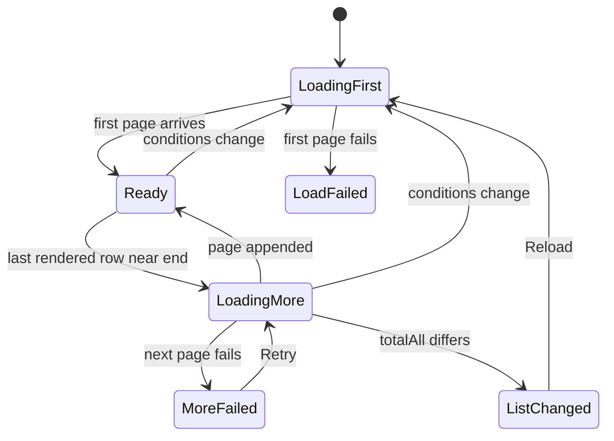

# Data model: Paged tag list, bulk tag actions and screen state

Parent Issue: #651. The rest of the model is unchanged. Sources of truth:

| Topic | Source |
| --- | --- |
| Existing table definitions | [internal/store/migrations/](../../internal/store/migrations/) |
| Tag tables, name rules and write rules | [specs/014-video-tags/data-model.md](../014-video-tags/data-model.md) |
| Tentative tags and rejected names | [specs/031-tentative-tags/data-model.md](../031-tentative-tags/data-model.md) |

This file covers only the values added to `domain`, the store operations added or changed, and the rules of
the screen's state. Operations not named here (single create, rename, delete, confirm, reject, synonyms,
adding and removing tags on videos, video counts) do not change.

The bulk operations of [Values added to `domain`](#values-added-to-domain) to [Write rules](#write-rules) (`BatchTags`, `MergeTags`, `TagImpact`) are merged into the feature branch
and unchanged by the revision of the parent Issue. The [Migration](#migration), the page values in [Values added to `domain`](#values-added-to-domain), `ListTags`,
`ListRejectedTagNames` and the key writes of [Store operations](#store-operations), and [Screen state](#screen-state) were added or rewritten by the revision.

## Migration

One migration, `00030_tag_sort_keys.sql`
([research.md R-10](research.md#r-10-a-natural-order-name-key-sort_key-on-tag_names-and-rejected_tag_names-filled-by-the-startup-key-refresh)).
Table meanings and existing columns do not change.

| Table | Added columns | Rule |
| --- | --- | --- |
| `tag_names` | `sort_key text not null default ''` | `domain.NaturalSortKey(name)`, written with `search_key` in the same transaction by every operation that writes a name row (create, synonym, create on assignment, rename); a merge that moves `tag_id` leaves it unchanged |
| `rejected_tag_names` | `sort_key text not null default ''`, `search_version integer not null default 0` | `sort_key` is `domain.NaturalSortKey(name)`, written by reject; `search_version` means the same as `tag_names.search_version` (`domain.SearchKeyVersion`) |

The migration runs `update tag_names set search_version = 0`, and `TagStore.RefreshSearchKeys` at startup
fills `sort_key` of existing rows together with `search_key` ([Store operations](#store-operations)). Existing `rejected_tag_names` rows default
to `search_version` 0, so the same refresh picks them up. The key is a rebuildable derived value, rebuilt by
the same mechanism when `SearchKeyVersion` is raised.

**Natural name order**: the byte order of `sort_key`, then `tags.id` (for rejected names, the byte order of
`name`). `NaturalSortKey` works on the matching form (`FoldForMatch`), so names equal after folding
full-width, half-width and kana tie and are ordered by `id` (R-10, "Change in the name order").

## Values added to `domain`

Merged (bulk operations):

| Value | Contents |
| --- | --- |
| `Tag.CreatedAt time.Time` | `tags.created_at` (Unix seconds); set by every operation that returns a `Tag`; `Tag.createdAt` in the API ([research.md R-8](research.md#r-8-date-created-is-tagscreated_at-exposed-as-tagcreatedat-tags-created-in-the-same-second-sort-by-name)) |
| `TagBatchAction` | Three values, `TagBatchConfirm`, `TagBatchReject`, `TagBatchDelete`, with `Valid()` |
| `TagBatchOutcome{AppliedIDs, NotFoundIDs, NotApplicableIDs []int64}` | Result of a bulk operation; each array keeps the order of `ids` and is empty, not `nil`, when it has no ids |
| `TagMergeOutcome{Tag Tag, NotFoundIDs []int64}` | Result of a merge; `Tag` is the target after the merge |
| `TagImpactAction` | Three values, `TagImpactReject`, `TagImpactDelete`, `TagImpactMerge` (the actions that ask for confirmation, requirement 11), with `Valid()` |
| `TagImpact{TagCount, VideoCount int}` | The counts the confirmation shows: `TagCount` is the existing `ids` the action works on (`TagImpactApplies`); `VideoCount` is the videos carrying any of them, without duplicates |
| `MaxTagBatch = 20000` | Limit of `ids` and `sourceIds`, for the same reason as `MaxVideoTagsSelection` ([R-4](research.md#r-4-bulk-confirm-reject-and-delete-use-one-post-apitagsbatch-transaction-that-skips-and-counts-misses)) |

The kinds an action works on are the pure function `TagBatchApplies(action TagBatchAction, tentative bool)
bool`:

| Action | True when |
| --- | --- |
| `confirm`, `reject` | `tentative` is true |
| `delete` | `tentative` is false |

This is the per-row rule of the screen
([031 ui-design.md "Row"](../031-tentative-tags/ui-design.md#row)), so the server also keeps requirement 8,
"the existing per-row rules do not change". The confirmation count uses
`TagImpactApplies(action TagImpactAction, tentative bool) bool`: `reject` and `delete` return what
`TagBatchApplies` returns for the action of the same name, and `merge` is true for either kind.

Added by the revision (paging,
[R-1](research.md#r-1-the-server-pages-the-list-and-applies-search-filters-and-sort-to-every-tag)):

| Value | Contents |
| --- | --- |
| `TagSort` | `TagSortName` (default), `TagSortCountDesc`, `TagSortCountAsc`, `TagSortCreatedDesc`, `TagSortCreatedAsc`; the same strings as the API's `TagSort` (`name`, `countDesc`, `countAsc`, `createdDesc`, `createdAsc`), with `Valid()` |
| `TagListQuery{Search string; TentativeOnly, UnusedOnly bool; Sort TagSort; Cursor string; Limit int}` | List conditions. `Search` is the raw string from the caller; the store folds it with `FoldForMatch` and trims it (empty means no search). `Limit` 0 means every tag (the cursor is ignored and `NextCursor` is empty). An empty `Sort` means `TagSortName` |
| `TagPage{Items []Tag; Total, TotalAll int; NextCursor string}` | One page. `Total` counts tags matching the conditions (search and filters); `TotalAll` counts all tags; `NextCursor` is empty when there is no next page |
| `RejectedTagNamePage{Items []string; Total int; NextCursor string}` | One page of rejected names |
| `MaxTagPageLimit = 200` | Upper limit of `limit`, as in `GET /api/library` |

`ErrInvalidCursor` is the one from 013 (a cursor made under another sort, or one that cannot be parsed).

## Store operations

Added to or changed on `TagStore`. Every operation uses only the shared SQLite connection and publishes no
domain event (tag changes have no side effects; the `TagStore` paragraph of ARCHITECTURE.md is unchanged).
`ids` go to `json_each` as one argument (as in `external_video_tags.go`).

Merged (bulk operations):

| Operation | What one transaction does |
| --- | --- |
| `BatchTags(ctx, action, ids) (TagBatchOutcome, error)` | Deduplicates `ids` and joins `tags` to read which exist and their `tentative`. Missing ids go to `NotFoundIDs`, ids where `TagBatchApplies` is false to `NotApplicableIDs`. For the rest: `confirm` runs `update tags set tentative = 0`; `reject` runs `insert or ignore` of each tag's primary name into `rejected_tag_names`, then `delete from tags`; `delete` runs `delete from tags`. Those ids are `AppliedIDs` |
| `MergeTags(ctx, targetID, sourceIDs) (TagMergeOutcome, error)` | `ErrTagNotFound` when the target is missing. Deduplicates `sourceIDs`; missing ids go to `NotFoundIDs`. The rest (minus the target's id) go to `mergeTagsInto`, which copies assignments, moves names and deletes sources in a statement count independent of the number of sources; then `tagByID` reads the target once |
| `TagImpact(ctx, action, ids) (TagImpact, error)` | Deduplicates `ids`, reads which exist and their `tentative`, and keeps only ids where `TagImpactApplies` is true. `TagCount` is their number. `VideoCount` adds the kept ids as a condition to `taggedVideosSQL` and counts `distinct video_id` |

Changed or added by the revision:

| Operation | What it does |
| --- | --- |
| `ListTags(ctx, query TagListQuery) (TagPage, error)` | Replaces `ListTags(ctx)`. One query attaches counts to every tag from the `taggedVideosSQL("")` aggregation (a CTE), applies the conditions, the sort (table below) and the cursor condition, and reads `Limit + 1` rows; when row `Limit + 1` exists, `NextCursor` is built from row `Limit`. Synonyms of the page's tags are read once with `tag_id in (json_each)`. `Total` is `count(*)` under the same conditions; `TotalAll` is `count(*)` of `tags`. With `Limit` 0, only the conditions and the sort apply and every tag is returned (the external API's `listTags` and the full candidate list call it with `TagListQuery{}`) |
| `ListRejectedTagNames(ctx, cursor string, limit int) (RejectedTagNamePage, error)` | Replaces the full-list form. Reads `limit + 1` rows ordered by `sort_key, name`; `Total` is `count(*)`. The cursor wraps `sort_key` and `name` |
| `RefreshSearchKeys(ctx) (int, error)` | Rewrites `search_key` and `sort_key` of `tag_names` rows whose `search_version` is below the current version, and `sort_key` of `rejected_tag_names` rows under the same condition. Returns the number of rows rewritten (both tables together) |
| Operations that write a name row (create, synonym, create on assignment and rename through `insertTagName`; the `rejected_tag_names` insert of `RejectTag` and `BatchTags(reject)`) | Write `sort_key = domain.NaturalSortKey(name)` in the same statement |

The conditions of `ListTags`:

| Condition | SQL |
| --- | --- |
| `Search` | `exists (select 1 from tag_names tn where tn.tag_id = t.id and instr(tn.search_key, ?) > 0)` |
| `TentativeOnly` | `t.tentative = 1` |
| `UnusedOnly` | The video count is 0 |

Sort orders and keyset conditions follow the same idea as `orderBy` and `after` of `listOrder`. The value and
the name can run in opposite directions, so the condition is expanded rather than one row-value comparison:

| `TagSort` | `order by` | Cursor wraps | "After the cursor" condition |
| --- | --- | --- | --- |
| `name` | `tn.sort_key asc, t.id asc` | `sort_key`, `id` | `(tn.sort_key, t.id) > (?, ?)` |
| `countDesc` / `countAsc` | `video_count desc/asc, tn.sort_key asc, t.id asc` | `video_count`, `sort_key`, `id` | `video_count < ?` (`>` for asc) `or (video_count = ? and (tn.sort_key, t.id) > (?, ?))` |
| `createdDesc` / `createdAsc` | `t.created_at desc/asc, tn.sort_key asc, t.id asc` | `created_at`, `sort_key`, `id` | Same shape as the count sorts |

The cursor is an opaque string wrapping the sort name, the value, `sort_key` and `id`. A cursor from another
sort, or one that cannot be parsed, returns `ErrInvalidCursor` (the same shape as `encodeCursor` and
`decodeCursor` in `listing.go`, sharing what can be shared).

The two invariants of [031 data-model.md, Migration](../031-tentative-tags/data-model.md#migration) gain a third,
checked in `invariants_test.go`:

| Rule | Enforced in |
| --- | --- |
| A `tag_names` or `rejected_tag_names` row at the current `search_version` has `sort_key` equal to `NaturalSortKey(name)` | `internal/store/invariants_test.go` |

The signatures of `ListTags` and `ListRejectedTagNames` in the `Tags` interface declared by `internal/httpapi`
(`router.go`) change. The wiring in `cmd/mdm` does not change.

## Write rules

The tables of [014 data-model.md, Write rules](../014-video-tags/data-model.md#write-rules) and [031 data-model.md, Write rules](../031-tentative-tags/data-model.md#write-rules) gain no new kind of write. A bulk operation gives the same result as running
the single operation several times in one transaction (merged).

| Bulk operation | Relation to the single operation |
| --- | --- |
| Confirm | Same as `ConfirmTag` on each id; an already confirmed tag is skipped and counted (the single route changes nothing and returns 200) |
| Reject | Same as `RejectTag` on each id; a confirmed tag is skipped and counted (the single route returns `409 tag_not_tentative`) |
| Delete | Same as `DeleteTag` on each id; a tentative tag is skipped and counted (the single route also deletes tentative tags, but the screen shows no delete on a tentative row, [031 data-model.md, Write rules](../031-tentative-tags/data-model.md#write-rules)) |
| Merge | `mergeTagsInto` produces the result of merging each source in turn, in a statement count independent of the number of sources; the target is confirmed once |

`sort_key` is written with its name row and removed with it, so it does not affect the write rules.

## Screen state

The state the tag management screen (`web/src/tags/TagsPage.tsx`) holds, and its rules. The conditions
(search term, filters, sort) and the tab go into the URL query (`web/src/tags/tagListUrl.ts`,
[ui-design.md "URL state"](ui-design.md#url-state)); `localStorage` keeps only the sort order (the addendum
of
[R-7](research.md#r-7-the-sort-order-is-a-per-device-preference-in-localstorage-filters-stay-in-screen-state)).
The screen does not use the shared cache (`getTags` and `subscribeTags` in `web/src/api/tags.ts`,
[R-1](research.md#r-1-the-server-pages-the-list-and-applies-search-filters-and-sort-to-every-tag)).

The diagram below shows the list's loading states and what each condition change, page and action does.

| State | Rule |
| --- | --- |
| Conditions `query` | Search term, `Tentative only`, `Unused only`, and sort `TagSort` (URL `sort`; without it, the value saved by `tagListPreferences.ts`; `name` when that is unreadable or broken). When any changes: abort the request in flight, advance the generation number, clear the selection, and request the first page (Edge Cases "while selecting…" and "while more rows load…"). The previous rows stay until it arrives (no empty flash) |
| Page `rows` | Loaded rows (`Tag[]`), `total`, `totalAll`, `nextCursor`, whether more rows are loading, and the next-page failure. More rows are appended with duplicates dropped by `id` ([R-11](research.md#r-11-more-rows-load-100-at-a-time-near-the-end-duplicates-are-dropped-by-id-and-a-count-mismatch-asks-for-a-reload)). A page is 100 tags |
| Load-more trigger | Requests once when the virtualizer's last rendered row is at or past `rows.length - overscan`, `nextCursor` exists and nothing is loading. On failure the loaded rows stay, and `Retry` on the failure row at the end retries the same cursor (Edge Case "loading more fails") |
| Mismatch `inconsistent` | True when `totalAll` in a next-page response differs from the screen's value. Rows stay, loading more stops, and the list-changed line with `Reload` appears; `Reload` loads from the first page and clears the selection (Edge Case "while more rows load, another tab…") |
| Load failure | First page fails: with no list held, the existing failure display with `Retry`; with a list held, that list stays and the reason is noted (Edge Case "loading the list fails") |
| Visible rows `visibleRows` | `rows` as is. A row being renamed that is not in `rows` (after the conditions changed and the first page reloaded) is inserted at its `sort` position and kept (Edge Case "row being renamed"). The position comes from `naturalSortKey` and the sort value ([R-12](research.md#r-12-actions-update-the-loaded-rows-in-place-positioned-with-a-port-of-naturalsortkey)) |
| Heading count | `〈total〉 of 〈totalAll〉` when search or a filter is on (acceptance criterion 8), otherwise `〈totalAll〉`. The loaded count is not shown, and an inserted row being renamed is not counted. Loading until the first page arrives |
| Tab | `Tags` or `Rejected names` (URL `tab`). Switching closes the selection, create and rename. While `Rejected names` is open, the tag list does not load more |
| Selection `Set<number>` | A subset of the ids in `rows`; ids that leave `rows` and the id of a row being renamed are removed. Select all loaded selects every id in `rows` (requirement 10; tags not loaded are not selected). The limit counts the ids sent ([R-4](research.md#r-4-bulk-confirm-reject-and-delete-use-one-post-apitagsbatch-transaction-that-skips-and-counts-misses)): when `rows.length` exceeds `maxTagBatch`, only the header checkbox (select all loaded) is disabled; bulk actions are disabled only when the selection exceeds `maxTagBatch`, so a row-by-row selection works however many rows are loaded (requirements 8 and 9) |
| Rows rendered | Rows of `visibleRows` the virtualizer places in or near the viewport, plus the focused row and the row being renamed ([R-2](research.md#r-2-rows-are-virtualized-with-usewindowvirtualizer-from-tanstackreact-virtual), merged) |
| Rejected names | The first page (`items`, `total`, `nextCursor`), refetched when the screen opens and on the 031 triggers. Scrolling the `Rejected names` tab to the end appends more. A name removed with `Allow again` is removed locally and `total` drops ([R-13](research.md#r-13-rejected-names-load-in-pages-from-get-apitagsrejected-names-with-more-loaded-on-scroll)) |
| Merge dialog candidates | Candidates from `GET /api/tags?q=…&limit=…` with the folded input. Opened from a row, the sources are excluded; opened from the selection (`fromSelection`), the selected tags stay as candidates (choosing one as the target removes it from the sources; requirement 9 and the Edge Case, the merged form). A change of input aborts the request in flight ([R-14](research.md#r-14-merge-target-candidates-come-from-get-apitagsqlimit)) |

After an action, single or bulk, the screen updates `rows` in place (R-12). On failure nothing changes and the
selection stays. When `notFoundIds` is not empty, the list reloads from the first page.

| Action | Change to `rows` and counts |
| --- | --- |
| Confirm | Set `tentative: false`; remove the row when `Tentative only` is on |
| Reject, delete, merge source | Remove the row; decrease `total` and `totalAll` |
| Merge target | Rewrite with the response's `tag`: replace and reposition when in `rows`, otherwise insert at its position (a tag not loaded, fetched by the merge dialog). Check both the pre-merge `Tag` (the row or the dialog candidate) and the response's `tag` against the current conditions: matched before but not after, remove and decrease `total`; not matched before but after, increase `total` (the source names become synonyms, so the target can start matching the search term) |
| Rename | Replace the name and reposition; remove the row when it no longer meets the current conditions |
| Create | Insert at its position and increase `total` and `totalAll` when it meets the conditions; otherwise increase only `totalAll` |

Whether a row meets the conditions uses a `foldForMatch` substring match, `tentative` and `videoCount === 0`
(R-3). Repositioning and inserting place the row at the position given by `naturalSortKey` and the sort
value, but when that position is outside the loaded range (after the last row while `nextCursor` exists) the
row is not put in `rows` (and is removed if it was there). The next-page cursor is the last row's key, so the
next page returns rows after it but not rows that moved before it (such as a merge target whose count rose
under `countDesc`); a row that moved forward goes missing unless the screen places it (R-12).

The shared cache (`web/src/api/tags.ts`) stays for the candidates and the filter check. `afterTagChanged`,
which the single and bulk action functions call after success, refetches as before when there are
subscribers, and otherwise drops `held` (R-12). The handling of the video list snapshot
(`clearListSnapshot`) does not change.
