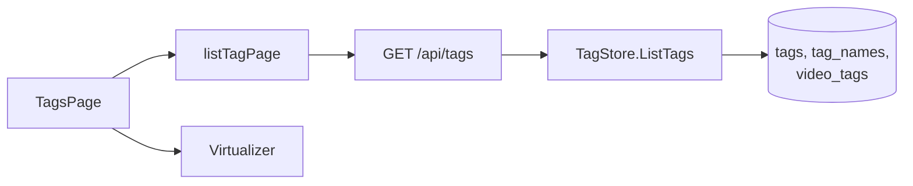
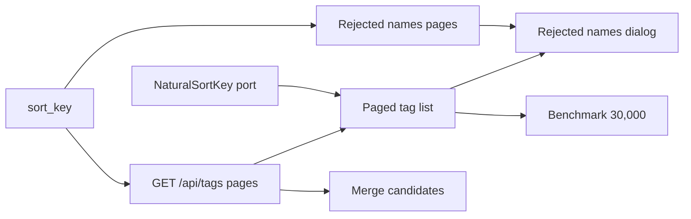

# Implementation Plan: Keep the tag admin screen responsive with thousands of tags, and tidy them up with sort, filters and bulk actions

**Branch**: `feature/036-tag-admin-scale` | **Parent Issue**: #651

**Input**: The parent Issue. It is this feature's specification.

## Summary

The tag admin screen (`/tags`) shows its list as soon as it opens with
thousands to tens of thousands of tags, and search, scrolling and row actions
do not freeze it. The feature adds sort orders (name, video count, date
created), a filter for unused tags (on no videos), and bulk confirm, reject,
delete and merge on several selected rows. Rejected names, search, filters,
sort and bulk actions stay within reach while the list is scrolled.

### Changes in this revision

The parent Issue was revised: the screen loads only what it shows and loads
more on scroll; search, sort and filters apply to every tag, including tags not
yet loaded; "select all" covers the loaded rows only; the scale gains 30,000
tags; and rejected names are also loaded only as far as shown. This
contradicts R-1 of the earlier Plan ("receive every tag in one response, filter
on the screen, draw only the visible rows"). Child Issues #678 to #687 are all
merged into the feature branch. The table shows what each part of that work
becomes.

| Fate | What |
| --- | --- |
| Kept | `Tag.createdAt` (R-8) |
| Kept | `POST /api/tags/batch` and `POST /api/tags/impact` (R-4, R-6) |
| Kept | `sourceIds` on `POST /api/tags/{id}/merge` (R-5) |
| Kept | Row virtualization (R-2) |
| Kept | Sort order saved on the device (R-7) |
| Kept | Row checkboxes and the selection bar |
| Kept | Merge dialog width |
| Kept | The band below the top bar and the rejected names dialog |
| Kept | The benchmark tooling (R-9) |
| Kept, new role | The `FoldForMatch` port and its shared check (R-3) |
| Replaced | How the list is read: every tag → server pages ([research.md R-1](research.md#r-1-the-server-pages-the-list-and-applies-search-filters-and-sort-to-every-tag)) |
| Replaced | Where search, filters and sort run: screen → server |
| Replaced | Counts in the count line: computed on the screen → `total` and `totalAll` in the response |
| Replaced | What "select all" selects: every filtered tag → the loaded rows |
| Replaced | How rejected names are read: all → pages ([R-13](research.md#r-13-rejected-names-load-in-pages-from-get-apitagsrejected-names-with-more-loaded-on-scroll)) |
| Replaced | Source of merge target candidates: every tag on the screen → server search ([R-14](research.md#r-14-merge-target-candidates-come-from-get-apitagsqlimit)) |
| Added | The natural-order name key `sort_key` and its migration ([R-10](research.md#r-10-a-natural-order-name-key-sort_key-on-tag_names-and-rejected_tag_names-filled-by-the-startup-key-refresh)) |
| Added | Loading more, and handling of duplicates, count mismatches and failures ([R-11](research.md#r-11-more-rows-load-100-at-a-time-near-the-end-duplicates-are-dropped-by-id-and-a-count-mismatch-asks-for-a-reload)) |
| Added | Applying a change within the loaded rows, and the `NaturalSortKey` port ([R-12](research.md#r-12-actions-update-the-loaded-rows-in-place-positioned-with-a-port-of-naturalsortkey)) |
| Added | The 30,000 scale and its benchmark scenes (R-9) |

`## Implementation Work` does not repeat merged units; its units are only the
difference still needed on top of the current feature branch
(`plan-to-issues` skips child Issues that already exist). The earlier units are
recorded in child Issues #678 to #687 and in the git history.

| Area | Decision |
| --- | --- |
| List | `GET /api/tags` gains `q`, `tentative`, `unused`, `sort`, `cursor` and `limit`. The screen receives 100 tags at a time and loads more on scroll. A request without `limit` still returns every tag, for suggestions, filter validation and the external API (R-1, [contracts/screen-api.md §5](contracts/screen-api.md#5-get-apitags-parameters)) |
| Name keyset | `tag_names.sort_key` (`NaturalSortKey`) serves the name-order keyset; the startup key refresh fills it (R-10, [data-model.md §0](data-model.md#0-migration)) |
| Drawing | Loaded rows grow to the total once the end is reached, so drawing only visible rows stays ([R-2](research.md#r-2-rows-are-virtualized-with-usewindowvirtualizer-from-tanstackreact-virtual)) |
| Search | The server matches against `search_key` (`FoldForMatch`). The screen's port decides on the spot whether a changed row still matches the current conditions ([R-3](research.md#r-3-the-typescript-port-of-foldformatch-decides-on-the-screen-whether-a-loaded-row-still-matches)) |
| After an action | The screen rewrites the loaded rows without reading the list again and places rows with the `NaturalSortKey` port. The shared cache reloads only while it has subscribers (R-12) |
| Bulk actions | Unchanged from the merged work (R-4 to R-6). They act on loaded rows. The 20,000 limit applies to the number of ids sent; when more rows than that are loaded, only "select all loaded" is disabled, and a selection made row by row still works |
| Rejected names | `GET /api/tags/rejected-names` returns pages and the dialog loads more inside itself (R-13, [contracts/screen-api.md §6](contracts/screen-api.md#6-get-apitagsrejected-names-parameters)) |
| Benchmark | `scripts/tagsbench` gains the 30,000 scale (30,000 videos) and scenes for the transfer size on open and for scrolling while loading more (R-9, [quickstart.md](quickstart.md)) |
| Design | The Issue has the `ui` label, so the `design` stage revises `ui-design.md` to settle: the loading-more, failure and mismatch rows; the count line wording ("select all" over loaded rows); what is disabled over the limit (only the header checkbox; the current `ui-design.md` also disables "Confirm" and "More") and the reason text; loading more in the rejected names dialog; and how merge dialog candidates look while loading. The current `ui-design.md` follows the earlier Plan |

### Fixes after the visual review

After the implementation units merged, the visual review found that the action
row inside the content, the crowded count line, the selection bar floating at
the bottom of the screen and the rejected names dialog did not match the
library screen. The fix moves elements only and keeps behaviour and the server
API ("Proposal 1", approved in review):

| Element | Placement |
| --- | --- |
| Search, filters ("Tentative only" and "Unused only" in the "Filter" popover) and sort | The shared top bar, as in the library |
| Top of the content | Heading (count and "New tag"), tabs "Tags \| Rejected names", filter chips, column header |
| Heading while selecting | Replaced by the selection row |
| Rejected names | The body of their tab |
| Merge dialog candidates | A fixed-height list under the input |
| Conditions and tab | Kept in the URL |
| Count | Does not show the number loaded |

[ui-design.md](ui-design.md) is the source of truth for the layout. The decision
to keep state in the URL was added to
[research.md R-7](research.md#r-7-the-sort-order-is-a-per-device-preference-in-localstorage-filters-stay-in-screen-state).

## Technical Context

**Canonical definitions**:

| Subject | Source |
| --- | --- |
| Boundaries, dependency direction, role type rules, domain events, auth boundary, web layer split | [ARCHITECTURE.md](../../ARCHITECTURE.md), [.golangci.yml](../../.golangci.yml) (depguard) |
| Tag tables, name rules, video counts, matching in the search box | [specs/014-video-tags/data-model.md](../014-video-tags/data-model.md), [specs/014-video-tags/contracts/tags-api.md](../014-video-tags/contracts/tags-api.md), [internal/store/tags.go](../../internal/store/tags.go), [tag_listing.go](../../internal/store/tag_listing.go), [tag_lookup.go](../../internal/store/tag_lookup.go), [tag_search_keys.go](../../internal/store/tag_search_keys.go), [folder_tags.go](../../internal/store/folder_tags.go) (`taggedVideosSQL`), [internal/domain/tag.go](../../internal/domain/tag.go), [internal/domain/search.go](../../internal/domain/search.go) (`FoldForMatch`, `NaturalSortKey`, `SearchKeyVersion`) |
| Tentative tags and rejected names | [specs/031-tentative-tags/data-model.md](../031-tentative-tags/data-model.md), [specs/031-tentative-tags/contracts/screen-api.md](../031-tentative-tags/contracts/screen-api.md), [internal/store/tentative_tags.go](../../internal/store/tentative_tags.go) |
| Keyset pages, cursors, the title key `title_key` | [specs/013-library-search/contracts/list-api.md](../013-library-search/contracts/list-api.md), [specs/013-library-search/data-model.md](../013-library-search/data-model.md) (§4, §5), [internal/store/listing.go](../../internal/store/listing.go) (`listOrder`, `encodeCursor`, `decodeCursor`), [internal/store/search_keys.go](../../internal/store/search_keys.go) (startup key refresh) |
| Screen API and conversion | [api/openapi.yaml](../../api/openapi.yaml), [internal/httpapi/tags.go](../../internal/httpapi/tags.go), [internal/httpapi/router.go](../../internal/httpapi/router.go) (`Tags`), [internal/httpapi/external.go](../../internal/httpapi/external.go) (the caller of `listTags` for every tag) |
| Screen | [web/src/tags/](../../web/src/tags/), [web/src/api/tags.ts](../../web/src/api/tags.ts) (shared cache), [web/src/api/videosData.ts](../../web/src/api/videosData.ts) (`appendUnique`, `inconsistent`), [web/src/lib/foldForMatch.ts](../../web/src/lib/foldForMatch.ts), [web/src/preferences/tagListPreferences.ts](../../web/src/preferences/tagListPreferences.ts), [web/src/ui/Combobox.tsx](../../web/src/ui/Combobox.tsx), [web/src/i18n/en.ts](../../web/src/i18n/en.ts) |
| Screen layout rules and the virtual scrolling decision | [docs/design-docs/library-ui.md](../../docs/design-docs/library-ui.md) (§3, §6), [ui-design.md](ui-design.md) (follows the earlier Plan; `design` revises it) |
| Benchmark | [docs/how-to/tags-admin-benchmark.md](../../docs/how-to/tags-admin-benchmark.md), [scripts/tagsbench](../../scripts/tagsbench/), [web/bench/](../../web/bench/) |
| Generation and check entry points | [Taskfile.yml](../../Taskfile.yml) (`task check`, `task check-docs`, `task generate`, `task test-e2e`) |

**Feature-specific context**:

- One migration is added (`00030_tag_sort_keys.sql`,
  [data-model.md §0](data-model.md#0-migration)). It adds only derived key
  columns and does not change what the tables mean. The earlier "no migration"
  no longer holds.
- No npm or Go dependency is added (`@tanstack/react-virtual` is already
  merged). No domain event and no `/api/events` kind is added.
- The performance budget is acceptance criteria 1 to 4 of the parent Issue, up
  to 30,000 tags: first row within 1 second; the number of tags and bytes
  received on open does not change with scale; no freeze over 0.2 seconds after
  an action; no consecutive frames over 50 ms while scrolling and loading more.
  `task check` cannot verify these; [quickstart.md](quickstart.md) gives the
  measurement.
- The external API (`api/external-v1.yaml`) and MCP do not change.
  `GET /api/v1/tags` returns the same result through `TagListQuery{}` (every
  tag).
- `GET /api/tags` without `limit` still returns every tag, for suggestions and
  filter validation (`web/src/library/`, `web/src/player/`). Moving those off
  the full list is out of scope in the parent Issue (#674, #675).

## Constitution Check

| Gate | Verdict |
| --- | --- |
| Dependency direction (ARCHITECTURE.md "Intended dependency direction") | Pass. `internal/domain` holds values (`TagSort`, `TagListQuery`, `TagPage`, `RejectedTagNamePage`) and pure functions (`NaturalSortKey` exists). `internal/store` replaces `ListTags` and `ListRejectedTagNames` on `TagStore` and writes `sort_key`. `internal/httpapi` parses parameters and converts. `internal/app` and `cmd/mdm` are untouched |
| Role types do not call other roles' public methods; SQL stays in `internal/store` | Pass. The key refresh runs inside `TagStore.RefreshSearchKeys`, and its startup caller (`cmd/mdm`) does not change. Cursor encoding is shared with `listing.go` |
| API source of truth and generated files (AGENTS.md) | Pass. Edit `api/openapi.yaml` and run `task generate`. The new `required` fields on `TagList` and `RejectedTagNameList` are a screen contract whose only caller is `web/src/api/tags.ts` |
| Migration rules (`task migrations-check`, style of [014 data-model.md §1](../014-video-tags/data-model.md#1-migration)) | Pass. `00030` only adds columns and resets `search_version`; Down drops the columns. The keys are rebuildable derived values on the `SearchKeyVersion` mechanism ([013 data-model.md §5](../013-library-search/data-model.md#5-when-keys-are-built-and-search_version)) |
| Virtual scrolling decision (library-ui.md §3) | Pass. Paged reading still grows the loaded rows to the total, so the decision stands (R-2). The §3 statement "receives and holds every tag in one response" is corrected |
| Server output in English, screen text in the catalogue (gosmopolitan, i18n.md) | Pass. All new text goes in `web/src/i18n/en.ts` |
| Guests do not see the owner's data | Pass. `/tags` and the new parameters are on owner-only routes |
| Design documents describe the present (docs/design-docs/index.md) | Pass. Each unit updates its own part of ARCHITECTURE.md (the `TagStore` and `web/src/tags/` paragraphs), `docs/design-docs/library-ui.md` §3 and `docs/how-to/tags-admin-benchmark.md` |

The verdicts hold after Phase 1. There is no violation for Complexity Tracking.

## Project Structure

### Documentation (this feature)

```text
specs/036-tag-admin-scale/
├── plan.md               # This file
│                         # No spec.md — the parent Issue is the specification
├── research.md           # R-1 to R-14 (R-1 replaced and R-10 to R-14 added in the revision)
├── data-model.md         # Migration 00030, domain values, TagStore operations, screen-side state rules
├── quickstart.md         # Steps and expectations for measuring acceptance criteria 1 to 4 at scale
├── ui-design.md          # Output of the design stage; follows the earlier Plan and design revises it
└── contracts/
    └── screen-api.md     # Tag.createdAt, GET /api/tags parameters, POST /api/tags/batch, merge changes,
                          # POST /api/tags/impact, GET /api/tags/rejected-names parameters
```

### Source Code

**Affected boundaries** (the revision's difference; merged boundaries are as in
child Issues #678 to #687):

| Boundary | What changes |
| --- | --- |
| `internal/domain` | `TagSort`, `TagListQuery`, `TagPage`, `RejectedTagNamePage`, `MaxTagPageLimit`; the shared check cases for `NaturalSortKey` |
| `internal/store` | Migration `00030`; writing `sort_key` on `tag_names` and `rejected_tag_names`; extending `RefreshSearchKeys`; replacing them with `ListTags(query)` and `ListRejectedTagNames(cursor, limit)`; shared cursors; invariant tests |
| `internal/httpapi` | Parameters of `ListTags` and `ListRejectedTagNames` in `tags.go`, the call in `external.go`, `Tags` in `router.go`; `api/openapi.yaml` and generated files |
| `web/src/api` | `listTagPage`, `listRejectedTagNamePage`, `tagPageLimit` and `afterTagChanged` in `tags.ts` |
| `web/src/lib` | `naturalSortKey.ts` |
| `web/src/tags` | Paged reading and applying changes in `TagsPage`, loading more in `RejectedNames`, candidates in `MergeTagDialog` |
| `web/src/i18n` | New text |
| Benchmark | `scripts/tagsbench`, `web/bench/`, `docs/how-to/tags-admin-benchmark.md` |
| Documents | `ARCHITECTURE.md`, `docs/design-docs/library-ui.md` |

**New paths**:

- `internal/store/migrations/00030_tag_sort_keys.sql`
- `internal/domain/testdata/natural_sort_key.json` (key cases read by both Go
  and Vitest; R-12)
- `web/src/lib/naturalSortKey.ts`

**Structure decision**: the list page lives in `TagStore.ListTags`; no new role
type is created. Counting videos, filtering, sorting and the cursor fit in one
query over `tags`, `tag_names`, `video_tags` and `video_folder_names` (R-1,
R-10). Cursor encoding and keyset condition building are shared with
`listing.go`, not rewritten for tags. The diagram shows the path of one page
request.



`TagsPage` holds the conditions, pages and selection, and leaves only the
choice of rows to draw to the virtualizer
([data-model.md §4](data-model.md#4-screen-state)). The key port sits in
`web/src/lib/` next to `foldForMatch.ts`, as a pure function that calls no
server. The benchmark tooling stays out of product code, in `scripts/` and
`web/bench/` (R-9).

## Implementation Work

Merged units (#678 to #687) are not repeated. The units below are the
difference needed on top of the current feature branch. The diagram shows
which unit must land before which.



### Store a natural-order name key `sort_key` on `tag_names` and `rejected_tag_names`, filled at startup

**Scope**: `internal/store/migrations/00030_tag_sort_keys.sql`
([data-model.md §0](data-model.md#0-migration)). Every operation that writes a
name row (`insertTagName`, rename, the `rejected_tag_names` insert of
`RejectTag` and `BatchTags(reject)`) writes `sort_key = domain.NaturalSortKey(name)`
in the same statement. `TagStore.RefreshSearchKeys` fills `sort_key` together
with `search_key`, for `rejected_tag_names` too
([data-model.md §2](data-model.md#2-store-operations),
[research.md R-10](research.md#r-10-a-natural-order-name-key-sort_key-on-tag_names-and-rejected_tag_names-filled-by-the-startup-key-refresh)).
New invariants in `invariants_test.go`. The `TagStore` paragraph of
ARCHITECTURE.md (the key refresh handles two keys). The list order does not
change yet.

**Dependencies**: None

**Acceptance**: `task check` (including `migrations-check`) passes. Store tests
show:

- After the migration, existing rows (empty `sort_key`, `search_version` 0)
  become `NaturalSortKey(name)` through `RefreshSearchKeys`, and its return
  value is the total of rewritten rows in `tag_names` and `rejected_tag_names`.
- After `CreateTag`, `AddSynonym`, `RenameTag`, `ApplyVideoTags` (creating a
  tentative tag), `RejectTag` and `BatchTags(reject)`, each written row's
  `sort_key` equals `NaturalSortKey(name)` and its `search_version` is current.
- A row whose `tag_id` a merge moved keeps its `sort_key`.
- The invariant check passes after the existing tests and after bulk actions.

### Add search, filters, sort and pages to `GET /api/tags`

**Scope**: In `domain`, `TagSort`, `TagListQuery`, `TagPage` and
`MaxTagPageLimit` ([data-model.md §1](data-model.md#1-values-added-to-domain)).
Replace with `TagStore.ListTags(ctx, query)`: a CTE for video counts, `instr` on
`search_key`, the tentative and unused filters, five sort orders with keyset
conditions, reading `Limit + 1` rows for `NextCursor`, `Total` and `TotalAll`,
and every tag for `Limit` 0 ([data-model.md §2](data-model.md#2-store-operations),
[research.md R-1](research.md#r-1-the-server-pages-the-list-and-applies-search-filters-and-sort-to-every-tag)).
Share cursor encoding with `listing.go`. In `api/openapi.yaml`, the `listTags`
parameters, `TagSort`, and `total`, `totalAll` and `nextCursor` on `TagList`,
with generated files. Parameter parsing and `400` in
`internal/httpapi/tags.go`, the call in `external.go`, `Tags` in `router.go`
([contracts/screen-api.md §0, §5](contracts/screen-api.md#5-get-apitags-parameters)).
`listTagPage`, `tagPageLimit` and the `TagSort` type in `web/src/api/tags.ts`
(`TagListSort` in `tagListOrder.ts` moves to the generated `TagSort`;
[§4](contracts/screen-api.md#4-websrcapi-functions)). The screen does not
change yet.

**Dependencies**: `Store a natural-order name key sort_key on tag_names and rejected_tag_names, filled at startup`

**Acceptance**: `task check` passes. Store tests show:

- 250 tags (names include `tag 2`, `tag 10`, full-width and kana) read in three
  pages at `Limit` 100 return every tag once in `sort_key, id` order; the third
  page's `NextCursor` is empty; `Total` and `TotalAll` are 250 on every page.
- `Search` set to `ＡＣＴＩＯＮ` matches the tag named `action` and a tag with
  the synonym `Action Movie`, and `Total` is that count (acceptance criterion 9).
- `UnusedOnly` gives `Total` equal to the number of unused tags, every `Items`
  count is 0, and it combines with `TentativeOnly` and `Search` (acceptance
  criterion 8, requirement 6).
- `countDesc` puts the tag with the most videos first and unused tags last,
  ties by name (acceptance criterion 5).
- `createdDesc` puts the newest tag first (acceptance criterion 6).
- Count and date orders lose and repeat nothing when tags on both sides of a
  page boundary share a value.
- A cursor from another sort order returns `ErrInvalidCursor`.
- `Limit` 0 returns every tag with an empty `NextCursor`.
- The existing `ListTags` tests (counts, synonyms, `CreatedAt`) keep passing
  with `TagListQuery{}`.

httpapi tests show:

- `GET /api/tags?limit=100&sort=countDesc` returns 100 `items` with `total`,
  `totalAll` and `nextCursor`, and `cursor` reads the rest.
- `limit=0`, `limit=201`, `sort=foo`, a broken `cursor` and a 101-character `q`
  return `400 invalid_request`.
- No parameters return every tag without `nextCursor`.
- The `GET /api/v1/tags` response is unchanged.
- A guest gets `401`.

The generated-file check passes.

### Page `GET /api/tags/rejected-names` and return its count

**Scope**: `domain.RejectedTagNamePage`. Replace with
`TagStore.ListRejectedTagNames(ctx, cursor, limit)` (order `sort_key, name`,
with `Total`; [data-model.md §2](data-model.md#2-store-operations)). In
`api/openapi.yaml`, `cursor` and `limit` on `listRejectedTagNames` and `total`
and `nextCursor` on `RejectedTagNameList`, with generated files.
`internal/httpapi/tags.go` and `Tags` in `router.go`
([contracts/screen-api.md §6](contracts/screen-api.md#6-get-apitagsrejected-names-parameters),
[research.md R-13](research.md#r-13-rejected-names-load-in-pages-from-get-apitagsrejected-names-with-more-loaded-on-scroll)).
`listRejectedTagNamePage` in `web/src/api/tags.ts`; `TagsPage`, the current
caller of `listRejectedTagNames`, keeps working by using only `items`, and
loading more in the dialog is another unit.

**Dependencies**: `Store a natural-order name key sort_key on tag_names and rejected_tag_names, filled at startup`

**Acceptance**: `task check` passes. Store tests show: 250 rejected names read
in three pages at `limit` 100 come in natural name order (`name 2` before
`name 10`) with nothing lost or repeated, `Total` is 250, and the third page's
`NextCursor` is empty; `Total` drops after a name is removed with ×
(`ForgetRejectedTagName`). httpapi tests show:
`GET /api/tags/rejected-names?limit=2` returns 2 `items` with `total` and
`nextCursor`, and `cursor` reads the rest; `limit=0` and a broken `cursor`
return `400`; no parameters return up to 100; the existing `DELETE` tests keep
passing. In Vitest, the current rejected names tests in `TagsPage.test.tsx`
keep passing.

### Port `NaturalSortKey` to TypeScript

**Scope**: `web/src/lib/naturalSortKey.ts`: on top of `foldForMatch`, replace
each run of ASCII digits with a prefix giving its digit count without leading
zeros as four decimal digits, followed by the digits (the same steps as
`NaturalSortKey` in `internal/domain/search.go`).
`compareNaturalSortKeys(a, b)` compares by code point, not by UTF-16 code unit.
`internal/domain/testdata/natural_sort_key.json` with a Go test
(`NaturalSortKey`) and a Vitest test that both read it
([research.md R-12](research.md#r-12-actions-update-the-loaded-rows-in-place-positioned-with-a-port-of-naturalsortkey)
"Port check"; same approach as `fold_for_match.json`).

**Dependencies**: None

**Acceptance**: `task check` passes. The shared cases include `tag 2` and
`tag 10` (`2` → `00012`, `10` → `000210`), `0` and `00` (→ `0000`), mixed
digits and letters, full-width digits (half-width after NFKC), kana, and names
with surrogate pairs, and Go and Vitest produce the same keys. In Vitest, the
key order matches Go's `strings.Compare` order (the order of the shared cases),
and `compareNaturalSortKeys` puts code points above U+FFFF after U+E000 to
U+FFFF (the test includes a pair that `<` orders the other way).

### Read the tag admin list from the server for each set of conditions, and load more on scroll

**Scope**:

- Detach `TagsPage` from the shared cache (`getTags`, `subscribeTags`,
  `currentTags`). Whenever the conditions (search term, "Tentative only",
  "Unused only", sort) change, read the first page again with `listTagPage`:
  abort the request in flight, use a generation number, empty the selection,
  and keep the previous rows until the response arrives.
- When the last row the virtualizer draws nears the end, append the next page
  with `nextCursor`: drop duplicate `id`s, one request at a time, a failure row
  with "Retry", and one row for a `totalAll` mismatch with "Reload".
- Show the count line from `total` and `totalAll`.
- Make the header checkbox "select all loaded".
- Apply the limit `maxTagBatch` to the header checkbox by the number of loaded
  rows, and to bulk actions (`overLimit` in the selection bar) by the number
  selected.
- Apply single and bulk actions within the loaded rows: place rows with
  `naturalSortKey` and the sort value; decide whether a row matches with
  `foldForMatch`, `tentative` and `videoCount`; adjust `total` and `totalAll`
  locally.
- Do not drop a row being renamed when the conditions change.
- Make `afterTagChanged` reload only while there are subscribers.
- Remove `sortTags` (sorting on the screen) and applying `matchesFilters` to
  every tag.

Sources: [data-model.md §4](data-model.md#4-screen-state),
[research.md R-1, R-3, R-11, R-12](research.md#r-11-more-rows-load-100-at-a-time-near-the-end-duplicates-are-dropped-by-id-and-a-count-mismatch-asks-for-a-reload).
English catalogue text (loading more, failure, mismatch, "select all" over
loaded rows; the form follows the revised `ui-design.md`). The
`web/src/tags/` paragraph of ARCHITECTURE.md, and the statement "receives and
holds every tag in one response" in `docs/design-docs/library-ui.md` §3.

**Dependencies**: `Add search, filters, sort and pages to GET /api/tags`, `Port NaturalSortKey to TypeScript`

**Acceptance**: This unit changes the screen (visual and interaction review
needed). `task check` passes. Vitest shows:

- Opening sends `GET /api/tags` once with `limit=100&sort=name`, and never the
  full `getTags` request.
- Typing `ＡＣＴＩＯＮ` in search reads from the start with `q=ＡＣＴＩＯＮ` and
  shows only the response's rows (acceptance criterion 9).
- "Unused only" sends `unused=true`, and the count line reads
  `<total> of <totalAll>` (acceptance criterion 8).
- Changing the sort reads again with `sort=countDesc` and empties the selection
  (Edge Case).
- When the drawn range nears the end, one request with `cursor` is sent, its
  rows are appended, and duplicate `id`s are dropped.
- When a later response has a different `totalAll`, the "list changed" row
  appears, loading more stops, and "Reload" reads from the start.
- When loading more fails, the loaded rows stay and "Retry" sends the same
  `cursor` (Edge Case).
- Changing the search while waiting for more discards the old response (Edge
  Case).
- The header checkbox selects only loaded rows, and nothing more even when
  `nextCursor` exists (requirement 10).
- When loaded rows exceed `maxTagBatch`, only the header checkbox is disabled,
  and bulk actions on a few rows selected one by one still work.
- Under "Tentative only", selecting all loaded tentative tags and confirming
  sends `POST /api/tags/batch` once; after the response the tentative mark
  leaves the rows and no list reload is sent (acceptance criterion 10).
- A tag created under name order is inserted at its key position, and appears
  first under `createdDesc` (acceptance criterion 6).
- A row renamed during a search so that it no longer matches is removed, and
  `total` drops.
- Under `countDesc`, merging into a target that is not loaded inserts the
  target where the response's count places it when that position is within
  the loaded range, does not insert it when the position is outside, and the
  same tag never appears twice after loading to the end.
- Changing the sort while renaming keeps the row being renamed and its input
  value (Edge Case).
- After an action, the full `GET /api/tags` is not sent when `getTags` has no
  subscribers, and is sent when it has.
- When the first page fails, the screen shows the failure and "Retry" if it
  holds no list yet, and keeps the list it holds otherwise (Edge Case).
- The current row action, selection bar, merge and rejected names tests in
  `TagsPage.test.tsx` keep passing.

The admin tests in `web/e2e/tags.e2e.ts` (search 18, 16 and 16b, 9 to 12, 14,
17 and others) keep passing. At the three `tagsbench` scales, the first row
appears within 1 second, `items` on open is 100 and the response size does not
change with scale, and the longest task after the first search character, Esc,
one confirm and one rename stays within 0.2 seconds (acceptance criteria 1 to
3).

### Load only what the rejected names dialog shows when it opens

**Scope**: The rejected names state in `TagsPage` becomes the first page
(`items`, `total`, `nextCursor`), and the entry point shows `total`. When the
`RejectedNames` dialog content scrolls to the end, append the next page with
`listRejectedTagNamePage` (loading, failure and "Retry" follow "Rejected names"
in the revised `ui-design.md`). A name removed with × is dropped locally and
`total` decreases. The triggers from 031 (reject, create, rename, add synonym,
bulk reject) reload the first page only
([data-model.md §4](data-model.md#4-screen-state) "Rejected names",
[research.md R-13](research.md#r-13-rejected-names-load-in-pages-from-get-apitagsrejected-names-with-more-loaded-on-scroll)).
English catalogue text.

**Dependencies**: `Page GET /api/tags/rejected-names and return its count`,
`Read the tag admin list from the server for each set of conditions, and load more on scroll`

**Acceptance**: This unit changes the screen (visual and interaction review
needed). `task check` passes. Vitest shows:

- Opening sends `GET /api/tags/rejected-names` once with `limit=100`, and the
  entry point shows `total` (larger than the response's `items`).
- Opening the dialog and scrolling to the end sends a request with `cursor` and
  appends names.
- × sends `DELETE`, the name disappears, and the entry point count drops by 1.
- After a bulk reject, the first page is read again.
- When loading more fails, the loaded names stay and "Retry" appears.

At the 1,000 scale of `tagsbench`, the rejected names dialog opens right after
`/tags` opens, without scrolling (acceptance criterion 13).

### Find merge target candidates with server search

**Scope**: Remove the `tags` prop from `MergeTagDialog` and fetch candidates
with `listTagPage({ q, limit })` whenever the input changes: exclude the source
only when opened from a row, keep the selected tags as candidates when opened
from a selection, abort the request in flight, keep the previous candidates
until the response arrives, and show loading and failure as "Merge dialog" in
the revised `ui-design.md` says. Candidates come in the server's name order.
Handling of a name or synonym that exactly matches the input (`exactOption`) is
decided from the response. The call in `TagsPage`
([research.md R-14](research.md#r-14-merge-target-candidates-come-from-get-apitagsqlimit),
[data-model.md §4](data-model.md#4-screen-state) "Merge dialog
candidates"). English catalogue text. The `web/src/tags/` paragraph of
ARCHITECTURE.md (how the target is chosen "from every tag").

**Dependencies**: `Add search, filters, sort and pages to GET /api/tags`

**Acceptance**: This unit changes the screen (visual and interaction review
needed). `task check` passes. Vitest shows:

- Opening the dialog sends `GET /api/tags?limit=8` (empty `q`); opened from a
  row, the candidates are the response without the source; opened from a
  selection, they include the selected tags.
- Typing `ａｃｔ` sends `q=ａｃｔ`, and the unloaded tag `Action` appears as a
  candidate (requirement 9).
- Changing the input repeatedly aborts the earlier requests, and only the last
  response becomes the candidates.
- Choosing the target from the selection removes its id from `sourceIds`, and
  when the target is the only source, the action cannot be run (Edge Case; the
  merged tests keep passing).
- The existing tests in `MergeTagDialog.test.tsx` pass without the `tags` prop.

Tests 12, 17 and B3 and the merge tests in `web/e2e/tags.e2e.ts` keep passing.

### Add the 30,000 scale and the open transfer and scroll-while-loading scenes to the benchmark

**Scope**: Add `-videos N` to `scripts/tagsbench` (10 times `-scale` when
omitted) so it can build the 30,000-tag, 30,000-video data. In
`web/bench/tags-admin.bench.ts`, add "tags received on open" (the number of
`items` and the response bytes of `GET /api/tags` on open), and change the
scroll scene to "to the end while loading more" (until `nextCursor` runs out).
Update the tables in `docs/how-to/tags-admin-benchmark.md` and
[quickstart.md](quickstart.md)
([research.md R-9](research.md#r-9-scriptstagsbench-builds-scale-data-and-a-playwright-script-measures-the-production-build)
"Scales and scenarios added by the revision"). Not part of `task test-e2e` or CI.

**Dependencies**: `Read the tag admin list from the server for each set of conditions, and load more on scroll`

**Acceptance**: `task check` and `task check-docs` pass.
`go run ./scripts/tagsbench -scale 30000 -videos 30000` builds data with 30,000
tags and 30,000 videos; `GET /api/tags?limit=100` on the started production
build returns 100 items; the benchmark table (the 8 scenes in quickstart.md)
prints. At all three scales, `items` received on open is 100 and the response
size stays within ±5% (acceptance criterion 2), and scrolling the 30,000-tag
list to the end while loading more never has two consecutive frames over
50 ms (acceptance criterion 4). The PR body records a table measured in the
same environment before the revision (the feature branch head before the
revision) and after it, and reports the `GET /api/tags` response time
separately (quickstart.md "Breakdown").
