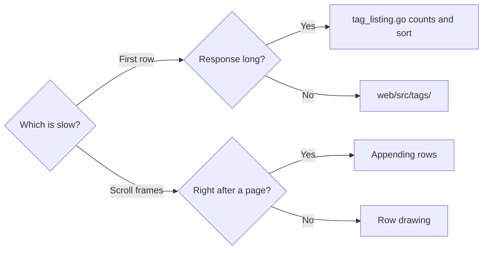

# Quickstart: Check the acceptance criteria at scale

These steps measure acceptance criteria 1 to 4 of parent Issue #651, which
`task check` and Vitest cannot verify: numbers taken from headless Chromium
against the production build with libraries of 1,000 tags and 10,000 videos,
3,000 tags and 30,000 videos, and 30,000 tags. Functional correctness
(acceptance criteria 5 to 13) is covered by the store, httpapi and Vitest
tests and is not repeated here.

The tooling is the merged `scripts/tagsbench` and `web/bench/`; the scales and
scenes added in the revision come from the implementation unit "Add the 30,000
scale and the open transfer and scroll-while-loading scenes to the benchmark"
([research.md R-9](research.md#r-9-scriptstagsbench-builds-scale-data-and-a-playwright-script-measures-the-production-build)).
[docs/how-to/tags-admin-benchmark.md](../../docs/how-to/tags-admin-benchmark.md)
is the source of truth for usage; this page lists what is measured and what is
expected.

## Prerequisites

- An environment where `task build` passes (Go, Node, `ffmpeg`, `ffprobe`;
  [docs/how-to/development.md](../../docs/how-to/development.md)). No video
  files are created, so `ffmpeg` is used only for the startup check.
- Playwright's browser installed under `web/` (as for `task test-e2e`). Where it
  cannot be installed, pass a local Chromium with `-chromium`.

## Steps

```sh
# Build the scale data (first run only; kept in .local/tagsbench/), start the production build on it, and measure
go run ./scripts/tagsbench -scale 1000
go run ./scripts/tagsbench -scale 3000
go run ./scripts/tagsbench -scale 30000 -videos 30000
```

| Data | Rule |
| --- | --- |
| `-scale` | The scale name (number of tags) |
| Videos | 10 times `-scale` when omitted; `-videos` sets it |
| Videos at the 30,000 scale | 30,000, the same as the 3,000 scale, so only the number of tags differs (R-9) |
| Tags | Every tag has videos except about 9%, which are unused; half are tentative (matching the parent Issue's "about 90 of 1,000") |

`web/bench/tags-admin.bench.ts` measures and prints one value per scene in a
table. Measure before the change (the feature branch head before the revision)
and after it in the same environment, one after the other, and record both in
the PR body (as in "PR format" of
[docs/how-to/preview-benchmark.md](../../docs/how-to/preview-benchmark.md)).

## Scenes and expectations

Each expectation holds at 1,000, 3,000 and 30,000 tags.

| Scene | Measurement | Expected | Acceptance |
| --- | --- | --- | --- |
| Open to first row | From navigating to `/tags` until the first list row appears in the DOM | Within 1 second | 1 |
| Tags received on open | `items` in the `GET /api/tags` response on open, and the response size in bytes (Playwright `response.body()`) | Same count and size at all three scales (±5%, from tag name length alone) | 2 |
| First search character | Longest task (Long Task) from typing one character in search until the list changes | At most 0.2 seconds | 3 |
| Clear with Esc | Longest task from clearing search with Esc until the list returns | At most 0.2 seconds | 3 |
| One confirm | Longest task from pressing "Confirm" on a tentative row until the row is replaced | At most 0.2 seconds | 3 |
| One rename | Longest task from sending a rename until the row is replaced | At most 0.2 seconds | 3 |
| Scroll | Frame times while scrolling with the mouse wheel from the top to the end, loading more on the way | No two consecutive frames over 50 ms, at 30,000 too | 4 |
| Bulk confirm | Longest task from selecting every loaded tentative tag under "Tentative only" and confirming until the tentative marks disappear | At most 0.2 seconds | 10 |

Long Tasks and frame times are read inside the page from `PerformanceObserver`
(`longtask`) and the interval between `requestAnimationFrame` callbacks. The
numbers vary by browser and machine, so the before values go in the same
table.

## Breakdown

The diagram shows where to look when a budget is missed.



When the first row is slow, report the server's `GET /api/tags` response time
(Playwright `response.timing`) separately from drawing. A long response points
at video counting and sorting in `internal/store/tag_listing.go`; a long draw
points at `web/src/tags/`. This feature fixes both the one-page response and
drawing. When video counting (`taggedVideosSQL`) takes 1 second at the 30,000
scale, put that measurement in the PR body and open a separate Issue for how
counts are stored on the server: the parent Issue's out-of-scope list hands
server-side slowness to #674 (R-1 "Video counts").

When scrolling has consecutive frames over 50 ms, compare Long Task times with
request times to tell whether they follow a response for more rows. If they
do, appending to `rows` and reattaching the selection are suspect
([data-model.md, Screen state](data-model.md#screen-state)); otherwise row drawing
is.
