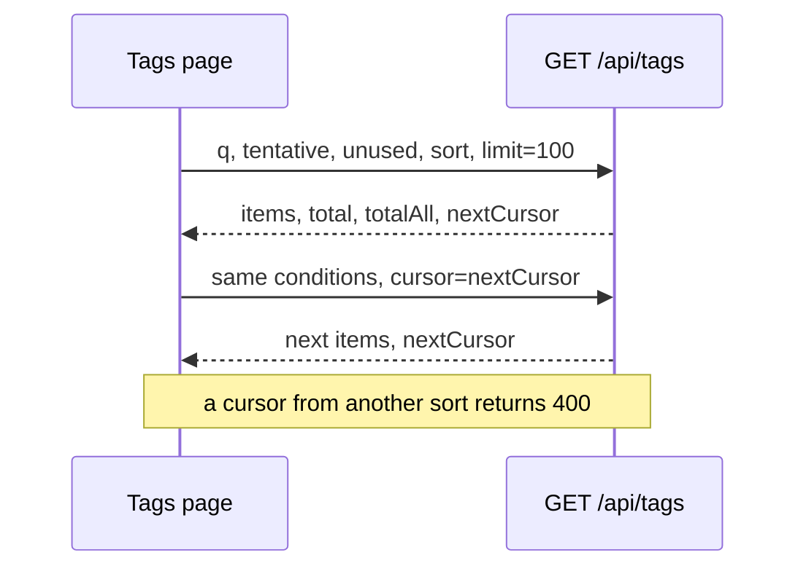
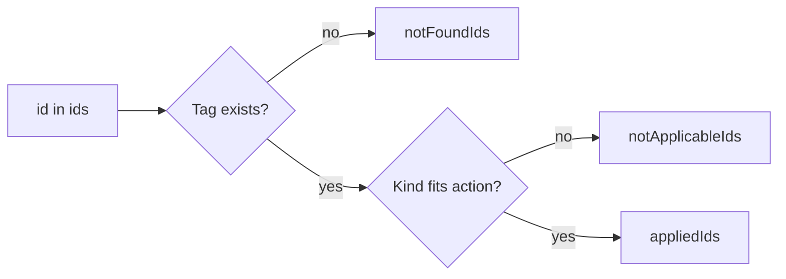
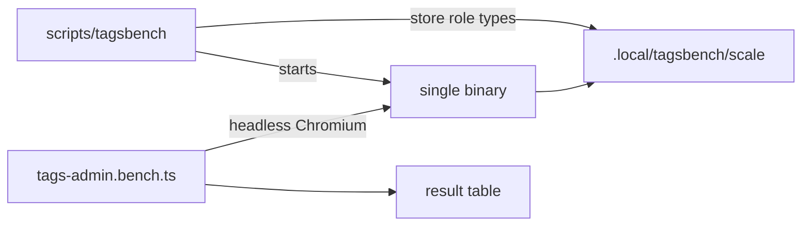
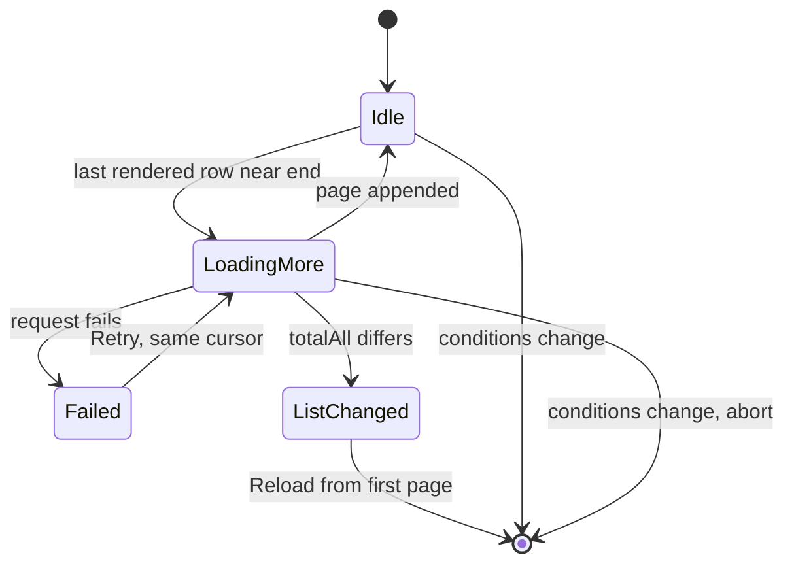
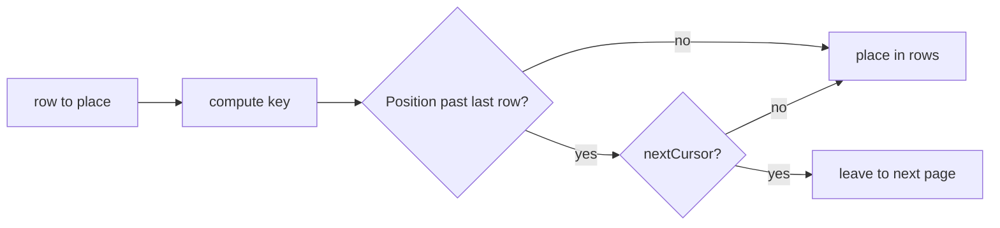

# Research: Tag management at thousands to tens of thousands of tags

Parent Issue: #651. Inherited decisions:

| Topic | Source of truth |
| --- | --- |
| Tech stack | [docs/design-docs/tech-stack-selection.md](../../docs/design-docs/tech-stack-selection.md) |
| Boundaries and dependency direction | [ARCHITECTURE.md](../../ARCHITECTURE.md) |
| Tag tables and name rules | [specs/014-video-tags/data-model.md](../014-video-tags/data-model.md) |
| Tentative tags and rejected names | [specs/031-tentative-tags/data-model.md](../031-tentative-tags/data-model.md) |
| Screen text and formatting | [docs/design-docs/i18n.md](../../docs/design-docs/i18n.md) |
| Visual rules of the list screens | [docs/design-docs/library-ui.md](../../docs/design-docs/library-ui.md) |

This file records only the decisions this feature adds.

The revision of the parent Issue (the screen loads only what it shows; search, sort and filters apply to every
tag, loaded or not; the scales gain 30,000 tags) replaced R-1, added a scale and scenarios to R-9, and
rewrote the role of R-3, R-7 and R-12. R-10 onwards were added by the revision. R-2, R-4 to R-6 and R-8 match
the implementation already merged into the feature branch and do not change.

## R-1: The server pages the list and applies search, filters and sort to every tag

**Decision**: `GET /api/tags` gains `q`, `tentative`, `unused`, `sort`, `cursor` and `limit`
([contracts/screen-api.md §5](contracts/screen-api.md#5-get-apitags-parameters)). On open the screen
receives one page (`limit` tags) and fetches the next page with `nextCursor` as it scrolls. Search, filters
and sort are request parameters that the server applies to every tag before cutting the page. A page carries
`total` (tags matching the conditions) and `totalAll` (all tags), which the count line shows (acceptance
criterion 8). A request without `limit` returns every tag as before; the shared cache (`getTags` in
`web/src/api/tags.ts`) that the combobox candidates and the filter check use keeps that form.

The sequence below shows one screen opening and scrolling.

The cursor is keyset, as in `GET /api/library` (sort value, name key, `id`). A cursor made under another
sort returns `400` (`ErrInvalidCursor`,
[013 list-api.md §5](../013-library-search/contracts/list-api.md#5-cursor-and-errors)).

| Option | Verdict |
| --- | --- |
| **Add paging and conditions to `GET /api/tags`** | Chosen |
| Receive every tag at once and filter on the screen (R-1 before the revision) | Rejected: conflicts with requirement 2 and acceptance criterion 2 |
| A separate route such as `GET /api/tags/page` | Rejected: the response shape and filter rules split across two routes, and #674 would need another route to fetch candidates under the same conditions |
| Offset paging (`?page=N`) | Rejected: rows repeat or go missing when another tab adds or removes tags while more rows load, which the Edge Case "while more rows load, another tab…" forbids; keyset has a precedent in the library |

**Rationale**: The revised requirement 2 asks that the screen load only the tags it needs to show, so that
the wait to open and the amount first loaded do not grow with the number of tags; acceptance criterion 2
measures that the count received and the bytes transferred are the same at 1,000, 3,000 and 30,000 tags.
Virtualization fixed rendering, but transfer and JSON parsing of the whole list grow with the total.
Requirements 4, 6 and 7 and acceptance criteria 8 and 9 apply sort, filters and search to tags not yet
loaded, so the conditions have to go to the server; the existing route is extended because the candidates
and the filter check need the full list (the parent Issue's `対象外`, handled by #674 and #675).

**Tie-break**: in every sort, tags with the same value are ordered by the natural name order (the `sort_key`
of R-10), then by `id` (requirement 4, "tags with the same value are ordered by name"; the same tie-break as
`SortTagRefs`). The video-count and date-created sorts can run opposite to the name order, so the cursor
condition is "value before, or value equal and (key, id) after", not a single row-value comparison
([data-model.md §2](data-model.md#2-store-operations)).

**Search rule**: `q` is folded with `domain.FoldForMatch` and trimmed; when not empty, it is matched with
`instr` against `tag_names.search_key` (rows of both the primary name and the synonyms), the same matching
form as [014 data-model.md §7](../014-video-tags/data-model.md#7-matching-tag-names-in-the-search-box)
(requirement 7). Terms are not split into AND, OR or exclusion: the screen's search before the revision was a
substring match of one term, and the parent Issue asks for the same matching form, not a query syntax. `q` is
limited to 100 characters, like `query` on `GET /api/library`.

**Video counts**: one query counts every tag with the existing `taggedVideosSQL` aggregation
([014 data-model.md §5](../014-video-tags/data-model.md#5-video-counts)) and uses it for the count sorts, the
`Unused only` filter and the page's counts. The full list before the revision ran the same aggregation once
per request, so its cost is not new; what is new is that it runs per page. quickstart.md reports the
`GET /api/tags` response time at 30,000 tags separately. If the aggregation takes 1 second, the way counts
are stored (server side) has to change, which the parent Issue's `対象外` hands to #674.

## R-2: Rows are virtualized with `useWindowVirtualizer` from `@tanstack/react-virtual`

**Decision**: Add `@tanstack/react-virtual` to `web/package.json` and use it only in the tag list. The window
(document) still owns scrolling, and row heights are measured from the rendered elements
(`measureElement`). Paging (R-1) does not change this.

| Option | Verdict |
| --- | --- |
| **`@tanstack/react-virtual` with measured heights** | Chosen |
| A hand-written window | Rejected: two fixed heights would make offsets a sum, but the rename error text and the create row break them; changing the row shape to avoid that narrows the design for the implementation's sake |
| One fixed row height, synonyms packed into the name line | Rejected: changes the information hierarchy of [014 ui-design.md "Rows"](../014-video-tags/ui-design.md#rows) with no requirement behind it |
| `react-window` | Rejected: needs fixed heights or a height function, so measuring is still hand-written |
| Drop virtualization now that the list is paged | Rejected: loaded rows grow to the total, as the rationale explains |

**Rationale**: Row heights vary: a tag with synonyms is one line taller, a row being renamed grows with its
error text, and the create row goes on top; hand-written windowing would put the bugs in height measurement
and offsets. The dependency has no runtime dependencies and follows the Renovate process
([docs/how-to/dependency-updates.md](../../docs/how-to/dependency-updates.md)). Of the two reasons
[library-ui.md §3](../../docs/design-docs/library-ui.md#3-no-virtual-scrolling) gives for avoiding virtual
scrolling (a wrapping grid whose cards per line depend on width, and loading only 60 at a time), the first
does not apply to a one-column list, and the second does not apply after R-1 either: acceptance criterion 4
scrolls a 30,000-tag list to the end while loading more, so loaded rows reach 30,000 and rendering them all
brings back the slowness measured before the revision.

**Documents**: `docs/design-docs/library-ui.md` §3 states that the tag list uses this and that the grid still
does not, for unchanged reasons (merged). After the R-1 revision, its wording "receives and holds every tag
at once" becomes "receives pages, and loaded rows grow to the total".

## R-3: The TypeScript port of `FoldForMatch` decides on the screen whether a loaded row still matches

**Decision**: Keep `web/src/lib/foldForMatch.ts` (merged; NFKC, then lowercasing per code point, then
hiragana to katakana) and `internal/domain/testdata/fold_for_match.json`, which Go and Vitest both read. Its
role changes: the server searches with `search_key` (R-1), so the screen no longer matches search terms with
it. The screen uses it after create, rename, confirm and reject to decide, without a round trip, whether the
row still meets the current conditions (search term, `Tentative only`, `Unused only`) (R-12).

| Option | Verdict |
| --- | --- |
| **Keep the port for the per-row check** | Chosen |
| Drop the port and refetch the list after every action | Rejected: brings back per-action refetching, as the rationale explains |
| Drop the port and keep an acted-on row even when it no longer matches | Rejected: a row renamed during a search so it no longer matches stays until the next refetch and disagrees with the server's list |

**Rationale**: Before the revision the port let the screen match every tag. With paging, checking one row by
a round trip would mean a list refetch per row action, one of the causes of the "freezes every time" before
the revision; with the server's matching form on the screen, the check is synchronous. The machinery that
catches disagreements between the two languages on the same input set is already merged.

Lowercasing and the remaining difference (code points missing from Node's Unicode version are excluded as
known exceptions) follow the merged implementation and tests and are not decided again here.

## R-4: Bulk confirm, reject and delete use one `POST /api/tags/batch` transaction that skips and counts misses

**Decision**: The route takes `{ action: confirm | reject | delete, ids }` and, in one transaction, processes
only the ids that are existing tags of the kind the action works on (confirm and reject: tentative tags;
delete: confirmed tags). The response has three arrays: processed ids, ids not found, and ids skipped for the
wrong kind ([contracts/screen-api.md §1](contracts/screen-api.md#1-post-apitagsbatch),
[data-model.md §2](data-model.md#2-store-operations)). The single-tag routes (`POST /api/tags/{id}/confirm`
and others) stay, and row actions keep using them (requirement 8, "the existing per-row rules do not
change").

The rule below sorts each id in `ids`.

| Option | Verdict |
| --- | --- |
| **One route, one transaction, skip and report misses** | Chosen |
| One route per action (`/api/tags/confirm`, `/reject`, `/delete`) | Rejected: same body and response shape, so nothing justifies splitting |
| The screen calls the single-tag routes in turn | Rejected: requests equal the selection size, and the handling of a mid-way failure is left to the screen; this is the freezing itself |
| Fail the whole request with `404` for a missing id | Rejected: the Edge Case asks for the rest to be processed |

**Rationale**: Confirming 100 tentative tags as 100 requests and 100 refetches is what the parent Issue's
"freezes every time" is; one transaction means one request and one screen update, which meets acceptance
criterion 10. The Edge Cases "selecting kinds the action does not apply to" and "another tab removes some of
the targets" both say "process the rest and report the count", so the result is not all-or-nothing and
skipped ids are returned by reason. A failed transaction applies nothing, so "the done and not-done parts are
clear, and the not-done part stays selected" holds when the screen removes only `appliedIds` from the
selection.

**Limit**: `ids` holds 1 to 20,000 ids, for the same reason as `videoIds` of `POST /api/video-tags` (fits the
1 MiB body limit and passes to `json_each` as one argument). Over the limit returns `400` with reason
`too_many_tags` (with `limit`). The limit counts the ids sent, so when the loaded rows exceed it the screen
disables only the header checkbox (select all loaded), and disables bulk actions only when the selection
exceeds it. Requirement 10 targets the loaded rows, so a 30,000-tag list scrolled to the end cannot use
select all, but a row-by-row selection still works (requirements 8 and 9); gating bulk actions on loaded rows
would block a selection of a few rows just because the user scrolled near the end.

## R-5: Merge takes `sourceIds` (one or more) in `POST /api/tags/{id}/merge`, also for a single merge

**Decision**: `MergeTagRequest` becomes `{ sourceIds: int64[] }`, and `sourceId` is removed. The response is
`{ tag: Tag, notFoundIds: int64[] }`. A missing target `{id}` returns `404 tag_not_found`; `{id}` inside
`sourceIds` returns `400` (reason `merge_same_tag`, as today). Missing sources are skipped and listed in
`notFoundIds`, and the rest merge in one transaction
([contracts/screen-api.md §2](contracts/screen-api.md#2-post-apitagsidmerge-changes)).

| Option | Verdict |
| --- | --- |
| **`sourceIds` only** | Chosen |
| Keep `sourceId` and add an optional `sourceIds` | Rejected: a shape that needs exactly one of the two adds `oneOf` handling to the generated code, the shape [014 contracts/tags-api.md §1](../014-video-tags/contracts/tags-api.md#1-schemas) avoided |
| A separate route only for bulk merge | Rejected: the same transaction would live in two places |

**Rationale**: The merge transaction (copy assignments, move names, delete the source, confirm the target)
only repeats per source, so one and many need no different shapes. `api/openapi.yaml` is the screen's
contract and its only caller is `mergeTag` in `web/src/api/tags.ts`; the external API
(`api/external-v1.yaml`) has no merge.

**Statement count independent of the number of sources**: calling the single `mergeTagInto` per source runs
the target's `tagByID` (a recount and a read of the growing synonym list) each time, holding the write
transaction for long in a 20,000-tag merge. The source set goes to `json_each`; copying assignments, moving
names and deleting sources are one statement each, and the target is read once at the end (`mergeTagsInto`
in [data-model.md §2](data-model.md#2-store-operations)).

When the target is among the sources, the screen removes it from the sources (Edge Case). The server still
rejects that with `400`.

## R-6: `POST /api/tags/impact` counts affected videos without duplicates for the confirmation

**Decision**: The route takes `{ action, ids }` and returns the number of `ids` that exist and that `action`
(`reject`, `delete`, `merge`) works on, and the number of videos now in the library carrying any of them
(manually added or from the folder name,
[014 data-model.md §5](../014-video-tags/data-model.md#5-video-counts)), deduplicated by video `id`
([contracts/screen-api.md §3](contracts/screen-api.md#3-post-apitagsimpact)).

| Option | Verdict |
| --- | --- |
| **A read route that counts with the batch rule** | Chosen |
| Sum of `videoCount` | Rejected: counts duplicates, which the requirement forbids |
| Return counts per kind and let the screen choose | Rejected: the screen would hold a second copy of the rule, which can drift from the server's processing |
| Add `dryRun` to `POST /api/tags/batch` | Rejected: mixes reads and writes in one route; `POST /api/video-tags/summary` is the precedent for a read route |

**Rationale**: Requirement 11 and acceptance criteria 11 and 12 ask for a count without duplicates; a sum of
the screen's `videoCount` counts a video with two of the tags twice. A single delete or merge confirmation
still uses `videoCount` (014's "no route for confirmation" is about single tags; the bulk confirmation is a
request this feature adds).

**Why `action`**: bulk reject and delete can mix tentative and confirmed tags (requirement 8), and
`POST /api/tags/batch` skips kinds that do not apply (R-4). Counting all `ids` would show 101 videos when
deleting a tentative tag on 100 videos together with a confirmed tag on 1 video, although only the confirmed
tag is deleted. The count covers only what the action changes, so it uses the same rule as the processing
(`TagImpactApplies`, following `TagBatchApplies`,
[data-model.md §1](data-model.md#1-values-added-to-domain)).

## R-7: The sort order is a per-device preference in `localStorage`; filters stay in screen state

**Decision**: `readTagListPreferences` and `writeTagListPreferences` in
`web/src/preferences/tagListPreferences.ts` (merged) store only the sort order. They are total functions like
`viewPreferences.ts` (never throw; a broken value reads as the default, `Name`). `Tentative only`,
`Unused only` and the search term are not stored and not put in the URL. The sort values are the five values
of the API's `TagSort` (`name`, `countDesc`, `countAsc`, `createdDesc`, `createdAsc`), and the screen sends
the stored value as the `sort` parameter (R-1).

| Option | Verdict |
| --- | --- |
| **Device preference in `localStorage`** | Chosen |
| URL query | Rejected: same shape as the library, but back and forward change the sort, and reopening the browser loses it |
| The server's `settings` table | Rejected: a per-device display preference has no reason to be a server setting |

**Rationale**: Requirement 5 asks only the sort order to survive leaving the screen and reopening the
browser. A device preference fits because the library's sort is also kept on the device by `viewPreferences`,
and the management screen's URL is not meant to be shared. Filters are not stored because nothing changes the
judgement of [031 research.md R-8](../031-tentative-tags/research.md#r-8-the-tentative-only-filter-and-the-rejected-name-list-live-in-the-screen)
that kept `Tentative only` in screen state, and the unused filter has the same nature. The stored values equal
the API's because sorting moved to the server (R-1), leaving no reason for the screen to keep a mapping
table.

**Values**: `name` (default), `countDesc`, `countAsc`, `createdDesc`, `createdAsc`. `Name` has no direction
(as in the current order). Ties are broken by the server as in R-1.

**Addendum (fix after the visual review)**: with search, filters and sort moved into the shared top bar used
by the library, the search term, `Tentative only`, `Unused only`, the sort order and the tab under the heading
go into the URL query (`q`, `tentative=1`, `unused=1`, `sort`, `tab=rejected`), like the library's list
conditions ([ui-design.md "URL state"](ui-design.md#url-state), `web/src/tags/tagListUrl.ts`). Conditions
then survive reload and back and forward, as in the library; this replaces "not put in the URL" above.
`localStorage` still keeps only the sort order, used when the URL has no `sort`.

## R-8: "Date created" is `tags.created_at` exposed as `Tag.createdAt`; tags created in the same second sort by name

**Decision**: `GET /api/tags` and every response that returns a `Tag` gain `createdAt` (`date-time`)
(merged). The value is the existing `tags.created_at` (Unix seconds), so there is no migration and no column
change. The `Date created` sort compares `created_at` and, on a tie, uses the name order like every other sort
(requirement 4).

| Option | Verdict |
| --- | --- |
| **Existing `created_at` in seconds, ties by name** | Chosen |
| Ties by `id` descending (creation order) | Rejected: conflicts with requirement 4, "tags with the same value are ordered by name" |
| Store `created_at` in milliseconds | Rejected: mixes units with existing rows, and copying in a migration cannot restore the precision |

**Rationale**: The column exists and `insertTag` writes it. Finer precision would change the column's meaning
and mix with existing rows. Bulk tagging in the external API creates several tags in one transaction, so
they share a second, and requirement 4 sets their order to the name order.

The external API's response (`listTags` in `api/external-v1.yaml`) does not change: only `domain.Tag` gains a
field, and `internal/httpapi/external.go` maps to the external types explicitly.

## R-9: `scripts/tagsbench` builds scale data and a Playwright script measures the production build

**Decision**: `scripts/tagsbench` (Go, merged) creates a data directory under `.local/tagsbench/<scale>/`.
It writes the parent Issue's scale through the role types of `internal/store`
(`SettingsStore.AddMediaFolder`, `ScanIndexStore.UpsertVideo`, `TagStore.ApplyVideoTags`). It creates no
video files, only location rows under the registered folder. The same program starts the built single binary
on that data, and `web/bench/tags-admin.bench.ts` (Playwright, configured apart from the `web/e2e/` tests and
not part of `task test-e2e` or CI) measures the scenarios and prints a table. The steps are in
`docs/how-to/tags-admin-benchmark.md`, and the results go in the PR body ([quickstart.md](quickstart.md)).

The flow below shows how the data and the measurement connect.

**Scales and scenarios added by the revision**: a 30,000-tag scale with 30,000 videos (as at 3,000 tags);
`-videos N` decouples the video count from the scale (omitted, it stays 10 times the tag count). Two
scenarios are added: the count and response size `GET /api/tags` returns on open (acceptance criterion 2),
and the frame times while scrolling the 30,000-tag list to the end with more rows loading (acceptance
criterion 4).

| Option | Verdict |
| --- | --- |
| **Separate benchmark on the production build** | Chosen |
| Put it in `web/e2e/` and run with `task test-e2e` | Rejected: loading 30,000 videos and measuring adds minutes to e2e, and timing noise makes CI unstable |
| Generate and scan real files | Rejected: ffprobe makes preparing the scale slow, and the target is the management screen, not the scan |
| Measure in Vitest's jsdom | Rejected: render time differs from a real browser, so the acceptance numbers mean nothing |
| 10 times the videos at 30,000 tags too | Rejected: building the data takes over an hour, and it measures a video count the parent Issue's table does not have |

**Rationale**: The acceptance criteria measure the production build from headless Chromium, and their numbers
(1 second, 0.2 seconds, 50 ms, the same transfer size) cannot be checked without scale data. As with
`scripts/previewbench` in `docs/how-to/preview-benchmark.md`, the target is the production code itself, and
no measurement hooks go into the product; rows are written only through the store's public operations so no
SQL leaves `internal/store` (ARCHITECTURE.md "`store.DB` does not hand out its `*sql.DB`"). The 30,000-tag
scale does not use 300,000 videos because the parent Issue gives no video count for it (the table heading is
"a library of 30,000 tags") and the aim is the difference by tag count; with the same videos as at 3,000
tags, the only difference between the two scales is the number of tags.

## R-10: A natural-order name key `sort_key` on `tag_names` and `rejected_tag_names`, filled by the startup key refresh

**Decision**: Add `sort_key text not null default ''` to `tag_names` and `rejected_tag_names`. It holds
`domain.NaturalSortKey(name)` (`FoldForMatch` applied, then each digit run replaced with a length-prefixed
form, so byte order is natural order;
[013 data-model.md §4](../013-library-search/data-model.md#4-title_key-rules)), written in the same
transaction whenever a name row is written (create, synonym, create on assignment, rename, reject). For
existing rows the migration resets `search_version` to 0 (and adds `search_version` to
`rejected_tag_names`), and `TagStore.RefreshSearchKeys` at startup fills the key together with `search_key`
(the same point as
[014 data-model.md §7](../014-video-tags/data-model.md#7-matching-tag-names-in-the-search-box)). The
server's name order is the byte order of this key, then `id` ([data-model.md §0](data-model.md#0-migration)).

| Option | Verdict |
| --- | --- |
| **Stored key filled by the startup refresh** | Chosen |
| `order by name collate nocase` | Rejected: folds only case and does not order `2` before `10`, a step back from today's natural order |
| No stored key; sort everything in Go, then cut `limit` | Rejected: every page reads and sorts every tag, defeating paging |
| Reuse `search_key` as the key | Rejected: the matching form does not length-prefix digit runs, so `tag 2` sorts after `tag 10` |
| A separate `sort_version` column | Rejected: `search_version` means "the version of the key rules", and one version covers two keys |

**Rationale**: The keyset cursor of R-1 has to fetch "the next row in name order" in SQL, which the Go
function `CompareNatural` cannot do; the library's title order already keeps the same key in
`video_locations.title_key` for `order by` and the cursor (`sortText` in `listing.go`). Rejected names get the
key too because requirement 12 asks their list to load only what it shows, in natural name order
([031 contracts/screen-api.md §3](../031-tentative-tags/contracts/screen-api.md#3-rejected-names)). The
startup refresh is used because SQL cannot compute `NaturalSortKey`, and the key-rule version and rebuild
machinery already exist.

**Change in the name order**: before the revision, `ListTags` sorted with Go's `SortTags` (`CompareNatural`
on the primary name, ties by the raw string). `NaturalSortKey` works on the matching form (full-width,
half-width and kana folded), so names with the same matching form, such as `アニメ` and `あにめ`, are now
ordered by `id`. This is the same definition as the library's title order, so the contract's wording "natural
name order" stays.

## R-11: More rows load 100 at a time near the end, duplicates are dropped by `id`, and a count mismatch asks for a reload

**Decision**: A page is 100 tags (`limit=100`; more than the 60 of `GET /api/library` because rows are one
light column and more than 12 fit on one screen). When the last row the virtualizer renders comes within a
few rows of the end of the loaded rows, the screen requests the next page with `nextCursor` once (never two
in flight). Arriving rows are appended with duplicates dropped by `id` (as `appendUnique` in `videosData.ts`).
On a cancelled or failed load, or a mismatch, the rules in the diagram apply
([data-model.md §4](data-model.md#4-screen-state)).

The diagram below shows the loading states of the list.

When `totalAll` in a next-page response differs from the screen's value, the rows stay, more loading stops,
and the screen shows the list-changed line with `Reload` (the same shape as `inconsistent` in
`videosData.ts`). A failed next page keeps the loaded rows and shows a failure row with `Retry` at the end,
which retries the same cursor. Changing search, filters or sort aborts the request in flight with
`AbortController`, discards stale responses by a generation number, and loads from the first page.

| Option | Verdict |
| --- | --- |
| **Trigger from the virtualizer's last rendered row** | Chosen |
| An `IntersectionObserver` sentinel (the library's form) | Rejected: in a virtualized list the sentinel's position is controlled outside the virtualizer; the virtualizer's last rendered row is shorter |
| Silently reload from the first page on a mismatch | Rejected: loses the selection and scroll position; reloading everything read so far, as `useScanIssues` does, means reloading thousands of rows |
| Also check `total` for a mismatch | Rejected: `total` changes with the user's own actions and is recounted locally, so `totalAll` is the surer sign of another tab's change; own actions recount `totalAll` locally too |
| 200 tags per page | Rejected: nearly triples one page's response and inflates "the amount first loaded" of acceptance criterion 2 |

**Rationale**: The Edge Case "another tab adds or removes tags while more rows load: no tag appears twice and
no row goes missing unnoticed" is met in its first half by keyset and `id` deduplication and in its second
half by the `totalAll` mismatch notice. Keyset does not return rows that moved before the cursor, so it cannot
prevent the gap itself ([013 list-api.md §5](../013-library-search/contracts/list-api.md#5-cursor-and-errors)
gives the same guarantee), and a silent reload loses the selection and scroll position. The Edge Case
"changing search, filters or sort while more rows load: the old conditions' rows do not mix in" is met by the
abort and the generation number (the same idea as `generation` in `web/src/api/tags.ts`).

## R-12: Actions update the loaded rows in place, positioned with a port of `NaturalSortKey`

**Decision**: After single and bulk actions, the screen does not refetch the list but rewrites the loaded rows:

| Action | Change to the loaded rows |
| --- | --- |
| Confirm | Set the row's `tentative` to false |
| Reject, delete, merge source | Remove the row |
| Merge target | Replace with the response's `tag` (insert it if not loaded) and reposition |
| Rename | Replace the name and reposition |
| Create | Insert at its position if it meets the current conditions, otherwise leave it out |

Whether a created row meets the conditions uses `foldForMatch` from R-3 for the search term, and `tentative`
and `videoCount` for the filters. `total` and `totalAll` change locally. A refetch from the first page
happens only when `notFoundIds` arrives (R-4). The shared cache's `afterTagChanged` (`web/src/api/tags.ts`)
refetches only when there are subscribers, and otherwise drops `held` for the next `getTags` to fetch.

The rule below places a repositioned or created row.

The key comes from `web/src/lib/naturalSortKey.ts` (a port of `NaturalSortKey`: `foldForMatch` plus the
digit-run replacement) and is compared by code point; the video-count and date-created sorts compare their
value first. A row placed outside the loaded range would repeat in the next page, because the keyset returns
only rows after the last row's key; a row that moves into the loaded range (a merge target not yet loaded, or
one whose count rose under `countDesc`) is counted but missing until a refetch unless the screen places it.

| Option | Verdict |
| --- | --- |
| **Rewrite loaded rows, position with the ported key** | Chosen |
| Refetch from the first page after every action | Rejected: as the rationale explains |
| Position with `compareNatural` | Rejected: names with the same matching form order differently from the server |
| Put created and renamed rows at the top without comparing keys | Rejected: correct for newest-first `Date created`, but the name order stays broken until a refetch |
| Keep refetching the shared cache as today | Rejected: as the rationale explains |

**Rationale**: Refetching from the start after each action shrinks 30,000 loaded rows back to one page and
loses the scroll position and selection, and reloading what was read is a round trip of thousands of rows;
rewriting in place needs no round trip and meets "does not freeze" of acceptance criteria 3 and 10.
Positioning with the server's key keeps rows from jumping on a refetch, whereas `compareNatural` (on the
primary name) disagrees with the R-10 key. The shared cache refetches only for subscribers because the tag
management screen has none, and refetching all 30,000 tags per action would bring back transfer that grows
with the total (requirements 2 and 3; parsing the full JSON can be a 0.2-second long task).

**Port check**: input and expected pairs for `NaturalSortKey` live in
`internal/domain/testdata/natural_sort_key.json`, like `fold_for_match.json`, and the Go and Vitest tests
read the same file. Go compares keys by bytes and the screen by code points; both give the same order (UTF-8
byte order equals code point order; UTF-16 code unit order does not, so strings are not compared with `<`).

## R-13: Rejected names load in pages from `GET /api/tags/rejected-names`, with more loaded on scroll

**Decision**: `GET /api/tags/rejected-names` gains `cursor` and `limit` (default 100, maximum 200), and the
response gains `total` and `nextCursor`
([contracts/screen-api.md §6](contracts/screen-api.md#6-get-apitagsrejected-names-parameters)). The order is
`sort_key` (R-10), then the byte order of `name`. On open the screen receives one page and shows `total` at
the entry point, and loads more when the list is scrolled to the end. A name removed with `Allow again` is
removed locally and `total` drops by 1. After reject, create, rename and adding a synonym, only the first page
is refetched (the 031 triggers, unchanged).

| Option | Verdict |
| --- | --- |
| **Paged route with `total`** | Chosen |
| Keep the full list | Rejected: conflicts with requirement 12 |
| A separate route returning only `total` for the entry point | Rejected: `total` on the page response is enough |

**Rationale**: The second half of requirement 12 asks the rejected-name list to load only what it shows on
open. Rejected names can grow each time the external API creates a tentative tag, so like tags they must not
load in proportion to the total. The default of 100 follows R-11.

**Addendum (fix after the visual review)**: the dialog and its entry point were replaced by the tab
`Rejected names 〈total〉` under the heading and its body
([ui-design.md "Rejected names tab"](ui-design.md#rejected-names-tab)). More rows load as the body scrolls (a
sentinel rooted at the viewport). The paging, count and refetch rules above are unchanged.

## R-14: Merge target candidates come from `GET /api/tags?q=…&limit=…`

**Decision**: The target candidates in `MergeTagDialog` come from `GET /api/tags` with `q` (the folded input)
and `limit` (the maximum candidate rows, 8 in [ui-design.md "Merge dialog"](ui-design.md#merge-dialog)), the
route of R-1. Opened from a row, the sources are removed from the response; opened from the selection
(`fromSelection`), they are not (requirement 9, "the target can also be one of the selected tags", and the
Edge Case "the target is removed from the sources"; as in the merged `MergeTagDialog`). Candidates keep the
server's name order. A change of input aborts the request in flight, and the previous candidates stay while
waiting. The `tags` prop (the full list held by the screen) is removed.

| Option | Verdict |
| --- | --- |
| **Fetch candidates from the server per input** | Chosen |
| Build from the shared cache's full list | Rejected: as the rationale explains; the parent Issue's `対象外` hands full-list candidates outside the management screen to #674 and #675, but the dialog inside it belongs to this feature |
| Build from the loaded rows only | Rejected: conflicts with requirement 9 |

**Rationale**: Before the revision the screen held every tag, so candidates came from there. With paging
(R-1) the screen holds only loaded rows, and requirement 9 lets the target be any tag not selected, including
tags not loaded. Fetching the shared cache's full list on each dialog open would, at 30,000 tags, transfer and
parse everything (a long task that can exceed 0.2 seconds; requirement 3, "merge… does not freeze"). The
server searches in the matching form (R-1), so candidate matching moves from `toLowerCase().includes` to
folding full-width, half-width and kana.

**Scope**: the `Add tag` candidates (`web/src/library/tagChoices.tsx`, `AddTagPopover`, `VideoTags`) do not
change (the parent Issue's `対象外`).
