# UI design: Tag admin screen that stays manageable with thousands to tens of thousands of tags

**Feature**: [parent Issue #651](https://github.com/syudead/vv/issues/651) ·
[plan.md](plan.md) · [research.md](research.md) (R-1 to R-7, R-11 to R-14) ·
[data-model.md, Screen state](data-model.md#screen-state) ·
[contracts/screen-api.md](contracts/screen-api.md) ([`GET /api/tags` parameters](contracts/screen-api.md#get-apitags-parameters), [`GET /api/tags/rejected-names` parameters](contracts/screen-api.md#get-apitagsrejected-names-parameters))

The visual rules come from the following sources and are not decided again here.

| Topic | Source |
| --- | --- |
| Colours, interaction states, width breakpoints, list layout, selection bar shape | [Library UI](../../docs/design-docs/library-ui.md) ([Visual values in one CSS location, with contrast guaranteed by tests](../../docs/design-docs/library-ui.md#visual-values-in-one-css-location-with-contrast-guaranteed-by-tests), [No virtual scrolling](../../docs/design-docs/library-ui.md#no-virtual-scrolling), [Width breakpoints in CSS, and the sidebar exception](../../docs/design-docs/library-ui.md#width-breakpoints-in-css-and-the-sidebar-exception), [List layout](../../docs/design-docs/library-ui.md#list-layout)) |
| Role tokens | `@theme` in [`web/src/index.css`](../../web/src/index.css). Refer to them by name; do not copy values |
| Contrast pairs under test | [`web/src/theme/tokens.test.ts`](../../web/src/theme/tokens.test.ts) |
| Skeleton of the tag admin screen (body width, row columns and format, create and rename, synonyms dialog, delete dialog, states table) | [specs/014-video-tags/ui-design.md "Tag management page"](../014-video-tags/ui-design.md#tag-management-page) and the current [`web/src/tags/`](../../web/src/tags/) |
| Tentative mark, "Tentative only", the row's "Confirm" and "Reject…", the reject dialog, the **content** of rejected names (description, chips, ×, loading, reload, empty) | [specs/031-tentative-tags/ui-design.md "Tag management page"](../031-tentative-tags/ui-design.md#tag-management-page) |
| Library toolbar sort (menu and direction toggle, the combined view-and-sort control below `md`) | [specs/013-library-search/ui-design.md "Sort and direction"](../013-library-search/ui-design.md#sort-and-direction), [specs/033-video-dates/ui-design.md "Sort and direction"](../033-video-dates/ui-design.md#sort-and-direction), the current [`web/src/videoList/SortControls.tsx`](../../web/src/videoList/SortControls.tsx), [`FilterMenu.tsx`](../../web/src/videoList/FilterMenu.tsx) and [`web/src/library/LibraryToolbar.tsx`](../../web/src/library/LibraryToolbar.tsx) |
| Library selection (how list-view checkboxes appear; selection bar box, wrapping and limit) | [specs/014-video-tags/ui-design.md "Selection bar"](../014-video-tags/ui-design.md#selection-bar), the current [`web/src/library/SelectionBar.tsx`](../../web/src/library/SelectionBar.tsx) and [`web/src/videoList/VideoCard.tsx`](../../web/src/videoList/VideoCard.tsx) (list-view row) |
| Library load-more (`Skeleton` while loading, the load-more failure box and "Retry") | [specs/013-library-search/ui-design.md](../013-library-search/ui-design.md), the current [`web/src/videoList/states.tsx`](../../web/src/videoList/states.tsx) (`LoadMoreFailed`) and [`web/src/library/LibraryPage.tsx`](../../web/src/library/LibraryPage.tsx) |
| Where screen text lives and its format | [Screen text and formatting (i18n)](../../docs/design-docs/i18n.md). The English here is a proposal showing intent; after implementation the catalog [`web/src/i18n/en.ts`](../../web/src/i18n/en.ts) is the source of truth |

This feature adds or changes eight things on the owner-only tag admin screen (`/tags`). Items 1 to 7 are merged
into the feature branch (child Issues #678 to #687); this document aligns them with the revised parent Issue and
Plan. Item 8 and what it affects (every place whose unit is "loaded rows") is what that revision added.

1. The headings, tabs and column header **stay** under the top bar while the list scrolls (requirement 13).
2. A **sort** (name, video count, date created) and an **unused-only** filter (requirements 4 to 6).
3. A **checkbox** on each row, and a selection bar shown **only while something is selected** that confirms,
   rejects, deletes and merges in bulk (requirements 8 to 11).
4. **Confirmation dialogs** for bulk reject, delete and merge (requirement 11), and a **merge dialog** with several
   sources (requirements 9 and 14).
5. **Rejected names** move to a tab under the heading and open in the page body (requirement 12).
6. Row actions collapse into **a menu with text labels** on touch devices and narrow widths (`UI品質`: `行の操作`).
7. The list draws only the visible rows (requirements 1 and 3). **The look does not change.**
8. The list **loads from the server only what the view needs and loads more on scroll** (requirements 1 to 3
   and 7). Search, filters and sort apply to every tag, loaded or not; the end of the list gains **loading more,
   failure and list-changed** rows. The column header's select-all selects **loaded rows** (requirement 10).
   The rejected names tab and the merge dialog's candidates also load only what they show (requirements 12 and 9).

A later visual review found that the controls row built inside the body (its own search field, two toggle
buttons, the sort) and the count row (count, select all, the rejected names entry) did not match the library and
looked out of place. This document follows the fix the review approved ("Proposal 1"). Behaviour and the server
API do not change: pages of 100, `q`, `tentative`, `unused` and `sort` on the server, and select-all over loaded
rows only. The fix moves these pieces:

| Piece | Where it goes | Section |
| --- | --- | --- |
| Search, filters, sort | The **shared top bar**, as in the library | [Top bar](#top-bar) |
| Top of the body | A **header row** ("Tags", count, "New tag"), the **tabs** "Tags \| Rejected names", the active **filter chips**, the **column header** | [Band](#band) |
| Bulk actions | The header row is **replaced by the selection bar** with real buttons while something is selected | [Selection bar](#selection-bar) |
| Rejected names | A **tab** in the body, not a dialog | [Rejected names tab](#rejected-names-tab) |
| Merge candidates | A **fixed-height list** under the input | [Merge dialog](#merge-dialog) |
| Conditions and tab | The **URL** | [URL state](#url-state) |

Unchanged: row columns and format, the create row, rename, the synonyms dialog, the single-tag confirm, reject,
delete and merge rules, the tentative mark, the behaviour of "Tentative only", and the rules for the content of
rejected names. No colour, radius or shadow token is added ([Colour](#colour)).

The page from top to bottom; the band stays under the top bar and the rows scroll with the document.

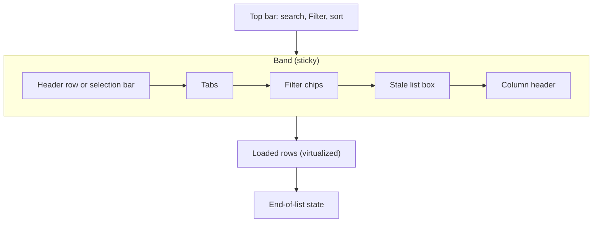

Filter chips appear only while a filter applies, and the stale list box only after a failed first page.

## Why this shape

- **Page controls sit in the shared top bar, as in the library.** Search, filters and sort go into the centre of
  the top bar through `TopBarPortal` and reuse the library's `SearchBox`, the `FilterMenu` frame (`FilterPopover`)
  and the `SortMenu` shapes (`SortMenuView`, `CompactSortView`). The first version built its own controls row in
  the body and did not match the library (review). The top bar is always visible, which also keeps the controls in
  reach while scrolling (requirement 13).
- **The header, tabs and column header stay in a `sticky` band; the body scroll does not change.** Scrolling the
  list in its own box (fixed body, only the list moves) changes how the browser restores the scroll position on
  back and forward and how `/` is handled, and the page would move differently from other body screens such as
  settings. The band holds the header row (the selection bar while selecting), the tabs, the filter chips and the
  column header; rows flow with the body. Because the selection bar is in the band, bulk actions are in reach at
  any scroll depth.
- **Sort uses the library's "Sort by" menu and direction toggle, in the same place.** The parent Issue's
  `UI品質` names this shape, and users already know it from the library. The secondary `Button` shows the current
  kind, so its text says which sort is on. Clicking column headings does not sort: the column header only says
  which column is which, and the top bar button says the sort.
- **"Tentative only" and "Unused only" are checkboxes in the library's "Filter" popover.** The first version put
  two toggle buttons in the body's controls row, which did not match the library filter and crowded the row
  (review). Active filters show as the count on the "Filter" button (`bg-accent-soft text-link` and the number, as
  in the library) and as **chips** under the heading (the same `FilterChip` as the library's `ActiveTagFilters`),
  so the user reads what applies without opening the popover and removes a filter with one press on the chip's ×.
- **Search, filters and sort go to the server without changing how visible rows look.** The only visible
  difference is that results come from every tag, not from the loaded rows (requirements 4, 6 and 7); the parts
  and positions stay. On a condition change the **previous rows and count stay** until the new first page arrives
  (as in the library search; no empty flash and no `Skeleton` flicker). On failure the previous rows stay and a
  failure box with "Retry" **stays in the band** to say the rows do not match the current conditions (Edge Case:
  show the current failure display and "Retry"; keep the list if one is already there). A toast alone would
  vanish and leave mismatched rows looking like the current result.
- **More rows load automatically as the scroll nears the end of the loaded rows; there is no "Show more"
  button.** This matches the library, and the parent Issue asks to load more as the user scrolls. Loading more,
  failure and list-changed show as **rows at the end of the list**, not toasts: they follow the loaded rows, so
  showing them where the list stops is the clearest place, and scrolling back shows the earlier rows are still
  there. The failure row is the library's `LoadMoreFailed` box, with "Retry" reloading from the same cursor.
- **A mismatch (tags added or removed in another tab) keeps the rows and tells the user instead of reloading
  silently.** When a load-more response's `totalAll` differs from the screen's value, the loaded rows and the
  selection stay, the end of the list shows a one-line list-changed notice with "Reload", and loading more stops
  ([research.md R-11](research.md#r-11-more-rows-load-100-at-a-time-near-the-end-duplicates-are-dropped-by-id-and-a-count-mismatch-asks-for-a-reload)).
  A silent reload from the top would lose a scroll position thousands of rows deep and the selected rows. Only
  "Reload" reloads from the top (the selection empties). The notice is not a failure, so it uses a neutral box with
  a surface, not the danger colour.
- **Select-all selects loaded rows only and does not reach unloaded tags.** Requirement 10 and the out-of-scope
  item (bulk actions on everything matching the conditions) decide this. Because the selectable set is narrower
  than "the matching set", the accessible name and the selection bar count show that **only loaded rows were
  selected** ([Column header](#column-header)). The gap between the list total and the selected count ("100
  tags selected" against "500 of 1,000 tags") marks that the rest is not loaded. The count does not show the
  loaded number (page boundaries): loading continues automatically on scroll, and the number is a mechanism the
  user does not need (review).
- **Selection uses checkboxes, and the header row is replaced by the selection bar while selecting.** The first
  version floated a bar at the bottom of the screen, which covered the last row (review). The header row stays in
  the band, so replacing it keeps the actions in reach while scrolling (requirement 13) without covering rows. The
  swap keeps the same height (`min-h-10`), so the list does not jump when the first row is selected. Checkboxes
  stay faintly visible at all times, as in the library list view, so devices without hover still see the way in.
- **Bulk actions are real buttons, and actions that do not apply are not shown.** The first version showed only
  "Confirm" and hid the rest under a "More" menu. The selection bar has room for "Confirm" (primary; the main
  clean-up action), "Merge into one tag…", "Reject…" and "Delete…" (secondary; text and icon in the danger colour).
  Actions that do not apply to the selection ("Confirm" and "Reject…" with no tentative tag, "Delete…" with no
  confirmed tag) are hidden rather than dimmed: listing only what works is shorter than making the user read why
  something does not. Confirm asks nothing (requirement 11); reject, delete and merge go through a confirmation
  dialog.
- **"Select all loaded" is the checkbox at the start of the column header.** It sits at the start of the thin
  column header above the list (checkbox, "Name", right-aligned "Videos") and reads like the header checkbox of a
  mail list: "select this list (the loaded part)". Putting the library's "Select all" in the selection bar was
  rejected: that bar appears only after the first selection, so the first row would need a separate press. With
  the header checkbox, one press after filtering selects every loaded row.
- **When more rows are loaded than the limit, only the header checkbox stops.** The bulk limit (`maxTagBatch`,
  20,000) applies to the number of ids sent
  ([research.md R-4](research.md#r-4-bulk-confirm-reject-and-delete-use-one-post-apitagsbatch-transaction-that-skips-and-counts-misses),
  Plan "Bulk actions"). A few rows picked one by one stay under the limit however many rows are loaded, so there is
  no reason to stop the selection bar actions. Only "select all loaded" stops; its reason says too many tags are
  loaded and points to filtering. Selection bar actions stop only when the selected count itself exceeds the
  limit, which picking rows one by one practically never reaches.
- **Rejected names open in the "Rejected names" tab under the heading and load more in the body.** The collapsible
  section 031 put under the list is out of reach below thousands of rows (requirement 12). The first version opened
  a dialog from a small entry at the right end of the count row, which crowded that row and left "Rejected names 0"
  unclear (review). Tabs show both lists and their counts in the same form, "Tags 300 | Rejected names 4", and stay
  in the band, so they are reachable from the top. The content lies in the body and loads more as the body scrolls
  (second half of requirement 12). The tab count is the response's `total`, not the loaded number.
- **Merge target candidates come from the server on each keystroke.** The screen holds only loaded rows, and
  requirement 9 asks that the target can be any tag, selected or not
  ([research.md R-14](research.md#r-14-merge-target-candidates-come-from-get-apitagsqlimit)). Candidates
  use the same matching form as the list search, so full-width and half-width forms and kana variants match. The
  visible differences are a small spinner at the right end of the input and candidates that may change a beat
  after the input. The previous candidates stay until new ones arrive, so the list does not empty and flicker.
  Candidates sit in a **fixed-height box** under the input, always shown, not in a list layered over the input: the
  layered list opened taller than the dialog content and covered its buttons (review).
- **On touch devices and below `sm`, row actions collapse into one menu with text labels.** The parent Issue's
  `UI品質` asks that actions are not icons whose meaning is unknown until pressed. Text beside each icon was rejected:
  four action labels take the row width and leave no room for the name. Each menu item has text, and the "⋯" entry
  is the shape current list products settle on for "this row's actions". A one-press confirm on the row becomes two
  presses, but the main clean-up path on touch is "checkbox → Confirm (selection bar)", which stays one press per
  row. On mouse devices the current four `IconButton`s (with tooltips) do not change.

## Words

Labels the catalog already holds are written as `web/src/i18n/en.ts` shows them.

| Place | Text | Notes |
| --- | --- | --- |
| Sort menu heading | Sort by | |
| Sort kinds | Name / Video count / Date created | |
| Accessible name of the sort button | Sort by: {kind} | |
| Direction toggle (video count) | Descending (most videos first). Press for ascending / Ascending (fewest videos first). Press for descending | |
| Direction toggle (date created) | Descending (newest first). Press for ascending / Ascending (oldest first). Press for descending | |
| Direction `SegmentedControl` items (compact view below `sm`) | Most videos first / Fewest videos first, Newest first / Oldest first | |
| Compact sort button below `md` | Sort | |
| Search field | Search tags | Accessible name and placeholder |
| Filter button | Filter / Filter (2 applied) | Same as the library; the second is the accessible name |
| Filter popover checkboxes | Tentative only / Unused only | |
| Filter checkbox hints | Show only tags created by automatic tagging / Show only tags that aren't on any videos | |
| Filter popover reset | Clear filters | Same as the library |
| Accessible name of the chip list | Active filters | |
| Accessible name of a chip | Remove the filter "Tentative only" / Remove the filter "Unused only" | |
| Header count | 90 of 1,000 tags | `total` of `totalAll`, while a filter or search applies. Otherwise 1,000 tags. The loaded number is never added |
| Accessible name of the tab list | Tag lists | |
| Tabs | Tags {`totalAll`} / Rejected names {`total`} | |
| Column header | Name / Videos | |
| Accessible name of the header checkbox | Select all 100 loaded tags / Clear selection | The second while all are selected. With one row: Select the 1 loaded tag |
| Why the header checkbox is disabled (loaded rows over the limit) | Too many tags are loaded to select them all at once (limit {limit}). Narrow the list with search or a filter. | |
| Accessible name of a row checkbox | Select "{name}" | |
| While loading more | Loading more tags… | Screen reader only |
| Load-more failure row | Couldn't load more: {reason} / Retry | |
| First page failed while a list is shown | Couldn't load tags: {reason}. The list below may not match the current search, filters and sort. / Retry | In the band |
| List-changed row | Tags were added or removed elsewhere, so the rest of this list may be out of date. / Reload | |
| Empty-result heading | No unused tags / No unused tentative tags / No unused tags match "{input}" / No unused tentative tags match "{input}" | |
| Empty-result description | Every tag is on at least one video. | "Unused only" alone, no search |
| Empty-result button | Show all tags | Current wording |
| Accessible name of the selection bar (`region`) | Selected tags | |
| Selection bar count | 1 tag selected / 12 tags selected | |
| Selection bar actions | Clear selection (×) / Confirm / Merge into one tag… / Reject… / Delete… | |
| Selected count over the limit | Too many tags are selected to act on them together (limit {limit}). Clear some of the selection. | Under the selection bar |
| Bulk confirm toast | Confirmed 8 tags / Confirmed 8 tags. 4 were already confirmed. | |
| Bulk reject dialog title | Reject selected tags | |
| Bulk reject text (applies to all) | The 8 selected tags will be removed from 120 videos, and automatic tagging won't create their names again. You can allow a name again from Rejected names. | |
| Bulk reject text (applies to some) | 8 of the 12 selected tags are tentative. They will be removed from 120 videos, and automatic tagging won't create their names again. The 4 confirmed tags are left as they are. You can allow a name again from Rejected names. | |
| Bulk delete dialog title | Delete selected tags | |
| Bulk delete text (applies to all) | The 8 selected tags will be removed from 120 videos. This can't be undone. | |
| Bulk delete text (applies to some) | 8 of the 12 selected tags are confirmed. They will be removed from 120 videos. This can't be undone. The 4 tentative tags are left as they are; reject them instead. | |
| Zero videos (reject, delete, merge) | The "…aren't on any videos…" form | Never "removed from 0 videos" |
| While counting | Counting the affected videos… | |
| Count failed | Couldn't count the affected videos: {reason} / Retry | |
| Bulk reject and delete buttons | Cancel / Reject (Rejecting… while sending) / Delete (Deleting… while sending) | |
| Bulk reject and delete toasts | Rejected 8 tags / Rejected 8 tags. 4 confirmed tags were skipped. / Deleted 8 tags / Deleted 8 tags. 4 tentative tags were skipped. | |
| Merge dialog title (several) | Merge 4 tags | |
| Merge dialog sources heading | Tags to merge | |
| Merge target input | Tag to merge into | Visible label and accessible name |
| No candidates (in the list) | No matching tags | |
| Merge dialog footer | Alpha → Action / 3 tags → Action | Source → target |
| Candidate search failed (under the input) | Couldn't search tags: {reason} | |
| Merge confirmation (several) | The 120 videos tagged with these 4 tags get the tag "Action". Their names and synonyms become synonyms of "Action", and the 4 tags leave the tag list. This can't be undone. | The number is the sources without the target |
| Target picked from the selection | "Action" is kept and the other 3 tags merge into it. | |
| No source left | Choose another tag to merge into: "Action" is the only tag selected. | |
| Merge toast (several) | Merged 4 tags into "Action" | The number actually merged |
| Some targets no longer existed | Some of the tags no longer existed, so the list was reloaded | |
| Rejected names tab description | Automatic tagging won't create these names. Allow a name again to let it be created. | |
| Rejected name row button | Allow again / Allow "{name}" again | Visible text / accessible name |
| Rejected names load-more failure | Couldn't load more rejected names / Retry | |
| Row actions menu entry (touch, below `sm`) | Actions | |

- "Unused" names a tag on zero videos; the text explains it as "tags that aren't on any videos". "Empty" and
  "orphan" are not used.
- "Loaded" means "received by the screen so far" and implies that unloaded tags remain. "Shown" and "visible" are
  not used: visible rows are the drawn rows, a different set from loaded rows. "Loaded" appears only in the header
  checkbox's accessible name and disabled reason, never in counts or as a page boundary.
- Every number uses `formatNumber`, and counts use the catalog's `tagCount` and `videos`. Tag names are user data
  and are embedded untranslated (i18n.md).

## Top bar

Search, filters and sort sit in the centre of the shared top bar (`TopBarPortal`), as in the library
([`web/src/tags/TagToolbar.tsx`](../../web/src/tags/TagToolbar.tsx)). Order and look match
[`LibraryToolbar`](../../web/src/library/LibraryToolbar.tsx), and so does the Tab order: search → "Filter" → sort
→ direction. The body has no controls row. While the "Rejected names" tab is open the top bar holds nothing: tag
search, filters and sort do not apply to rejected names (as in 031).

Changing search, "Tentative only", "Unused only" or the sort **reloads the first page from the server** under the
new conditions ([data-model.md, Screen state](data-model.md#screen-state), "Conditions").

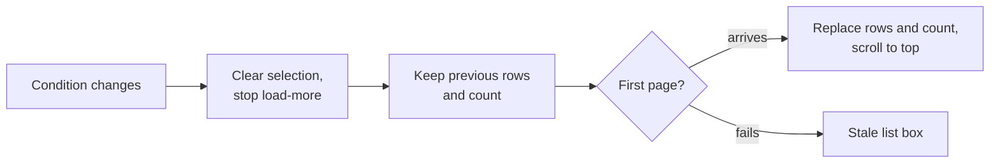

- The `Skeleton` does not come back while waiting. The scroll position returns to the top on arrival, because the
  old position means nothing under new conditions.
- An in-flight load-more is abandoned, so rows from old conditions never mix in (Edge Case).
- **Every change empties the selection**, including a sort change (Edge Case: clear the selection when search,
  filters or sort change while selecting). Rows that come back with the same ids are not reselected.
- A row being renamed survives a condition change ([Row checkbox](#row-checkbox)). A failed first page is
  [Stale list](#stale-list).

| Control | Shape and behaviour |
| --- | --- |
| Search | The library's `SearchBox` with `syntaxHelp={false}` (no video search syntax help). Accessible name and placeholder "Search tags"; `/` focuses it; Esc clears it and leaves the field (Esc during IME composition is ignored). Requests on every keystroke (`debounceMs={0}`, the previous request is aborted; behaviour since 014). The server matches the names and synonyms of every tag and treats full-width and half-width forms and kana variants as equal, the same rule as tag search in the library (requirement 7, `q` in [contracts/screen-api.md, `GET /api/tags` parameters](contracts/screen-api.md#get-apitags-parameters)). Input stops at 100 characters (code points), the limit of `q`, counted as in the library search field. `disabled` when there are no tags |
| "Filter" | The library's `FilterMenu` button and popover (`FilterPopover`; secondary `Button`, `ListFilter`, text "Filter" at `xl` and up). Two `FilterCheckbox`es: "Tentative only" (hint "Show only tags created by automatic tagging") and "Unused only" (hint "Show only tags that aren't on any videos"). While either applies, the button takes the library's `bg-accent-soft text-link` with the active count (1 or 2), the accessible name becomes "Filter (N applied)", and the popover ends with "Clear filters" (clears both; search and sort stay). A checkbox reloads with `tentative=true` or `unused=true` and leaves the popover open (as in the library). Both together match tags meeting both (requirement 6), over every tag |
| "Filter" disabled | Before the first page has ever arrived, after a failure with no list, and when `totalAll` is 0 with nothing applied. **Not disabled when `total` reaches 0 while a filter applies**: it is how the user removes the filter and a focus target |
| Sort, `md` and up | The library's `SortMenu` shape (`SortMenuView`): a secondary `Button` with the current kind ("Name", "Video count", "Date created") and `ChevronDown`, accessible name "Sort by: {kind}". The menu has the heading "Sort by" and three radio items. Icons: Name `ArrowDownAZ` (the library's "Title" icon, meaning name order); Video count `Hash` (a number); Date created `CalendarPlus` (the day the tag was made; the library's "Date created" uses `FileClock` for a file's creation date, a different thing, so the picture differs) |
| Sort default direction | Picking a kind sets its default direction: Video count descending (`countDesc`), Date created newest first (`createdDesc`). Name has no direction (requirement 4) |
| Direction toggle | As in the library, a `Button` joined to the right of the menu button (`rounded-l-none px-2.5`) with `ArrowDownWideNarrow` (descending) or `ArrowUpNarrowWide` (ascending); accessible name and tooltip in [Words](#words). **Hidden for Name** (the menu button returns to full rounding) |
| Sort, below `md` | As in the library's view-and-sort control: a `SlidersHorizontal` button (accessible name "Sort") opens a popover (`PopoverContent`, `align="end"`, `w-72`) holding the `CompactSortControls` shape (`CompactSortView`): heading "Sort by", two columns of radios, and the direction `SegmentedControl` under them (hidden for Name). The button itself does not change with the sort (as in the library) |
| Sort scope and memory | Applies to every tag, loaded or not (requirement 4); the server sorts and the screen does not re-sort. Ties fall back to natural name order (R-10). The chosen sort is in the URL ([URL state](#url-state)) and in `localStorage` (R-7). Without a sort in the URL the stored sort applies; if it is broken, Name |
| Sort disabled | When there are no tags, including before the first page arrives |

## URL state

Search text, filters, sort and tab are URL query parameters, like the library list conditions
([specs/013-library-search/contracts/list-url.md](../013-library-search/contracts/list-url.md)), and survive
reload, back and forward ([`web/src/tags/tagListUrl.ts`](../../web/src/tags/tagListUrl.ts)).

| Parameter | Values | Rule |
| --- | --- | --- |
| `q` | Search text in the `normalizeQuery` form | |
| `tentative` | `1` | Not written when false |
| `unused` | `1` | Not written when false |
| `sort` | `name`, `countDesc`, `countAsc`, `createdDesc`, `createdAsc` | Always written. Leaving it out would mean "the sort stored on this device", and back could not return to the previous sort (as [013 list-url.md, Parameters](../013-library-search/contracts/list-url.md#parameters)) |
| `tab` | `rejected` | Not written for the "Tags" tab |

- A value that cannot be parsed counts as the default.
- Filters, sort, tab and a chip's × each push one history entry. Search input works as in the library: within one
  focus-to-blur run, only the first commit pushes and the rest replace.
- R-7 kept "Tentative only", "Unused only" and the search text out of the URL; they are in it now to match the
  library conditions (review). `localStorage` still stores only the sort.

## Band

The top of the body is one band that stays under the top bar
([`web/src/tags/TagsPage.tsx`](../../web/src/tags/TagsPage.tsx)). Top to bottom: the **header row** (the
**selection bar** while selecting) → the **tabs** → the **filter chips** (only while a filter applies) → the
[Stale list](#stale-list) box (only when present) → the **column header**.

- The band is `position: sticky` with `top` at the top bar height token (`top-navbar`), an opaque `bg-bg` surface
  so rows do not show through, and `z-20` (below the top bar's `z-40`). Inside it is `flex flex-col gap-3` with
  `pt-3`, so the stuck heading does not touch the top bar. The body width stays `max-w-4xl`.
- The band height depends on width and content (chips, the box, a wrapping selection bar). A `ResizeObserver`
  remeasures it, and the virtualizer's scroll offsets and `scroll-padding-top` subtract it, so a row receiving focus
  never hides under the band.
- Pressing "New tag" when the top of the list is not visible under the band scrolls to the top first, then inserts
  the create row and focuses its input. The create row is always first in the list, and an input is never created
  out of view.

### Header

The header row is `flex min-h-10 items-center gap-3`: on the left an `h1` "Tags" in the library heading format
(`text-xl font-semibold tracking-tight sm:text-2xl`); to its right the count in the format of the library's
"N items" (`text-xs text-fg-muted tabular-nums sm:text-sm`, `role="status"`, `aria-live="polite"`); then the
primary "New tag" (`Plus`).

- **Count**: built from the response's `total` and `totalAll`
  ([contracts/screen-api.md, `GET /api/tags` parameters](contracts/screen-api.md#get-apitags-parameters)). "1,000 tags", or "90 of 1,000
  tags" while a filter or search applies (acceptance criterion 8; unloaded tags are counted). **The loaded number
  and page boundaries never appear.** A row kept for an ongoing rename is not counted. Changes after an action are
  counted locally ([data-model.md, Screen state](data-model.md#screen-state), "Applying an action's result").
  Before the first page arrives the count reads "Loading…".
- On the "Rejected names" tab the row shows only the `h1`, without the count and "New tag".
- Selecting one row replaces this row with the selection bar of the same height ([Selection bar](#selection-bar)).

### Tabs

Under the header row sit two underlined tabs (`ui/Tabs`, `role="tablist"`, accessible name "Tag lists"):
"Tags {`totalAll`}" and "Rejected names {rejected names `total`}". The number follows the name in
`font-normal text-fg-subtle tabular-nums` and is omitted until known. The selected tab is `text-fg` with a 2px
`border-accent` underline; the other is `text-fg-muted` (`text-fg` on hover). The row ends with
`border-b border-border`.

- Switching is by press, or by the left and right arrows, Home and End; only the selected tab is in the Tab order.
  The panel has `role="tabpanel"` and `aria-labelledby`.
- The tab is the URL's `tab` ([URL state](#url-state)). Switching closes the selection, the create row and rename
  (all belong to the "Tags" tab). The tab does not switch while a create or rename is being sent.
- Leaving the "Tags" tab keeps the loaded rows and count, and coming back shows the same list. Nothing loads more
  while "Rejected names" is open.

### Active filters

While "Tentative only" or "Unused only" applies, the active filters show as chips under the tabs (`ul`,
accessible name "Active filters", `flex flex-wrap gap-1.5`). Each chip is the `FilterChip` of the library's tag
filter (`ActiveTagFilters`: `h-6`, `rounded-sm`, `bg-accent-soft`, `text-xs text-link`, trailing `X`). Leading
icons: `CircleDashed` for "Tentative only" (the tentative mark) and `VideoOff` for "Unused only". Accessible name
"Remove the filter "{name}"". Pressing a chip removes only that filter and moves focus to the remaining chip, else
to "Filter" (to "New tag" when there are no tags).

### Column header

A thin row above the list (`h-9`, `border-b border-border`, `text-xs text-fg-muted`) with the rows' `px-2` and
`gap-2 sm:gap-3`. Left to right: the **header checkbox** → "Name" (`flex-1`) → right-aligned "Videos" (`w-16
sm:w-20`, the width of the rows' video count column) → a gap as wide as the row actions column (four `IconButton`s
on mouse devices at `sm` and up; one "Actions" on touch or below `sm`). To keep the actions column aligned,
confirmed rows reserve the width of "Confirm", so the video count sits under "Videos" on every row. The column
header has no sort controls and is hidden when the list has no rows (empty state).

The header checkbox is a `Checkbox` (`size-5`) in a `size-8` wrapper. It appears like a row checkbox
([Row checkbox](#row-checkbox): `opacity-40` while nothing is selected, `opacity-100` on column header hover or
while selecting). Its scope is the **selectable loaded rows** (`rows`); a row being renamed is excluded, and
unloaded tags are never selected (requirement 10).

| State | Condition | Mark | Press does | Accessible name |
| --- | --- | --- | --- | --- |
| Empty | No selectable row selected | Empty | Selects every selectable row | Select all 100 loaded tags (the number of selectable loaded rows) |
| Mixed | Some selected | lucide `Minus` | Selects every selectable row | Select all 100 loaded tags |
| All | All selected | Check | Clears the selection | Clear selection |
| Disabled | No selectable row, or loaded rows over `maxTagBatch` | | | Over the limit, the reason "Too many tags are loaded to select them all at once…" is in the wrapper's `title` and in an `sr-only` element named by `aria-describedby` (as the library limit). The selection bar does not show it ([Enabled and disabled](#enabled-and-disabled)) |

When load-more adds rows, "All" turns back into "Mixed".

### Stale list

This is the shape when the **first page** fails while a list is shown: after a condition change, "Reload", or
the reload after `notFoundIds` ([data-model.md, Screen state](data-model.md#screen-state), "Load failure").

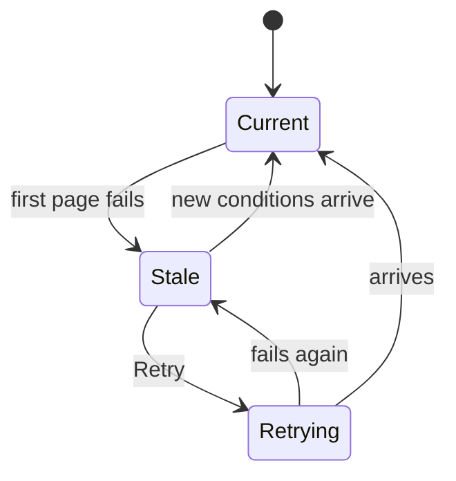

- The previous rows and count stay (Edge Case). Above the column header, in the band, the library's
  `LoadMoreFailed` box (`rounded-md border border-danger bg-danger-soft px-3 py-2 text-sm text-danger`,
  `AlertCircle`, `role="alert"`) says "Couldn't load tags: {reason}. The list below may not match the current
  search, filters and sort." with a `sm` `Button` "Retry". No toast: the box says the same and does not vanish. It
  lives in the band because the kept rows do not match the conditions, so the notice has to be visible at any
  scroll depth.
- The box stays until a first page **arrives**, from "Retry" or a condition change. "Retry" reloads the first page
  under the current conditions and is `disabled` while sending; on arrival the rows and count are replaced, the
  scroll returns to the top and the box goes. Another failure keeps the box and only changes the reason.
- While the box is shown **nothing loads more**: the cursor belongs to the old conditions (Edge Case: rows from
  old conditions never mix in), and the [Loading more](#loading-more) state is not shown. Checkboxes and actions on
  the kept rows still work; each acts on a real tag and applies within the loaded rows as before.
- The band grows by the box (below `sm` the text and button wrap with `flex-wrap`). This lasts only during a rare
  failure, and the virtualizer subtracts the current band height ([Band](#band)).

## Rows

Row columns, format, height (`py-2`), the name link, the synonyms line, the video count, the tentative mark and the
rename input stay as in 014 and 031. Only the leading checkbox and the collapsed actions on touch and narrow widths
are added. Drawing only visible rows (R-2) and loading in pages (R-1, R-11) do not change how rows look.

### Loading more

The end of the list (below the last loaded row) shows one load-more state at a time. It uses the rows' `px-2` and
width, sits under the `divide-y` line, is not counted, cannot be selected, and is outside the virtualizer's drawn
range (an ordinary element after the loaded rows).

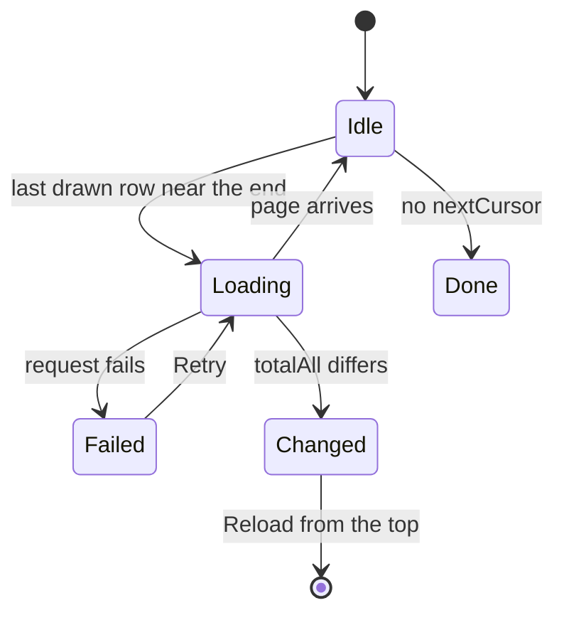

Reloading from the top under new conditions clears every state.

| State | What the end of the list shows |
| --- | --- |
| Loading | Three row `Skeleton`s (the first-load shape and height, `aria-hidden`). The list wrapper is `aria-busy`, with an `sr-only` `role="status"` "Loading more tags…". **Visible rows keep scrolling and accepting actions** (`UI品質`); a single-row action during the load applies within the loaded rows (R-12). Arriving rows append and the `Skeleton`s go |
| Failed | The library's `LoadMoreFailed` box (`rounded-md border border-danger bg-danger-soft px-3 py-2 text-sm text-danger`, `AlertCircle`, `role="alert"`, `my-3`) with "Couldn't load more: {reason}" and a `sm` `Button` "Retry", which reloads from the same cursor. Loaded rows stay (Edge Case: when loading more fails) |
| List changed (load-more `totalAll` differs from the screen's) | A neutral box of the same size (`rounded-md border border-border-strong bg-elevated px-3 py-2 text-sm text-fg`, lucide `RefreshCw`, `role="status"`) with "Tags were added or removed elsewhere, so the rest of this list may be out of date." and a secondary `sm` `Button` "Reload". Loading more stops; loaded rows and the selection stay. "Reload" reloads from the top (selection empty, scroll at the top) and the box goes (Edge Case: another tab changes tags while loading more; R-11). Not danger, because it is a notice, not a failure |
| Done (no `nextCursor`) | Nothing. No "Everything is loaded" row: the absence of the load-more `Skeleton` is the sign, and the loaded number is not shown |

The trigger is the virtualizer's last drawn row coming within a few rows of the end of the loaded rows
([data-model.md, Screen state](data-model.md#screen-state), "When to load more"), so loading starts before the
user reaches the end. When an action leaves **no loaded row** (`rows` empty) and a `nextCursor` exists, no row is
drawn and that trigger cannot fire. The screen then requests the next page once, together with applying the
action, and shows the loading `Skeleton` instead of the empty state when `total` is not 0. Examples: confirming
every loaded tentative tag under "Tentative only", or deleting every loaded row under "Unused only".

### Row checkbox

- A `Checkbox` (`size-5`) sits **left** of the name column with `gap-2` (`sm:gap-3`). The press target is a
  `size-8` square wrapper with the checkbox centred, so touch does not miss it. Pressing it does not follow the
  name link.
- Appearance follows the library list view: `opacity-40` while nothing is selected; `opacity-100` on hover or
  focus of that row; `opacity-100` on every row while anything is selected. Devices without hover press it at
  `opacity-40` (faint but visible).
- A selected row gets a `bg-accent/10` surface (10% of the accent). The first version's `bg-accent-soft` is a
  solid dark teal, and runs of selected rows made the list look heavy (review). The name (`text-fg`) and the count
  and synonyms (`text-fg-muted`) keep their colours.
- A row being renamed shows the rename surface (`bg-elevated` with `ring-control-border`), which wins, and its
  checkbox is `disabled`: committing a rename can move the row to another sort position, so it is not selectable
  during rename. Starting a rename on a selected row deselects it (the selection bar count drops; at zero the header
  row returns). Bulk actions never act on a tag being renamed.
- The selection is a subset of the **loaded rows** and empties when search, filters or **sort** change (Edge Case,
  [data-model.md, Screen state](data-model.md#screen-state), "Selection"). Ids that leave `rows` after an action
  or a reload drop out. Row checkboxes stay pressable even when the loaded rows exceed the limit
  ([Why this shape](#why-this-shape)).
- A row being renamed survives a reload from the top under new conditions: if the new `rows` lack it, it is inserted
  at its sort position, so the typed name is not lost (Edge Case on rows being renamed; as the current search does).
  When the rename is committed or cancelled, the row disappears if it does not match the current conditions.
- No Shift range selection: the parent Issue does not ask for it, and the header checkbox selects every loaded row.

### Actions on touch and narrow widths

| Device and width | Row actions |
| --- | --- |
| Mouse (`pointer: fine`) at `sm` and up | Unchanged: the "Confirm", "Rename" and "Synonyms" `IconButton`s and the "More actions" menu (031 "Row") |
| Touch (`pointer: coarse`) or below `sm` | One `IconButton` at the right end (`Ellipsis`, accessible name "Actions", no tooltip) opening a menu of labelled items: "Confirm" (`Check`, tentative rows only) → "Rename" (`Pencil`) → "Synonyms" (`Tags`) → "Merge into another tag…" (`Merge`) → separator → "Reject…" (`Ban`, danger, tentative rows) or "Delete…" (`Trash2`, danger, confirmed rows) |

- Item labels reuse the current `IconButton` accessible names and menu items. CSS chooses the variant
  (`[@media(pointer:coarse)]` and `max-sm:`), without reading `matchMedia` (library-ui.md, [Width breakpoints in CSS, and the sidebar exception](../../docs/design-docs/library-ui.md#width-breakpoints-in-css-and-the-sidebar-exception), as `TouchControls`).
- "Confirm" in the menu behaves like the row's "Confirm": no confirmation; while sending, the entry `IconButton` is
  `aria-busy` and ignores further presses. Rename, synonyms, merge, reject and delete behave as their `IconButton`s
  and items. Focus rules from 014 and 031 that target "Rename" or "More actions" target the entry `IconButton`
  while collapsed.
- Width at 360px: the body's `px-4` and the row's `px-2` leave 312px. Minus the checkbox wrapper `size-8` (32px),
  three `gap-2` (24px), the count column `w-16` (64px) and the entry `IconButton` (32px), the name column gets about
  160px (wider than 031's 92px). No horizontal scroll.
- This collapse is merged (#683).

## Selection bar

Selecting one row replaces the header row at the top of the band with the **selection bar** of the same height
(`min-h-10`) ([`web/src/tags/TagSelectionBar.tsx`](../../web/src/tags/TagSelectionBar.tsx)): `role="region"`,
accessible name "Selected tags". An empty selection brings the header row back. No bar floats at the bottom of the
screen (it covered the last row; review). It stays with the band, so it is in reach at any scroll depth
(requirement 13).

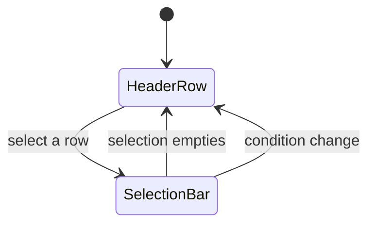

The selection empties through ×, the header checkbox in "All", a condition change, a tab switch, renaming the last
selected row, or applying an action.

### Layout

Left to right:

1. **×** (`IconButton`, accessible name "Clear selection"). Clears the selection and moves focus to the header
   checkbox.
2. The count "12 tags selected" (`text-lg font-semibold text-fg tabular-nums`, `role="status"`,
   `aria-live="polite"`; close to heading size because it sits in the heading's place). The number is the selected
   ids, a subset of the loaded rows. After the header checkbox it is the number of selectable loaded rows ("100 tags
   selected"); when it is below the matching total (the tab's "Tags 1,000", the header row's "500 of 1,000 tags"),
   the gap reads as "the rest is not loaded".
3. Right-aligned, the bulk actions as real buttons (`Button`, `md`):

| Button | Variant and icon | Shown when |
| --- | --- | --- |
| Confirm | primary, lucide `Check` | The selection has a tentative tag |
| Merge into one tag… | secondary, `Merge` | Always (merging one source gives the row merge's result) |
| Reject… | secondary, `Ban`; text and icon `text-danger` | The selection has a tentative tag |
| Delete… | secondary, `Trash2`; text and icon `text-danger` | The selection has a confirmed tag |

When the width runs out (below `sm` and similar), the buttons wrap to a line under the count (`flex-wrap`). The
library's "Select all" is not here; the header checkbox does that job.

### Enabled and disabled

- Actions that do not apply to the selection are **hidden, not dimmed**. With tentative and confirmed tags mixed,
  "Confirm", "Reject…" and "Delete…" all show; each acts on the tags it applies to and reports how many it skipped
  (Edge Case).
- The limit applies to the **selected count**: only when the selected ids exceed `maxTagBatch` do the shown actions
  become `disabled`, with the library-style reason ("Too many tags are selected to act on them together…") in
  `title`, `aria-describedby` and a `text-xs text-danger` line under the selection bar. **With more loaded rows than
  the limit, actions stay pressable while the selected count is within it** (rows picked one by one work however many
  rows are loaded; Plan "Bulk actions", requirements 8 and 9). The header checkbox stops at the loaded count
  ([Column header](#column-header)), so this state is reached only by picking more than the limit row by row, which
  practically does not happen.
- While a bulk action is sending, every selection bar button is `disabled`, and while confirming, the "Confirm"
  icon becomes `LoaderCircle` (`animate-spin motion-reduce:animate-none`). Loading more is not paused: the ids sent
  are fixed by the selection and do not depend on arriving rows.

### Bulk confirm

"Confirm" sends one `POST /api/tags/batch` (`confirm`, every selected id) at once, with no dialog
(requirement 11).

| Response part | Screen result |
| --- | --- |
| `appliedIds` | Those rows change to `tentative: false` **within the loaded rows** (the mark and the row "Confirm" disappear; no reload; R-12) and leave the selection. Toast "Confirmed 8 tags" |
| `notApplicableIds` (already confirmed) | Stay selected. The toast becomes "Confirmed 8 tags. 4 were already confirmed." |
| `notFoundIds` not empty | The list reloads **from the top** (scroll at the top; ids missing from the new `rows` leave the selection). Toast "Some of the tags no longer existed, so the list was reloaded" |
| Failure (`5xx`, network) | A toast with `errorText`; nothing changes and the selection stays (Edge Case: when it fails midway) |

Under "Tentative only", confirmed rows leave the list and `total` drops. Unloaded tentative tags stay tentative and
appear when more loads (acceptance criterion 10). Focus after a confirm follows this rule; it never lands on a
button that cannot be pressed.

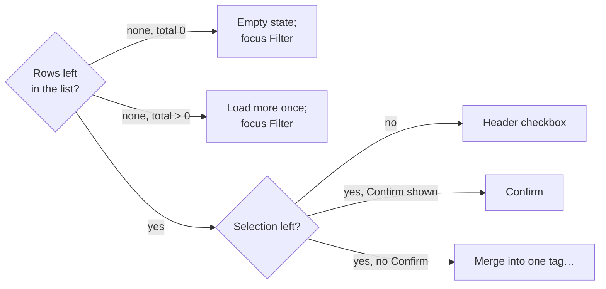

- "None, total 0" shows 031's "No tentative tags" empty state; focus goes to "Filter", which now holds the toggle
  031 focused (031: focus when a row leaves the filter).
- "None, total > 0" means unloaded tentative tags remain. The screen does not show the empty state; it requests
  the next page with `nextCursor` together with applying the confirm, because no row is drawn and the virtualizer
  trigger cannot fire ([Loading more](#loading-more)). The cursor is the position of the last loaded row, so the
  confirmed rows leaving does not move it. The selection bar is gone and the header checkbox is `disabled`, so focus
  goes to "Filter".
- "Yes, no Confirm" happens when tentative and confirmed tags were mixed and only confirmed ones remain selected.

### Bulk reject and delete

"Reject…" and "Delete…" in the selection bar open a `ModalFrame` dialog with the skeleton of 014's delete dialog:
a body paragraph, a secondary "Cancel" (first focus) and a danger "Reject" or "Delete".

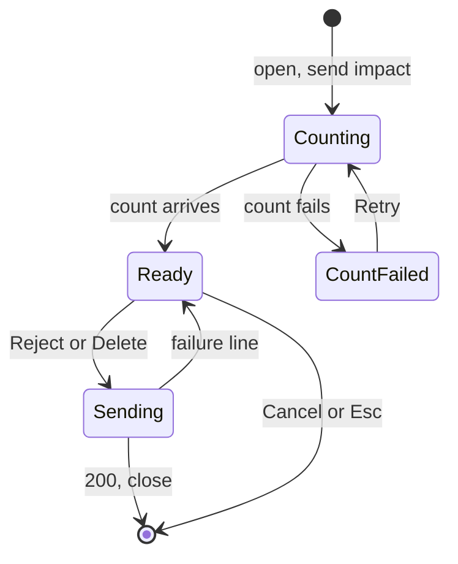

| State | What the dialog shows |
| --- | --- |
| Counting | Opening sends `POST /api/tags/impact` (`reject` or `delete`, every selected id). The body is one line "Counting the affected videos…" (`text-sm text-fg-muted`) with `LoaderCircle`. **The danger button stays `disabled`** so nothing runs without a number ([contracts/screen-api.md, `POST /api/tags/impact`](contracts/screen-api.md#post-apitagsimpact)) |
| Ready | When `tagCount` equals the selected count, the "applies to all" text; when smaller, the "applies to some" text ([Words](#words); selected, applied and skipped counts and `videoCount` filled in). `videoCount` 0 uses the "aren't on any videos" form, never "removed from 0 videos". The paragraph has 014's `border-l-2 border-danger-strong pl-3` |
| Count failed | `text-sm text-danger` (`role="alert"`) "Couldn't count the affected videos: {reason}" and a ghost `sm` `Button` "Retry"; the danger button stays `disabled` |
| Sending | Both buttons `disabled`; `LoaderCircle` on the danger button (as the delete dialog) |
| Failed | One `text-sm text-danger` (`role="alert"`) line with `errorText`; the dialog stays open and the selection stays |
| Cancel or Esc | Closes without changes and returns focus to the button that opened it ("Reject…" or "Delete…") |

On `200` the dialog closes:

- `appliedIds` rows leave the loaded rows (`total` and `totalAll` drop; no reload) and the selection.
  `notApplicableIds` stay selected.
- Toast "Rejected 8 tags" or "Deleted 8 tags"; with skipped tags "… 4 confirmed tags were skipped." or "… 4
  tentative tags were skipped.".
- After a reject, the first page of rejected names reloads (the tab count grows).
- Non-empty `notFoundIds` reloads the list from the top with the same toast as [Bulk confirm](#bulk-confirm).
- If the removal lifts the end of the list into the drawn range, loading more starts as usual. If no loaded row
  remains and a `nextCursor` exists, the next page is requested together with applying the result
  ([Loading more](#loading-more)).

Focus applies the 014 and 031 delete and reject rule to bulk actions:

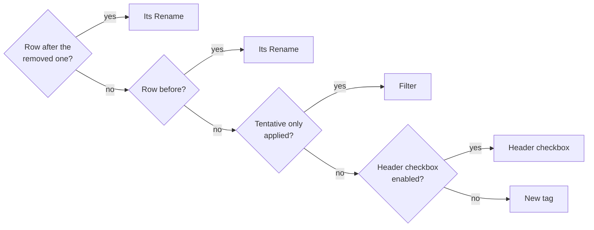

"Rename" means the entry `IconButton` while row actions are collapsed.

## Merge dialog

`MergeTagDialog` becomes one dialog with one or more sources. The row's "Merge into another tag…" (one source) and
the selection bar's "Merge into one tag…" (the selected tags as sources) open the same dialog.

### Width

- The dialog is `ModalFrame` at `sm:max-w-lg` (full width below `sm`). The target input frame and the candidate
  list fill the dialog's inner width (`frameClassName="w-full"`; requirement 14), for a single merge too.

### Target field and list

- A **visible label** "Tag to merge into" (`label`, `text-sm font-medium text-fg`) sits above the input, and lucide
  `Search` (`text-fg-subtle`) at the left of its frame. The frame matches the body search field (`h-9`, `text-sm`,
  `rounded-md`).
- Candidates are **always** listed in a **fixed-height box** under the input (`h-60 max-h-[40vh]`,
  `rounded-md border border-border p-1`, scrolling vertically; `Combobox` `inline`), not in a list layered over the
  input. The box height does not depend on the number of candidates and never covers the dialog's footer buttons.
  Candidate rows are `min-h-9` and `rounded-md`; the hovered or arrow-selected row is `bg-hover-wash`.
- **The chosen target stands out in the list** (`bg-accent-soft text-link`, name in `font-medium`).
- With no candidates (neither loading nor failed), the box shows "No matching tags" in `text-sm text-fg-muted`.
- The left of the footer (the button row) shows "**source → target**" once a target is chosen: the source name for
  one source, "3 tags" for several, in `text-sm text-fg-muted`, the target in `font-medium text-fg`, with
  `ArrowRight` between.
- "Merge" is a **primary** `Button`, `disabled` (primary `disabled`, `opacity-50`) until a target is chosen and its
  count arrives. A "Merge" that cannot be pressed is not shown in danger red (review). The body's
  `border-l-2 border-danger-strong` paragraph says the action is destructive (as in 014).
- Esc closes the dialog even with the candidate box open: the box is part of the dialog body, with no level of its
  own to close.

### Sources

| Sources | Dialog content |
| --- | --- |
| One (from a row) | The current shape: title "Merge "X"", no source list, 014's confirmation text and count (`videoCount`) |
| Several (from the selection bar) | Title "Merge 4 tags". Above the input, the heading "Tags to merge" (`text-xs font-semibold text-fg-muted uppercase`, the popover `legend` format) and the source names (`ul`, `flex flex-wrap gap-1.5`; each a `bg-bg` `Chip` as in 014's synonyms dialog, `h-6`, `text-xs`, no ×). The list is `max-h-32 overflow-y-auto`, so dozens of sources do not stretch the dialog. Tentative tags carry the row's mark (`size-3`) after the name |
| Target picked from the selection | That tag leaves the sources (Edge Case). Its chip stays with a `text-fg-muted` "kept" (removing it would look like a selected tag went missing), and a `text-sm text-fg-muted` line ""Action" is kept and the other 3 tags merge into it." sits above the confirmation text |
| Only the target left (one tag selected and chosen as target) | `text-sm text-fg-muted` "Choose another tag to merge into: "Action" is the only tag selected." replaces the confirmation text, and "Merge" is `disabled` |

### Target candidates

Candidates come from **every tag**: selected, unselected and unloaded (requirement 9). Each input requests
`GET /api/tags?q={input}&limit=8`
([research.md R-14](research.md#r-14-merge-target-candidates-come-from-get-apitagsqlimit),
[data-model.md, Screen state](data-model.md#screen-state), "Merge dialog candidates").

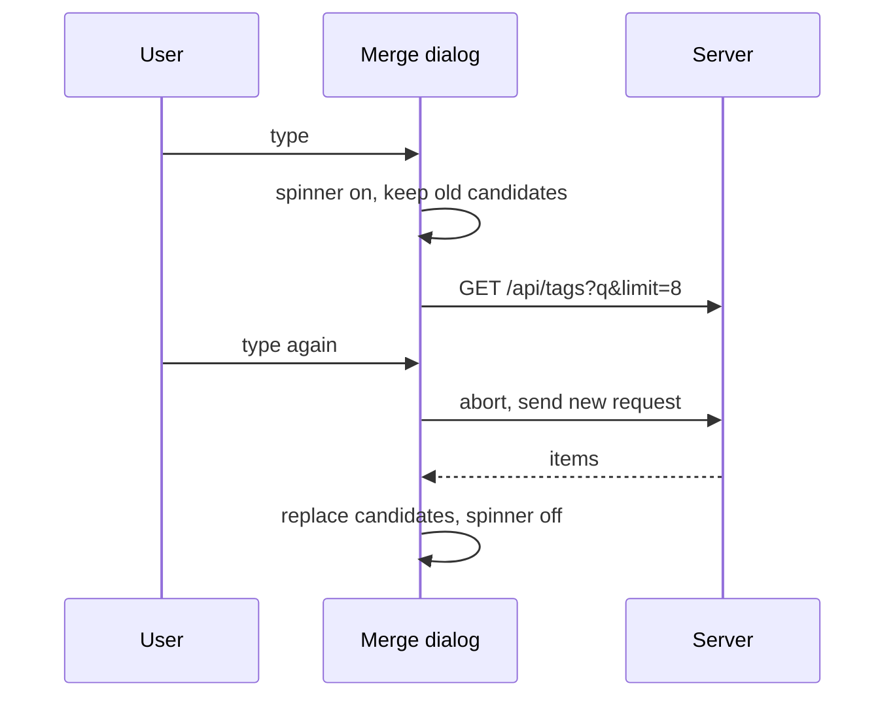

- **Candidate rows keep the current `Combobox` content**: the name, "Synonym: …" when a synonym matched, the count
  at the right, `exactOption` for a name or synonym equal to the input, up to 8 rows. Order is the server's natural
  name order; the screen does not re-sort. Opened from a row, the response drops the source; opened from the
  selection, selected tags stay as candidates (the merged shape).
- **Right after opening** (empty input) the same request fetches the first 8 and lists them on arrival; candidates
  for an empty input stay as today.
- **Loading**: `Combobox` `busy` (`LoaderCircle` at the right end of the frame, `size-3`, `text-fg-muted`,
  `aria-busy`). **The previous candidates stay** until replaced; the list never empties or closes, because a list
  that vanishes and returns on every keystroke cannot be followed. No "Searching…" row: the spinner is enough, a
  load is one round trip and usually appears with the input. The next input aborts the request in flight, and only
  the last response becomes the candidates.
- **No candidates** (`items` empty and no `exactOption`): "No matching tags" in the box.
- **Failure**: "Couldn't search tags: {reason}" under the input in the `Combobox` `reason` format
  (`mt-1 text-xs text-danger`). The last candidates stay; the next input clears the message and searches again. No
  "Retry": changing the input searches again, so there is nothing more to press. "Merge" stays unpressable without
  a chosen candidate, as before.
- Matching uses the list search's matching form, so `ａｃｔ` finds "Action" even when it is not loaded
  (requirements 9 and 7). What happens after choosing is [Confirmation](#confirmation).

### Confirmation

- Choosing a target sends `POST /api/tags/impact` (`merge`) for the sources without the target. Until it arrives:
  "Counting the affected videos…" with `LoaderCircle`, and "Merge" `disabled`. On arrival, 014's
  `border-l-2 border-danger-strong` paragraph says "The 120 videos tagged with these 4 tags get the tag "Action".
  …". The tag number ("these 4 tags", "the 4 tags leave") is **the sources without the target**, not the selected
  count: selecting 4 and choosing "Action" among them gives "these 3 tags". The video number is the response's
  `videoCount`. With one source left, 014's single-tag text applies. A count failure shows bulk reject's
  "Couldn't count…" and "Retry". Choosing another target counts again.
- Running sends `POST /api/tags/{id}/merge` with `sourceIds` = the sources without the target. On `200`:

| Effect | Rule |
| --- | --- |
| Dialog | Closes |
| Source rows | Leave the loaded rows |
| Target | Rewritten from the response's `tag` (counts summed; tentative becomes confirmed); no reload |
| Target among loaded rows | Its row is replaced and moves to its sort position |
| Target not loaded (chosen from candidates) | Inserted at its sort position if that falls inside the loaded range; otherwise not inserted, and a later page returns it (R-12) |
| Selection | Empties |
| Toast | The number **actually merged** (`sourceIds` minus `notFoundIds`): "Merged 4 tags into "Action"" (one: 014's "Merged "X" into "Action"") |
| Focus | The target row's name if it is among loaded rows (as 014). Otherwise (outside the loaded range, or confirmed under "Tentative only") 031's rule: the row after the first removed source, else the header checkbox ("New tag" when no row remains and the checkbox is `disabled`) |
| No loaded row left with a `nextCursor` | The next page is requested together with applying the result ([Loading more](#loading-more)) |

- Non-empty `notFoundIds` reloads the list from the top. When **every** source was gone (`notFoundIds` equals
  `sourceIds`; the response's `tag` is unchanged), there is no merge toast; it is handled like today's
  `tag_not_found`: the dialog closes, the toast "Some of the tags no longer existed, so the list was reloaded"
  shows, and the list reloads. When only some were gone, the merged-count toast is followed by the same reload
  toast.
- Failure, "Cancel" and Esc stay as in 014: a failure shows in the open dialog; on close, focus returns to the
  "More actions" that opened it or to the selection bar's "Merge into one tag…".

## Rejected names tab

Selecting the "Rejected names" tab under the heading ([Tabs](#tabs)) lists rejected names in the body
(`role="tabpanel"`; [`web/src/tags/RejectedNames.tsx`](../../web/src/tags/RejectedNames.tsx)). No dialog opens. The
content arrives in **pages** of `GET /api/tags/rejected-names` and loads more as the body scrolls
([research.md R-13](research.md#r-13-rejected-names-load-in-pages-from-get-apitagsrejected-names-with-more-loaded-on-scroll),
[contracts/screen-api.md, `GET /api/tags/rejected-names` parameters](contracts/screen-api.md#get-apitagsrejected-names-parameters)).

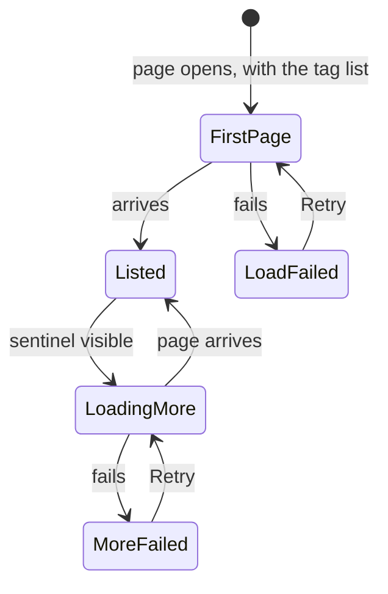

- **Content**: one description line (`text-sm text-fg-muted` "Automatic tagging won't create these names. Allow a
  name again to let it be created.") and the names (`ul`, accessible name "Rejected names",
  `divide-y divide-border`). Rows are `min-h-12` and `px-2`: the name (`text-sm font-medium`, `truncate` with
  `title`) and a secondary `sm` "Allow again" at the right (accessible name "Allow "{name}" again"). Pressing it
  removes the name at once (no confirmation, `disabled` while sending, no toast). Focus moves to the next row's
  "Allow again", else the previous row's, else the "Rejected names" tab. A removal failure is one `role="alert"`
  line under the list. The first load shows four row-height `Skeleton`s (`h-10`); a failed first load shows
  "Couldn't load the rejected names" and "Retry"; no names shows "No rejected names" centred. The rules are 031
  "Rejected names", with the × chip turned into a row button.
- **Loading**: the page fetches the first page (100) together with the tag list when it opens, and the tab count is
  the response's `total`. Opening the tab shows that page without reloading (acceptance criterion 13).
- **More**: when the end of the list nears the viewport (a sentinel with the viewport as root), the next 100 come
  with `nextCursor` and append (the #730 rule; rows are not virtualized). While loading, three row-height
  `Skeleton`s (`aria-hidden`) sit under the list and its `ul` is `aria-busy`. One request at a time; row buttons
  stay pressable until it arrives. If the sentinel shows during a reload, it is watched again after the reload and
  loads more.
- **More failed**: under the list, `text-sm text-danger` (`role="alert"`) "Couldn't load more rejected names" and a
  ghost `sm` `Button` "Retry". Loaded names stay; "Retry" reloads from the same cursor. If every loaded name is
  removed but more remain, the screen shows the load-more state (or "Retry" after a failure), not the empty text.
- **Removal**: `204` removes the row and lowers the tab count (`total`) by 1, without a reload. If a first-page
  reload overlaps a removal in flight, its response is dropped and the reload runs after the removal.
- **Reload** triggers (after reject, create, rename, adding a synonym, bulk reject) stay as in 031. Only **the first
  page** reloads.
- Search, filters and sort do not apply to rejected names (they are not tags; as in 031). On this tab the top bar
  holds nothing, not even search: `GET /api/tags/rejected-names` has no search, and adding one is outside this fix.

## States

These rows add to or change the "States" tables of 014 and 031.

| State | What the screen shows |
| --- | --- |
| Waiting for the first page after a condition change (search, filters, sort) | The previous rows and count stay. The selection empties and the header row returns. No `Skeleton`. On arrival the rows are replaced and the scroll returns to the top |
| No match for "Unused only" (no search, "Tentative only" off) | `EmptyState` (`VideoOff`) "No unused tags", description "Every tag is on at least one video.", `Button` "Show all tags". Pressing it removes the filter and focuses "Filter". Decided by the response's `total` being 0 |
| No match for "Unused only" and "Tentative only" | `EmptyState` (`VideoOff`) "No unused tentative tags", no description, `Button` "Show all tags". Pressing it removes both and focuses "Filter" |
| No match for "Tentative only" (031) | 031's "No tentative tags". "Show all tags" removes it and focuses "Filter" ("New tag" when there are no tags) |
| No match for filters and search | `EmptyState` (`SearchX`) "No unused tags match "{input}"" or "No unused tentative tags match "{input}"", `Button` "Show all tags". Pressing it removes the filters and the search and focuses the search input |
| Loading more | Three row `Skeleton`s at the end, screen reader "Loading more tags…". Visible rows keep scrolling and accepting actions |
| Loading more failed | A danger box "Couldn't load more: {reason}" with "Retry" at the end. Loaded rows stay |
| The list changed during load-more (`totalAll` mismatch) | A neutral box "Tags were added or removed elsewhere…" with "Reload" at the end. Loaded rows and the selection stay; loading more stops. "Reload" reloads from the top and empties the selection |
| Everything loaded | Nothing at the end |
| Bulk confirm sending | Every selection bar button `disabled`; the "Confirm" icon is `LoaderCircle` |
| Waiting for the count in bulk reject, delete or merge | Body "Counting the affected videos…" with `LoaderCircle`; the danger button `disabled` |
| Count failed | `role="alert"` "Couldn't count the affected videos: {reason}" with "Retry" in the body; the danger button `disabled` |
| Run over a selection with inapplicable tags | The dialog body says "8 of the 12 selected tags are …" first, and the toast after running says "4 … were skipped.". Skipped tags stay selected |
| Some targets no longer existed (`notFoundIds`) | The rest is processed; toast "Some of the tags no longer existed, so the list was reloaded"; the list reloads from the top. Ids missing from the new `rows` leave the selection |
| A bulk action failed | From the selection bar (confirm) a toast; from a dialog one line in the dialog. List and selection unchanged |
| Loaded rows over the limit | Only the header checkbox is `disabled`, with the reason in `title` and `sr-only`. Row checkboxes and selection bar actions stay pressable |
| Selected count over the limit | Selection bar actions `disabled`, with the reason in `title`, `aria-describedby` and one line under the selection bar |
| Merge dialog searching candidates | `LoaderCircle` at the right end of the input; previous candidates stay |
| Merge dialog candidate search failed | `text-xs text-danger` "Couldn't search tags: {reason}" under the input; the last candidates stay |
| Merge dialog has no candidates | "No matching tags" in the candidate box |
| Rejected names tab loading more | Three row `Skeleton`s under the list |
| Rejected names tab failed to load more | "Couldn't load more rejected names" with "Retry" under the list; loaded names stay |
| Load failure with a list shown | The current list and count stay; a danger box "Couldn't load tags: {reason}…" with "Retry" sits above the column header in the band, stays until a page arrives, and nothing loads more ([Stale list](#stale-list), Edge Case). With no list yet, the current danger `EmptyState` with "Retry" |

The first-load `Skeleton`, "No tags yet", the "Tentative only" empty state, and the rename, create and single-row
action states stay as in 014 and 031. Single-row actions also apply within the loaded rows without a reload
(confirm, reject, delete, rename, create, merge; [data-model.md, Screen state](data-model.md#screen-state),
"Applying an action's result"). The visible difference is that actions cause no `Skeleton` or row flicker and the
scroll position does not move. The sort, "Filter" and the header checkbox are `disabled` before the first page has
arrived and after a failure with no list. Tabs always show; their counts appear once known.

## Responsive behaviour

Width variants use only Tailwind's default breakpoints, in CSS (library-ui.md, [Width breakpoints in CSS, and the sidebar exception](../../docs/design-docs/library-ui.md#width-breakpoints-in-css-and-the-sidebar-exception)). The judged widths are 360px
(covering 390px devices), 768px and 1280px. The top bar varies as the library's `LibraryToolbar` does.

| Width | Top bar | Band | Rows |
| --- | --- | --- | --- |
| 1280px | Search (`sm:max-w-md`) → "Filter" (with text at `xl` and up) → sort (menu and direction) | Header row ("Tags", count, "New tag") → tabs → (chips) → column header | Checkbox → name column → count → four `IconButton`s (mouse) or one "Actions" (touch) |
| 768px (`md` and up) | As above ("Filter" shows icon and count only) | As above | As above |
| 360px (below `md`) | Search (`flex-1`) → "Filter" (icon and count) → compact sort (`SlidersHorizontal`, accessible name "Sort") | As above. The selection bar wraps its buttons under the count | Checkbox → name column (about 160px) → count (`w-16`) → one "Actions". No horizontal scroll |

- The compact sort below `md` is the library's view-and-sort popover (`PopoverContent`, `align="end"`, `w-72`) with
  the `CompactSortControls` shape ([Top bar](#top-bar)).
- The header row stays on one line at 360px ("Tags", "1,000 of 1,000 tags", "New tag" take about 300px); the count
  is `truncate` and does not wrap. The tabs "Tags 1,000 | Rejected names 1,000" also fit one line (about 250px).
- Band height at 1280px without chips: `pt-3` + header row `h-10` + tabs `h-10` + column header `h-9` + two `gap-3`,
  about 150px. At 1280×800 the list below the top bar and the band is about 600px, about 12 rows of tags without a
  synonyms line. One page of 100 is about 8 screens, so nothing needs to load more right after opening.
- Dialogs (confirmation, merge) keep `ModalFrame`'s current width handling (full width below `sm`).

## Review criteria

Judge on a real screen (library-ui.md, [Layout verified by people, not machines](../../docs/design-docs/library-ui.md#layout-verified-by-people-not-machines)); presence alone does not pass (Q-4). Check mainly at 1280×800, then at
768px and 360px (on a touch device or with devtools touch emulation). Scale: `tagsbench` with 1,000, 3,000 and
30,000 tags ([quickstart.md](quickstart.md)); the visual judgement is the same at 30,000.

1. **Match with the library**: the top bar's search field, "Filter" and sort button sit in the same place, at the
   same height and with the same look as on the library screen. The heading "Tags" and the count to its right use
   the format of "Library" and "N items". The body has no controls row of its own.
2. **Visual hierarchy**: opening the screen at 1280×800, the eye goes to the row names → the heading and "New tag" →
   counts, synonyms and tentative marks; the checkboxes (`opacity-40`) are noticed after that. Selecting one row
   swaps the header row for the selection bar, and the faint selected surface (`accent/10`) and every checkbox come
   forward, while name colour and size stay. × restores the screen. In the selection bar only "Confirm" is
   primary; merge, reject and delete are secondary (reject and delete with danger text). Inapplicable actions are
   absent. While a filter applies, the "Filter" button has the `accent-soft` surface and a number, and chips sit
   under the heading. End-of-list states (`Skeleton`, failure, list changed) never stand out over rows, and only
   the failure box carries the danger colour (`UI品質`: `視覚的階層`, `操作の優先順位`).
3. **Density**: at 1280×800 about 12 rows without a synonyms line show under the band. Row height is 031's (the
   `size-5` checkbox fits the `py-2` row without stretching it). The selection bar has the header row's height, so
   selecting does not change how many rows show. No page boundary appears in counts.
4. **Spacing rhythm**: inside the band, header row, tabs, chips and column header are `gap-3` apart. The line under
   the column header matches the lines between rows in colour and weight. The gap between checkbox and name column
   equals the column gap `gap-2` (`sm:gap-3`), so the column header's checkbox, "Name" and "Videos" sit exactly
   above the rows' checkbox, name and count. When the band sticks, rows scrolling under it do not show through.
   The load-more `Skeleton` has the rows' height and `px-2`, so it reads as a continuation of the loaded rows.
5. **Typography**: heading and count use the library format. The selection bar count is `text-lg font-semibold`;
   the column header and tab numbers are `text-xs` or `text-sm` in `fg-muted` or `fg-subtle`. The sort button text
   is only the kind name; the direction is shown by the icon.
6. **Action priority**: "Filter" → "Tentative only", the header checkbox, and the selection bar's "Confirm" clear
   every loaded tentative tag in 4 presses (acceptance criterion 10; 2 when the URL has `tentative=1`). Reject is
   "Reject…" → wait for the number → "Reject", two presses, one dialog more than confirm. A single-row action on a
   mouse device stays one press. On touch, row actions take "Actions" → item, two presses, but every item is
   readable text (`UI品質`: `行の操作`).
7. **Loaded versus all**: under "Tentative only" with `total` 500 ("500 of 1,000 tags"), the header checkbox makes
   the selection bar read "100 tags selected", the checkbox shows the selected state, and its accessible name goes
   "Select all 100 loaded tags" → "Clear selection". After "Confirm", the 100 loaded rows lose the tentative mark,
   the header count becomes "400 of 1,000 tags", and scrolling to load more shows the remaining tentative tags still
   tentative (acceptance criterion 10, requirement 10). The screen does not freeze during this.
8. **Loading more**: scrolling a 30,000-tag list to the end shows row `Skeleton`s under the last loaded row that
   are soon replaced by rows, while the band stays put and row checkboxes and actions remain pressable. No tag shows
   twice. A load-more failure keeps the loaded rows, and the danger box's "Retry" loads more. Creating a tag in
   another tab and then loading more shows the neutral box "Tags were added or removed elsewhere…", stops loading,
   and "Reload" reloads from the top (Edge Case).
9. **Visible sort and filters**: the sort button's text shows the kind and the arrow to its right the direction.
   Turning on "Unused only" makes the header count "90 of 1,000 tags", shows the chip "Unused only", and every row
   shown reads "0 videos"; the count includes unloaded tags (acceptance criterion 8). "Video count" descending puts
   the most-used tag first and reaches 0 videos at the end (acceptance criterion 5). Under "Date created" newest
   first, creating a tag with "New tag" puts its row first (acceptance criterion 6). Changing sort, filters, search
   or tab and reloading opens with the same conditions (acceptance criterion 7, [URL state](#url-state)). Typing
   `ＡＣＴＩＯＮ` in search shows "action" even though it was not loaded (acceptance criterion 9). Changing
   conditions never shows an empty list or a `Skeleton`; the old rows give way to the new ones.
10. **Reach while scrolling**: at the end of a 30,000-tag list, the top bar's search, "Filter" and sort, and the
    band's header (or the selection bar), tabs and column header are visible (requirement 13). At the top of a
    1,000-tag list, pressing the "Rejected names" tab without scrolling lists them in the body (acceptance criterion
    13).
11. **Confirmation numbers**: selecting 8 tentative and 4 confirmed tags and opening "Delete…" shows "4 of the 12
    selected tags are confirmed", not "8 of the 12 selected tags are confirmed", with the number of distinct videos
    carrying any of the 4 confirmed tags (acceptance criterion 12). Merging 4 selected tags into "Action" shows 4
    chips and a target input across the dialog width; after running, the 4 disappear and "Action"'s count becomes
    the distinct sum (acceptance criterion 11, requirement 14). Typing `ａｃｔ` in the target input shows the
    unloaded "Action" in the box under the input, with a small spinner at the right end while typing and no
    candidates vanishing and returning (requirement 9). The box does not cover the footer buttons, the chosen
    target stands out, and the footer shows "source → target". Until a target is chosen, "Merge" is a primary
    button that cannot be pressed, not red.
12. **Rejected names tab**: with 1,000 rejected names the tab shows "1,000"; opening it lists the first 100 as rows,
    and scrolling to the end shows row `Skeleton`s and appends the next 100. "Allow again" removes the row and
    lowers the tab number by 1 (requirement 12).
13. **Keyboard**: Tab goes top bar search → "Filter" → sort menu → direction → the body's "New tag" (or, while
    selecting, the selection bar's × → actions) → tabs → chips → ("Retry" of the [Stale list](#stale-list) box when
    present) → header checkbox → row checkbox → row name → row actions → …, and after the last loaded row to the
    end-of-list box's button ("Retry" or "Reload" when present). `/` jumps to search. Esc in a dialog closes only
    the dialog. In a 1,000-tag list, tabbing through rows past the edge of the drawn range reaches the next row
    (focus does not jump out of the band or the body), and Shift+Tab likewise returns to the previous row. When Tab
    reaches the last loaded row, loading more has already started if more exists (from when that row was drawn;
    [Keyboard across virtualized rows](#keyboard-across-virtualized-rows)).
14. **Examples that do not meet the requirement** (`UI品質`): it is faster, but there is no way to select and
    confirm loaded tags together. Checkboxes or action buttons draw the eye before names when nothing is selected.
    A filter applies but neither the "Filter" button nor a chip shows it. Reject, delete and merge look as heavy as
    the primary confirm. Inapplicable actions show as dimmed buttons. Selection actions cover the last row. Counts
    show page boundaries (the loaded number). Rejected names sit below the list, out of reach from the top. On touch,
    row actions are icons only, unclear until pressed. Fewer than 12 rows show at 1280×800. The merge dialog input is
    clearly narrower than the dialog. The list falls back to `Skeleton` and flickers on every condition change.
    Scrolling or row actions stop while loading more. After the header checkbox, the count does not show that only
    loaded rows were selected. A change in another tab silently returns the user to the top and loses the selection.

## Keyboard across virtualized rows

Drawing only the visible rows (R-2) leaves rows outside the drawn range out of the DOM, so the browser's default
Tab jumps out of the list from the last drawn row. Two rules keep Tab order equal to the loaded row order (merged).

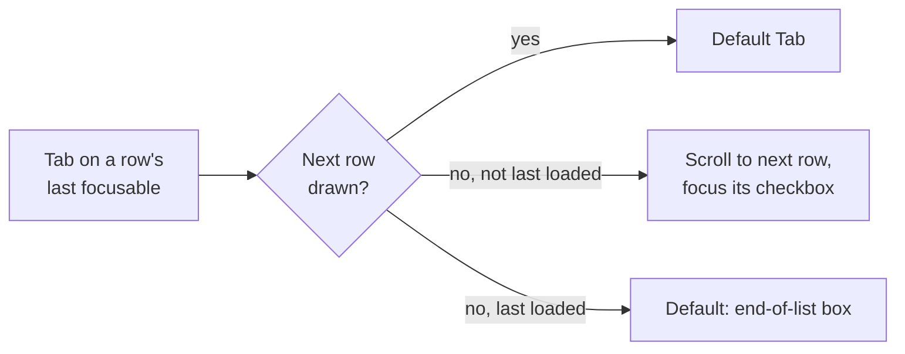

- **The focused row stays drawn**: the virtualizer's drawn range (`rangeExtractor`) always includes the focused
  row's index. Scrolling it off screen does not remove it, so focus never falls to `body`.
- **Tab at the edge passes to the next row**: in the list wrapper's `keydown`, when Tab comes from a row's last
  focusable element and the next row is not drawn (and this is not the last loaded row), the default is prevented,
  the list scrolls to the next row (`scrollToIndex`, minus the band height; [Band](#band)), and once drawn, focus
  moves to that row's checkbox. Shift+Tab from a row's first focusable element with the previous row undrawn scrolls
  to the previous row and focuses its last focusable element (the row actions entry). Tab from the last loaded row
  and Shift+Tab from the first row keep the default and leave the list (to the end-of-list box's button, or to the
  band's header checkbox).
- **Relation to loading more**: tabbing to the last loaded row draws it, which starts loading more (the
  [Loading more](#loading-more) trigger). Arriving rows append after it, so the user keeps tabbing forward. If the
  load is too slow and focus leaves the list, Shift+Tab comes back.

## Colour

- No token is added. The selected row surface is 10% `accent` (`bg-accent/10`). It lies over `bg`, so the contrast
  of the name (`fg`) and the count and synonyms (`fg-muted`) stays close to that on `bg`.
- These pairs are already in `pairs`: the active "Filter" and the chips (`link` on `accent-soft`), the chosen merge
  candidate (the same pair), the selection bar text (`fg` on `bg`), the selection bar's "Reject…" and "Delete…" text
  (`danger` on `elevated`), the failure line in dialogs (`danger` on `elevated`), band text (`fg-muted` on `bg`),
  the load-more failure box and the band's stale list box (`danger` on `danger-soft`, as the library's
  `LoadMoreFailed`), and the list-changed box (`fg` on `elevated`).
- The tentative mark's `fg-subtle` is used for the icon only (as in 031).

## Accessibility

The parent Issue does not ask for a screen reader or contrast design, so this section fixes only names and roles
(the same scope as 014 and 031).

| Element | Name and role |
| --- | --- |
| Row checkbox | Accessible name "Select "{name}"" |
| Header checkbox | "Select all 100 loaded tags" / "Clear selection"; mixed state `aria-checked="mixed"`; the disabled reason through `aria-describedby` |
| "Filter" | Accessible name "Filter" / "Filter (N applied)"; the popover holds labelled `checkbox`es |
| Chips | Buttons "Remove the filter "{name}"" inside the `ul` "Active filters" |
| Sort menu | `aria-label` "Sort by: {kind}"; the direction button as in [Words](#words); the compact button "Sort" |
| Tabs | `role="tablist"` "Tag lists"; `role="tab"` with `aria-selected` and `aria-controls`; the panel `role="tabpanel"` with `aria-labelledby`. The header count is `role="status"` |
| End-of-list states | Loading: `aria-busy` on the list wrapper and an `sr-only` `role="status"` "Loading more tags…". Failure box `role="alert"`; list-changed box `role="status"`. The band's stale list box `role="alert"` |
| Selection bar | `role="region"` "Selected tags"; the count `role="status"` (`polite`); the over-limit reason in `title` and `aria-describedby` |
| Dialogs | The title is `ModalFrame`'s `title`. The counting line is `aria-busy` and the failure line `role="alert"`. The merge input has a visible `label`, and `Combobox` sets `aria-busy` while candidates load. The candidate box is `role="listbox"` (always open, so `aria-expanded="true"`) |
| Rejected names tab | The list `ul` "Rejected names", `aria-busy` while loading more. Row button accessible name "Allow "{name}" again" |
| "Actions" menu | Entry `aria-label` "Actions"; items have text |
