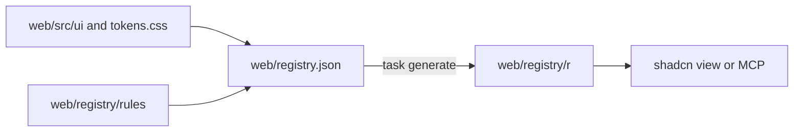

# Contract: the vv registry and the design-system checks

Source of truth: `web/registry.json` for the items, `web/components.json` for
the shadcn configuration, and `web/eslint.config.js` with
`web/design-exceptions.js` for the checks. This contract fixes what agents and
reviewers can rely on; the decisions behind it are
[research.md R-3 to R-9](../research.md#r-3-the-registry-is-built-into-the-repository-and-read-from-disk).

## Layout

The diagram shows the files and what produces each one.

| Path | Content | Edited by hand |
| --- | --- | --- |
| `web/registry.json` | The item list: name, type, files, dependencies, `docs` | Yes |
| `web/registry/rules/*.md` | The usage rules, one file per tier | Yes |
| `web/src/ui/tokens.css` | Every token, in `@theme` | Yes |
| `web/registry/r/*.json` | `shadcn build` output, one file per item plus `registry.json` | No; `task generate` writes it |

## Items

| Item | Type | Carries |
| --- | --- | --- |
| `vv` | `registry:file` | The index: every item name, its tier and one line on when to use it |
| `vv-theme` | `registry:file` | `tokens.css`, as a file rather than `cssVars`, so reading it never writes CSS variables |
| `vv-rules` | `registry:file` | `web/registry/rules/` |
| One item per component | `registry:ui` | The component file in `web/src/ui`; `docs` names its section in `components.md` |
| One item per page pattern | `registry:block` | The pattern's files; `docs` names its section in `patterns.md` |

Item names are the component's file name in kebab case (`icon-button`). Which
components and patterns exist is decided by the tier PRs
([research.md R-1](../research.md#r-1-each-tier-is-confirmed-on-its-own-implementation-pr)),
not here.

## Reading an item

From `web/`, any of these returns the item with its file contents and `docs`
(acceptance criterion 2):

| Tool | Call |
| --- | --- |
| CLI | `npx shadcn view ./registry/r/<item>.json` |
| MCP | `view_items_in_registries` with `./registry/r/<item>.json` |
| Plain read | `web/registry/r/<item>.json` |

`shadcn search` and the MCP search tools do not reach this registry; the `vv`
item is the list.

## Check rules

Each rule fails `task check` (`lint-web` or `test-web`) with the message shown
(acceptance criterion 4).

| Fails on | Rule | Message |
| --- | --- | --- |
| `<button>`, `<input>`, `<select>`, `<textarea>`, `<table>`, `<dialog>` outside `web/src/ui` | `no-restricted-syntax` | `Use the design-system component (web/registry/rules/components.md).` |
| `role="button"` outside `web/src/ui` | `no-restricted-syntax` | `Use the design-system Button (web/registry/rules/components.md).` |
| A fixed value (a literal) in `style` outside `web/src/ui`; `style` is only for values known at run time | `no-restricted-syntax` | `A fixed value in style bypasses the design-system scale. …` |
| An import from `radix-ui` or `@radix-ui/*` outside `web/src/ui` | `no-restricted-syntax` | `Use the design-system components in web/src/ui/shadcn instead of Radix directly.` |
| `outline-none`, `outline-hidden`, or a `ring` or `outline` class under a `focus`, `focus-visible` or `focus-within` variant, outside `web/src/ui/shadcn` | `better-tailwindcss/no-restricted-classes` | `Keep the shared focus ring (web/src/index.css :focus-visible); never remove it or add your own (web/registry/rules/components.md, Focus).` |
| A class with an arbitrary value or property, or the `(--var)` shorthand | `better-tailwindcss/no-restricted-classes` | `Arbitrary value outside the design-system scale (web/registry/rules/foundations.md).` |
| A class the theme does not generate | `better-tailwindcss/no-unknown-classes` | The plugin's own message |
| A numeric step outside the scale, until the theme reset | `better-tailwindcss/no-restricted-classes` | `Step outside the design-system scale (web/registry/rules/foundations.md).` |
| A raw colour outside `tokens.css`, a default palette class, a contrast pair below its minimum | `tokens.test.ts` | Unchanged |

Arbitrary variants (`data-[state=open]:`, `has-[...]:`, `max-[49.5rem]:`) pass;
only the part after the last `:` is checked.

## Exception list

`web/design-exceptions.js` exports one array. An entry exempts a file from
named rules, or allows named classes in a file.

| Field | Meaning |
| --- | --- |
| `file` | Path under `web/src` |
| `rules` | The rules the entry exempts |
| `classes` | Optional: the only classes allowed, as regular expressions; without it the whole file is exempt from `rules` |
| `kind` | `migration` (removed by the PR migrating the file) or `special` (stays) |
| `reason` | Required for `special`: why the design system cannot express the look |

A Vitest test fails when an entry names a missing file, when a `special` entry
has no `reason`, and, once the theme reset has landed, when a `migration`
entry remains.
