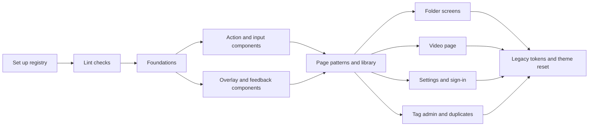

# Implementation Plan: vv design system on shadcn/ui, used as the reference for AI implementation

**Branch**: `feature/038-design-system` | **Parent Issue**: #757

**Input**: The parent Issue. It is this feature's specification.

## Summary

The library screen is the starting point for a new vv design system built on
shadcn/ui: foundations, components with usage rules, and page patterns. It
lives as a shadcn registry inside the repository, agents reach it from
`AGENTS.md` through the shadcn skill and MCP server, ESLint fails code outside
it, and every screen moves onto it.

| Concern | Approach |
| --- | --- |
| Deciding the design system | `ui-design.md` sets each tier's direction from the library screen; the foundations, components and page patterns are each built and confirmed by the maintainer in their own PR, in that order, on a development-only showcase ([R-1](research.md#r-1-each-tier-is-confirmed-on-its-own-implementation-pr), [R-2](research.md#r-2-a-development-only-showcase-route-renders-each-tier)) |
| Registry | `web/registry.json`, built by `task generate` into `web/registry/r/` and read by path ([R-3](research.md#r-3-the-registry-is-built-into-the-repository-and-read-from-disk), [contracts/registry.md](contracts/registry.md)) |
| shadcn setup | Radix base, `@/` alias, `cn` package, components kept in `web/src/ui` ([R-4](research.md#r-4-shadcn-is-set-up-on-radix-with-a-path-alias-and-the-cn-package)) |
| Tokens | shadcn's semantic names plus vv's own roles, hex, in `web/src/ui/tokens.css`; dark only, with no light set ([R-5](research.md#r-5-tokens-use-shadcns-semantic-names-in-hex-in-their-own-file)) |
| Rules and agent route | Per-tier rule files shipped as the `vv-rules` item; `AGENTS.md` → `design-system.md` → registry; vendored shadcn skill and project MCP server ([R-6](research.md#r-6-usage-rules-are-markdown-files-shipped-as-registry-items), [R-7](research.md#r-7-agents-reach-the-registry-through-agentsmd-a-vendored-skill-and-an-mcp-server)) |
| Checks and migration | ESLint with `eslint-plugin-better-tailwindcss` plus the existing token test; one exception list that starts with every current offender and shrinks with each screen PR ([R-8](research.md#r-8-eslint-enforces-the-design-system-with-exceptions-in-one-list), [R-9](research.md#r-9-screens-migrate-one-area-per-pr-behind-a-shrinking-exception-list)) |

The Issue carries the `ui` label, so `design` runs next. Its `ui-design.md`
decides, from the Issue's `UI品質`: the density of the library (management)
and the video page (viewing); the direction of the type, spacing, radius,
shadow and colour scales; the component and page-pattern inventory; and, for
each special look (seek preview, thumbnail marks, video.js controls), whether
it becomes a vv component or a `special` exception. Concrete token values are
chosen in the foundations PR (R-1).

## Technical Context

**Canonical definitions**:

| Topic | Source |
| --- | --- |
| Web layer and its directories | [ARCHITECTURE.md](../../ARCHITECTURE.md#web-layer) |
| Tech stack | [docs/design-docs/tech-stack-selection.md](../../docs/design-docs/tech-stack-selection.md) |
| Current visual rules and token checks | [docs/design-docs/library-ui.md](../../docs/design-docs/library-ui.md), [web/src/index.css](../../web/src/index.css), [web/src/theme/tokens.test.ts](../../web/src/theme/tokens.test.ts) |
| Lint configuration and its no-inline-config rule | [web/eslint.config.js](../../web/eslint.config.js) |
| Check entry points | [Taskfile.yml](../../Taskfile.yml) (`task check`, `task generate`, `task test-e2e`) |
| Dependency updates | [docs/how-to/dependency-updates.md](../../docs/how-to/dependency-updates.md) |

**Feature-specific context**:

- New web dependencies: `radix-ui` (replaces the eight `@radix-ui/react-*`
  packages), `class-variance-authority`, `cn`, `tw-animate-css`; devDependencies
  `shadcn` 4.21 and `eslint-plugin-better-tailwindcss` 4.7.
- New generated output: `web/registry/r/`, written by `task generate` and
  compared by `generate-check`.
- New agent configuration: `.mcp.json`, `.codex/config.toml` and the vendored
  `.agents/skills/shadcn/`.
- No server, API or data change: no `data-model.md`, and the only contract is
  the registry and its checks.

## Constitution Check

| Gate | Verdict |
| --- | --- |
| Important constraints are testable (core-beliefs.md) | Pass. Raw controls, arbitrary values, off-scale steps and unknown classes fail `task check` (R-8); the exception list is itself tested ([contracts/registry.md](contracts/registry.md#exception-list)). |
| Agent guidance is a map, not a copy (core-beliefs.md, AGENTS.md) | Pass. `AGENTS.md` gains one line to `design-system.md`; the rules exist once, in `web/registry/rules/` (R-6). |
| Generated files are not hand-edited (AGENTS.md) | Pass. `web/registry/r/` is written only by `task generate`, and `generate-check` catches drift. |
| No `eslint-disable` comments (`noInlineConfig`, syudead/vv#443) | Pass. Exceptions are entries in `web/design-exceptions.js`, each with a kind and, for `special`, a reason. |
| Every intermediate state builds and passes (Issue edge case) | Pass. Checks land with a baseline of exceptions, and legacy token names stay as aliases until the last unit (R-9). |
| Dark scheme only (requirement 9, library-ui.md) | Pass. `tokens.css` has one set; shadcn's light `:root` and `.dark` split is not created. |
| Screen text stays in the i18n catalog (i18n.md) | Pass. Showcase and component text goes through `t`; the i18n ESLint rules are unchanged. |
| Documents change with behaviour, translated (AGENTS.md) | Each document section has one owning unit ([Documentation ownership](#documentation-ownership)); each unit translates what it changes. |

Re-checked after Phase 1: no violation.

## Project Structure

### Documentation (this feature)

```text
specs/038-design-system/
├── plan.md
├── research.md          # R-1..R-9
├── quickstart.md        # Confirmation records, registry access, agent route, failing checks, operations
└── contracts/
    └── registry.md      # Registry layout and items, reading an item, check rules, exception list
```

No `data-model.md`: the feature stores nothing.

### Source Code

**Affected boundaries**:

| Boundary | What changes |
| --- | --- |
| `web/src/ui` | Components rebuilt on shadcn/ui; `tokens.css` added |
| `web/src/index.css` | Imports `tokens.css`; keeps the video.js and seek-preview CSS |
| Every screen directory under `web/src` | Moves onto the components, patterns and scales |
| `web/src/theme/tokens.test.ts` | Raw-colour exemption narrowed to `tokens.css`; pairs on the new names |
| `web/eslint.config.js`, `web/package.json`, `web/tsconfig.json`, `web/vite.config.ts` | Checks, dependencies, `@/` alias |
| `scripts/generate`, `Taskfile.yml` | Registry build in `task generate` |
| `AGENTS.md`, `.agents/skills/sdd-design`, `sdd-implement`, `issue-handoff/references/design.md` | Route UI work to the design system (R-7) |

**New paths**:

| Path | Purpose |
| --- | --- |
| `web/components.json` | shadcn configuration |
| `web/registry.json`, `web/registry/rules/`, `web/registry/r/` | Registry source, rules, built items |
| `web/src/ui/tokens.css` | Tokens |
| `web/design-exceptions.js` | Exception list |
| `web/src/designSystem/` | The development-only `/design-system` showcase |
| `.agents/skills/shadcn/`, `.mcp.json`, `.codex/config.toml` | shadcn skill and MCP server |
| `docs/design-docs/design-system.md` | Design document, linked from the index |

**Structure decision**: Follows the [web layer](../../ARCHITECTURE.md#web-layer);
the registry sits in `web/` beside the code it describes rather than at the
repository root (R-3).

### Documentation ownership

Each section has one owning unit, which writes it in the same PR as the
behaviour. "Set up shadcn/ui and the vv registry, and route agents to it"
creates `design-system.md` with every heading below.

| Document | Section | Owning unit |
| --- | --- | --- |
| `docs/design-docs/design-system.md` and the index | Creation, "Registry and agent route" | Set up shadcn/ui and the vv registry, and route agents to it |
| `docs/design-docs/design-system.md` | "Checks and exceptions" | Fail lint on raw controls, arbitrary values and unknown Tailwind classes |
| `docs/design-docs/design-system.md` | "Foundations"; `library-ui.md` section 1 role table replaced by a link | Define the design-system foundations and apply them to the library screen |
| `docs/design-docs/design-system.md` | "Components" | Rebuild the action and input components on shadcn/ui |
| `docs/design-docs/design-system.md` | "Page patterns" | Define the page patterns and finish the library screen on them |
| `docs/design-docs/library-ui.md` | Sections 1 and 2 updated to the final token file and theme reset | Remove the legacy tokens and limit Tailwind to the design-system scale |
| `ARCHITECTURE.md` | Web layer: `ui/` row and token location | Set up shadcn/ui and the vv registry, and route agents to it |
| `docs/design-docs/tech-stack-selection.md` | shadcn/ui and Radix | Set up shadcn/ui and the vv registry, and route agents to it |
| `docs/how-to/dependency-updates.md` | Updating the vendored shadcn skill and reapplying its pinned-CLI change | Set up shadcn/ui and the vv registry, and route agents to it |

## Implementation Work

The graph shows the units and what each waits for.



Each migration unit lists its screen's operations in its PR body, checked on
`main` and on the PR ([quickstart.md](quickstart.md) step 6).

### Set up shadcn/ui and the vv registry, and route agents to it

**Scope**: `components.json`, the `@/` alias, the R-4 dependencies (the
`@radix-ui/react-*` imports and `lib/cn.ts` replaced without visual change),
`registry.json` with the `vv` index item and today's `web/src/ui` components,
the registry build in `task generate`, the empty `/design-system` route
([R-2](research.md#r-2-a-development-only-showcase-route-renders-each-tier)),
the agent route of [R-7](research.md#r-7-agents-reach-the-registry-through-agentsmd-a-vendored-skill-and-an-mcp-server),
and this unit's rows in [Documentation ownership](#documentation-ownership).

**Dependencies**: None

**Acceptance**: `npx shadcn view ./registry/r/vv.json` in `web/` lists the
items; `task check` and `task test-e2e` pass with no screen change;
putting `npx shadcn@latest` back into the vendored skill fails `task test-web`; editing a
component without `task generate` fails `generate-check`; `/design-system`
opens under `task dev` and is absent from `task build` output.

### Fail lint on raw controls, arbitrary values and unknown Tailwind classes

**Scope**: The rules of [contracts/registry.md](contracts/registry.md#check-rules)
except the off-scale step rule, `web/design-exceptions.js` with every current
offender as a `migration` entry, and its Vitest test
([exception list](contracts/registry.md#exception-list)).

**Dependencies**: Set up shadcn/ui and the vv registry, and route agents to it

**Acceptance**: `task check` passes; adding `<button>` or `h-[3px]` to a file
not in the list fails `task lint-web` with the contract's message; an entry
naming a missing file fails `task test-web`.

### Define the design-system foundations and apply them to the library screen

**Scope**: `tokens.css` with the colour, type, spacing, radius, shadow and
motion scales under the R-5 names, legacy names as aliases, the raw-colour
exemption narrowed and the contrast pairs moved
([R-5](research.md#r-5-tokens-use-shadcns-semantic-names-in-hex-in-their-own-file));
the off-scale step rule; `vv-theme`, `foundations.md` and its
`vv-rules` entry; the showcase's foundations section; the library screen and
shell on the new tokens and scales.

**Dependencies**: Fail lint on raw controls, arbitrary values and unknown
Tailwind classes

**Acceptance**: The PR carries `/design-system` foundations and library
screenshots at 1440 px and 390 px and the maintainer's approving review; the
library screen changes visibly; `task check` passes, including every contrast
pair on the new names.

### Rebuild the action and input components on shadcn/ui

**Scope**: The action and input components of the `ui-design.md` inventory
(buttons, text and choice inputs, toggles, slider, combobox, chips) rebuilt
from shadcn/ui on the foundations, each as a registry item with its
`components.md` section, in the showcase with every state, and used by the
library screen.

**Dependencies**: Define the design-system foundations and apply them to the
library screen

**Acceptance**: Showcase and library screenshots at 1440 px and 390 px and the
maintainer's approving review; `npx shadcn view ./registry/r/button.json`
prints a `docs` line naming its section; `task check` and `task test-e2e` pass.

### Rebuild the overlay and feedback components on shadcn/ui

**Scope**: The overlay and feedback components of the `ui-design.md`
inventory (dialog, popover, menu, tooltip, tabs, toast, skeleton, badges and
the vv-specific marks it keeps as components), built and shown as in
"Rebuild the action and input components on shadcn/ui".

**Dependencies**: Define the design-system foundations and apply them to the
library screen

**Acceptance**: As for the action and input components, for these items. With
both component PRs approved, the components tier is confirmed.

### Define the page patterns and finish the library screen on them

**Scope**: The page patterns of the `ui-design.md` inventory (list, toolbar,
empty, loading and error states, dialog, form) as `registry:block` items with
`patterns.md`, in the showcase; the library screen, the shell and
`web/src/videoList` built from them, with their `migration` entries removed.

**Dependencies**: Rebuild the action and input components on shadcn/ui;
Rebuild the overlay and feedback components on shadcn/ui

**Acceptance**: Showcase and library screenshots at 1440 px and 390 px and the
maintainer's approving review; the library operation list passes; no
`migration` entry remains for `library/`, `shell/` or `videoList/`;
`task check` and `task test-e2e` pass.

### Move the folder screens onto the design system

**Scope**: `web/src/folders` built from the registry components and patterns,
its `migration` entries removed.

**Dependencies**: Define the page patterns and finish the library screen on
them

**Acceptance**: Folder screen screenshots at 1440 px and 390 px; the folder
operation list passes; no `migration` entry remains for `folders/`;
`task check` and `task test-e2e` pass.

### Move the video page onto the design system

**Scope**: `web/src/player` built from the registry, keeping the viewing
density `ui-design.md` sets; the seek preview, thumbnail marks and video.js
controls become components or `special` entries as `ui-design.md` decides.

**Dependencies**: Define the page patterns and finish the library screen on
them

**Acceptance**: Video page screenshots at 1440 px and 390 px, playing and
paused; the video page operation list passes; `player/` has only `special`
entries, each with a reason; `task check` and `task test-e2e` pass.

### Move the settings, sign-in and setup screens onto the design system

**Scope**: `web/src/settings` and `web/src/auth` built from the registry, their
`migration` entries removed.

**Dependencies**: Define the page patterns and finish the library screen on
them

**Acceptance**: Settings, sign-in and setup screenshots at 1440 px and 390 px;
the settings operation list passes; no `migration` entry remains for
`settings/` or `auth/`; `task check` and `task test-e2e` pass.

### Move the tag admin and duplicates screens onto the design system

**Scope**: `web/src/tags` and `web/src/versions` built from the registry, their
`migration` entries removed.

**Dependencies**: Define the page patterns and finish the library screen on
them

**Acceptance**: Tag admin and duplicates screenshots at 1440 px and 390 px; the
tag admin operation list passes; no `migration` entry remains for `tags/` or
`versions/`; `task check` and `task test-e2e` pass.

### Remove the legacy tokens and limit Tailwind to the design-system scale

**Scope**: Legacy token aliases deleted, the theme namespaces reset
([R-8](research.md#r-8-eslint-enforces-the-design-system-with-exceptions-in-one-list)),
the off-scale step rule removed, the exception test switched to rejecting
`migration` entries, and the `library-ui.md` row in
[Documentation ownership](#documentation-ownership).

**Dependencies**: Move the folder screens onto the design system; Move the
video page onto the design system; Move the settings, sign-in and setup
screens onto the design system; Move the tag admin and duplicates screens onto
the design system

**Acceptance**: `web/design-exceptions.js` holds only `special` entries;
`p-7` (or any step outside the scale) in a screen fails `task lint-web` as an
unknown class; every step of [quickstart.md](quickstart.md) passes.
