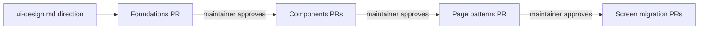
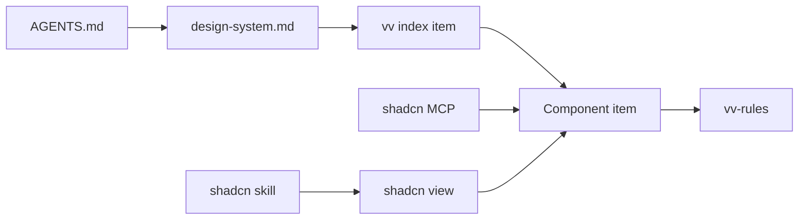

# Research: vv design system on shadcn/ui

Parent Issue: #757. Inherited decisions:

| Topic | Source of truth |
| --- | --- |
| Tech stack (React, Vite, Tailwind CSS) | [docs/design-docs/tech-stack-selection.md](../../docs/design-docs/tech-stack-selection.md) |
| Web layer directories | [ARCHITECTURE.md](../../ARCHITECTURE.md#web-layer) |
| Token location, raw-colour scan and contrast pairs | [docs/design-docs/library-ui.md](../../docs/design-docs/library-ui.md#1-visual-values-in-one-css-location-with-contrast-guaranteed-by-tests) |
| Dark scheme only | [docs/design-docs/library-ui.md](../../docs/design-docs/library-ui.md#2-dark-scheme-only-without-a-lightdark-switch) |
| Screen text rules enforced by ESLint | [docs/design-docs/i18n.md](../../docs/design-docs/i18n.md) |
| Dependency updates | [docs/how-to/dependency-updates.md](../../docs/how-to/dependency-updates.md) |

This file records only the decisions this feature adds. Facts about the
`shadcn` CLI are from version 4.21.1.

## R-1: Each tier is confirmed on its own implementation PR

**Decision**: `ui-design.md` sets the direction and the review criteria of all
three tiers from the library screen. Each tier (foundations, components, page
patterns) is then built in its own implementation PR, in that order, and the
maintainer's approving review of that PR, with the tier shown on the showcase
(R-2), is the record of confirmation (acceptance criterion 1).

The diagram shows the order and where the maintainer confirms.

| Option | Maintainer sees | Verdict |
| --- | --- | --- |
| **Design direction, then one PR per tier** | Each tier rendered in the app, before the next tier is built on it | Chosen |
| All three tiers settled in `ui-design.md` alone | Prose and token names only; components are designed before the foundations under them are seen | Rejected: one review, not one per tier (requirement 3) |
| Three `design` runs, one per tier | Prose per tier | Rejected: stage selection runs `design` once; the next two runs would need the maintainer to name a revision each time |

**Rationale**: Token values live only in the CSS
([design.md](../../.agents/skills/issue-handoff/references/design.md#sources-that-already-decide-things)),
so their concrete values are chosen where the CSS changes. A tier PR that the
maintainer asks to change is changed before merge, and the next tier depends
on the merged one.

## R-2: A development-only showcase route renders each tier

**Decision**: `/design-system` exists only under `vite dev`
(`import.meta.env.DEV`) and renders every token, registry component and page
pattern with its states. Each tier PR adds its section and attaches Playwright
screenshots of it at 1440 px and 390 px.

| Option | Verdict |
| --- | --- |
| **Development-only route in the SPA** | Chosen |
| Storybook | Rejected: a second build toolchain and its own Vite config to keep in step with Tailwind 4 and the `@/` alias |
| Library screen screenshots only | Rejected: shows the components that screen happens to use, in the states it happens to be in |
| Owner-only route in the shipped app | Rejected: adds a screen to the product (out of scope: no added features) |

## R-3: The registry is built into the repository and read from disk

**Decision**: `web/registry.json` declares the items, and `shadcn build`
writes them to `web/registry/r/`, which is version controlled. `task generate`
runs the build, so `task check` (`generate-check`) fails when the built JSON
is stale. Agents read an item by path
([contracts/registry.md](contracts/registry.md#reading-an-item)).

| Option | `shadcn view` / MCP view | `shadcn search` / MCP search | Verdict |
| --- | --- | --- | --- |
| **Built JSON on disk, read by path** | Works with a `.json` path | Not available; the `vv` index item lists every item instead | Chosen |
| `@vv` namespace on a localhost URL | Works while a server runs | Works while a server runs | Rejected: every agent session must start a server first, and output under `web/public` would ship in the binary |
| GitHub address `syudead/vv/<item>` | Works for the pushed ref | Works for the pushed ref | Rejected: needs `registry.json` at the repository root and sees only pushed commits, so a component added on a working branch is invisible to the agent using it |
| `file://` or relative path in `registries` | Fails (undici has no `file://`; a relative path is prefixed with `ui.shadcn.com`) | Fails | Rejected: does not work in 4.21.1 |

## R-4: shadcn is set up on Radix with a path alias and the cn package

**Decision**: `web/components.json` uses the `radix` base, `aliases.ui`
`@/ui` (the existing `web/src/ui`), and `tailwind.css` `src/index.css`. The
`@/*` path maps to `web/src/*` in `tsconfig.json` and `vite.config.ts`. The
dependencies are the ones the radix base declares: `radix-ui` (replacing the
eight `@radix-ui/react-*` packages), `class-variance-authority`, `cn` and
`tw-animate-css`, with `shadcn` as a devDependency so the CLI version is
pinned and updated by Renovate.

| Choice | Rejected | Why |
| --- | --- | --- |
| `radix` base | `base` (Base UI), `aria` | The eight existing primitives are already Radix; the other bases rewrite them all |
| `@/*` path alias | `#/*` package imports | Both satisfy `shadcn init`; upstream items, the shadcn skill and its rules are written with `@/` |
| `cn` package replacing `web/src/lib/cn.ts` | Keeping the hand-written `cn` | It only joins strings, so a caller's `className` cannot override a variant's class; shadcn components rely on that merge |
| Components stay in `web/src/ui` | Moving them to `web/src/components/ui` | `aliases.ui` accepts any path, and [ARCHITECTURE.md](../../ARCHITECTURE.md#web-layer) already names `ui/` for primitives |

## R-5: Tokens use shadcn's semantic names, in hex, in their own file

**Decision**: The foundations tier defines its colour tokens under shadcn's
semantic names (`background`, `foreground`, `card`, `popover`, `primary`,
`secondary`, `muted`, `accent`, `destructive`, `border`, `input`, `ring` and
their `-foreground` pairs) plus vv's own roles that shadcn lacks (`navbar`,
`warning`, `success`, `favorite`, `overlay`). Every token, with the type,
spacing, radius, shadow and motion scales, lives in `@theme` in a new
`web/src/ui/tokens.css` that `index.css` imports. Colour values stay six-digit
hex. The raw-colour scan exempts only `tokens.css`.

| Choice | Rejected | Why |
| --- | --- | --- |
| shadcn semantic names | Keeping vv's names (`surface`, `fg-muted`, `accent-hover`) | Upstream component code and the shadcn skill's styling rules use the semantic names; with vv's names every added component is translated by hand |
| Hex values | oklch, as shadcn's defaults | The contrast test parses `#rrggbb` only; the CLI writes hex unchanged |
| A separate `tokens.css` | Tokens stay in `index.css` | `shadcn add` writes an upstream theme's or style's CSS variables into the `tailwind.css` file and overwrites same-named ones. With tokens elsewhere and the scan exempting only `tokens.css`, such a write lands in `index.css` and fails the check (Issue edge case: upstream updates) |

**Rationale**: The vv names (`surface`, `accent`, ...) stay defined, as
`var()` aliases of the new tokens, until the last screen migration lands,
so unmigrated screens keep their look ([R-9](#r-9-screens-migrate-one-area-per-pr-behind-a-shrinking-exception-list)).
`library-ui.md` keeps the reason tokens live in CSS; the token roles move to
the design system document.

## R-6: Usage rules are Markdown files shipped as registry items

**Decision**: The rules agents follow are written once, per tier, in
`web/registry/rules/` (`foundations.md`, `components.md`, `patterns.md`) and
shipped as the `registry:file` item `vv-rules`. Each component and pattern
item's `docs` string names its section in those files.
`docs/design-docs/design-system.md` records the design system's decisions and
reasons, and links the rules instead of repeating them.

| Option | Verdict |
| --- | --- |
| **Rule files shipped as a registry item** | Chosen |
| Rules only in `docs/design-docs/` | Rejected: not retrievable through the shadcn CLI or MCP (requirement 4) |
| Rules only in each item's `docs` string | Rejected: a plain string shown at install; page patterns and foundations have no item of their own to carry them |
| An agent skill under `.agents/skills/` | Rejected: a second copy beside the registry, read by our agents but not through shadcn |

## R-7: Agents reach the registry through AGENTS.md, a vendored skill and an MCP server

**Decision**: `AGENTS.md` gains one line pointing UI work to
`docs/design-docs/design-system.md`, which names the registry, the `vv` index
item and the rules. The official shadcn skill is vendored at a pinned commit
into `.agents/skills/shadcn/` (`.claude/skills` links there). The shadcn MCP
server, run from the pinned devDependency, is registered for Claude in
`.mcp.json` and for Codex in `.codex/config.toml`. `sdd-design`,
`sdd-implement` and the `design` reference send UI work to the design system,
and tell `ui-design.md` to compose registry components and patterns, adding
one to the design system first when it is missing (requirement 6).

The diagram shows how an agent starting at `AGENTS.md` reaches an item.

| Option | Verdict |
| --- | --- |
| **Vendored skill at a pinned commit** | Chosen |
| `npx skills add shadcn/ui` at session start | Rejected: needs the network every session and follows upstream without review |
| No shadcn skill, our rules only | Rejected: requirement 5 names the skill |

## R-8: ESLint enforces the design system, with exceptions in one list

**Decision**: `eslint-plugin-better-tailwindcss` reads `src/index.css` as its
Tailwind entry point. `no-unknown-classes` fails on a class the theme does not
generate, and `no-restricted-classes` fails on an arbitrary value, an arbitrary
property and the `(--var)` shorthand, while allowing arbitrary variants
(`data-[state=open]:`, `has-[...]:`). `no-restricted-syntax` fails on
`<button>`, `<input>`, `<select>` and `<textarea>` outside `web/src/ui`. The
raw-colour scan and the contrast pairs stay in `tokens.test.ts`. Exceptions
are file and class entries, each with a reason, in one file
`web/design-exceptions.js`, because `noInlineConfig` forbids comments
([contracts/registry.md](contracts/registry.md#check-rules)).

| Option | Verdict |
| --- | --- |
| **`eslint-plugin-better-tailwindcss` 4.7** | Chosen: resolves classes with Tailwind 4 itself, reads `className` and `cn()`/`cva()` arguments, and takes allow lists |
| `eslint-plugin-tailwindcss` 4.4 | Rejected: `no-arbitrary-value` has no allow list, so each exception is a separate config block |
| A Vitest regex scan | Rejected: cannot tell which classes the theme generates, and misses classes built in `cn()` expressions |

**Rationale**: The off-scale check comes from the theme itself: the final unit
resets Tailwind's open namespaces (`--spacing: initial`, `--text-*: initial`
and the others the foundations tier scales) so only the scale's steps exist,
and `no-unknown-classes` fails on anything else. Until then a
`no-restricted-classes` pattern built from the scale fails off-scale numeric
steps in files outside the exception list.

## R-9: Screens migrate one area per PR behind a shrinking exception list

**Decision**: The checks land first, with every file that breaks them today
listed as a `migration` exception. Each migration PR moves one screen area onto
the design system and deletes its files' entries; the last unit removes the
legacy token aliases, resets the theme namespaces (R-8), and leaves only
entries of kind `special` with a reason (Issue edge case: special looks).

| Option | Verdict |
| --- | --- |
| **Checks first, exception list shrinks** | Chosen: a new offending file fails from the first PR on, and every intermediate state builds and passes |
| Checks at the end | Rejected: new offenders arrive during the migration and are found only at the end |
| One PR migrating every screen | Rejected: too large to review visually, and the operation checks of acceptance criterion 6 cover five screens |
