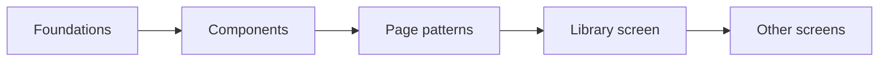
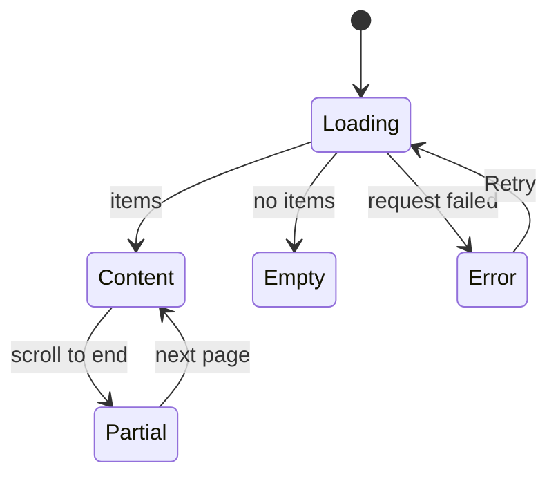

# UI design: vv design system on shadcn/ui

Sources: [plan.md](plan.md), [research.md](research.md),
[library-ui.md](../../docs/design-docs/library-ui.md) (layout, density and
per-screen behaviour, which this design keeps), the
[VVMDM brand](../022-vvmdm-brand/ui-design.md) (dark surfaces, cyan), and the
`@theme` block of [web/src/index.css](../../web/src/index.css) (today's token
names).

This document sets the direction of each tier. The foundations, components
and page patterns PRs choose the concrete values against it, and the
maintainer confirms each tier on the `/design-system` showcase
([R-1](research.md#r-1-each-tier-is-confirmed-on-its-own-implementation-pr)).

## Why this shape

vv keeps its identity, dark neutral surfaces with cyan as the one interaction
colour, and gains what it lacks: closed scales, one component per role and a
named pattern per screen type. The surfaces move to shadcn's flat neutral
style (thin borders, no gradients, shadows only on floating layers), because
the registry components arrive in that style and every screen then shares it
without per-component restyling. Rejected: shadcn's default look with a white
primary button, because cyan is the brand's action colour; and today's look
kept as is, because the Issue makes it a starting point only.

The diagram shows what each tier builds on and which screen uses it first.

## Foundations

### Colour roles

Every colour is one of these roles. The foundations PR sets the values in
`tokens.css`; the right column names the current token each role starts from,
so the first rendering is recognisably vv. Every role is opaque except
`overlay`.

| Token | Role | Starts from |
| --- | --- | --- |
| `background` / `foreground` | Page and body text | `bg` / `fg` |
| `navbar` | Top bar and sidebar | `navbar` |
| `card` / `card-foreground` | Cards, sections, list rows | `surface` / `fg` |
| `popover` / `popover-foreground` | Menus, popovers, dialogs, toasts | `elevated` / `fg` |
| `muted` / `muted-foreground` | Fields' fill and secondary text | `field` / `fg-muted` |
| `secondary` / `secondary-foreground` | Secondary buttons, chips | `surface-hover` / `fg` |
| `accent` / `accent-foreground` | Hover and highlighted menu rows (shadcn's meaning, not the brand colour) | An opaque mix of `surface` and `hover-wash` / `fg` |
| `primary` / `primary-foreground` | The one main action per area, selected state, progress | `accent` / `accent-fg` |
| `primary-soft` | Selected rows and active filter chips | `accent-soft` |
| `border`, `input`, `ring` | Dividers, control borders, keyboard focus | `border`, `control-border`, `link` |
| `destructive`, `warning`, `success`, each with `-foreground` and `-soft` | Danger, caution, done; always with text and an icon | `danger*`, `warning*`, `success*` |
| `favorite` | The favorite heart only | `favorite` |
| `overlay` | Behind dialogs and over thumbnails | `overlay` |

`fg-subtle` merges into `muted-foreground`, and `border-strong` into `input`:
two greys of text and two of lines are enough to separate primary from
secondary.

### Type

| Step | Use |
| --- | --- |
| `text-2xs` | Text on thumbnails: duration, seek time, badges over images |
| `text-xs` | Metadata, counts, chip labels, help text |
| `text-sm` | Body of the library, controls, menus, card titles |
| `text-base` | Body of the video page, dialog body |
| `text-lg` | Section headings, dialog titles |
| `text-xl` | Page titles, the video title |

Weights are `font-normal`, `font-medium` (controls, labels, card titles) and
`font-semibold` (headings). `text-2xl` and larger, `font-bold`, and the pixel
sizes on thumbnails (`text-[10px]`, `text-[11px]`) leave the scale.

### Spacing and sizes

Spacing and sizes share one scale on a 4px grid: steps `0`, `px`, `0.5`, `1`,
`1.5`, `2`, `3`, `4`, `5`, `6`, `8`, `10`, `12`, `16`, plus the layout
constants (top bar, sidebar, card widths, seek preview), which become named
steps. Today's `2.5`, `9`, `14`, `15` and pixel values (`h-[3px]`,
`px-[7px]`) move to the nearest step or to a component.

| Role | Library | Video page |
| --- | --- | --- |
| Control height | `h-8` | `h-9`, `h-10` for the main action |
| Gap between controls | `gap-2` | `gap-3` |
| Gap between cards | `gap-3` | `gap-4` |
| Section padding | `p-3` | `p-4`–`p-6` |
| Icons | `size-4` | `size-4`, `size-5` in the player |

### Radius, shadow and motion

| Scale | Steps |
| --- | --- |
| Radius | `rounded-sm` (checkboxes, badges), `rounded-md` (controls, cards, thumbnails), `rounded-lg` (popovers, dialogs), `rounded-full` (pills, the scrub dot); `rounded-xl` leaves |
| Shadow | None on resting surfaces; `shadow-card-hover` on a hovered card; `shadow-elevated` on floating layers; `drop-shadow-mark` on marks over images |
| Motion | `fade-in`, `pop-in` and `slide-up` kept; no new animation; reduced motion turns them off as today |

## Components

Each component is the shadcn/ui component on the radix base, restyled only
through the tokens above, and replaces the vv component or raw element in the
right column. The two component PRs split along the table.

| PR | Component | Replaces |
| --- | --- | --- |
| Actions and inputs | `Button` (`default` = primary, `secondary`, `outline`, `ghost`, `destructive`, `link`; sizes `sm`, `default`, `lg`, `icon-sm`, `icon`) | `ui/Button`, `ui/IconButton`, raw `<button>` |
| Actions and inputs | `Input`, `Textarea`, `Label`, `Field` | Raw `<input>` and `<textarea>` in auth, settings, tags, title edit |
| Actions and inputs | `Select`, `RadioGroup` | Raw `<select>`, the sort radio columns |
| Actions and inputs | `Checkbox`, `Switch` | `ui/Checkbox`, the visibility switch |
| Actions and inputs | `ToggleGroup`, `Toggle` | `ui/SegmentedControl`, `ui/FilterChip` |
| Actions and inputs | `Slider` | Zoom slider |
| Actions and inputs | `Combobox` (`Command` in `Popover`) | `ui/Combobox` |
| Actions and inputs | `Badge` | `ui/Chip`, tag chips, count badges |
| Overlays and feedback | `Dialog`, `AlertDialog` | `ui/ModalFrame`; `AlertDialog` for delete and reject confirmations |
| Overlays and feedback | `Popover`, `DropdownMenu`, `Tooltip`, `Tabs` | `ui/Popover`, `ui/Menu`, `ui/Tooltip`, `ui/Tabs` |
| Overlays and feedback | `Sonner` (new dependency `sonner`) | `ui/Toast` |
| Overlays and feedback | `Skeleton`, `Progress`, `Spinner` | `ui/Skeleton`, scan and watch progress bars |
| Overlays and feedback | `Alert`, `Empty` | Stall warning, autoplay notice, inline errors, empty-state blocks |
| Overlays and feedback | `Separator`, `Kbd`, `Breadcrumb` | Dividers, search syntax keys, folder breadcrumbs |
| Overlays and feedback | `Sidebar` | `shell/Sidebar`: its expanded, icon and offcanvas states are vv's expanded, rail and drawer |

vv's own components, registry items with their own rules:

| Component | What it is |
| --- | --- |
| `VideoThumbnail` | Thumbnail with duration badge, progress edge, favorite and selection marks; used by video, group and folder cards and list rows |
| `FavoriteToggle` | The heart, mark and toggle in one ([library-ui.md, Favorite mark](../../docs/design-docs/library-ui.md#favorite-mark)) |
| `TentativeMark` | The tentative-tag marker |
| `ScrubPreview`, `ThumbnailBackdrop`, `BrandHomeLink` | As today, on the new tokens |

Two looks stay `special` exceptions, each with its reason in
`web/design-exceptions.js`: the video.js control bar skin, which styles a
third-party DOM through CSS in `index.css`, and the seek preview, whose position
is computed from the pointer and the frame size.

## Page patterns

Each screen is one of these patterns, built from the components above. The
page patterns PR adds them as `registry:block` items and builds the library on
the list pattern.

| Pattern | Parts | Screens |
| --- | --- | --- |
| List page | Toolbar in the top bar, count row, grid or list view, selection bar | Library, folder contents, search results, duplicates |
| Toolbar | Search, filter popover, view toggle, zoom, sort; collapses into `View and sort` below the wide width | Library, folders |
| Admin table | Band with search and actions, tabs, sortable rows with a check column, bulk actions | Tag admin |
| Settings page | Titled sections; each row is label, description and control | Settings |
| Detail page | Header band, player pane, information pane with fact rows | Video page |
| Centered form | One card with title, fields and one primary button | Sign-in, setup |
| Form dialog | Title, fields, `Cancel` and one primary action, at most 32rem wide | Tag create, merge, synonyms, bundle |
| Confirm dialog | `AlertDialog`: what happens, `Cancel`, a destructive action named by its verb | Delete and reject tag |

### States

Every list, table and section shows one of these, from the same blocks.

| State | What the screen shows |
| --- | --- |
| Loading | `Skeleton` shapes of the final layout; no spinner over a whole page |
| Empty | `Empty`: icon, one line saying why, and the action that fills it when the viewer can take it |
| Error | `Alert` in `destructive`: what failed, and `Retry` when retrying can help |
| Partial (more loading) | Content, then a `Spinner` row at the end |

The diagram shows how a list moves between them.

## Words

The showcase is development-only, and its text still goes through `t`.

| Place | Text | Notes |
| --- | --- | --- |
| Showcase heading | `Design system` | Page title |
| Showcase sections | `Foundations`, `Components`, `Page patterns` | One per tier |

No product screen gains or changes text.

## Responsive behaviour

Screenshots in each tier PR are taken at these widths.

| Width | Layout |
| --- | --- |
| 390px | Sidebar as a drawer; toolbar in one column; dialogs full width with 16px margins |
| 768px | Sidebar as a rail; toolbar collapsed into `View and sort` |
| 1440px | Sidebar expanded; toolbar inline |

The breakpoints are those of
[library-ui.md, section 4](../../docs/design-docs/library-ui.md#4-width-breakpoints-in-css-and-the-sidebar-exception).

## Review criteria

1. Foundations: on the showcase, the colour roles read as five levels of
   surface (navbar, background, card, popover, muted) without two looking the
   same, and cyan appears only on actions, selection, focus and progress.
2. Foundations: the type steps are distinguishable side by side, and a
   library card's title, metadata and thumbnail text use three different steps.
3. Foundations: at 1440px, the library shows at least as many cards per row
   at each zoom level as on `main`.
4. Components: every component in the showcase shows its normal, hover,
   keyboard focus, pressed, selected (where it has one) and disabled states,
   and focus is the same ring on every one.
5. Components: on the library, one area has at most one `primary` button, and
   icon-only buttons have the same hit size in the toolbar, the selection bar
   and on cards.
6. Page patterns: the library, the folder screen and duplicates line up the
   same toolbar, count row and grid edges at 1440px and 390px.
7. Page patterns: the loading, empty and error states of a list keep the
   toolbar in place and show the block in the grid area.
8. Every screen: the video page keeps more space between its parts than the
   library (control heights, gaps and body text one step larger).
